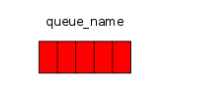

RabbitMQ 是一个消息Broker。你可以把他想象成一个邮局。当你发送邮件到邮箱，你很确定邮递员最终会将你的邮件送递到接收者。你可以把RabbitMQ比喻成一个邮箱，邮局，和一个邮递员。

RabbitMQ和邮局的最大区别是RabbitMQ不处理纸质的东西，相反他接收，存储，转递二进制数据--message。

RabbitMQ,和很多消息传递一样，使用一些术语。

1. 生产(Producing)表示发送。一个发送消息的程序称为生产者(Producer)。如下所示，以"P"表示：


2. 队列(queue)是一个邮箱的名字。它存在于RabbitMQ中。尽管消息是从RabbitMQ流动到你的应用，他们只可以存储在一个队列中。一个队列是无限容量的，它基本上是一个无限的buffer.多个生产者可以发送消息到一个队列，多个消费者也可以从从一个队列中接收数据。一个队列可以像如下所画的，上面的是队列的名字：



3. 消费和接收有着相似的意思。一个消费者是一个等待接收消息的程序。如下所示：


### "Hello World"
在教程的这一部分，我们写两个程序。一个生产者发送一个简单的消息，和一个消费者接收消息并且把他们打印出来。

在下面的图中，“P”是我们的生产者，“C”是消费者。中间的那个盒子是一个队列--RabbitMQ代表消费者保存消息的buffer。


#### Sending
我们称我们的发送者为`Send`，消息接受者为`Recv`。发送者连接到RabbitMQ，发送一个消息，然后退出。

在`Send.java`中，我们需要导入一些类：

````
import com.rabbitmq.client.ConnectionFactory;
import com.rabbitmq.client.Connection;
import com.rabbitmq.client.Channel;
````

为Queue命名：

````
public class Send {
  private final static String QUEUE_NAME = "hello";

  public static void main(String[] argv)
      throws java.io.IOException {
      ...
  }
}
````

然后我们创建一个到服务器的连接：

````
ConnectionFactory factory = new ConnectionFactory();
factory.setHost("localhost");
Connection connection = factory.newConnection();
Channel channel = connection.createChannel();
````

`Connection`抽象了Socket 连接，并且负责协议版本协商和鉴权。在这里，我们连接到一个本地机器的Broker。如果我们想连接到不同机器上的Broker，我们只需在这里指定主机名字或IP地址。

接下来我们创建一个`Channel`，也是大多数API开始的地方。

为了发送消息，我们需要声明我们要发送的队列；然后我们可以发布消息到这个队列：

````
channel.queueDeclare(QUEUE_NAME, false, false, false, null);
String message = "Hello World!";
channel.basicPublish("", QUEUE_NAME, null, message.getBytes());
System.out.println(" [x] Sent '" + message + "'");
````

声明队列是幂等的--只有在它不存在时才会被创建。消息的内容是一个字节数组，所以你可以以你自己喜欢的方式编码。

最后，我们关闭`Channel`和`Connection`:

````
channel.close();
connection.close();
````

如下是整个`Send.java`类：

> Sending doesn't work!
>
>如果这是你第一次使用RabbitMQ，并且你没有看到"Send"消息，然后，你可能抓破头皮在想到底哪里出错了。可能Broker启动时没有足够的磁盘空间（默认需要至少 1GB）,因此拒绝接收消息。检查Broker的日志文件确认一下，如果需要，减少需要的磁盘空间。设置`disk_free_limit`

#### Receiving
接收者从RabbitMQ拉消息，所以不像发送者发送一个消息，我们将保持它运行来监听消息，并且打印。

`Recv.java`中的代码和`Send`中的有大多数相同的imports:

````
import com.rabbitmq.client.ConnectionFactory;
import com.rabbitmq.client.Connection;
import com.rabbitmq.client.Channel;
import com.rabbitmq.client.Consumer;
import com.rabbitmq.client.DefaultConsumer;

public class Recv {
  private final static String QUEUE_NAME = "hello";

  public static void main(String[] argv)
      throws java.io.IOException,
             java.lang.InterruptedException {

    ConnectionFactory factory = new ConnectionFactory();
    factory.setHost("localhost");
    Connection connection = factory.newConnection();
    Channel channel = connection.createChannel();

    channel.queueDeclare(QUEUE_NAME, false, false, false, null);
    System.out.println(" [*] Waiting for messages. To exit press CTRL+C");
    ...
    }
}
````

注意到，在这里我们也声明了队列。因为可能先启动发送者，我们想保证在我们想消费消息时队列存在。

我们将要告诉服务端从队列中递送消息给我们（消费者）。因为服务端会异步的推送消息，我们提供一个callback，这个callback将会buffer message知道我们准备使用这些消息。这就是`DefaultConsumer`做的。

````
Consumer consumer = new DefaultConsumer(channel) {
  @Override
  public void handleDelivery(String consumerTag, Envelope envelope, AMQP.BasicProperties properties, byte[] body)
      throws IOException {
    String message = new String(body, "UTF-8");
    System.out.println(" [x] Received '" + message + "'");
  }
};
channel.basicConsume(QUEUE_NAME, true, consumer);
````

这就是整个的`Recv.java`类。
