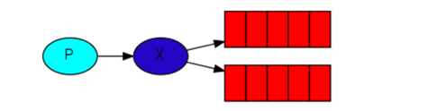
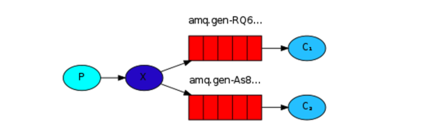

在前一个教程中，我们创建了一个work queue。work queue队列后面的假设是每一个任务只被递送给一个worker。在这一部分，我们将会做一些完全不同的东西--我们将递送一个消息到多个consumer。这一模式被称为`publish/subscribe`。

为了说明这个模式，我们将建立一个简单的日志系统。它包括两个程序--第一个发出日志信息，第二个接收并且打印他们。

在我们的日志系统中，每一个运行的接收者都会接收到消息。这样的话，我们将可以运行一个接收者将日志直接存入磁盘，同时运行其他的接收者，在屏幕上看到日志。

本质上，发布日志信息将会广播到所有的接收者。

### Exchanges
在教程的前一部分，我们发送到一个queue,从一个queue中接收信息。现在是时候介绍RabbitMQ中完整的消息传递模型了。

我们迅速的过一下之前教程中包括的东西：

+ 生产者（Producer）是发送消息的用户应用。
+ 队列（queue）是一个存储消息的buffer
+ Consumer是接收消息的用户应用

RabbitMQ中的消息传递模型的主要idea是生产者永远不会直接传递消息到队列。实际上，很多生产者甚至不知道一个消息是否会递送到任何队列。

相反的，生产者只可以发送消息到一个`exchange`。一个`exchange`是很简单的东西。在一端，它接收来自生产者的消息，另一端它将消息push到队列。exchange必须准确的知道如何处理它接收的消息。它应该追加到一个特定的queue吗？它应该追加到多个queue吗？或者它应该被丢弃吗？处理规则被exchange 类型定义。



有一些可用的exchange 类型：`direct`，`topic`，`headers`，`fanout`。我们关注最后一个`fanout`。我们创建一个这个类型的exchange，称为`logs`：

````
channel.exchangeDeclare("logs", "fanout");
````

`fanout` exchange是很简单的。顾名思义，它只是广播所有的消息到它直到的所有的queue。这正是我们的日志系统所需要的。

> List exchange
> 为了列出Server上所有的exchange,你可以运行`rabbitmqctl`:
>
````
sudo rabbitmqctl list_exchanges
Listing exchanges ...
        direct
amq.direct      direct
amq.fanout      fanout
amq.headers     headers
amq.match       headers
amq.rabbitmq.log        topic
amq.rabbitmq.trace      topic
amq.topic       topic
logs    fanout
...done.
````

在这个列表中是一些`amq.*`exchanges和默认的exchange。他们是被默认创建的。但是你可能目前不会用他们。

##### Nameless exchange
在前一部分中，我们对exchange一无所知，但是仍然可以发送消息到queue.可能是因为我们使用了一个默认的exchange,它就是我们通过空字符串("")定义的。

回想一下，我们之前是如何发布一个消息的：

````
channel.basicPublish("", "hello", null, message.getBytes());
````

第一个参数是exchange的名字。空字符串表示默认的或没有名字的exchange:消息被路由到`routingKey`指定的queue，如果它存在的话。

现在我们可以发布到我们的已经命名的exchange:

````
channel.basicPublish( "logs", "", null, message.getBytes());
````

### Temporary queues
正如你可能记得的，之前我们使用了有一个具体名字的queues(记得是`hello`和`task_queue`)。能命名一个queue对我们是很重要的--我们需要将workers指向到同一个queue。给一个queue一个名字是很重要的，当你想在生产者和消费者之间共享queue时。

但是这不是我们的日志系统的情况。我们想要接收所有的日志信息，而不是他们的一部分。我们也只对当前流动的消息感兴趣而不是旧的。为了解决，我们需要两个东西。

首先，无论什么时候我们连接到RabbitMQ，我们需要一个新鲜的(fresh)，空的queue。为了做到这一点，我们可以以一个随机的名字创建一个queue，或者更加好的做法是--让服务器为我们选择一个随机的queue name。

第二，一旦我们和consumer失去连接，这个queue应该自动删除。

在Java Client中，当我们不传递任何参数给`queueDeclare()`我们创建了一个non-durable，独占的，自动删除的queue，以一个生成的名字。

````
String queueName = channel.queueDeclare().getQueue();
````

`queueName`包含了一个随机的queue name。例如，它可能看起来像`amq.gen-JzTY20BRgKO-HjmUJj0wLg`

### Bindings
我们已经创建了一个`fanout`exchange和一个queue。现在我们需要告诉exchange发送消息到我们的队列(queue)。exchange和一个queue之间的关系称为一个`binding`。

````
channel.queueBind(queueName, "logs", "");
````

从现在开始，`logs`exchange将会追加消息到我们的queue。

> Listing Bindings
> 你可以列出所有的绑定，使用，正如你所猜测的，`rabbitmqctl list_bindings`。

### Putting it all together


生产者程序，产生日志消息，并没有和之前的例子中有很大的不同。最重要的改变是现在我们想要发布消息到`logs`exchange而不是没有名字的那个。我们需要在发送时提供一个`routingKey`，但是它的值被`fanout`exchange忽略了。下面的代码是`EmitLog.java`的：

````
import java.io.IOException;
import com.rabbitmq.client.ConnectionFactory;
import com.rabbitmq.client.Connection;
import com.rabbitmq.client.Channel;

public class EmitLog {

    private static final String EXCHANGE_NAME = "logs";

    public static void main(String[] argv)
                  throws java.io.IOException {

        ConnectionFactory factory = new ConnectionFactory();
        factory.setHost("localhost");
        Connection connection = factory.newConnection();
        Channel channel = connection.createChannel();

        channel.exchangeDeclare(EXCHANGE_NAME, "fanout");

        String message = getMessage(argv);

        channel.basicPublish(EXCHANGE_NAME, "", null, message.getBytes());
        System.out.println(" [x] Sent '" + message + "'");

        channel.close();
        connection.close();
    }
    //...
}
````

正如你所看到的，在建立连接后，我们声明了exchange.这一步是必须的，因为发布到一个不存在的exchange的禁止的。

消息将会丢失如果还没有queue绑定到exchange，但是对我们来说是ok的；如果还没有consumer在监听，我们可以安全的丢弃消息。

如下的代码是`ReceiveLogs.java`:

````
import com.rabbitmq.client.*;

import java.io.IOException;

public class ReceiveLogs {
  private static final String EXCHANGE_NAME = "logs";

  public static void main(String[] argv) throws Exception {
    ConnectionFactory factory = new ConnectionFactory();
    factory.setHost("localhost");
    Connection connection = factory.newConnection();
    Channel channel = connection.createChannel();

    channel.exchangeDeclare(EXCHANGE_NAME, "fanout");
    String queueName = channel.queueDeclare().getQueue();
    channel.queueBind(queueName, EXCHANGE_NAME, "");

    System.out.println(" [*] Waiting for messages. To exit press CTRL+C");

    Consumer consumer = new DefaultConsumer(channel) {
      @Override
      public void handleDelivery(String consumerTag, Envelope envelope,
                                 AMQP.BasicProperties properties, byte[] body) throws IOException {
        String message = new String(body, "UTF-8");
        System.out.println(" [x] Received '" + message + "'");
      }
    };
    channel.basicConsume(queueName, true, consumer);
  }
}
````
