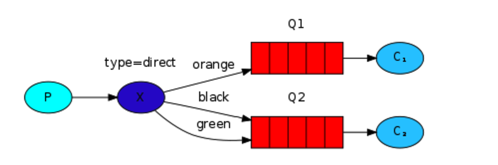
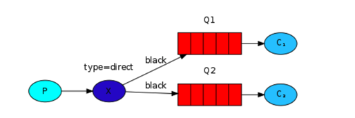
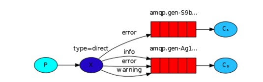

### Routing
在前一个教程中，我们创建了一个简单的日志系统。我们可以广播日志消息到多个接收者。

在这个教程中，我们打算增加一些feature--我们打算让它可以订阅一部分消息。例如，我们将可能将关键的错误信息直接到日志文件，同时仍然可以打印所有的日志信息到控制台。

### Bindings
在之前的例子中，我们已经创建了Bindings。你可能回想起这样的代码：

````
channel.queueBind(queueName, EXCHANGE_NAME, "");
````

一个binding是一个exchange和一个queue之间的关系。可以简单的理解为：这个queue对这个exchange中的消息感兴趣。

binding可以接收一个额外的`routingKey`参数。为了避免和`basic_publish`参数混淆，我们打算称它为一个`binding key`。这就是我们如何使用key创建binding的：

````
channel.queueBind(queueName, EXCHANGE_NAME, "black");
````

binding key的含义取决于exchange 类型。`fanout` exchange，我们之前使用的，简单的忽略了这个值。

### Direct exchange
我们之前例子中的日志系统广播所有的消息到所有的consumers。我们想要扩展，允许基于他们的严重性过滤消息。例如，我们可能想要一个程序将接收的严重error的日志写入磁盘，并且不为warning或info 日志消息浪费磁盘空间。

过去，我们使用`fanout`exchange,它没有给我们很多灵活性--他只具有无脑的广播。

我们使用一个`direct`exchange.一个`direct` exchange 后面的路由算法是简单的--一个消息发送到`binding key`符合消息的`routing Key`的queues。

为了说明，考虑如下的设置：



在这个设置中，我们可以看到`direct` exchange `X`有两个queue绑定到它。第一个queue的binding key 是`orange`，第二个有两个bingings，一个的binding key是`black`，另一个的binding key是`green`。

在这样的设定中，发布到这个exchange的routing key为`orange`的消息将会路由到queue Q1。routing key为`black`或`green`的消息将会发送到Q2。所有其他的消息将会被丢弃。

### Multiple bindings


使用同一个binding key绑定多个queues也是很合法的。在我们的例子中，我们可以在`X`和`Q1`之间增加一个绑定，以binding key `black`。在这个例子中，`direct`exchange 将像`fanout`一样，广播消息到所有符合的queues。一个routing key为`black`的消息将被递送到Q1和Q2。

### Emitting logs
我们将使用在日志系统使用这种模型。我们发送消息到一个`direct`exchange 而不是`fanout`。我们将提供日志严重性作为`routing key`。这种方式接收程序将可以选择他想接收的严重性。我们首先关注于产生日志。

正如经常看到的，我们首先需要创建一个exchange:

````
channel.exchangeDeclare(EXCHANGE_NAME, "direct");
````

并且，我们准备发送一个消息：

````
channel.basicPublish(EXCHANGE_NAME, severity, null, message.getBytes());
````

为了简单，我们将假定`severity`可以为`info`,`warning`,`error`中的一个。

### Subscribing
接收消息将像之前教程中的一样，除了一个---我们将为我们感兴趣的每一个`severity`创建一个新的绑定。

````
String queueName = channel.queueDeclare().getQueue();

for(String severity : argv){    
  channel.queueBind(queueName, EXCHANGE_NAME, severity);
}
````

### Putting it all together


`EmitLogDirect.java`类的代码：

````
public class EmitLogDirect {

    private static final String EXCHANGE_NAME = "direct_logs";

    public static void main(String[] argv)
                  throws java.io.IOException {

        ConnectionFactory factory = new ConnectionFactory();
        factory.setHost("localhost");
        Connection connection = factory.newConnection();
        Channel channel = connection.createChannel();

        channel.exchangeDeclare(EXCHANGE_NAME, "direct");

        String severity = getSeverity(argv);
        String message = getMessage(argv);

        channel.basicPublish(EXCHANGE_NAME, severity, null, message.getBytes());
        System.out.println(" [x] Sent '" + severity + "':'" + message + "'");

        channel.close();
        connection.close();
    }
    //..
}
````

`ReceiveLogsDirect.java`的代码：

````
import com.rabbitmq.client.*;

import java.io.IOException;

public class ReceiveLogsDirect {

  private static final String EXCHANGE_NAME = "direct_logs";

  public static void main(String[] argv) throws Exception {
    ConnectionFactory factory = new ConnectionFactory();
    factory.setHost("localhost");
    Connection connection = factory.newConnection();
    Channel channel = connection.createChannel();

    channel.exchangeDeclare(EXCHANGE_NAME, "direct");
    String queueName = channel.queueDeclare().getQueue();

    if (argv.length < 1){
      System.err.println("Usage: ReceiveLogsDirect [info] [warning] [error]");
      System.exit(1);
    }

    for(String severity : argv){
      channel.queueBind(queueName, EXCHANGE_NAME, severity);
    }
    System.out.println(" [*] Waiting for messages. To exit press CTRL+C");

    Consumer consumer = new DefaultConsumer(channel) {
      @Override
      public void handleDelivery(String consumerTag, Envelope envelope,
                                 AMQP.BasicProperties properties, byte[] body) throws IOException {
        String message = new String(body, "UTF-8");
        System.out.println(" [x] Received '" + envelope.getRoutingKey() + "':'" + message + "'");
      }
    };
    channel.basicConsume(queueName, true, consumer);
  }
}
````

[`EmitLogDirect.java完整代码`](https://github.com/rabbitmq/rabbitmq-tutorials/blob/master/java/EmitLogDirect.java)

[`ReceiveLogsDirect.java的完整代码`](https://github.com/rabbitmq/rabbitmq-tutorials/blob/master/java/ReceiveLogsDirect.java)
