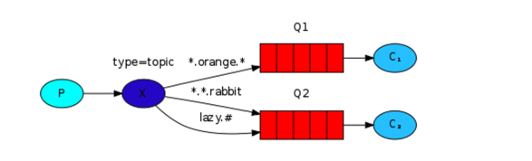

在之前的教程中，我们改进了我们的日志系统。我们使用一个`direct`exchange而不是`fanout`，获得了选择性接受信息的可能性。

虽然使用`direct`exchange改进了我们的系统，他仍然有一些限制--它不能基于多个标准路由。

在我们的日志系统中，我们可能想订阅不止基于严重性，也基于日志源。你可能从unix tool `syslog`知道这个概念，它路由日志基于严重性(info/warn/crit。。)和设备(auth/cron/kern)。

这可能给我们很多灵活性--我们可能想只监听来自`cron`的重大error或者来自`kern`的所有日志。

为了实现这个，我们需要学习更加复杂的`topic`exchange。

### Topic exchange
发送到一个`topic` exchange的消息不能有一个任意的routingKey--它必须是一列词，以`.`分割。这些词可以是任何的，但是通常它们指定了连接到的消息的一些feature。一些有效的routing key，例如："stock.usd.nyse","nyse.vmw"。在routing key中可以有尽可能多的词，直到达到255字节的限制。

binding key必须以同样的形式。`topic` exchange 背后的逻辑和`direct` exchange类似--一个以特定routing key发送的消息将被递送给所有符合的binding key的queue。但是，有两种特殊类型的binding key:

+ `*` 只能代替一个词
+ `#` 可以代表一个或多个词

最简单的解释如下所示：



我们创建了三个绑定：Q1绑定到binging key `*.orange.*`,Q2 绑定到`*.*.rabbit`和`lazy.#`.

> Topic Exchange
> topic exchange很强大，并且可以像其他exchanges一样。
>
> 当一个queue绑定到binding key为`#`，他将接收所有的消息，不管routing key--像`fanout` exchange。
>
> 当一个特殊的`*`和`#`没有在绑定中使用时，topic exchange将和`direct` exchange一样。

### Putting it all together
我们将在我们的日志系统中使用`topic` exchange.我们将假设日志的routing key有两个词:`<facility>.<severity>`。

代码和之前的教程中的大部分一致。

`EmitLogTopic.java`:

````
public class EmitLogTopic {

    private static final String EXCHANGE_NAME = "topic_logs";

    public static void main(String[] argv)
                  throws Exception {

        ConnectionFactory factory = new ConnectionFactory();
        factory.setHost("localhost");
        Connection connection = factory.newConnection();
        Channel channel = connection.createChannel();

        channel.exchangeDeclare(EXCHANGE_NAME, "topic");

        String routingKey = getRouting(argv);
        String message = getMessage(argv);

        channel.basicPublish(EXCHANGE_NAME, routingKey, null, message.getBytes());
        System.out.println(" [x] Sent '" + routingKey + "':'" + message + "'");

        connection.close();
    }
    //...
}
````

`ReceiveLogsTopic.java`：

````
import com.rabbitmq.client.*;

import java.io.IOException;

public class ReceiveLogsTopic {
  private static final String EXCHANGE_NAME = "topic_logs";

  public static void main(String[] argv) throws Exception {
    ConnectionFactory factory = new ConnectionFactory();
    factory.setHost("localhost");
    Connection connection = factory.newConnection();
    Channel channel = connection.createChannel();

    channel.exchangeDeclare(EXCHANGE_NAME, "topic");
    String queueName = channel.queueDeclare().getQueue();

    if (argv.length < 1) {
      System.err.println("Usage: ReceiveLogsTopic [binding_key]...");
      System.exit(1);
    }

    for (String bindingKey : argv) {
      channel.queueBind(queueName, EXCHANGE_NAME, bindingKey);
    }

    System.out.println(" [*] Waiting for messages. To exit press CTRL+C");

    Consumer consumer = new DefaultConsumer(channel) {
      @Override
      public void handleDelivery(String consumerTag, Envelope envelope,
                                 AMQP.BasicProperties properties, byte[] body) throws IOException {
        String message = new String(body, "UTF-8");
        System.out.println(" [x] Received '" + envelope.getRoutingKey() + "':'" + message + "'");
      }
    };
    channel.basicConsume(queueName, true, consumer);
  }
}
````

Run the following examples, including the classpath as in Tutorial 1 - on Windows, use %CP%.

To receive all the logs:

`$ java -cp $CP ReceiveLogsTopic "#"`
To receive all logs from the facility "kern":

`$ java -cp $CP ReceiveLogsTopic "kern.*"`

Or if you want to hear only about "critical" logs:

`$ java -cp $CP ReceiveLogsTopic "*.critical"`

You can create multiple bindings:

`$ java -cp $CP ReceiveLogsTopic "kern.*" "*.critical"`

And to emit a log with a routing key "kern.critical" type:

`$ java -cp $CP EmitLogTopic "kern.critical" "A critical`

kernel error"

完整的代码，[EmitLogTopic.java](https://github.com/rabbitmq/rabbitmq-tutorials/blob/master/java/EmitLogTopic.java),[ReceiveLogsTopic.java](https://github.com/rabbitmq/rabbitmq-tutorials/blob/master/java/ReceiveLogsTopic.java)
