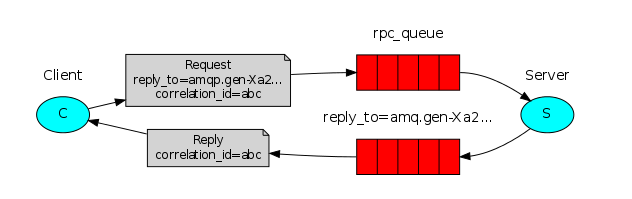

在第二个教程中，我们学习了如何使用Work Queue在多个worker中分发耗时任务。

但是如果我们需要在一台远程机器上运行一个函数，并且等待结果？这种模式通常称为RPC。

在这个教程中，我们打算使用RabbitMQ来构建一个RPC系统：一个客户端和一个RPC 服务端。因为我们没有任何耗时的任务值得分发，我们打算创建一个dummy RPC服务，返回斐波那契数。

### Client interface
为了说明RPC服务是如何被使用的，我们打算创建一个简单的客户端类。它将会暴露一个名为`call`的方法，这个方法会发送RPC 请求，然后阻塞，直到接收到一个回答。

````
FibonacciRpcClient fibonacciRpc = new FibonacciRpcClient();   
String result = fibonacciRpc.call("4");
System.out.println( "fib(4) is " + result);
````

> A note on RPC
>
>虽然RPC在计算中是一种很普遍的模式，但它却是很重要的。当一个程序员没有意识到一个方法调用是本地的还是慢的RPC时，问题出现了。诸如，导致一个不可预测的系统和给debug增加不必要的复杂性。滥用RPC可能导致不可维护的系统。
>
>记住如下的这些建议：
>1. 确保本地调用方法和远程调用方法是很显的。
>2. 为你的系统写文档
>3. 处理错误

### Callback queue
通常，通过RabbitMQ完成RPC是很容易的。一个客户端发送一个请求信息，一个服务端回复一个响应信息。为了接收响应，我们需要随请求发送一个`Callback` queue地址。我们可以使用默认的queue。试试吧：

````
callbackQueueName = channel.queueDeclare().getQueue();

BasicProperties props = new BasicProperties
                            .Builder()
                            .replyTo(callbackQueueName)
                            .build();

channel.basicPublish("", "rpc_queue", props, message.getBytes());

// ... then code to read a response message from the callback_queue ...
````

> Message properties
>
>AMQP 协议为一个消息预先定义了14中属性。大多数属性很少使用，除了下面的这些：
>
>1. deliveryMode:标记一个消息为持久化（值为2）或者transient （其他任何的值）。你可能记得这个属性。
>
>2. contentType:被用来描述编码的mime-type.比如对于json,这个属性通常为:application/json
>
>3. replyTo:一般用来命名一个callback queue。
>
>4. correlationId:用来关联RPC请求和RPC响应。

### Correlation Id
在上面的方法中，我们建议为每一个RPC请求创建一个callback queue。这是非常的没有效率的。但是，幸运的是，我们有更加好的方式--我们可以为每一个客户端创建一个简单的callback queue。

这导致了一个新的问题，如何将请求和响应对应起来呢？这就是`correlationId`属性要使用的时候了。我们可以为每一个请求设置一个唯一的值。随后，当我们从callback queue中收到一个消息时，我们检查这个属性，基于这个，我们可以将一个请求和响应对应起来。如果我们看到不知道的`correlationId`值，我们可以安全的丢弃这个消息，他不属于我们的请求。

你可能会问，我们是否应该忽略callback queue中的未知消息，而不是失败？因为这可能是服务端的竞态条件。尽管不像，但是可能RPC服务端在发送给我们响应之后，在发送ack 消息确认之前就die了。如果这种情况发生了，重新启动的服务端将会再次处理请求。这就是为什么客户端必须gracefully处理重复的响应。

### Summary


我们的RPC工作起来如下：

1. 当客户端启动时，它创建一个匿名的互斥的callback queue。
2. 对于一个RPC请求，客户端随消息发送两个属性：`replyTo`,它设置了callback queue；`correlationId`，为每一个请求设置一个唯一的值。
3. 请求发送到一个名为`rpc_queue` 的queue。
4. RPC worker（又叫服务端）在那个queue上等待请求。当一个请求出现时，它执行操作，并且发送结果消息给客户端，使用`replyTo`中指定的queue。
5. 客户端在callback queue上等待数据。当一个消息出现时，他检查`correlationId`属性。如果它符合请求中的值，就将响应返回应用。

### Putting it all together
`Fibonacci` 任务：

````
private static int fib(int n) throws Exception {
    if (n == 0) return 0;
    if (n == 1) return 1;
    return fib(n-1) + fib(n-2);
}
````

我们声明了我们的斐波那契方法。它假定只输入有效的正整数。

我们的RPC 服务端的代码如下：

````
private static final String RPC_QUEUE_NAME = "rpc_queue";

ConnectionFactory factory = new ConnectionFactory();
factory.setHost("localhost");

Connection connection = factory.newConnection();
Channel channel = connection.createChannel();

channel.queueDeclare(RPC_QUEUE_NAME, false, false, false, null);

channel.basicQos(1);

QueueingConsumer consumer = new QueueingConsumer(channel);
channel.basicConsume(RPC_QUEUE_NAME, false, consumer);

System.out.println(" [x] Awaiting RPC requests");

while (true) {
    QueueingConsumer.Delivery delivery = consumer.nextDelivery();

    BasicProperties props = delivery.getProperties();
    BasicProperties replyProps = new BasicProperties
                                     .Builder()
                                     .correlationId(props.getCorrelationId())
                                     .build();

    String message = new String(delivery.getBody());
    int n = Integer.parseInt(message);

    System.out.println(" [.] fib(" + message + ")");
    String response = "" + fib(n);

    channel.basicPublish( "", props.getReplyTo(), replyProps, response.getBytes());

    channel.basicAck(delivery.getEnvelope().getDeliveryTag(), false);
}
````

服务端的代码是很直接的：

1. 和往常一样，我们开始建立一个connection,channel和声明queue。
2. 我们可能想运行更多的服务端进程。为了在多个服务端散布均匀，我们需要在`chanel.basicQos`设置`prefetchCount`
3. 我们使用`basicConsume`来访问queue。然后我们进入while循环，等待请求消息，执行操作，返回响应。

`RPCClient.java`的代码如下：

````
private Connection connection;
private Channel channel;
private String requestQueueName = "rpc_queue";
private String replyQueueName;
private QueueingConsumer consumer;

public RPCClient() throws Exception {
    ConnectionFactory factory = new ConnectionFactory();
    factory.setHost("localhost");
    connection = factory.newConnection();
    channel = connection.createChannel();

    replyQueueName = channel.queueDeclare().getQueue();
    consumer = new QueueingConsumer(channel);
    channel.basicConsume(replyQueueName, true, consumer);
}

public String call(String message) throws Exception {     
    String response = null;
    String corrId = java.util.UUID.randomUUID().toString();

    BasicProperties props = new BasicProperties
                                .Builder()
                                .correlationId(corrId)
                                .replyTo(replyQueueName)
                                .build();

    channel.basicPublish("", requestQueueName, props, message.getBytes());

    while (true) {
        QueueingConsumer.Delivery delivery = consumer.nextDelivery();
        if (delivery.getProperties().getCorrelationId().equals(corrId)) {
            response = new String(delivery.getBody());
            break;
        }
    }

    return response;
}

public void close() throws Exception {
    connection.close();
}
````

客户端发出请求:

````
RPCClient fibonacciRpc = new RPCClient();

System.out.println(" [x] Requesting fib(30)");   
String response = fibonacciRpc.call("30");
System.out.println(" [.] Got '" + response + "'");

fibonacciRpc.close();
````

The design presented here is not the only possible implementation of a RPC service, but it has some important advantages:

+ If the RPC server is too slow, you can scale up by just running another one. Try running a second RPCServer in a new console.

+ On the client side, the RPC requires sending and receiving only one message. No synchronous calls like queueDeclare are required. As a result the RPC client needs only one network round trip for a single RPC request.

Our code is still pretty simplistic and doesn't try to solve more complex (but important) problems, like:

+ How should the client react if there are no servers running?
+ Should a client have some kind of timeout for the RPC?
+ If the server malfunctions and raises an exception, should it be forwarded to the client?
+ Protecting against invalid incoming messages (eg checking bounds, type) before processing.
