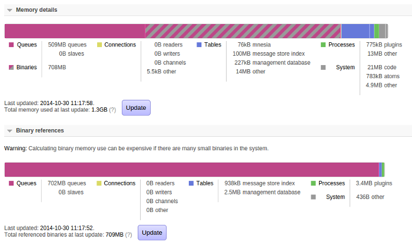
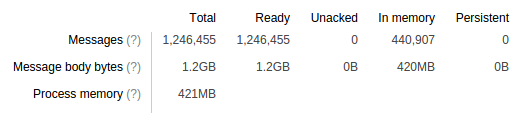
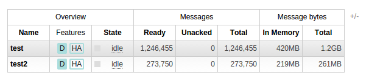

“我的queue使用了多少内存？”这是一个容易问的问题，但是是一个难以回答的复杂的问题。RabbitMQ 3.4 给你一个更加清楚的视图这篇博客讨论了一些，也大概解释了queue memory use。

### A bit of background
首先，我们需要理解Erlang 如何管理内存。Erlang 和大多数垃圾收集语言有点不同的是他没有一个全局的heap。相反的是，每一个进程（process）有一个独立的，私有的heap。在RabbitMQ里，process可以是queue,channels,connections等等。这意味着，当垃圾回收时，整个系统都不必停止；相反，每个进程在自己的schedule下，收集垃圾。

这很好，但是当一个消息在RabbitMQ里传递时，他将会在多个进程中传递。当这发生时，我们想尽量避免过多的copy。因此，Erlang对于binaries给了我们一个不同的内存管理系统，他被用于RabbitMQ中的很多事，其中最有趣的是message body。Binaries在进程间是共享的，引用计数。

### How this applies to RabbitMQ
这意味着被message body使用的内存在RabbitMQ中的进程中是共享的。这种共享也发生在queue上：如果一个exchange route a message 到 很多queues,message body 只会在内存中存储一次。

所以，我们可以知道问“how much memory does this queue use”是一个很难回答的问题。我们可以排除被queue引用的任何binaries memory，这将导致under-counting,或者我们可以包括它，可能会导致over-counting。

RabbitMQ的早期版本没有尝试解决这种窘境；他们报告queue的memory use为进程的memory(不包括任何引用的binaries)。

RabbitMQ 3.4 给了我们一些更好的指导， both from the top down and from the bottom up. 首先，让我们看 a top-down view of memory use：

这个以前的有很多不同。整体内存使用分解现在有了更多的策略。

We show the binary memory breakdown separately for a couple of reasons; one is that it can be quite expensive to calculate (we have to walk over all memory used by the server; if there are large numbers of small binaries this can take a while) and another is that we don't guarantee it will add up to the size shown in the overall memory breakdown (due to the way binaries are shared as mentioned above).

但是我们在这里可以看到，绝大多数binary use 会由于队列中的message。这个截图是来自一个很static的broker，所以这就是我们期望的。

### But what about the queues?
OK，但是哪个queue使用了那些内存呢？我们可以通过看一看每个queue的详细页调查（这些信息也可以通过 rabbitmqctl获得，但是图片更友好）。

这里我们可以看到RabbitMQ的另一个新的feature：queue维护了它包含的message body的总数。所以，我们可以看到这个queue包含1.2 GB的message body content,其中的420MB 在内存中。我们可以推断420MB是queue的用于binary memory的。这个queue也用了421MB 的进程内存（一个巧合的数据）-它包括message properties和header,以及每个message的metadata。

因此，可以合理的说”这个queue使用了841MB 内存”--除了可以和其他queue共享的message body。

顺便插一句，注意“在内存中”和“持久化”是不同的。一个非持久化的消息可能被换出page，在内存的压力下；一个持久化的消息也可能在内存中。查看[文档](http://www.rabbitmq.com/memory.html#memsup-paging)关于paging 的更多信息。

我们也可以从如下如看出这点：

当然，这仍然没有完美的给出一个queue使用了多少内存。这种事对于一个动态系统来说几乎是不可能的。但是它给了我们一个更接近的视图。
