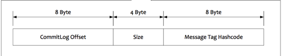
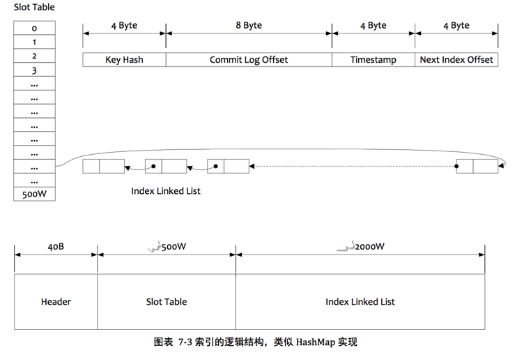
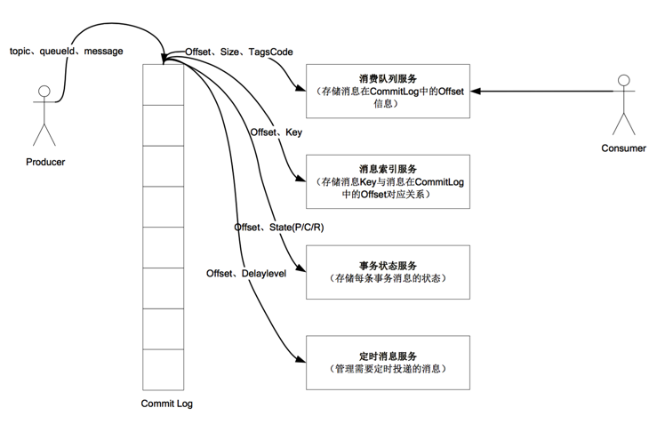
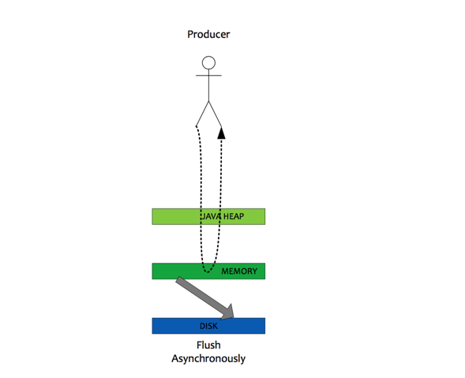

在RocketMQ中，Producer向一些队列(MessageQueue)轮流发送消息，队列集合称为Topic。每个队列都有一个queueId.所有的消息都存储在Commit Log文件中。但是consumer是通过Topic和tag订阅消息，所以还需要维护一个Topic、queueId以及它们对应的消息的数据结构，这就是ConsumeQueue.为了快速的查询消息，我们还需要Index File.

存储目录结构：
````
|-abort
|-checkpoint
|-config
|   |-consumerOffset.json
|   |-consumerOffset.json.bak
|   |-delayOffset.json
|   |-delayOffset.json.bak
|   |-subscriptionGroup.json
|   |-subscriptionGroup.json.bak
|   |-topics.json
|   |-topics.json.bak
|-commitlog
|   |00000000000000000000
|   |00000000001073741824
|-index
|   |20161028011752334
|-consumequeue
    |-OFFSET_MOVED_EVENT
    |  |-0
    |  |  -00000000000000000000  
    |-%RERTY%ConsumerGroupA
    |  |-0
    |  |  -00000000000000000000
    |-%SCHEDULE_TOPIC_XXXX
    |  |-2
    |  |  -00000000000000000000
    |  |  -00000000000006000000
    |-TopicA
    |  |-0
    |  |  -00000000000000000000
    |  |  -00000000000006000000
    |  |-1
    |  |  -00000000000000000000
    |  |  -00000000000006000000
    |-TopicB
    |  |-0
    |  |  -00000000000000000000
    |  |  -00000000000006000000
    |  |-1
    |  |  -00000000000000000000
    |  |  -00000000000006000000
````

## ConsumeQueue
在RocketMQ中，Producer向Message Queue发送消息，所有的消息队列都是持久化的，长度无限的数据结构。消息队列中的存储单元是定长的（20字节）,如下图所示。你可以把消息队列想象成一个长度无限的字节数组。访问其中的存储单元可以通过数组的下标，也就是offset.



如上图所示为ConsumeQueue中的一个存储单元，前8个字节存储消息在CommitLog中的offset，9-12个字节存储message size,最后8个字节存储message tag的hashcode。

在物理存储上，ConsumeQueue的结构是这样的：

````
|-consumequeue
    |-topic
    |  |-queueId
    |  |  -00000000000000000000
    |  |  -00000000000006000000
    |  |-queueId
    |  |  -00000000000000000000
    |-topic
    |  |-queueId
    |  |  -00000000000000000000
    |  |  -00000000000006000000
````

每一个consumequeue文件都是定长的(6000000 字节)，并且文件的名字即为其在队列中的起始偏移量(offset)。

在`CommitLog`类的`HashMap<String/* topic-queueid */, Long/* offset */> topicQueueTable`中，维护了每一个队列的偏移量，它的key为“topic-queueid”，value为queueOffset。

## CommitLog
所有的消息最终存储在CommitLog 文件中。CommitLog文件是定长的，大小为1 G(`1024 * 1024 * 1024` 字节，1073741824字节)。commitlog文件的名字即为其在CommitLog队列中的起始偏移量。

commitlog的物理结构为：

````
|-commitlog
|   |00000000000000000000
|   |00000000001073741824
|   |...
````

消息在commitlog文件中存储的格式为：

````
+----------------------------------------------------------------------------+
| totalsize (4)| MagicCode (4) | BodyCRC (4) | queueId (4) | Flag (4)        |                                         
+----------------------------------------------------------------------------+
| queueOffset (8) | physicalOffset (8) | sysFlag (4) | bornTimestamp (8)     |
+----------------------------------------------------------------------------+
| bornHost (8)| storeTimestamp (8)| storeHostAddress (8)| reconsume Times (4)|
+----------------------------------------------------------------------------+
| prepared transaction offset (8) | body length (4)     |     body data      |
+----------------------------------------------------------------------------+
| topic lenght (1) | topic data | properties lenght (2) | properties data    |   
+----------------------------------------------------------------------------+
````

在这里我们要关注几个字段：

+ queueId.消息对应的consumeQueue的queueId.

+ queueOffset.消息在consumeQueue中的offset。

+ physicalOffset.消息在Commitlog中的offset。

+ sysFlag.消息的类型，有CompressedFlag,MultiTagsFlag,TransactionNotType,TransactionPreparedType,TransactionRollbackType,TransactionCommitType.

+ storeTimestamp

+ bornTimestamp

每个消息的total size不能超过512K。

存储系统特性：

1. 所有数据单独存储到一个 Commit Log,完全顺序写,随机读。

2. 对最终用户展现的队列实际上只存储了消息在CommitLog的位置信息,并且串行方式刷盘。

这样做的好处如下:

1. 队列轻量化,单个队列数据量非常少。

2. 对磁盘的访问串行化,避免磁盘竟争,不会因为队列增加导致IOWAIT增高。

每个方案都有缺点,它的缺点如下:

1. 写虽然完全是顺序写,但是读却变成了完全的随机读。

2. 读一条消息,会先读consumeQueueTable,如果consumeQueueTable中没有,会产生IO读ConsumeQueue 文件。
再读CommitLog,增加了开销。

3. 要保证CommitLog与ConsumeQueue完全的一致,增加了编程的复杂度。

以上缺点如何克服:

1. 随机读,尽可能让读命中 PAGECACHE,减少 IO 读操作,所以内存越大越好。如果系统中堆积的消息过多,
读数据要访问磁盘会不会由于随机读导致系统性能急剧下降,答案是否定的。

    + 访问 PAGECACHE 时,即使只访问 1k 的消息,系统也会提前预读出更多数据,在下次读时,就可能命
中内存。

    + 随机访问 Commit Log 磁盘数据,系统 IO 调度算法设置为 NOOP 方式,会在一定程度上将完全的随机
读变成顺序跳跃方式,而顺序跳跃方式读较完全的随机读性能会高 5 倍以上,可参见以下针对各种 IO
方式的性能数据。另外 4k 的消息在完全随机访问情况下,仍然可以达到 8K 次每秒以上的读性能。

2. 由于ConsumeQueue存储数据量极少,而且是顺序读,在PAGECACHE预读作用下,ConsumeQueue的读
性能几乎与内存一致,即使堆积情况下。所以可认为 Consume Queue 完全不会阻碍读性能。

3. Commit Log 中存储了所有的元信息,包含消息体,类似于 Mysql、Oracle 的 redolog,所以只要有 Commit
Log 在,Consume Queue 即使数据丢失,仍然可以恢复出来。

## Index File
每一个indexFile的结构和大小都是固定的，包括一个Index header,5000000个hash slot, 4 * 5000000 个 index linked list。

其中Index header是定长40字节的结构。包括beginTimestamp(8),endTimestamp(8),beginPhyOffset(8),endPhyOffset(8)
,HashSlotCount(4),indexCount(4)。

每一个hash slot都是4个字节。hash slot的值slotValue是最新的索引项(index linked list)的下标。

index linked list中的每一个index都是定长为20字节的结构。它包括key hash(4),phyoffset(4),timeDiff(8),slotValue(4).timeDiff存储的是时间差值
即，存储时间-开始时间，开始时间存储在index header中。

index文件结构如下图所示：



按照Message key 查询消息：

1. 根据查询的 key 的 hashCode%slotNum 得到具体的槽的位置(slotNum 是一个索引文件里面包含的最大槽的数目,例如图中所示 slotNum=5000000)。

2. 根据 slotValue(slot 位置对应的值)查找到索引项列表的最后一项(倒序排列,slotValue 总是指向最新的一个索引项)。

3. 遍历索引项列表返回查询时间范围内的结果集(默认一次最大返回的 32 条记录)

4. Hash 冲突。寻找 key 的 slot 位置时相当于执行了两次散列函数,一次 key 的 hashCode,一次 key 的 hash 值取模,因此这里存在两次冲突的情况;第一种,key 的 hash 值不同但模数相同,此时查询的时候会在比较一次 key 的 hash 值(每个索引项保存了 key 的 hash 值),过滤掉 hash 值不相等的项。第二种,hash 值相等但 key 不等, 出于性能的考虑冲突的检测放到客户端处理(key 的原始值是存储在消息文件中的,避免对数据文件的解析), 客户端比较一次消息体的 key 是否相同。

可以参考`IndexFile.putKey()`和`indexService.queryOffset()`方法。

各种服务交互如下图所示：


## 刷盘策略
在RocketMQ中，利用Memory-mapped File,消除了buffer copy。Memory-mapped I/O 使用文件系统建立
用户空间（这里是JVM）与文件系统页之间的直接的虚拟内存映射。这有几个好处：

+ 用户进程把文件数据当作内存，因此不用发起`read()`和`write()`系统调用。

+ 当用户进程（这里是JVM）访问虚拟内存空间，缺页异常将会自动的产生，以从磁盘读取文件数据。如果用户更改了映射内存空间，受影响的页将会自动标记为脏页，随后将会刷新到磁盘来更新文件。

+ 操作系统的虚拟内存子系统执行智能的页缓存(cache pages)，自动根据系统负载管理内存。

+ 数据总是页对齐的（文件系统页和虚拟内存页），消除了buffer copy。

+ 大文件可以直接映射到用户空间，从而消除了数据拷贝时的大的内存消耗。

在Memory-mapped file中，MappedByteBuffer占用的内存空间是在Java heap之外的。

RocketMQ 的所有的消息都是持久化的，先写入MappedByteBuffer，然后刷盘，可以保证内存和磁盘都有一份数据，访问时，直接从
内存读取。

### 同步刷盘
1.  broker 先将数据写入MappedByteBuffer,然后唤醒GroupCommitService，最终调用`MappedByteBuffer.force()`方法，
将MappedByteBuffer对文件的更改刷入磁盘。

2. GroupCommitService flush OK后，唤醒(CountDownLatch)等待线程。

3. 等待线程返回成功。

### 异步刷盘
1. broker 将数据写入MappedByteBuffer,返回成功。

2. 调用`FlushRealTimeService.wakeUp()`方法唤醒刷盘线程，刷盘线程刷盘。


