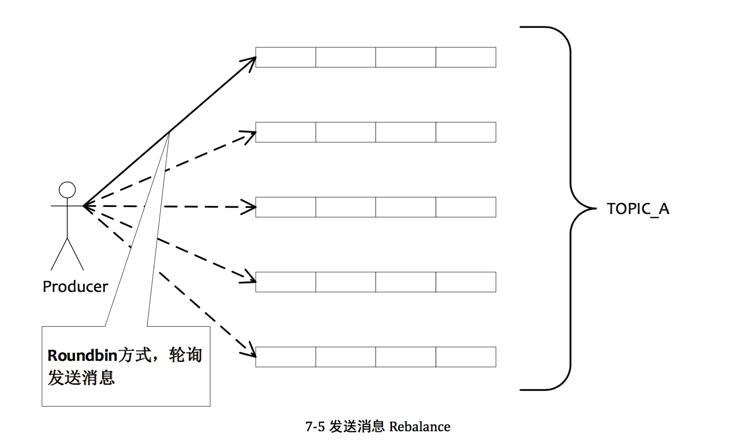

在RocketMQ中，消息由producer发送至broker,broker接收到消息后持久化。Producer的发送代码一般是这样的：

````
public static void main(String[] args) throws MQClientException,
        InterruptedException {
    /**
     * 一个应用创建一个Producer，由应用来维护此对象，可以设置为全局对象或者单例<br>
     * 注意：ProducerGroupName需要由应用来保证唯一<br>
     * ProducerGroup这个概念发送普通的消息时，作用不大，但是发送分布式事务消息时，比较关键，
     * 因为服务器会回查这个Group下的任意一个Producer
     */
    final DefaultMQProducer producer = new DefaultMQProducer(
            "ProducerGroupName");
    //name server服务,多个以;分开
    producer.setNamesrvAddr("localhost:9876");
    producer.setInstanceName("Producer");

    /**
     * Producer对象在使用之前必须要调用start初始化，初始化一次即可<br>
     * 注意：切记不可以在每次发送消息时，都调用start方法
     */
    producer.start();

    /**
     * 下面这段代码表明一个Producer对象可以发送多个topic，多个tag的消息。
     * 注意：send方法是同步调用，只要不抛异常就标识成功。但是发送成功也可会有多种状态，<br>
     * 例如消息写入Master成功，但是Slave不成功，这种情况消息属于成功，但是对于个别应用如果对消息可靠性要求极高，<br>
     * 需要对这种情况做处理。另外，消息可能会存在发送失败的情况，失败重试由应用来处理。
     */
    for (int i = 0; i < 10; i++) {
        try {
            {      //通过topic订阅消息，tag过滤消息
                Message msg = new Message("TopicTest1",// topic
                        "TagA",// tag 消息标签，只支持设置一个Tag（服务端消息过滤使用）
                        "OrderID001",// key 消息关键词，多个Key用KEY_SEPARATOR隔开（查询消息使用）
                        ("Hello MetaQA").getBytes());// body
                SendResult sendResult = producer.send(msg);
                System.out.println(sendResult);
            }

            {
                Message msg = new Message("TopicTest2",// topic
                        "TagB",// tag
                        "OrderID0034",// key
                        ("Hello MetaQB").getBytes());// body
                SendResult sendResult = producer.send(msg);
                System.out.println(sendResult);
            }

            {
                Message msg = new Message("TopicTest3",// topic
                        "TagC",// tag
                        "OrderID061",// key
                        ("Hello MetaQC").getBytes());// body
                SendResult sendResult = producer.send(msg);
                System.out.println(sendResult);
            }
        } catch (Exception e) {
            e.printStackTrace();
        }
        TimeUnit.MILLISECONDS.sleep(1000);
    }

    /**
     * 应用退出时，要调用shutdown来清理资源，关闭网络连接，从MetaQ服务器上注销自己
     * 注意：我们建议应用在JBOSS、Tomcat等容器的退出钩子里调用shutdown方法
     */
    // producer.shutdown();
    Runtime.getRuntime().addShutdownHook(new Thread(new Runnable() {
        public void run() {
            producer.shutdown();
        }
    }));
    System.exit(0);
}
````

当调用`producer.send(msg)`方法时，消息由Producer发送到了Broker。

下面我们跟踪send的过程。

`producer.send()`调用`DefaultMQProducerImpl.sendDefaultImpl()`方法发送消息。

`DefaultMQProducerImpl.sendDefaultImpl()`处理流程：

    1. `this.tryToFindTopicPublishInfo(msg.getTopic())`
        (1)根据topic从`topicPublishInfoTable`中找到`TopicPublishInfo`。如果这个topic是首次发送，那么`topicPublishInfoTable`中是没有对应的`TopicPublishInfo`的。

        (2)所以要调用`this.mQClientFactory.updateTopicRouteInfoFromNameServer(topic)`,从Name Server获取TopicRouteData。但是如果这个topic是第一次发送，Name Server也没有这个Topic对应的TopicRouteData。此时会从一个默认的Topic：`TBW102`取TopicRouteData，TBW102默认有4个MessageQueue。

    2. `int timesTotal = communicationMode == CommunicationMode.SYNC ? 3: 1`    
        timesTotal是消息发送失败后重试的次数。如果是同步调用的话，重试3次；异步调用，重试一次。

    3.  `MessageQueue tmpmq = this.selectOneMessageQueue(topicPublishInfo, lastBrokerName)`。
         在这一步实现了发送消息负载均衡。

````
public MessageQueue selectOneMessageQueue() {
    int index = this.sendWhichQueue.getAndIncrement();
    int pos = Math.abs(index) % this.messageQueueList.size();
    if (pos < 0)
        pos = 0;
    return this.messageQueueList.get(pos);
}
````

         采用round-robin的方式从MessageQueue中轮流选择队列，每个队列接收平均的消息量。
         这些队列可以部署在一台机器上，也可以部署在不同的机器上。通过增加机器，可以水平扩展队列容量。



         另外，也可以实现`MessageQueueSelector`，自定义发送到哪个队列，这个特性在发送顺序消息很关键。

    4. 调用`sendKernelImpl(msg, mq, communicationMode, sendCallback, topicPublishInfo, timeout)`

        (1) String brokerAddr = this.mQClientFactory.findBrokerAddressInPublish(mq.getBrokerName());   
          根据brokerName从`brokerAddrTable`中获取brokerAddr.

        (2)如果sendMessageWithVIPChannel=true(默认为true),则新的BrokerAddrIP:Port为旧的IP:port-2。

        (3)如果消息体大小超过4k，则压缩。sysFlag = MessageSysFlag.CompressedFlag;  

        (4)如果消息有MessageConst.PROPERTY_TRANSACTION_PREPARED这个属性，则， sysFlag |= MessageSysFlag.TransactionPreparedType;

        (5)如果消息topic以"%RETRY%"开头，则设置requestHeader.setReconsumeTimes(MessageAccessor.getReconsumeTime(msg));
        requestHeader.setMaxReconsumeTimes(MessageAccessor.getMaxReconsumeTimes(msg));
        并且，清除msg的RECONSUME_TIME，MAX_RECONSUME_TIMES属性。

        (6)RequestCode.SEND_MESSAGE_V2,调用NettyRemotingAbstract.invokeSyncImpl()发送至Broker。

        (7)request.getOpaque(),为requestId。将返回的结果和ResponseFuture对应起来。

到这里，客户端的发送流程就结束了。        

Broker端流程：

SendMessageProcessor.processRequest()处理请求，RequestCode.SEND_MESSAGE_V2。

调用commitLog.putMessage():

1. 如果是MessageSysFlag.TransactionNotType||MessageSysFlag.TransactionCommitType并且msg的`DELAY`属性大于0，则：

   将msg的topic设置为SCHEDULE_TOPIC_XXXX,queueId设置为msg.getDelayTimeLevel()-1。同时msg的REAL_TOPIC属性保存msg原topic,REAL_QID保存原queueId。

2. 从mappedFileQueue中获取最后一个mappedFile,如果最后一个mappedFile满了，则创建一个新的mappedFile，createOffset调整为最后一个mappedFile的fileFromOffset + mappedFileSize(1024*1024*1024)。

3. 调用mappedFile.appendMessage()写入消息。最终调用AppendMessageCallback.doAppend()写入消息。

    1. msgId = brokerIP1 + listenPort + wroteOffset.(wroteOffset = 文件名偏移量 + 文件中已经写入的bytes数)

    2. 以“topic-queueId”为key从topicQueueTable取queueOffset,queueOffset如果为null则设为0，存入topicQueueTable。

    3. 判断msg的sysFlag是否是：MessageSysFlag.TransactionPreparedType或 MessageSysFlag.TransactionRollbackType，如果是queueOffset = 0。

    4. 计算msg长度，如果超过512k则返回MESSAGE_SIZE_EXCEEDED

    5. 如果msgLen + 8 > (fileSize - currentPosition)，则将(fileSize - currentPosition)和CommitLog.BlankMagicCode写入byteBuffer,则返回END_OF_FILE

    6. 调用byteBuffer.put()写入byteBuffer。返回PUT_OK

    7. 如果tranType =  MessageSysFlag.TransactionPreparedType| MessageSysFlag.TransactionRollbackType，不处理。
       如果tranType = MessageSysFlag.TransactionNotType| MessageSysFlag.TransactionCommitType，topicQueueTable.put(key, ++queueOffset);

       注意这里，如果tranType =  MessageSysFlag.TransactionPreparedType| MessageSysFlag.TransactionRollbackType,这个topic和queueId在consumeQueue中的offset永远是0.

    处理appendMessage结果：
      + 如果是PUT_OK,继续。
      + 如果是END_OF_FILE，创建一个新的文件，重新调用appendMessage方法
      + 如果是MESSAGE_SIZE_EXCEEDED，PROPERTIES_SIZE_EXCEEDED，则返回MESSAGE_ILLEGAL。        

4. 同步刷盘（FlushDiskType.SYNC_FLUSH）

    1. 以下一个需要刷入的offset为参数，构造GroupCommitRequest：`new GroupCommitRequest(result.getWroteOffset() + result.getWroteBytes())`

    2. 调用GroupCommitService的putRequest()方法,将GroupCommitRequest放入`requestsWrite`列表中（`requestsWrite`为写请求集合。对应的有`requestsRead`，为读请求集合），这一步将唤醒GroupCommitService刷盘线程。唤醒后swapRequests()。

    3. 调用`doCommit()`方法。

      （1）如果`requestsRead`集合不为空，则遍历`requestsRead`集合中的`GroupCommitRequest`。判断是否还有消息没有刷入磁盘。

         （a)如果有消息没刷入磁盘，则调用`CommitLog.this.mapedFileQueue.commit(0);`刷入。

          (b)否则，调用GroupCommitRequest.wakeupCustomer(flushOK);向前端等待刷盘的线程返回flush OK。

          (c)requestsRead.clear()

       (2)如果`requestsRead`集合为空，则调用`CommitLog.this.mapedFileQueue.commit(0);`刷盘。

    前端线程等待5s，如果没有返回flushOk,则设置状态为FLUSH_DISK_TIMEOUT。

5. 异步刷盘
   调用FlushRealTimeService.wakeUp()方法，唤醒FlushRealTimeService刷盘线程。

6. 如果brokerRole是SYNC_MASTER则同步至slave。

## 同步双写，异步复制
Broker启动时，`BrokerController.initialize()`方法中

````
if (BrokerRole.SLAVE == this.messageStoreConfig.getBrokerRole()) {
    if (this.messageStoreConfig.getHaMasterAddress() != null && this.messageStoreConfig.getHaMasterAddress().length() >= 6) {
        this.messageStore.updateHaMasterAddress(this.messageStoreConfig.getHaMasterAddress());
        this.updateMasterHAServerAddrPeriodically = false;
    } else {
        this.updateMasterHAServerAddrPeriodically = true;
    }

    this.scheduledExecutorService.scheduleAtFixedRate(new Runnable() {

        @Override
        public void run() {
            try {
                BrokerController.this.slaveSynchronize.syncAll();
            } catch (Throwable e) {
                log.error("ScheduledTask syncAll slave exception", e);
            }
        }
    }, 1000 * 10, 1000 * 60, TimeUnit.MILLISECONDS);
````

如果Broker是Slave，SlaveSynchronize.syncAll方法会不断从Master拉取TopicConfig数据，ConsumeOffset数据，DelayOffset数据，SubscriptionGroupConfig数据。

那么如何知道Master的地址，Master HAServer的地址呢？

`BrokerController.start()`启动定时任务：

````
this.scheduledExecutorService.scheduleAtFixedRate(new Runnable() {

    @Override
    public void run() {
        try {
            BrokerController.this.registerBrokerAll(true, false);
        } catch (Throwable e) {
            log.error("registerBrokerAll Exception", e);
        }
    }
}, 1000 * 10, 1000 * 30, TimeUnit.MILLISECONDS);
````

这个`BrokerController.this.registerBrokerAll()`会定时向Name Server注册Broker信息、Filter Server 信息，HAServer信息。如果Broker不是Master，则会返回Master的地址，Master HAServer的地址。

Broker启动时调用`HAService.start()`，启动HAService：

````
public void start() {
    this.acceptSocketService.beginAccept();
    this.acceptSocketService.start();
    this.groupTransferService.start();
    this.haClient.start();
}
````

Slave启动HAClient，每隔5秒钟向Master报告Slave的CommitLog的MaxPhysicalOffset。

Master的`AcceptSocketService`，接收请求,分发读操作给`ReadSocketService`,写操作给`WriteSocketService`。

(1)`ReadSocketService`读取HAClient传来的Slave CommitLog的MaxPhysicalOffset，赋给`HAConnection.this.slaveAckOffset`和`HAConnection.this.slaveRequestOffset`.

(2)调用`HAService.notifyTransferSome(offset)`方法，这个方法调用`GroupTransferService.notifyTransferSome(HAConnection.this.slaveAckOffset)`方法，唤醒notifyTransferObject对象的等待集合中的线程。

(3)同时，`WriteSocketService`接着处理。`WriteSocketService.nextTransferFromWhere = HAConnection.this.slaveRequestOffset;`,而
`HAConnection.this.slaveRequestOffset`就是Slave CommitLog的MaxPhysicalOffset。此时，`WriteSocketService`将Master的下一个传输的offset--`nextTransferFromWhere`报告给Slave。

(4)Slave的HAClient接收到`WriteSocketService`发送的`nextTransferFromWhere`。

(5)`WriteSocketService`根据`nextTransferFromWhere`从CommitLog中拉数据:`SelectMapedBufferResult selectResult =
HAConnection.this.haService.getDefaultMessageStore().getCommitLogData(this.nextTransferFromWhere);`，如果selectResult的大小大于32KB，则`selectResult.getByteBuffer().limit(32 * 1024)`,即每次传输最多传输32K。构造传输报文，格式为：

````
+---------------------------------------+-------+
|                  Header               |  body |             
+---------------------------------------+-------+
|  此次传输的offset  |此次传输的msg 大小    |  msg  |
+---------------------------------------+-------+
````

发送给Slave。

(6)Slave接收`WriteSocketService`传输的数据，调用`HAService.this.defaultMessageStore.appendToCommitLog(masterPhyOffset, bodyData);`将msg append 到CommitLog。同时唤醒`ReputMessageService`,构造ConsumeQueue。调用`IndexService`创建Index。

(7)重复步骤1-6，直到Slave和Master保持同步。

(8)Slave 和Master保持同步后，调用`HAConnection.this.haService.getWaitNotifyObject().allWaitForRunning(100);`,`WriteSocketService`线程将等待，直到另一个线程执行`WaitNotifyObject.notify()`,`WaitNotifyObject.notifyAll()`,或者设置的超时时间到了。

接着上一步的6,如果brokerRole是SYNC_MASTER则同步至slave。

1. 调用`HAService.putRequest(GroupCommitRequest)`方法，这个方法最终调用`GroupTransferService.putRequest`，将GroupCommitRequest放入`requestsWrite`列表中（`requestsWrite`为写请求集合。对应的有`requestsRead`，为读请求集合），这一步将唤醒GroupTransferService线程。唤醒后swapRequests()。

     遍历`requestsRead`集合中的`GroupCommitRequest`request，从`push2SlaveMaxOffset`获取Slave的MaxPhysicalOffset。

    （1）如果Slave的MaxPhysicalOffset >= request.nextOffset，则说明Slave没有落后Master。Slave不需要从Master拉数据。transferOK = true。

    （2）如果Slave的MaxPhysicalOffset < request.nextOffset，则说明Slave落后Master，Slave需要从Master拉数据。transferOK = false。

     (3)如果transferOK == false,等待1s。再次检查transferOK是否为true。重试5次。5次后，transferOK还是为false,通知前端线程同步至Slave失败(FLUSH_SLAVE_TIMEOUT)。

2. 调用`HAService.getWaitNotifyObject().wakeupAll();`，唤醒`WaitNotifyObject`等待队列中的线程，也就是上面步骤8中的线程。执行步骤3-6。

## Send方法注意事项
send消息方法，只要不抛异常，就代表发送成功。但是发送成功会有多个状态，在sendResult里定义

+ SEND_OK：消息发送成功

+ FLUSH_DISK_TIMEOUT：消息发送成功，但是服务器刷盘超时，消息已经进入服务器队列，只有此时服务器宕机，消息才会丢失

+ FLUSH_SLAVE_TIMEOUT：消息发送成功，但是服务器同步到Slave时超时，消息已经进入服务器队列，只有此时服务器宕机，消息才会丢失

+ SLAVE_NOT_AVAILABLE：消息发送成功，但是此时slave不可用，消息已经进入服务器队列，只有此时服务器宕机，消息才会丢失。对于精确发送顺序消息的应用，由于顺序消息的局限性，可能会涉及到主备自动切换问题，所以如果sendresult中的status字段不等于 SEND_OK，就应该尝试重试。对于其他应用，则没有必要这样

## 消息发送失败处理
发送失败指返回的sendResult的status不为SEND_OK

Producer的send方法本身支持内部重试，重试逻辑如下：
如果DefaultMQProducer的retryAnotherBrokerWhenNotStoreOK为true（默认为false）才会重试，否则不会重试。

+ 默认重试次数为3

+ 如果发送失败，则轮转到下一个 MessageQueue的Broker（如果只有一个Broker则不重试，注意一个BrokerName下的主从Broker为一个broker）

+ 这个方法的总耗时时间不超过 sendMsgTimeout 设置的值，默认 3s所以，如果本身向 broker 发送消息产生超时异常，就不会再做重试(在3.5.8版本里去掉了这个限制)

如果调用send同步方法发送失败，则尝试将消息存储到 db，由后台线程定时重试，保证消息一定到达 Broker。

## 同步CommitLog到ConsumeQueue

其实在Broker启动时，会启动一个`ReputMessageService`线程，这个线程负责ConsumeQueue的维护。

````
while (!this.isStoped()) {
    try {
        Thread.sleep(1);
        this.doReput();
    } catch (Exception e) {
        DefaultMessageStore.log.warn(this.getServiceName() + " service has exception. ", e);
    }
}
````

`doReput()`方法处理流程：

1. 对比reputFromOffset(初始为0)和commitLog的maxoffset。如果reputFromOffset < maxoffset，则继续

2. 根据reputFromOffset从commitLog中拉数据。构造DispatchRequest,调用DefaultMessageStore.this.doDispatch(dispatchRequest)。

   doDispatch处理流程：

   (1) 如果MessageSysFlag.TransactionPreparedType|MessageSysFlag.TransactionRollbackType,不处理。什么意思呢？就是说，如果MessageSysFlag.TransactionPreparedType|MessageSysFlag.TransactionRollbackType，ConsumeQueue中没有这个topic和queueId,也不持久化到ConsumeQueue文件中。

   我们知道ConsumeQueue文件的存储单元会保存三种信息：commitLog offset,msg size,msg tags hashcode.如果消息存储在CommitLog中的offset没有保存到ConsumeQueue中，那么这些消息将无法消费。

   (2)如果MessageSysFlag.TransactionNotType|MessageSysFlag.TransactionCommitType,则调用DefaultMessageStore.this.putMessagePostionInfo()方法：根据topic和queueId找到ConsumeQueue,如果broker有写权限，则将commitLog offset,msg size,tagsCode写入ConsumeQueue。

   (3)DefaultMessageStore.this.indexService.buildIndex(req);建立索引文件。

   到这里`doDispatch()`方法结束。

3. 如果brokerRole不是slave,并且longPollingEnable = true，则调用`pullRequestHoldService.notifyMessageArriving()`  
   这里调用PullMessageProcessor.processRequest：

````
if (this.brokerController.getBrokerConfig().isSlaveReadEnable()) {
     // consume too slow ,redirect to another machine
     if (getMessageResult.isSuggestPullingFromSlave()) {
         responseHeader.setSuggestWhichBrokerId(subscriptionGroupConfig.getWhichBrokerWhenConsumeSlowly());
     }
     // consume ok
     else {
         responseHeader.setSuggestWhichBrokerId(subscriptionGroupConfig.getBrokerId());
     }
 }

long diff = maxOffsetPy - maxPhyOffsetPulling;
long memory = (long) (StoreUtil.TotalPhysicalMemorySize
                                * (this.messageStoreConfig.getAccessMessageInMemoryMaxRatio() / 100.0));
getResult.setSuggestPullingFromSlave(diff > memory);


public static long getTotalPhysicalMemorySize() {
    long physicalTotal = 1024 * 1024 * 1024 * 24;
    OperatingSystemMXBean osmxb = ManagementFactory.getOperatingSystemMXBean();
    if (osmxb instanceof com.sun.management.OperatingSystemMXBean) {
        physicalTotal = ((com.sun.management.OperatingSystemMXBean) osmxb).getTotalPhysicalMemorySize();
    }

    return physicalTotal;
}
````

当master消费过慢时，将读操作分发至slave节点。分发至那个节点可以由命令行`w`指定。

如果diff > 总物理内存的40%，则重定向到Slave.

## ConsumeQueue什么时候刷盘？

Broker启动时，会启动一个`FlushConsumeQueueService`线程，这个线程负责ConsumeQueue的刷盘。
