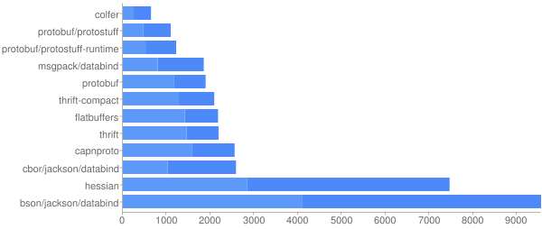
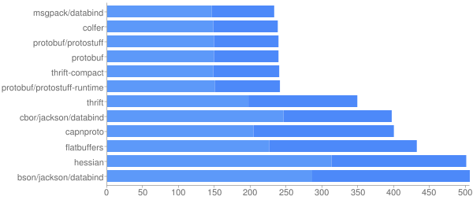

dubbo的分层以及架构在dubbo的[官方文档](http://dubbo.io/Developer+Guide-zh.htm)已经说得很清楚了，在这里我就不多说了。这里主要结合dubbo源码讲述dubbo对于RPC各个方面的实现。

一个RPC框架可以分为客户端和服务端，在dubbo中provider对应于服务端，consumer对应于客户端。

另外，一个RPC框架可以分为启动阶段和服务调用阶段。参考dubbo的架构图：


## 启动阶段
启动阶段可以分为客户端(consumer)启动和服务端(provider)启动。

consumer启动阶段主要要完成以下工作：

+ 创建服务代理类
+ 从注册中心获取远程服务地址列表
+ 订阅远程服务地址更新时的通知。

provider启动主要要完成以下工作：

+ 先向注册中心注册要发布的服务
+ 启动Server，等待连接

如图所示：


### Consumer启动阶段
Consumer在dubbo中有`ReferenceBean`类表示，我们假设采用xml配置，spring管理的方式配置。那么所有的配置文件都会由`DubboNamespaceHandler`解析。

一般情况下，我们的应用会有这样几种配置：

````
<!-- 应用名 -->
<dubbo:application name="dubbodemo-provider"/>

<!-- 连接到哪个注册中心 -->
<dubbo:registry id="dubbodemo" address="zookeeper://localhost:2181"/>

<!-- 用dubbo协议在20880端口暴露服务 -->
<dubbo:protocol name="dubbo" port="28080"/>

<!-- 声明需要暴露的服务接口 -->
<dubbo:service registry="dubbodemo" timeout="3000" interface="com.XXX.service.XXXService" ref="XXXService"/>

<dubbo:reference id="XXXService" interface="com.XXX.service.XXXService"/>
````

`ReferenceBean`实现了`InitializingBean`接口，在set properties之后会执行`afterPropertiesSet`方法。所以调用顺序是这样的：

ReferenceBean.afterPropertiesSet() --> ReferenceBean.getObject()-->
ReferenceConfig.get()-->ReferenceConfig.init()-->ReferenceConfig.createProxy()-->

1. Protocol.refer()-->RegistryProtocol.refer()-->RegistryProtocol.doRefer()-->
    1. RegistryDirectory.subscribe()-->FailBackRegistry.subscribe()-->ZookeZookeeperRegistry.doSubscribe() 订阅更新-->FailBackRegistry.notify()-->AbstractRegistry.notify()-->RegistryDirectory.notify()-->RegistryDirectory.refreshInvoker()-->RegistryDirectory.toInvokers()-->DubboProtocol.refer() init `DubboInvoker`-->DubboProtocol.getClients() "init client"

    2. MergeableCluster.join()-->init `MergeableClusterInvoker`

2. ProxyFactory.getProxy()，创建代理类

调用图如下图所示：


### Provider启动阶段
Provider在dubbo中由`ServiceBean`表示，同样，我们假设采用xml配置，spring管理的方式配置。那么所有的配置文件都会由`DubboNamespaceHandler`解析。`ServiceBean`实现了`InitializingBean`接口，在set properties之后会执行`afterPropertiesSet`方法。所以调用顺序是这样的：

ServiceBean.afterPropertiesSet-->ServiceBean.export()-->ServiceConfig.doExport()-->ServiceConfig.doExportUrlsFor1Protocol() 从这里可以看出服务端默认协议是`dubbo` -->

    1. init Invoker: Invoker<?> invoker = proxyFactory.getInvoker()-->JdkProxyFactory

    2. Exporter<?> exporter = protocol.export(invoker)-->

        1. DubboProtocol.export()-->DubboProtocol.openServer()-->DubboProtocol.createServer()-->Exchangers.bind()-->HeaderExchanger.bind()-->Transporters.bind()-->NettyTransporter.bind()--> NettyServer.doOpen() -->启动服务端，绑定地址。


        2. ProtocolListenerWrapper.export()--> RegistryProtocol.export()-->
              1. FailBackRegistry.register()--> 注册服务
              2. FailBackRegistry.subscribe()--> 订阅override数据

调用图如下图所示：

              

## 服务调用阶段
启动之后，服务端等待客户端的调用，客户端在调用远程服务时通过`Invoker`调用。那么在这一阶段我们要关注什么呢？

在这一阶段我们要关注RPC的下面语义：

+ 如何将消息转换为byte，也就是说，序列化协议是什么？
+ 通讯协议是什么？
+ 是否共用连接
+ 如何实现同步/异步调用

下面我们具体看Dubbo的实现。

### 客户端调用
客户端的调用通过`Invoker`，所以我们先看`Invoker`是哪个。通过上面的启动阶段，我们知道`Invoker`由`DubboProtocol.refer()`方法初始化。

````
public <T> Invoker<T> refer(Class<T> serviceType, URL url) throws RpcException {
        // create rpc invoker.
        DubboInvoker<T> invoker = new DubboInvoker<T>(serviceType, url, getClients(url), invokers);
        invokers.add(invoker);
        return invoker;
    }
````

getClients方法作用是初始化客户端，方法如下：

````    
    private ExchangeClient[] getClients(URL url){
        //是否共享连接
        boolean service_share_connect = false;
        int connections = url.getParameter(Constants.CONNECTIONS_KEY, 0);
        //如果connections不配置，则共享连接，否则每服务每连接
        if (connections == 0){
            service_share_connect = true;
            connections = 1;
        }

        ExchangeClient[] clients = new ExchangeClient[connections];
        for (int i = 0; i < clients.length; i++) {
            if (service_share_connect){
                clients[i] = getSharedClient(url);
            } else {
                clients[i] = initClient(url);
            }
        }
        return clients;
    }
````

我们可以看到`int connections = url.getParameter(Constants.CONNECTIONS_KEY, 0);`这个connections是你对consumer的配置，一般情况下，是默认情况，也就是0。所以默认是不共享连接的。所以会调用`initClient()`方法。但是我们还是要看看怎么共享连接，所以看看`getSharedClient()`方法：

````
/**
     *获取共享连接
     */
    private ExchangeClient getSharedClient(URL url){
        String key = url.getAddress();
        ReferenceCountExchangeClient client = referenceClientMap.get(key);
        if ( client != null ){
            if ( !client.isClosed()){
                client.incrementAndGetCount();
                return client;
            } else {
//                logger.warn(new IllegalStateException("client is    closed,but stay in clientmap .client :"+ client));
                referenceClientMap.remove(key);
            }
        }
        ExchangeClient exchagneclient = initClient(url);

        client = new ReferenceCountExchangeClient(exchagneclient, ghostClientMap);
        referenceClientMap.put(key, client);
        ghostClientMap.remove(key);
        return client;
    }
````

首先，`url.getAddress()`这里的address就是你要调用的远程服务的IP地址:端口。然后从`referenceClientMap`中获取客户端，如果已经有连接到那个地址的客户端则把client的引用数加一，否则创建一个新的`ExchangeClient`和`ReferenceCountExchangeClient`，将他放入`referenceClientMap`中并且从`ghostClientMap`中移除。这个`ghostClientMap`是一个`LazyConnectExchangeClient`的map。`LazyConnectExchangeClient`和`ExchangeClient`的区别是什么呢?还是看代码：

````
if (url.getParameter(Constants.LAZY_CONNECT_KEY, false)){
                client = new LazyConnectExchangeClient(url ,requestHandler);
            } else {
                client = Exchangers.connect(url ,requestHandler);
            }
````

上面可以看到，如果是配置了`lazy=true`的话，直接返回`LazyConnectExchangeClient`对象，并没有连接到服务端。

而如果不是`Lazy`的话，
`client = Exchangers.connect(url ,requestHandler)`-->HeaderExchanger.connect()-->Transporters.connect()-->NettyTransporter.connect()-->NettyClient.doOpen()-->NettyClient.doConnect()

直接看NettyClient.doConnect()方法：

````
protected void doConnect() throws Throwable {
    long start = System.currentTimeMillis();
    ChannelFuture future = bootstrap.connect(getConnectAddress());
    try{
        boolean ret = future.awaitUninterruptibly(getConnectTimeout(), TimeUnit.MILLISECONDS);
        ...
    }finally{
        if (! isConnected()) {
            future.cancel();
        }
    }
}
````

NettyClient连接到远程服务端。所以，如果lazy = true的话，在实际调用`Invoker`的时候，才会连接到远程服务端。如果laze = false的话，在`Invoker`初始化的时候就连接到远程服务端，但是此时可能并没有任何调用。所以在实际中建议设置lazy = true。

如何设置了共用连接的话（connections数，默认为0,即不共用),`referenceClientMap`会以"IP地址:port"为key，HeaderExchanger对象为value,保存连接。

接下来我们看看序列化和通讯协议。

我们找到了客户端、编码解码器以及requestHandler。

````
public class HeaderExchanger implements Exchanger {

    public static final String NAME = "header";

    public ExchangeClient connect(URL url, ExchangeHandler handler) throws RemotingException {
        return new HeaderExchangeClient(Transporters.connect(url, new DecodeHandler(new HeaderExchangeHandler(handler))));
    }
}
````

传递给HeaderExchangeHandler的handler是DubboProtocol中的`requestHandler`变量。   

最终我们看NettyClient的`doOpen()`方法：

````
@Override
    protected void doOpen() throws Throwable {
        NettyHelper.setNettyLoggerFactory();
        bootstrap = new ClientBootstrap(channelFactory);
        // config
        // @see org.jboss.netty.channel.socket.SocketChannelConfig
        bootstrap.setOption("keepAlive", true);
        bootstrap.setOption("tcpNoDelay", true);
        bootstrap.setOption("connectTimeoutMillis", getTimeout());
        final NettyHandler nettyHandler = new NettyHandler(getUrl(), this);
        bootstrap.setPipelineFactory(new ChannelPipelineFactory() {
            public ChannelPipeline getPipeline() {
                NettyCodecAdapter adapter = new NettyCodecAdapter(getCodec(), getUrl(), NettyClient.this);
                ChannelPipeline pipeline = Channels.pipeline();
                pipeline.addLast("decoder", adapter.getDecoder());
                pipeline.addLast("encoder", adapter.getEncoder());
                pipeline.addLast("handler", nettyHandler);
                return pipeline;
            }
        });
    }
````

序列化由`getCodec()`方法提供，通信协议由encoder和decoder提供。我们最终看`ExchangeCodec`的`public void encode(Channel channel, ChannelBuffer buffer, Object msg)`方法：

`encodeRequest()`方法是编码request的，通过这个方法可以看到通讯协议和序列化。

````
protected void encodeRequest(Channel channel, ChannelBuffer buffer, Request req) throws IOException {
        Serialization serialization = getSerialization(channel);
        // header.
        byte[] header = new byte[HEADER_LENGTH];
        // set magic number.
        Bytes.short2bytes(MAGIC, header);

        // set request and serialization flag.
        header[2] = (byte) (FLAG_REQUEST | serialization.getContentTypeId());

        if (req.isTwoWay()) header[2] |= FLAG_TWOWAY;
        if (req.isEvent()) header[2] |= FLAG_EVENT;

        // set request id.
        Bytes.long2bytes(req.getId(), header, 4);

        // encode request data.
        int savedWriteIndex = buffer.writerIndex();
        buffer.writerIndex(savedWriteIndex + HEADER_LENGTH);
        ChannelBufferOutputStream bos = new ChannelBufferOutputStream(buffer);
        ObjectOutput out = serialization.serialize(channel.getUrl(), bos);
        if (req.isEvent()) {
            encodeEventData(channel, out, req.getData());
        } else {
            encodeRequestData(channel, out, req.getData());
        }
        out.flushBuffer();
        bos.flush();
        bos.close();
        int len = bos.writtenBytes();
        checkPayload(channel, len);
        Bytes.int2bytes(len, header, 12);

        // write
        buffer.writerIndex(savedWriteIndex);
        buffer.writeBytes(header); // write header.
        buffer.writerIndex(savedWriteIndex + HEADER_LENGTH + len);
    }
````
### 通信协议
首先，`byte[] header = new byte[HEADER_LENGTH];`,HEADER_LENGTH为16。就是说协议头有16个字节。

`Bytes.short2bytes(MAGIC, header);`第一个字节和第二个字节是 MAGIC-NUMBER:`0xdabb`

其他的字节可以看下图：


通过上图我们可以知道dubbo通讯协议的头部，前两个字节是一个magic number:`0xdabb`；接下来是Serialization id,event,two way,req/res,status;第5-12个字节为requestId,第13-16个字节为data length，data length是消息体的长度。

在[从零开始实现RPC-(2)Java 实现](https://github.com/HeyMoon/rpc-note/blob/master/rpc%E5%8E%9F%E7%90%86/%E4%BB%8E%E9%9B%B6%E5%BC%80%E5%A7%8B%E5%AE%9E%E7%8E%B0RPC-(2)Java%20%E5%AE%9E%E7%8E%B0.md)中，我们说过，粘包问题可以通过四种方式解决：

 1. 消息定长，例如每个报文固定为200个字节，如果不够，空位补空格
 2. 在包尾增加回车换行符进行分割，例如FTP协议
 3. 将消息分为消息头和消息体，消息头包含表示消息长度(或消息体长度)的字段，通常设计思路为消息头的第一个字段使用int32 来表示消息的总长度。
 4. 更复杂的协议

在dubbo中，就采用了第三种方式。


### 序列化
序列化的实现可以看下面代码：

````
Serialization serialization = getSerialization(channel);
...
ObjectOutput out = serialization.serialize(channel.getUrl(), bos);
`````

`getSerialization`调用`AbstractCodec.getSerialization()`，最终调用`CodecSupport.getSerialization(URl url)`方法：

````
public static Serialization getSerialization(URL url) {
        return ExtensionLoader.getExtensionLoader(Serialization.class).getExtension(
            url.getParameter(Constants.SERIALIZATION_KEY, Constants.DEFAULT_REMOTING_SERIALIZATION));
    }
````

这里的`DEFAULT_REMOTING_SERIALIZATION`为hessian2，所以dubbo默认的序列化方式是hessian2。

但是hessian的序列化和反序列化耗时比较长，序列化之后的bytes的大小也很大。

下面是Jvm 序列化框架的Benchmark：

#### JVM Serializers Benchmark
数据来自：https://github.com/eishay/jvm-serializers/wiki

序列化和反序列化耗时



序列化后的字节大小



从上面的图可以知道，hessian无论是在耗时，还是序列化后的字节大小方面都是比较不理想的。这算是dubbo的一个缺点。

### 同步/异步调用
RPC调用由`Invoker`发起，所以直接看`Invoker`的`doInvoke()`方法。

````
protected Result doInvoke(final Invocation invocation) throws Throwable {
    RpcInvocation inv = (RpcInvocation) invocation;
    final String methodName = RpcUtils.getMethodName(invocation);
    inv.setAttachment(Constants.PATH_KEY, getUrl().getPath());
    inv.setAttachment(Constants.VERSION_KEY, version);

    ExchangeClient currentClient;
    if (clients.length == 1) {
        currentClient = clients[0];
    } else {
        currentClient = clients[index.getAndIncrement() % clients.length];
    }
    try {
        boolean isAsync = RpcUtils.isAsync(getUrl(), invocation);
        boolean isOneway = RpcUtils.isOneway(getUrl(), invocation);
        int timeout = getUrl().getMethodParameter(methodName, Constants.TIMEOUT_KEY,Constants.DEFAULT_TIMEOUT);
        if (isOneway) {
          boolean isSent = getUrl().getMethodParameter(methodName, Constants.SENT_KEY, false);
            currentClient.send(inv, isSent);
            RpcContext.getContext().setFuture(null);
            return new RpcResult();
        } else if (isAsync) {
          ResponseFuture future = currentClient.request(inv, timeout) ;
            RpcContext.getContext().setFuture(new FutureAdapter<Object>(future));
            return new RpcResult();
        } else {
          RpcContext.getContext().setFuture(null);
            return (Result) currentClient.request(inv, timeout).get();
        }
    } catch (TimeoutException e) {
        throw new RpcException(RpcException.TIMEOUT_EXCEPTION, "Invoke remote method timeout. method: " + invocation.getMethodName() + ", provider: " + getUrl() + ", cause: " + e.getMessage(), e);
    } catch (RemotingException e) {
        throw new RpcException(RpcException.NETWORK_EXCEPTION, "Failed to invoke remote method: " + invocation.getMethodName() + ", provider: " + getUrl() + ", cause: " + e.getMessage(), e);
    }
}
````

上述代码中的`currentClient`为`HeaderExchangeClient`,`currentClient.send()`最终调用`HeaderExchangeChannel.send()`

#### one way
one way实现比较简单，发送消息之后直接返回。

````
if (isOneway) {
  boolean isSent = getUrl().getMethodParameter(methodName, Constants.SENT_KEY, false);
    currentClient.send(inv, isSent);
    RpcContext.getContext().setFuture(null);
    return new RpcResult();
}
````

#### two way(同步)

````
RpcContext.getContext().setFuture(null);
return (Result) currentClient.request(inv, timeout).get();
````

`HeaderExchangeChannel.request()`方法如下：

````
public ResponseFuture request(Object request, int timeout) throws RemotingException {
    if (closed) {
        throw new RemotingException(this.getLocalAddress(), null, "Failed to send request " + request + ", cause: The channel " + this + " is closed!");
    }
    // create request.
    Request req = new Request();
    req.setVersion("2.0.0");
    req.setTwoWay(true);
    req.setData(request);
    DefaultFuture future = new DefaultFuture(channel, req, timeout);
    try{
        channel.send(req);
    }catch (RemotingException e) {
        future.cancel();
        throw e;
    }
    return future;
}
````

关键的地方在于`DefaultFuture`这个类。当new `DefaultFuture`时，`DefaultFuture`会将requestId作为key,DefaultFuture作为value放在一个全局的ConcurrentHashMap中，当在这一步`return (Result) currentClient.request(inv, timeout).get();`调用DefaultFuture的get方法时，

````
public Object get(int timeout) throws RemotingException {
    if (timeout <= 0) {
        timeout = Constants.DEFAULT_TIMEOUT;
    }
    if (! isDone()) {
        long start = System.currentTimeMillis();
        lock.lock();
        try {
            while (! isDone()) {
                done.await(timeout, TimeUnit.MILLISECONDS);
                if (isDone() || System.currentTimeMillis() - start > timeout) {
                    break;
                }
            }
        } catch (InterruptedException e) {
            throw new RuntimeException(e);
        } finally {
            lock.unlock();
        }
        if (! isDone()) {
            throw new TimeoutException(sent > 0, channel, getTimeoutMessage(false));
        }
    }
    return returnFromResponse();
}
````

它首先获取一个锁，然后调用`isDone()`方法判断response是否等于null（当服务端有消息返回时会调用`HeaderExchangeHandler`的`received()`方法，然后再调用`handleResponse()`方法将response设置为服务端的返回值。），如果response为null，说明服务端没有返回值，调用`done.await(timeout, TimeUnit.MILLISECONDS);`继续等待；如果response不为null，则返回response。

#### two way(异步)
异步和同步差不多，只不过异步返回一个future，然后在`FutureFilter`里设置一个`callBack`方法。

````
else if (isAsync) {
  ResponseFuture future = currentClient.request(inv, timeout) ;
    RpcContext.getContext().setFuture(new FutureAdapter<Object>(future));
    return new RpcResult();
}
````

### 负载均衡
