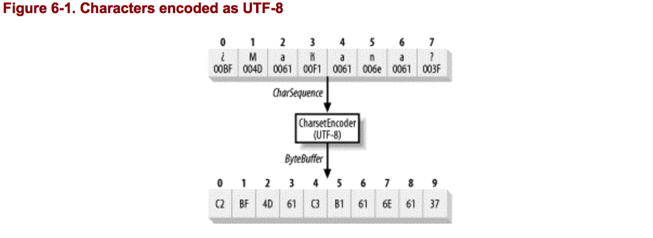
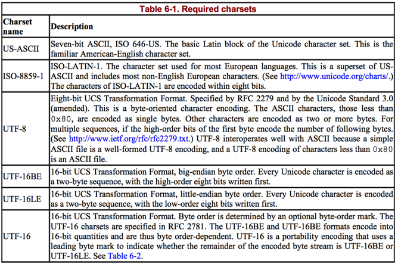
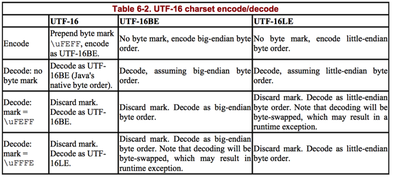
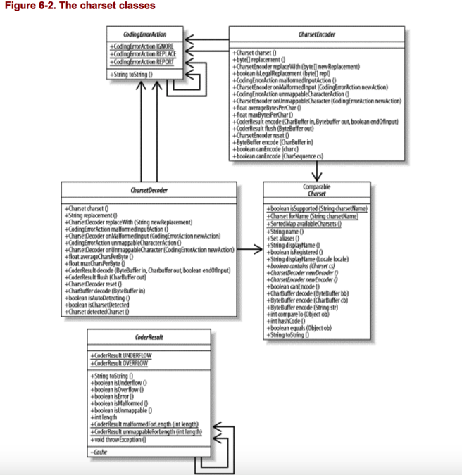

我们生活在一个变化莫测的世界中。甚至在这个我们称之为地球的平凡的 M 级行星 上,我们也使用数百种不同的语言。在《The Hitchhikers Guide to the Galaxy》(即《银河 系漫游指南》)中,Arthur Dent 把 Babelfish放在耳朵里,从而解决了他的语言 问题。之后在他偶然的银河旅行中,他就可以理解所遇到的由不同字符(至少可以说) 组成的语言。

在 Java 平台上,我们没有奢侈的 Babelfish 技术(至少现在没有)2,但我们仍必须处 理多种语言以及组成这些语言的多个字符。幸运的是,Java 是第一个被广泛使用的编程语 言,它使用内在的 Unicode 来表示字符。与以字节为导向的编程语言例如 C 或 C++相比, Unicode 的固有支持大大的简化了字符数据处理,但决不是自动的处理字符。您仍需要理 解字符映射的工作原理以及如何处理多个字符集。

## 6.1 Character Set Basics
在详细讨论`java.nio.charsets`中的新类前，我们定义一些和字符集和字符转码相关的术语。新的字符集类表示到该领域的更标准化的方法,所以明确术语的使用是很重要的。

### Character set(字符集)
字符的集合，例如：，有特殊语义的符号。字母"A"是一个字符。“%”也是。两者都没有数值，和ASCII，Unicode也没有直接的关系。两个符号在第一个计算机发明之前就存在了。

### Coded Character set(编码字符集)
分配数值到字符集。分配码到字符，这样他们就可以用特定的字符编码表达数字结果。其他的编码字符集可能将不同的数值分配到同一个字符。字符集映射通常由标准组织确定，例如US-ASCII，ISO 8895-1，Unicode和JIS X0201。

### Character-encoding scheme（字符编码方案）
编码字符集成员到八位字节(8 bit 字节)的映射。编码体系定义了字符序列如何编码到字节序列。字符编码的数值不需要和编码字节相同，也不需要一对一或一对多的关系。字符集编码和解码的原理和对象的序列化和反序列化类似。

字符数据通常编码以通过网络传输或存储到文件。一个编码方案不是字符集，它是一个映射。但是因为他们之间关系很近，大多数编码和一个字符集相关。例如，UTF-8，只用于编码Unicode字符集。然而，一个编码方案可能可以处理多个字符集。例如，EUC 可以编码好几种亚洲语言的字符。

图6-1是使用UTF-8编码方案，编码一个Unicode字符序列到一个字节序列的图形表示。UTF-8将小于字符码值0x80的字符编码为单个字节值（标准ASCII）。所有其他Unicode字符都编码为2-6个字节的多字节序列。[RFC2279](http://www.ietf.org/rfc/rfc2279.txt)。

### Charset（字符集）
术语 charset是在[RFC2278](http://ietf.org/rfc/rfc2278.txt)中定义的。它是编码字符集和字符编码方案的结合。`java.nio.charset`包中类的锚是 Charset，封装了charset抽象。



Unicode是16位字符编码。它尝试统一世界上所有语言的字符集到一个全面的映射中。它赢得了一席之地，但是现在仍然有许多其他的字符编码广泛使用。大部分操作系统在I/O和文件存储方面是面向字节的，所以无论使用哪种编码，Unicode或其他的，仍然需要把字节序列翻译为字符集编码。

`java.nio.charset`中的类解决了这个需求。这不是java 平台第一次解决字符集编码，但它是最系统的，最全面的，最灵活的解决方案。`java.nio.charset.spi`包提供了一个Server Provider Interface（SPI），允许新的编码者和解码者根据需要加入。

## 6.2 Charsets
到 JDK1.4 为止,每个 JVM 实现都需要支持标准字符集,表 6-1 列出了具体内容。 JVM 实现可以随意的支持额外的字符集,但是必须提供这个最小的集。(以您的 JVM 版本文件为参考,确定额外的字符集是否可用。)注意,尽管所有的 JVM 必须至少支持下列字符集,但是没有指定默认字符集,也没有要求是这些标准字符集之一。在 JVM 启动时确定默认值,取决于底层操作系统环境、区域设置、和/或 JVM 配置。如果您需要一个指定的字符集,最安全的办法是明确的说明。不要假设默认部署与您的开发环境相同。



字符集名字是大小写不敏感的。在比较字符集名字时，大写或小写字母认为是相等的。

互联网名称分配机构(IANA)维护所有正式注册的字符集名称,而表 6-1 中列出的所有名
称都是在 IANA 注册的标准名称。

UTF-16BE 和 UTF-16LE 编码字符为两字节数值。这种编码的解码者必须知道数据是如何让编码的或者从编码数据流中确定字节顺序的方法。UTF-16编码认出一个字节顺序标志：Unicode字符 `\uFEFF`。字节顺序标志只有当他出现在一个编码流的开始位置时才有特殊的意义。如果这个值在之后出现，它会映射成相应的Unicode值。国外的，小字节顺序系统可能会预先考虑`\uFFFE`并把流编码为UTF-16LE。使用UTF-16编码预先考虑和识别字节顺序标志允许有不同内部字节顺序的系统交换Unicode数据。

表6-2 说明了java平台的结合。



例6-1 说明了字符是如何被多种字符集实现翻译为字节序列。

````
package com.dyh.tutorial.nio;

import java.nio.ByteBuffer;
import java.nio.charset.Charset;

/**
 * Created by dengyunhui on 16/10/13.
 */
public class EncodeTest {

    public static void main(String[] args) {
        // This is the character sequence to encode
        String input = "\u00bfMa\u00f1ana?";
        // the list of charsets to encode with
        String[] charsetNames = {
                "US-ASCII", "ISO-8859-1", "UTF-8", "UTF-16BE",
                "UTF-16LE", "UTF-16" // , "X-ROT13"
        };
        for (int i = 0; i < charsetNames.length; i++) {
            doEncode(Charset.forName(charsetNames[i]), input);
        }

    }

    private static void doEncode(Charset cs, String input) {
        ByteBuffer bb = cs.encode(input);
        System.out.println("Charset: " + cs.name());
        System.out.println("  Input: " + input);
        System.out.println("Encoded: ");
        for (int i = 0; bb.hasRemaining(); i++) {
            int b = bb.get();
            int ival = ((int) b) & 0xff;
            char c = (char) ival;
            // Keep tabular alignment pretty
            if (i < 10) System.out.print(" ");
            // Print index number
            System.out.print("  " + i + ": ");
            // Better formatted output is coming someday...
            if (ival < 16) System.out.print("0");
            // Print the hex value of the byte
            System.out.print(Integer.toHexString(ival));
            // If the byte seems to be the value of a
            // printable character, print it.  No guarantee
            // it will be.
            if (Character.isWhitespace(c) ||
                    Character.isISOControl(c)) {
                System.out.println("");
            } else {
                System.out.println(" (" + c + ")");
            }
        }
        System.out.println("");
    }

}
````

### 6.2.1 The Charset Class
我们看看`Charset`类的API：

````
package java.nio.charset;
public abstract class Charset implements Comparable
{
public static boolean isSupported (String charsetName)
public static Charset forName (String charsetName)
public static SortedMap availableCharsets(  )
public final String name(  )
public final Set aliases(  )
public String displayName(  )
public String displayName (Locale locale)
public final boolean isRegistered(  )
public boolean canEncode(  )
public abstract CharsetEncoder newEncoder(  );
public final ByteBuffer encode (CharBuffer cb)
public final ByteBuffer encode (String str)
public abstract CharsetDecoder newDecoder(  );
public final CharBuffer decode (ByteBuffer bb)
public abstract boolean contains (Charset cs);
public final boolean equals (Object ob)
public final int compareTo (Object ob)
public final int hashCode(  )
public final String toString(  )
}
````

总结如下图6-2所示：



`Charset` 类封装了一个具体charset的不可变信息。`Charset`是抽象的。具体事例可以通过执行静态方法`forName()`，传递想要的charset的名字获取。所有的charset方法是线程安全的；一个实例可以在多线程之间共享。

boolean方法`isSupported()`可以调用来确定一个具体的charset当前是否可用。新的charset可以通过`Charset` SPI机制动态安装。所以一个给定的charset的名字可能改变。

一个charset可能有多个名字。通常有一个权威的名字和零个或多个别名。权威名字或别名可以在`forName()`和`isSupported()`中使用。

一些charset也有历史的名字，它们可能在之前的Java平台中使用，并且为了向后的兼容性而保留。历史charset名可以通过`InputStreamReader`和`OutputStreamWriter`的`getEncoding()`方法返回。如果一个charset有历史名，它将会是权威名字或别名中的一个。

最后一个静态工厂方法，`availableCharsets()`将返回`java.util.SortedMap`的JVM 上当前活跃的所有charset。和`isSupported()`一样，返回值可能随时间改变如果一个新的charset安装了。

`availableCharsets()`方法可能很慢。尽管可能支持很多charset，他们一般不会被创建直到显式要求。执行`availableCharsets()`要求所有已知的`Charset`对象实例化。
