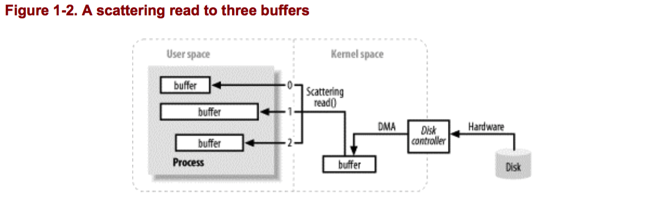
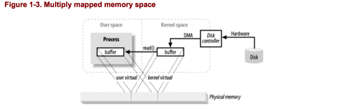
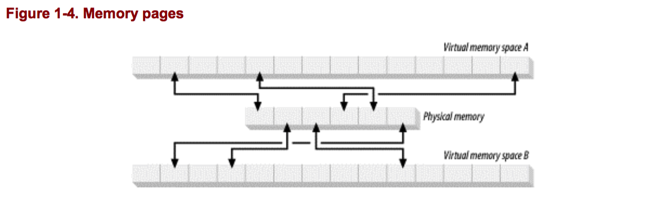
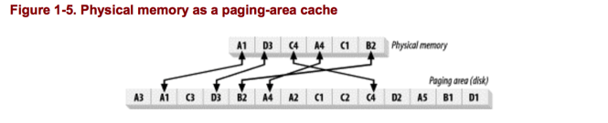
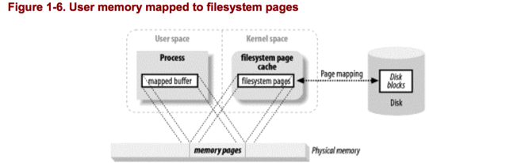
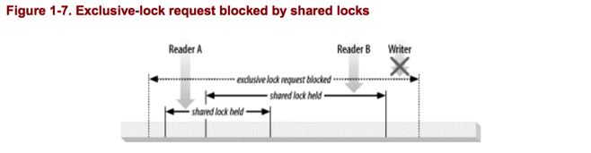
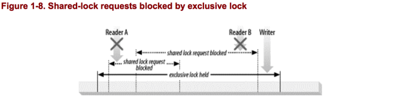

## Buffer Handling
Buffers，以及如何处理buffers，是所有I/O的基础，“input/output”这个术语只是表示moving data in and out of buffers.

进程执行I/O通过请求操作系统从一个buffer中消耗数据（write），或者把数据填充到一个buffer（read）。所有的数据移出或者移入一个进程都是通过这种机制。

图1-1展示了块数据如何从一个外部源，例如一个磁盘，移动到一个正在运行的进程内的内存区域。
进程通过执行`read（）`系统调用，要求它的buffer被填充。这导致内核发出一个指令到磁盘控制器从磁盘取这些数据。磁盘控制器通过DMA将这些数据直接写入内核内存buffer，而不需要CPU的帮助。
一旦磁盘控制器将数据全部填充到了内核内存buffer，内核将这些数据从内核空间的临时buffer拷贝至进程的特定buffer，当进程执行`read()`操作。

注意上图中的User Space（用户空间） 和 Kernel Space（内核空间）的概念。用户空间是普通进程生存的地方。JVM是一个普通进程，居住于User Space。用户空间是一个非特权区域：在这里执行的代码不能直接访问硬件设备。内核空间是操作系统生存的地方。内核代码有特权：它可以访问设备控制器，控制用户空间的进程的状态。更重要的是，所有的I/O流动要通过内核空间，要么直接，要么间接。

当一个进程请求I/O操作，它执行一个系统调用，陷入内核。当内核以这种方式调用时，它将会执行必要的步骤来找到进程需要的数据，然后转移到用户空间的特定buffer。内核会cache和预获取（prefetch）数据，所以进程要求的数据可能已经存在于内核空间。如果存在，进程要求的数据将从内核空间拷贝至用户空间。如果不存在，进程暂停，内核将数据获取到内存。

正如图1-1所看到的，你可能会觉得从内核空间拷贝到用户buffer似乎是一个多余的工作。为什么不直接告诉磁盘控制器将数据直接送到用户空间的buffer呢？这样做的话将会有很多问题。第一，硬件一般不可以直接访问用户空间。第二，基于块的硬件设备，例如磁盘，总是操作固定大小的数据块。用户进程可能并不会要求固定大小的数据块。内核起到中间人的角色，打破和重新组装数据，当它在用户空间和存储设备中移动时。

### Scatter/gather
很多操作系统可以使得装配过程更加有效。Scatter/gather的允许一个进程在一个系统调用中传递buffer的地址列表给操作系统。内核可以顺序的填充或者消耗多个buffers，在一个read操作中将数据散发给多个用户空间的buffers，或者在write操作中从几个buffers中收集数据。
如图1-2所示：

这使用户进程可以不用执行多个系统调用，允许内核优化数据的处理。

## 虚拟内存（Virtual Memory）
所有的现代操作系统都使用虚拟内存。虚拟内存意味着使用虚拟的地址而不是物理内存（RAM）地址
。这提供了很多好处，主要有两个方面：

1. 多个虚拟内存地址可以指向同一个物理内存
2. 一个虚拟内存空间可以比实际可用的硬件内存更大。

之前说过设备控制器不能使用DMA直接传输数据到用户空间，但是通过上述1，可以达到这个效果。
通过映射一个内核空间地址和一个用户空间的虚拟地址到同样的物理地址，DMA硬件（只可以访问物理内存地址）可以填充一个buffer，这个buffer可以同时对内核和用户空间进程可见。如图1-3所示：

这很重要，因为它消除了内核空间和用户空间的data copy，但是它要求内核和用户buffers共享同样的页对齐。buffers必须是磁盘控制器的块大小（通常是512 byte磁盘扇区）的倍数。
操作系统将内存地址空间分为多个页，页是固定大小的byte数组。内存页的大小总是磁盘块大小的倍数，通常为2次幂。典型的内存页大小是1024，2048和4096 bytes。虚拟内存页和物理内存页大小通常是一样。图1-4说明了多个虚拟地址空间的虚拟内存页如何映射到同一个物理地址。

## Memory Paging
为了支持虚拟内存的第二个属性（比物理内存有更大的地址空间），虚拟内存分页是必要的。因此，物理内存中的虚拟内存空间的页可以持久化到外部磁盘存储，来给其他虚拟页让出空间。本质上，物理内存表现的像一个分页区域的cache，当内存页被置换出物理内存时，内存页存储在磁盘上。

图1-5展示了四个进程的虚拟内存，每个进程都有自己的虚拟内存空间。进程A的5个页中的两个被加载到内存，其他的页存储在磁盘上。

MMU提供地址转换和存储保护的功能，并支持虚拟存储管理和多任务管理。MMU由一组集成电路芯片组成，逻辑地址作为输入，物理地址作为输出，直接送达总线，对主存单元进行寻址。

请求分页(demand paging)虚拟存储管理的原理：
当需要执行某条指令或使用某个数据而发现他们不在主存时，产生缺页异常（Page Fault）,系统从磁盘中把此条指令或数据所在页面装入，这样就保证用不到的页面不会被装入主存。

## File I/O
文件系统不同于磁盘。磁盘存储数据在扇区，每个扇区通常是512 bytes。它们是不知道文件内容的硬件设施。它们只是简单的提供存储数据的槽。在这一方面，磁盘的扇区和内存页相似，都是统一大小的可寻址的字节数组。

文件系统是更高层次的抽象。文件系统是安排和解释数据存储在磁盘（或者其他的随机存储，基于块的设备）上的一个特殊的方法。你写的代码大多数是与文件系统打交道，而不是直接和磁盘。文件系统定义了文件名，文件路径，文件，文件属性等的抽象。

上一节提到说有的I/O都是通过demand paging（请求分页）。分页是低层次的，并且总是直接传输磁盘扇区（磁盘扇区是固定大小的）进出内存页。为什么这种低层次的分页可以转化为以任意大小，任意定位访问的文件I/O？

一个文件系统组织一系列统一大小的数据块，一些块存储元信息，例如，空闲块，目录，索引等。一些块包含文件内容。

当用户进程发出读文件的请求，文件系统确定所要读取的文件在磁盘上的位置，然后将这些磁盘扇区放入内存。

文件系统也有页的概念，其大小为基本内存页大小的倍数。

一个分页的文件系统如何执行I/O归结为如下：

+ 确定请求的文件系统页（磁盘扇区）范围。文件内容在磁盘上可能分布在多个文件系统页上，并且这些页可能是不连续的。
+ 在内核中分配足够的内存页来保存这些文件系统页。
+ 建立内存页和文件系统页的映射。
+ 为每一个内存页产生缺页异常。
+ 虚拟内存系统捕捉缺页异常，安排页面装入，从磁盘读取文件内容，以使页生效。
+ 一旦页面装入完成，文件系统从中提取出文件内容，或文件属性等。

文件系统数据也会像内存页一样cache，在随后的I/O请求中，一些或所有的文件数据可能还存在于物理内存中而不用重新从磁盘读取。

大多数文件系统假定进程会读取文件的剩余数据而预读取其他的文件系统页。这些文件系统页可能在内存中存活很长一段时间。所以当一个文件被同一个或者不同的进程打开时，可能不需要去磁盘读取文件。

## Memory-mapped files
传统的文件I/O，用户进程发起`read()`和`write（）`系统调用传输数据，在内核空间和用户进程的buffers中总有一个或多个的数据拷贝，因为通常在文件系统页和用户buffer中没有一对一的alignment。但是操作系统支持一个特殊类型的I/O操作，允许用户进程最大程度的利用系统I/O的分页，从而可以完全避免buffer copy。这就是memory-mapped I/O。如下图1-6所示：

内存映射I/O使用文件系统建立用户空间和文件系统页之间的直接的虚拟内存映射。这有几个好处：

+ 用户进程把文件数据当作内存，因此不用发起`read()`和`write()`系统调用。
+ 当用户进程访问虚拟内存空间，缺页异常将会自动的产生，以从磁盘读取文件数据。如果用户更改了映射内存空间，受影响的页将会自动标记为脏页，随后将会刷新到磁盘来更新文件。
+ 操作系统的虚拟内存子系统子执行智能的页缓存，自动根据系统负载管理内存。
+ 数据总是页对齐的，消除了buffer copy。
+ 大文件可以直接映射到用户空间，从而消除了数据拷贝时的大的内存消耗。

虚拟内存和磁盘I/O密切联系，在很多方面就像同一件事的两个方面。处理大量数据的时候，要记住这一点。如果数据缓冲区是按页对齐的,且大小是内建页大小的倍数,那么,对大多数操作系统而言,其处理效率会大幅提升。

## File locking
File locking是一个概念，它表示一个进程可以阻止其他的进程访问一个文件或者限制其他的如何访问这个文件。Locking通常用于控制共享信息的更新方式或者是事务隔离的一部分。File Locking对于控制多个实体对公共资源的并发访问是必不可少的。例如数据库，严重依赖File locking。

虽然“file locking（文件锁）”顾名思义是锁住整个文件，但是锁通常可以在更加细微的层次。锁定区域往往可以细微到字节层次。锁和特定的文件相关，开始于文件的特定字节位置，包含特定数量的字节。这很重要，因为它允许很多进程协调访问一个文件的特定区域而不用阻碍其他进程对文件其他区域的访问。

文件锁有两种方式：共享的和互斥的。多个共享锁可能同时对同样的文件区域起作用。互斥锁，要求没有其他的锁对所请求的区域起作用。

共享和互斥锁的经典应用是控制对共享文件的更新，主要是用于读取访问。一个进程希望读取这个文件首先需要获得一个共享的文件锁（访问整个文件）或者访问的区域（访问文件的一个区域）的锁。第二个进程希望读取同样的文件区域首先要请求一个共享锁。两个进程可以并发的读取这个文件而不会妨碍彼此。但是，如果第三个进程希望更新这个文件，它会请求一个互斥锁。该进程将会阻塞，直到所有的锁（共享的和互斥的）被释放。一旦给予独占锁,其他共享锁的读取进程会处于阻塞状态,直到独占锁释放。这样,更新进程可以更改文件,读取进程也不会看到文件处于不一致的状态。如图1-7，1-8所示：

## Stream I/O
不是所有的I/O都是面向块的。还有面向流的，以管道为模型的I/O。比如控制台设备（键盘输入），打印设备，网络连接都是面向流的I/O。

流一般比块设备慢，而且是间歇的输入源。很多操作系统允许流I/O置于非阻塞模式，这种模式允许一个进程检查流上的输入是否可用，如果此时输入不可用，进程不用阻塞。这种功能允许一个进程在输入到来时处理输入，在没有输入时，可以做其他的事。

比非阻塞模式更进一步的是就绪选择(readiness selection)。这和非阻塞模式很像，但是将检查一个流是否准备好（读写）的任务交给操作系统。操作系统可以监视一系列流，并且返回一个标识给进程，哪些流准备好了。这种能力允许一个进程用公用的代码多路传输很多活跃的流，但是只用一个进程来处理操作系统返回的流准备信息(readiness)。这通常用于网络服务器处理大量的网络连接。
