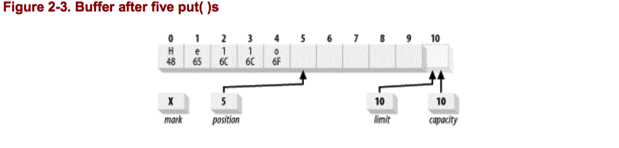
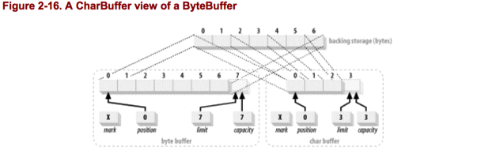

A `Buffer`对象是一个可容纳固定数量的数据的容器。它像一个存储器，在这里数据可以存储和检索。Buffers可以被填满和消耗。每一个非Boolean的原始数据类型都有其对应的buffer类。尽管buffers的行为取决于他们所存储的原始数据类型，但是buffer倾向于处理字节(byte)。非字节buffers可以在后台完成执行非字节转换成字节或字节转换非字节的转换，这取决于buffer是如何创建的。

Buffer的工作和channel紧密联系。Channels是I/O传输发生的出入口，而buffer是数据传输的来源或目标。对于外发的传输，你想要传输的数据先放在buffer中，然后传给channel。对于向内的传输，channel将数据放入你提供的一个buffer中。

图2-1是`Buffer`的类继承关系，最上层的是`Buffer`类。`Buffer`类定义了所有buffer类型的通用操作，不管它所包含的数据类型或者他们可能的特殊操作。


## 2.1 Buffer Basics
从概念上讲，一个buffer是封装成一个对象的包含原始数据类型的数组。`Buffer`类相对于一个简单的数组的优势是，它将数据内容和有关数据的信息封装在一个对象内。`Buffer`和它的子类定义了处理data buffer的API。

### 2.1.1 Attributes
所有的buffer都有四个属性来提供包含数据元素的信息。他们是：

+ Capacity.  buffer能够容纳的数据元素的最大数量。当buffer创建时，Capacity被设置，并且再也不能更改。
+ Limit.  buffer中第一个不能被读（读模式）或者写（写模式）的元素的index。或者说，buffer中现存的元素的数量。
+ Position.  buffer中下一个读或者写的元素的index。position由相应的`get()`和`put()`方法自动更新。
+ Mark.  一个标记位。调用`mark()`方法设置 mark = position。调用`reset()`设置 position = mark。Mark在没有设置之前是未定义的。

四个属性之间的关系是：
0 <= mark <= position <= limit <= capacity

我们用一些例子来说明这些属性，图2-2展示了一个新创建的，Capacity为10的ByteBuffer的逻辑视图。


position为0，capacity和limit为10，mark是未定义。capacity是固定的，但是其他的三个属性当buffer被使用时会改变。

## 2.1.2 Buffer API
我们看看Buffer的方法签名：


这些API里的一个要注意的方法是`isReadOnly()`方法。所有的buffers都是可读的，但并不是所有的都是可写的。每一个具体的buffer类实现`isReadOnly()`方法，来表明它是否允许buffer内容被修改。一些类型的buffer可能并不是将他们的数据元素存储在一个数组中，例如`MappedByteBuffer`的内容可能实际上是一个只读的文件。你可以明确的创建一个只读的buffer来保护内容被意外的修改。试图更改一个只读的buffer将会引发抛出`ReadOnlyBufferException`。

## 2.1.3 Accessing
我们之前已经知道了，Buffer管理固定数量的数据元素。但是在某些时候，我们可能只关心buffer中的一些元素。换句话说，在我们从buffer取出元素时，我们可能只填充了部分的buffer。我们需要跟踪已经添加到buffer中的数据元素的数量，下一个元素该存放在哪里等等的方法。position属性就是做这个的。当你调用`put()`方法时，它表明了下一个数据元素该插入的位置；当调用`get()`方法时，它表明了下一个该取出的元素的位置。精明的读者将会发现上述Buffer API中并没有`get()`或`put()`方法。每一个buffer类都有这些方法，但是它们所接受的参数，它们所返回的类型，每个子类都是不同的，所以在Buffer类中不能把他们申明为抽象的。他们将在子类中声明。我们可以看看`ByteBuffer`中的申明。


Gets和puts可以是相对的或绝对的。在前面的列表中，相对的方法没有index参数。当相对的方法返回时，position属性向前移动1位。相对操作可能抛出异常如果position向前移动太多。对于`put()`，如果position超过了limit，将会抛出`BufferOverflowException`。对于`get()`，如果position如果不比limit小，将会抛出`BufferUnderflowException`。绝对操作不会影响position，但是如果你提供了index超出范围（负数或者不小于limit）了，可能会抛出`java.lang.IndexOutOfBoundsException`。

### 2.1.4 Filling
我们看一个例子。我们将表示ASCII字符序列Hello的byte值放入一个名为buffer的`ByteBuffer`对象中。在新创建的buffer上，执行完下述代码后，buffer的状态将会如图2-5所示：

`buffer.put((byte)'H').put((byte)'e').put((byte)'l').put((byte)'l') .put((byte)'o');`



要注意的是，每一个字符必须强制转换为byte,我们不能这样做：`buffer.put('H');`，而不强制转型，因为我们是放入byte，而不是字符。记住在java中字符是`Unicode`，每一个`Unicode`字符占 16 bits。本章节的例子使用包含`ascii`字符集数值的字节。通过将`char`强制转换为 `byte`,我们删除了前八位来建立一个八位字节值。这通常只适合于拉丁字符而不能适合所有可能的 `Unicode`字符。为了让事情简化,我们暂时故意忽略字符集的映射问题。

我们需要注意的是有index参数的`put()`方法并不会影响`position`。这很重要。

### 2.1.5 Flipping（翻转）
我们已经填充了buffer了，现在我们准备取出buffer中元素使用了。我们想把buffer传给一个channel，这样buffer中的元素可以写出。如果现在这个channel执行buffer的`get()`方法，它将会取出我们刚才插入的数据之外的未定义的数据。如果我们把position设置回0，channel将会从正确的位置取出数据，但是它怎么知道何时到达我们刚才插入的数据的末尾呢。这就是limit属性引入的原因了。limit表明了the end of active buffer content。我们需要设置limit为position，然后将position重置为0。我们可以用以下代码做到这些：

`buffer.limit(buffer.position()).position(0);`

但是将buffer从写模式翻转为读模式已经被API的设计者预料到了；他们提供了一个好用方便的方法来做这个：

`buffer.flip()`

`flip()`方法将一个buffer从写模式变为读模式。调用`flip()`后，buffer的状态变为下图.


`rewind()`方法和`flip()`类似，但是不影响limit。它只是将position设置为0。你可以用`rewind()`方法回到过去，重新读取一个flip之后的buffer中的data。

如果你连续调用`flip()`方法两次呢，我们可以考虑一下以下代码：


````
buffer.limit(buffer.position()).position(0);
buffer.limit(buffer.position()).position(0);
````

这样，实际上buffer的limit和position都变为0了。在一个position和limit都为0的buffer上调用`get()`方法，将会抛出`BufferUnderflowException`，`put()`将会抛出`BufferOverflowException`。

### 2.1.6 Draining
如果我们将图2-5中的buffer传给一个channel，它将取出我们放进去的data，从position开始，到limit结束。

同样的，如果我们接收一个在别处fill的buffer，你可能将在取出元素之前先flip这个buffer。

当你取出元素时，boolean方法`hasRemaining()`将告诉你是否到达buffer的limit。下列代码是从buffer中取出元素到数组中的一种方法：

````
for (int i = 0; buffer.hasRemaining(), i++) {
        myByteArray [i] = buffer.get();
}
````

或者`remaining()`方法会告诉你当前position到limit剩余的元素的个数。你也可以使用以下代码：

````
int count = buffer.remaining();

for (int i = 0; i < count, i++) {
        myByteArray [i] = buffer.get();
}
````

如果你对这个buffer有独占的控制权，那么这将会更加有效，因为limit不会在每次遍历时都检查。

一旦buffer中的元素取出了，它可以被重用。`clear()`方法重置buffer到empty。它不会改变buffer中的data，而只是简单的将limit设置为capacity，position设置为0。

### 2.1.7 Compacting(压缩)


有时，你可能希望只取出buffer中的一部份数据，然后重新填充buffer。为了做到这一点，未读的数据元素需要下移以使第一个元素的index为0。如果反复做的话，这可能是效率低下的。但如果偶尔需要的话，API中提供了一个方法`compact()`可以为你做到这一点。这一buffer实现在拷贝数据时比你用`get()`和`put()`更加有效。如果你需要这样做，使用`compact()`方法。图2-6展示了一个buffer取出一部分元素，现在我们想要compact。


这样做：

````
buffer.compact()
````

buffer的状态如图2-7所示：


在这里发生了几件事。你可以看到下标为2-5的元素被拷贝到了0-3。下标4和5的元素没有受影响但是位于（下标4）或超过了（下标5）当前position,因此是“死的”。他们可以被随后的`put()`调用覆盖。同时还要注意到，position被设为拷贝的元素的数目。也就是说，现在buffer设置好了，可以插入元素到最后的“存活”的元素的后面。最后，limit被设为capacity，这样buffer可以再一次被填满。调用`compact()`的效果是，丢弃已经读取的元素，保留未读取的元素，同时使buffer可以被重新填满（通过设置limit为capacity）.

你可以用这种方法，把buffer当作一个FIFO队列。

如果你希望在压缩之后取出buffer中的元素，你将需要flip这个buffer，如之前讨论的。

### 2.1.8 Marking（标记）
我们已经讨论了buffer4个属性中的3个，第4个，mark，允许buffer记住一个位置，之后又回到这个位置。buffer的mark是未定义的直到`mark()`方法被调用，这时mark被设置为此时position的值。`reset()`方法设置position为当前的mark。如果mark是未定义的，调用`reset()`将会导致`InvalidMarkException`。如果mark设置了，buffer的一些方法将会丢弃mark（`rewind()`,`clear()`,`flip()`总是会丢弃mark）。调用有index参数的`limit()`和`position()`方法将会丢弃mark，如果新的值比当前mark小。

>不要混淆`reset()`和`clear()` 方法,`clear()`方法会清空buffer，然而`reset()`方法将position返回到之前设置的mark

### 2.1.9 Comparing(比较)
我们偶尔需要比较两个buffer中的数据。所有的buffer提供了`equals()`方法来测试两个buffer是否相等，和`compareTo()`方法来对比buffer。

两个buffer可以用以下的代码测试是否相等：

````
if (buffer1.equals (buffer2)) {
        doSomething();
}
````


当每个buffer中剩余的元素是相同的时，`equals()`方法返回true，否则返回false。


两个buffer被认为是相等的，当且仅当：

+ Buffer对象是相同的类型（class）。
+ Buffer剩余元素的个数相同。buffer的capacity不必相同，剩余元素的下标也不必相同，但是剩余元素（从position到limit）的个数必须相同。
+ 由`get()`方法返回的剩余元素的序列必须是相同的。

如果这些条件中的任何一个不满足，返回false。

### 2.1.10 Bulk Moves（大批移动）
buffer的设计目的是为了有效的数据传输。像之前的用循环移动数据效率不是很高。正如下述列表看到的，你可以大批的移动数据。

````
public abstract class CharBuffer
        extends Buffer implements CharSequence, Comparable
{
// This is a partial API listing
public CharBuffer get (char [] dst)
public CharBuffer get (char [] dst, int offset, int length)
public final CharBuffer put (char[] src)
public CharBuffer put (char [] src, int offset, int length)
public CharBuffer put (CharBuffer src)
public final CharBuffer put (String src)
public CharBuffer put (String src, int start, int end)
}
````

需要注意的是，如果你传入一个数组并且没有指定长度，那么整个数组都会被认为要传入。如果buffer中没有足够的空间来容纳整个数组，那么你会得到一个异常。这点很关键。

具体用法不详述了。


## 2.2 Creating Buffers
有七种主要的buffer类，每一种对应java中的非boolean的数据类型。第八种是MappedByteBuffer,一种专门用于内存映射文件的ByteBuffer。这些类都不能直接实例化，他们都是抽象类，但都提供了静态工厂方法来创建对应的实例。

我们以CharBuffer为例子，但同样可应用于其他六种：`IntBuffer, DoubleBuffer, ShortBuffer, LongBuffer, FloatBuffer, and ByteBuffer`。下面是创建buffer的主要方法，对于所有buffer类都是通用的。

````
public abstract class CharBuffer
        extends Buffer implements CharSequence, Comparable
}
// This is a partial API listing
public static CharBuffer allocate (int capacity)
public static CharBuffer wrap (char [] array)
public static CharBuffer wrap (char [] array, int offset,
int length)
public final boolean hasArray(  )
public final char [] array(  )
public final int arrayOffset(  )
}
````


新的buffer被创建，要么通过allocation（分配）要么通过wrapping(包装)。allocation创建了一个新的buffer对象，分配了一个私有的空间来容纳capacity的数据元素。Wrapping创建了一个buffer对象，但是没有分配任何空间来容纳数据元素。它利用你提供的array作为后端存储来存储buffer中的数据。

为了分配容纳100个char的CharBuffer：
`CharBuffer charBuffer = CharBuffer.allocate(100);`

如果你希望提供你自己的array作为buffer的后端存储，调用`wrap()`方法：

````
char[] array = new char[100];
CharBuffer charBuffer = CharBuffer.wrap(array);
````

这将会构造一个新的buffer对象，但是数据将会存储在array中。这表明执行buffer的`put()`方法所做的改变将会反应到array中，任何直接在array上做的改变也会反应到buffer对象上。`wrap()`的带offset和length参数的方法将会创建一个buffer对象，这个buffer对象的position等于offset,limit等于length + offset ，capacity等于array.length。

`CharBuffer charbuffer = CharBuffer.wrap (myArray, 12, 42);`

这将会创建一个position等于12，limit等于54，capacity等于myArray.length的CharBuffer。

这个方法并没有如你所期望的那样创建一个只占据array的一部份的buffer。这个buffer将会访问这个array的所有内容，但是offset和length参数初始化了buffer的状态。在这个buffer上调用`clear()`方法（我们记得clear方法会将position设置为0，limit设置为capacity）将会覆盖array中的所有元素。`slice()`方法将会生成一个只占据后端array一部分的buffer。

通过`allocate()`或`wrap()`创建的buffer都不是direct buffer（直接buffer）。非直接buffer都有后端array。你可以直接通过API直接方法这些array。boolean方法`hasArray()`可以告诉你这个buffer是否可以访问后端array。如果返回true，`array()`方法会返回后端array的引用。

如果`hasArray()`返回false，不要调用`array()`或者`arrayOffset()`，否则你将会得到`UnsupportedOperationException`。如果buffer是read-only的，他的后端array是不可访问的，即使这个buffer是通过`wrap()`创建的。执行`array()`或`arrayOffset()`将会抛出`ReadOnlyBufferException`来阻止你访问和修改这个read-only buffer的data。如果你通过其他方式访问了后端array，那么在array上的改变将反映到这个read-only buffer上。

`arrayOffset()`返回buffer中的data在array中的偏移。

## 2.3 Duplicating Buffers（复制buffer）
正如我们上面所讨论的，可以创建描述从外部存储到数组中的数据元素的buffer对象。但是buffer不限于管理数组中的外部数据。他们还可以管理其他buffer中的数据。当创建了一个管理其他buffer中的数据的buffer对象时，这个buffer是一个视图buffer。大多数的视图buffer是ByteBuffer的视图。

视图buffer总是通过调用已经存在的buffer实例上的方法创建。使用已经存在的buffer实例上的一个工厂方法意味着这个视图buffer知晓原buffer的内部实现细节。它可以直接访问内部数据元素，不管他们是存储在数组还是通过原buffer的`get()`/`put()`获取。如果原buffer是direct buffer，它的视图buffer也会有同样的效率优势。mapped buffer也同样。

我们用CharBuffer作为例子。

````
public abstract class CharBuffer extends Buffer implements CharSequence, Comparable
{
// This is a partial API listing
public abstract CharBuffer duplicate();
public abstract CharBuffer asReadOnlyBuffer();
public abstract CharBuffer slice();
}
````

duplicate方法，创建了一个像原buffer的新buffer。两个buffer共享数据元素，有同样的capacity，但是每一个buffer有自己的position，limit和mark。在一个buffer上做出的数据改变将会反映到另一个buffer上。对于数据，复制的buffer和原buffer有同样的视图。如果原buffer是read-only，或者direct，那么新的buffer也会继承这些属性。

一个buffer和他的复制buffer的关系如下图所示,代码如下所示：

````
CharBuffer buffer = CharBuffer.allocate(8);
buffer.position(3).limit(6).mark().position(5);
CharBuffer dupeBuffer = buffer.duplicate();
buffer.clear();
````


使用`asReadOnlyBuffer()`，你可以得到一个buffer的read-only buffer视图。这个方法和`duplicate()`类似，除了新创建的buffer将会禁用`put()`方法，而且它的isReadOnly()方法返回true。调用read-only buffer上任何的put方法将会抛出`ReadOnlyBufferException`。

切割buffer和复制相似，但是`slice()`创建一个新的buffer，这个新的buffer从原buffer的当前position位置开始，并且capacity是原buffer中的剩余元素（limit-position）的数量。新的buffer共享原buffer的数据元素的一个子序列。切割的buffer也会继承read-only和direct属性。以下代码是创建slice buffer的示例代码：

````
CharBuffer buffer = CharBuffer.allocate (8);
buffer.position (3).limit (5);
CharBuffer sliceBuffer = buffer.slice(  );
````


上述代码产生的结果如下图所示：


### 2.4 Byte Buffers
这一节我们将近距离观察byte buffers。所有的原始数据类型（除了boolean）都有对应的buffer类，但是byte buffer有它特有的性质。Byte 是操作系统及其I/O设备使用的基本数据单元。当在JVM和操作系统中移动数据时，将其他数据类型拆成它们的组成byte是必须的。

>Byte 总是8位的，对吗？
现在byte被广泛的认为是8位的。但并不一直是这样的。很多年以前，bytes 从3-12位不等。最常用的是6-9位。8位是市场强制和实践的结合。

#### 2.4.1 Byte Ordering
非byte的原始数据类型，除了boolean，都是由几个组合在一起的byte构成。如下所示：


每一个原始数据类型在内存中都是连续的byte序列。例如32-bit（32位）int 值0x037FB4C7(十进制的58700999)**可能**在内存中是图2-14所示的，如图可以看到**内存地址是从左向右增加**的。注意到前一句话我说的是“可能”。即使一个byte的大小是确定的，但是byte的顺序并没有广泛认同。代表一个整数的字节在内存中也可能是图2-15所示：


多字节数值存储在内存中的方式一般称为字节顺序(endian-ness)。如果一个数字的最大端在更低的地址，那么系统就是big-endian(如图2-14所示)。如果最小值在更低的地址，那么它就是little-endian（如图2-15所示）。

字节顺序很少由软件设计者决定。它通常是硬件设计所决定。两种字节顺序，现在都广泛使用。Intel 处理器使用little-endian。Motorola CPU家族，Sun Sparc和PowerPC CPU架构都是big-endian。

字节顺序不仅仅是CPU设计的问题。当Internet的设计者设计IP协议族来互联各种类型的计算机时，他们认识到在不同字节顺序的系统之间交换数值数据的问题。因此IP协议族，定义了网络字节顺序是big-endian。

在java.nio，字节顺序被封装为ByteOrder类。

````
package java.nio;
public final class ByteOrder
{
public static final ByteOrder BIG_ENDIAN
public static final ByteOrder LITTLE_ENDIAN
public static ByteOrder nativeOrder()
public String toString()
}
````

每一个buffer类有一个当前的字节顺序，可以通过`order()`查询。

````
public abstract class CharBuffer extends Buffer
{
implements Comparable, CharSequence
// This is a partial API listing
public final ByteOrder order()
}
````

这个方法会返回ByteOrder类中两个常量的一个。对于不是ByteBuffer类的其他buffer，字节顺序是read-only的，并且可能会由于buffer创建的方式不同而取不同的值。除了ByteBuffer，其他通过allocatate或者wrap创建的buffer，将会返回`order()`相同的值，和`ByteOrder.nativeOrder()`一样。这是因为buffer中包含的数据在JVM里是作为原始数据类型访问的。

ByteBuffer类是不同的：默认字节顺序总是ByteOrder.BIG_ENDIAN，不管系统的字节顺序是什么。Java的默认字节顺序是big-endian。如果本地硬件的字节顺序是little-endian，这可能会有性能问题。用本地硬件的字节顺序，将ByteBuffer中的内容作为其他数据类型访问可能会更有效。

你可能会对为什么ByteBuffer类需要一个字节顺序设置感到困惑。字节就是字节，难道不是吗?但是ByteBuffer类有很多方便的方法转换字节和其他原始数据类型。这些方法编码和解码字节的方式由ByteBuffer当前的字节顺序决定。

一个ByteBuffer的字节顺序可以在任何时候通过执行以ByteOrder.BIG_ENDIAN或ByteOrder.LITTLE_ENDIAN为参数的Order方法改变。

如果一个buffer是另一个buffer的视图，那么通过`order()`方法返回的值是创建视图时原ByteBuffer的字节顺序。创建后，视图buffer的字节顺序不能改变，并且即使原buffer的字节顺序之后改变了也不会受到影响。

### 2.4.2 Direct Buffers(直接buffer)
byte buffer 区别于其他buffer类的最重要方式是，它可以Channel的I/O操作的源头或目标。如果你看Channel API，你会发现channel只接受ByteBuffer作为参数。

在instruction中，我们看到，操作系统在内存区域执行I/O操作，这些内存区域，在操作系统看来，是连续的byte序列。并不奇怪，只有byte buffer有资格参与I/O操作。操作系统将直接访问进程的地址空间，在这里是JVM进程，来传输数据。这意味着，I/O操作的目标的内存区域必定是连续的byte序列。在JVM中，一个数组中的字节在内存中可能并不是连续的，或GC任何时候都可以移动。Array在java中是对象，数据存储在对象中的方式可能因为JVM实现的不同而不同。

因为这个原因，引出了direct buffer的概念。Direct buffer是为了channel和本地（native）I/O 操作交互。他们尽量存储byte数据在内存区域中，channel可以直接或者原始的使用，通过native code访问，通知操作系统直接取出或者填充这块内存区域。

Direct buffer通常是I/O操作的最佳选择。他们支持JVM允许的最有效的I/O机制。非direct buffer 本来也可以传递给channel，但是可能会引起性能下降。如果你传递一个非Direct buffer给channel用来写入，那么这个channel可能在每次调用时隐式的做如下操作：

1. 创建一个临时direct buffer对象。
2. 将非direct buffer的数据拷贝到direct buffer。
3. 用这个临时direct buffer执行底层次的I/O操作。
4. 这个临时direct buffer离开作用域，被GC回收。

这会潜在的导致每一次I/O调用上buffer copy和对象频繁的创建和回收。然而，取决于实现，事情可能并不是那么糟糕。Runtime 可能会cache和重用direct buffer或者执行其他的聪明的计谋来提高吞吐量。如果你只是简单的为了一次使用而创建buffer，那么区别不是重要。另一方面，如果在高性能场景中，重复的使用buffer对象，最好关闭allocate direct buffer而是重用buffer。

Direct buffer是I/O的最佳选择，但是他们可能比创建非Direct buffer更加昂贵。direct buffer所使用的内存空间是通过调用native，操作系统相关的代码所分配，绕过了标准JVM heap（堆）。建立和销毁direct buffer可能明显比在heap上分配的buffer更加昂贵，这取决于操作系统和JVM实现。**direct buffer的内存存储区域不受GC约束，因为他们在标准JVM heap之外。**

使用direct buffer和非direct buffer的性能权衡，可能因为JVM，操作系统和代码而很大不同。分配对外的内存，你可能使你的应用依赖JVM没有察觉到的其他的力量。

Direct ByteBuffer通过调用`ByteBuffer.allocateDirect()`创建，可以以传入需要的capacity，就像之前的`allocate()`方法一样。记住所有的wrap buffer，即通过`wrap()`方法创建的，都是非direct。

````
public abstract class ByteBuffer
        extends Buffer implements Comparable
{
// This is a partial API listing
public static ByteBuffer allocate (int capacity)
public static ByteBuffer allocateDirect (int capacity)
public abstract boolean isDirect();
}
````

所有的buffer提供了一个`isDirect()`方法测试一个特定的buffer是否是direct。由于ByteBuffer是唯一能分配为direct的buffer类型，所以非byte的视图buffer的`isDirect()`可能为true，当底层的buffer是direct ByteBuffer。

### 2.4.3 View Buffers
View Buffer通过已经存在的buffer对象的工厂方法创建。这个view buffer维护了自己的属性，capacity，limit，position，mark，但是和原buffer共享数据元素。可以参照之前的Duplicating Buffers小节。但是ByteBuffer允许创建视图映射byte buffer中的原始byte到其他的原始数据类型。例如`asLongBuffer()`创建一个视图buffer，访问ByteBuffer的8个字节作为long。

下述列表中的任何一个工厂方法都会创建一个新的buffer，这个新buffer是原ByteBuffer的视图。执行这些方法中的任何一个将会创建一个对应类型的buffer，这个buffer是底层ByteBuffer的slice（你还记得`slice()`方法吧）,根据ByteBuffer的当前position和limit。这个新的buffer的capacity是ByteBuffer中剩余元素（limit-position）的数量除以视图类型中组成一个数据类型的字节数（参见表2-1）。slice之后的任何剩余的byte对于这个视图都是不可见的。
视图buffer的第一个元素从创建视图时ByteBuffer的position开始。具有能被自然数整除的数据元素个数的视图缓冲区是一种较好的实现。


````
public abstract class ByteBuffer
        extends Buffer implements Comparable
{
// This is a partial API listing
public abstract CharBuffer asCharBuffer();
public abstract ShortBuffer asShortBuffer();
public abstract IntBuffer asIntBuffer();
public abstract LongBuffer asLongBuffer();
public abstract FloatBuffer asFloatBuffer();
public abstract DoubleBuffer asDoubleBuffer();
}
````

下述代码创建可ByteBuffer的一个CharBuffer视图。

````
ByteBuffer byteBuffer = ByteBuffer.allocate(7).order(ByteOrder.BIG_ENDIAN);
CharBuffer charBuffer = byteBuffer.asCharBuffer();
````

结果如图2-16：



一旦你获得了view buffer，你可以创建更多的子视图，通过`duplicate()`,`slice()`,`asReadOnlyBuffer()`。

当一个视图buffer访问底层的ByteBuffer的byte时，这些byte会根据这个view buffer的字节顺序设置包装组成一个数据元素。当一个view buffer被创建时，它继承了**创建时**底层ByteBuffer的字节顺序设置。view buffer的字节顺序设置之后都不可以改变。在图2-16中，你可以看到底层ByteBuffer的每两个byte映射成CharBuffer的一个char。字节顺序设置决定了这些byte对是怎么样被组合成char的。

从direct byte buffer中获得数据时，view buffer可能更加有效。如果这个view 的字节顺序和native 硬件的字节顺序一致，低层次的代码可以直接访问数据值而不用通过byte包装和解包装过程。

### 2.4.4 Data Element Views
ByteBuffer类提供了轻便的机制访问多数byte作为多字节数据类型（char,short,int,long,float,double）。ByteBuffer为每一种原始数据类型提供了存取和转化方法。

````
public abstract class ByteBuffer
{
extends Buffer implements Comparable
public abstract char getChar(  );
public abstract char getChar (int index);
public abstract short getShort(  );
public abstract short getShort (int index);
public abstract int getInt(  );
public abstract int getInt (int index);
public abstract long getLong(  );
public abstract long getLong (int index);
public abstract float getFloat(  );
public abstract float getFloat (int index);
public abstract double getDouble(  );
public abstract double getDouble (int index);
public abstract ByteBuffer putChar (char value);
public abstract ByteBuffer putChar (int index, char value);
public abstract ByteBuffer putShort (short value);
public abstract ByteBuffer putShort (int index, short value);
public abstract ByteBuffer putInt (int value);
public abstract ByteBuffer putInt (int index, int value);
public abstract ByteBuffer putLong (long value);
public abstract ByteBuffer putLong (int index, long value);
public abstract ByteBuffer putFloat (float value);
public abstract ByteBuffer putFloat (int index, float value);
public abstract ByteBuffer putDouble (double value);
public abstract ByteBuffer putDouble (int index, double value);
}
````

这些方法从ByteBuffer的position开始访问byte，就好像数据元素存储在那里一样。根据这个buffer的当前字节顺序。比如说,如果 getInt()函数被调用,从当前的position开始的四个字节会被包装成一个 int 类型的变量然后作为方法的返回值返回。


代码：`int value = buffer.getInt();`，将返回一个有buffer中1-4位置组成的int值。这个返回的准确值取决于Buffer的当前ByteOrder设置。更具体点：`int value = buffer.order(ByteOrder.BIG_ENDIAN).getInt();`，返回整数值0x3BC5315E，然而`int value = buffer.order(ByteOrder.LITTLE_ENDIAN).getInt();`，将会返回整数值0x5E31C53B。

如果你试图获取比buffer中剩余byte数更多的原始数据类型，那么将会抛出`BufferUnderflowException`。如果一个buffer中只剩下5个byte，执行`long value = buffer.getLong()`，将会抛出异常。

这些方法返回的值不需要对齐任何特定的模界(modulo boundary)。

put方法执行和get方法相反的操作。原始数据类型将会根据buffer的字节顺序被拆分成byte，然后存储。如果没有足够的空间存储，将会抛出`BufferOverflowException`。

>什么是module boundary？
一个模（modulo）是一个数除以另一数的余数（也就是取模运算），modulo boundary （模界）是一个特定除数的余数为0的一些点。例如任何能整除4的是modulo 4：4，8，12等。


### 2.4.5 Accessing Unsigned Data(访问无符号数据)
Java对无符号数据没有提供直接的支持。但是有时候有时又是必须的。ByteBuffer中没有对无符号数据提供直接的支持，但是要做到这些并不难。

````
import java.nio.ByteBuffer;
/**
 * Utility class to get and put unsigned values to a ByteBuffer object.
 * All methods here are static and take a ByteBuffer argument.
 * Since java does not provide unsigned primitive types, each unsigned
 * value read from the buffer is promoted up to the next bigger primitive
 * data type.  getUnsignedByte() returns a short, getUnsignedShort()
 * returns an int and getUnsignedInt() returns a long.  There is no
 * getUnsignedLong(  ) since there is no primitive type to hold the value
 * returned.  If needed, methods returning BigInteger could be implemented.
 * Likewise, the put methods take a value larger than the type they will
 * be assigning.  putUnsignedByte takes a short argument, etc.
 *
 * @author Ron Hitchens (ron@ronsoft.com)
 */
public class Unsigned
{
    public static short getUnsignedByte (ByteBuffer bb)
    {
        return ((short)(bb.get() & 0xff));
}
    public static void putUnsignedByte (ByteBuffer bb, int value)
    {
        bb.put ((byte)(value & 0xff));
}
    public static short getUnsignedByte (ByteBuffer bb, int position)
    {
        return ((short)(bb.get (position) & (short)0xff));
}
    public static void putUnsignedByte (ByteBuffer bb, int position,
int value) {
        bb.put (position, (byte)(value & 0xff));
    }
// ---------------------------------------------------------------
    public static int getUnsignedShort (ByteBuffer bb)
    {
        return (bb.getShort(  ) & 0xffff);
    }
    public static void putUnsignedShort (ByteBuffer bb, int value)
    {
        bb.putShort ((short)(value & 0xffff));
    }
public static int getUnsignedShort (ByteBuffer bb, int position)
    {
        return (bb.getShort (position) & 0xffff);
    }
    public static void putUnsignedShort (ByteBuffer bb, int position,
        int value)
    {
        bb.putShort (position, (short)(value & 0xffff));
}
// ---------------------------------------------------------------
    public static long getUnsignedInt (ByteBuffer bb)
    {
        return ((long)bb.getInt(  ) & 0xffffffffL);
}
public static void putUnsignedInt (ByteBuffer bb, long value)
    {
        bb.putInt ((int)(value & 0xffffffffL));
}
    public static long getUnsignedInt (ByteBuffer bb, int position)
    {
        return ((long)bb.getInt (position) & 0xffffffffL);
}
    public static void putUnsignedInt (ByteBuffer bb, int position,
long value) {
        bb.putInt (position, (int)(value & 0xffffffffL));
    }
}
````

### 2.4.6 Memory-Mapped Buffers
Mapped Buffer是数据元素存储在文件中，通过memory mapping访问的byte buffer。Mapped buffer总是direct，只能通过`FileChannel`对象创建。mapped buffer的用法类似direct buffer。但是MappedByteBuffer对文件访问有一些特殊的特性。
