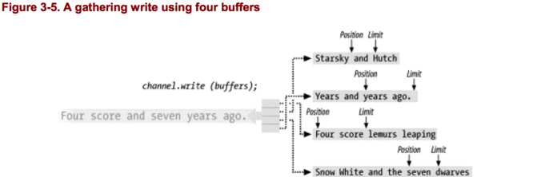
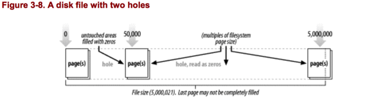
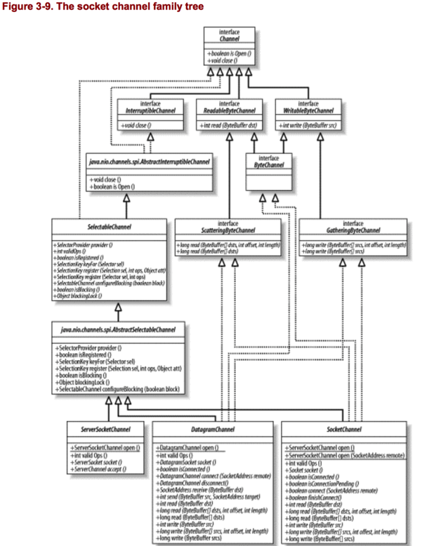

Channel是`java.nio`的第二个主要革新。他们不是一个扩展或提升，而是一个新的，一流的Java I/O 范例。他们提供了与I/O服务的直接连接。`Channel`是在byte buffer和Channel另一端的实体（通常是文件或socket）之间有效运输数据的管道。

在多数情况下，channel和操作系统文件描述符或文件指针有一对一的关系。虽然channel比文件描述符更通用，多数channel的使用场景是连接到一个打开文件的描述符。channel类提供了必要的抽象来维护平台无关性，但仍然塑造了现代操作系统的native I/O能力。

channel是网关，通过channel，操作系统的native I/O服务可以以最小的开支访问。buffer是内部endpoint，被channel用来接收和发送数据。


正如你在图3-2中看到的，channel类的继承关系比buffer类要复杂一些。内部关系更加复杂，并且部分类依赖于`java.nio.channels.spi`中的类。


## 3.1 Channel Basics
我们首先看看`Channel`接口：

````
package java.nio.channels;
public interface Channel
{
        public boolean isOpen(  );
        public void close(  ) throws IOException;
}
````

不像buffers，channel API 主要被定义为接口。`Channel`的实现由于操作系统的不同而根本不同，所以channel API仅仅简单描述其作用。Channel实现经常使用native code，所以这很正常。channel 接口允许你在可控和可移植的方式下获得对底层I/O服务的访问。


正如在上面看到的，Channel接口只有两个操作对于所有的channel是公有的：检查一个channel是否打开(isOpen())和关闭一个已经打开的Channel（close()）。图3-2展示了所有子接口。


InterruptibleChannel接口是一个标记接口，当一个channel实现这个接口时，表明这个channel是可以中断的。中断channel在3.1.3小节会讨论。大多数的（不是全部）channel是可中断的。


其他继承Channel的接口是面向byte的子接口`WritableByteChannel`和`ReadableByteChannel`。这支持了我们之前学到的：channel只能操作byte buffer。这个体系结构表明其他数据结构的channel可以继承`Channel`。这是好的类设计，但是非byte实现似乎是不可能的，因为操作系统的底层I/O基于byte。


在图3-2中你可以看到有两个类在`java.nio.channels.spi`包中，这两个类是：`AbstractInterruptibleChannel`和`AbstractSelectableChannel`。这两个类提供了channel实现可中断或可选择的公共的方法。尽管描述channel行为的接口定义在`java.nio.channels`包中，具体的实现则是继承自`java.nio.channels.spi`包。这允许他们可以访问protected的方法，而channel的普通使用者却不能访问。

### 3.1.1 Opening Channels
Channel是I/O服务的管道。I/O主要有两大类：文件I/O和streamI/O。所以有两种channels：文件和socket。如果你参考图3-2，你会发现有一个`FileChannel`类和三种Socket channel类：SocketChannel，ServerSocketChannel和DatagramChannel。

Channel可以用几种方式创建。Socket Channel类有工厂方法直接创建新的socket channel。但是一个`FileChannel`对象只能在一个打开的`RandomAccessFile`,`FileInputStream`,`FileOutputStream`对象调用`getChannel()`获取。你不可以直接创建`FileChannel`对象。


````
SocketChannel sc = SocketChannel.open();
sc.connect (new InetSocketAddress ("somehost", someport));
ServerSocketChannel ssc = ServerSocketChannel.open();
ssc.socket().bind (new InetSocketAddress (somelocalport));
DatagramChannel dc = DatagramChannel.open();
RandomAccessFile raf = new RandomAccessFile ("somefile", "r");
FileChannel fc = raf.getChannel();
````

### 3.1.2 Using Channels

正如我们在第二章所看到了，channels从ByteBuffer中传输数据，也将数据传输给ByteBuffer。

从图3-2中溢出大部分的分支，可以产生图3-3:



Channels可以是单向的或双向的。一个给定的channel可能实现`ReadableByteChannel`,它定义了`read()`方法。另一个可能实现`WritableByteChannel`,它定义了`write()`方法。一个实现了其中一个接口的类是单向的：他只能在一个方向上传输数据（只能读或写）。如果一个类实现了这两个接口，那么它是双向的，可以双向传输数据。

图3-3所示，`ByteChannel`继承了`ReadableByteChannel`和`WritableByteChannel`。`ByteChannel`没有定义任何新的方法，它是一个方便的，集合了多个继承的接口的接口。

我们回去看图3-2，注意file channel和socket channel，你可以发现file和socket的每一个channel都实现了这三个接口。就类定义而言，这意味着所有的file 和socket channel对象都是双向的。对于socket而言，这不是一个问题，因为他们永远都是双向的，但是对file而言这是个问题。

正如你所知道的，一个给定的文件在不同的时刻可以以不同的权限打开。从`FileInputStream`对象的`getChannel()`方法获得的`FileChannel`对象是read-only的，但是就接口声明而言也是双向的，因为`FileChannel`实现了`ByteChannel`。在这样的channel上执行`write()`将抛出未检查的`NonWritableChannelException`，因为`FileInputStream`总是以read-only 权限打开文件。

记住这一点很重要：一个channel连接一个具体的I/O服务，这个channel的能力会受它所连接的I/O服务的特性的限制。连接到一个read-only文件的`Channel`实例不能写，即使这个Channel实例的类定义中有一个write方法。


````
// A ByteBuffer named buffer contains data to be written
FileInputStream input = new FileInputStream (fileName);
FileChannel channel = input.getChannel();

// This will compile but will throw an IOException
// because the underlying file is read-only
channel.write (buffer);
````

>`Channel` 实例可能不允许read或write，这取决于底层文件指针的access mode。


ByteChannel的read和write方法，将ByteBuffer作为参数。每一个返回传输的byte数。buffer的position将会向前移动同样的值。如果只传输了一部分，buffer可以重新连接到channel，从上次离开的地方继续传输。重复上述行为，直到buffer的`hasRemaining()`方法返回false。

Channels可以以阻塞或非阻塞模式工作。非阻塞模式的channel永远不会将执行线程sleep。请求的操作要么立即完成，要么返回一个表示什么都没做的结果。**只有面向stream的channels，例如socket和pipes可以以非阻塞模式工作。**


正如你在图3-2中所看到的，socket channel类继承了`SelectableChannel`。继承了`SelectableChannel`的类可以用于`Selectors`，它允许readiness selection。结合非阻塞I/O和Selector允许你的应用利用多路传输I/O。

### 3.1.3 Closing Channels
不像buffers，channel不可以重用。一个打开的channel代表和一个具体的I/O服务的连接，并且包含连接的状态。当一个channel关闭了，连接也丢失了，channel再也没有连接到任何东西。

调用一个Channels的close方法，可能会引起线程短暂的阻塞，当这个channel最后确定底层I/O服务的关闭，即使这个channel是非阻塞模式。当一个channel关闭时，阻塞行为取决于操作系统和文件系统。在一个通道上调用多次close方法是无害的，但是如果第一个线程已经阻塞在close方法，任何其他的线程调用close方法也会阻塞，直到第一个线程完成关闭channel。之后在一个已经关闭的channel上调用close不会做任何事，直接返回。

一个channel的打开状态可以用`isOpen()`测试。如果返回true，那么这个channel可以使用。如果返回false，那么这个channel再也不可以使用了。

Channels引入了一些和关闭和中断有关的新的行为。如果一个channel实现了`InterruptibleChannel`接口，那么它支持以下语义。如果一个线程阻塞在一个channel上，并且这个线程被中断了（被另一个线程调用这个阻塞线程的interrupt方法），那么这个channel将会关闭，并且这个阻塞线程将会抛出一个`ClosedByInterruptException`。

另外，如果一个线程的中断状态设置了，并且这个线程试图访问一个channel，那么这个channel将会立即被关闭，抛出`ClosedByInterruptException`。当线程的`interrupt()`方法被调用时，线程的中断状态被设置。线程当前的中断状态可以用`isInterrupted()`方法测试。当前线程的中断状态可以调用静态的`Thread.Interrupted()`方法清除。

仅仅因为一个线程sleep在一个channel上，这个channel就关闭了，这似乎太苛刻了。但是这是NIO结构的明确的设计。经验表明，不可能在所有操作系统上**一致的**可靠处理中断I/O操作。在所有平台提供明确的channel行为的要求导致了当I/O操作被中断时，总是关闭channel。（也就是说，经验表示，不可能在所有平台上，统一一致的可靠处理中断I/O操作，为了提供一致的channel行为，当I/O操作被中断时，总是关闭channel）。这被认为是可以接受的，因为大部分时候一个线程被中断就是希望可以shut down线程。`java.nio`包允许这种行为来避免因为操作系统特性的困境，在这一领域，这些特性变幻莫测。

可中断channels也可以异步关闭。一个实现了`InterruptibleChannel`的channel可以在任何时候关闭，即使另一个线程阻塞等待这个channel的一个I/O操作完成。当一个channel被关闭时，所有sleep在这个channel上的线程将被唤醒，并且收到一个`AsynchronousCloseException`。这个channel接着被关闭，然后再也不可使用。

没有实现`InterruptibleChannel`的Channels不具备这些中断语义。

## 3.2 Scatter/Gather
Channels提供了一个重要的新的能力，scatter/gather。Scatter/gather是简单却强大的概念。它适用于对多个buffers执行一个I/O操作。对一个write操作，数据从几个buffers收集，然后发送到channel。buffers不需要有同样的capacity。就像所有的buffers中的数据在发送前串联到一个大的buffer中。对于read操作，从channel读取的数据**顺序**的分发到多个buffers，将每一个buffers填满（到limit），直到从channel读取的数据或所有的buffer空间耗尽。

现代操作系统支持native 向量I/O（vectored I/O）。当你在一个channel上请求scatter/gather操作，这个请求将会转化成合适的native 调用来直接填充或读取这个buffer。这是巨大的胜利，因为buffer copy 和系统调用减少或消除了。Scatter/gather应该和direct ByteBuffer一起使用，从nativeI/O获得最大的优势，特别是当这个buffer是long-lived。

````
public interface ScatteringByteChannel
        extends ReadableByteChannel
{
public long read (ByteBuffer [] dsts)
        throws IOException;
public long read (ByteBuffer [] dsts, int offset, int length)
        throws IOException;
}

public interface GatheringByteChannel
        extends WritableByteChannel
{
public long write(ByteBuffer[] srcs)
        throws IOException;
public long write(ByteBuffer[] srcs, int offset, int length)
        throws IOException;
}
````


又可以看到每个接口增加了两个新的方法来接收buffer数组作为参数。而且，每个方法提供接收offset和length作为参数。我们先来简单使用一下。下面的代码，我们假设channel连接到一个socket，准备读取48bytes数据。

````
ByteBuffer header = ByteBuffer.allocateDirect (10);
ByteBuffer body = ByteBuffer.allocateDirect (80);
ByteBuffer [] buffers = { header, body };
int bytesRead = channel.read (buffers);
````

一旦从`read()`返回，bytesRead的值为48，header buffer包含10 bytes数据，body buffer包含剩下的38 bytes数据。channel自动的将数据顺序分发到这两个buffer。buffers已经填充了，需要flip使得他们准备读取。
图3-5说明了一个gather writer。数据从buffers数组中的每个buffer中收集，组装成bytes 流，然后发送到channel。



图3-6展示了一个scattering read。到达channel的数据分发给buffer list，顺序填充每个buffer，从position到limit。下面的position和limit是read操作之前的。


接收offset和length参数的`read()`和`write()`提供了一种方法可以利用buffers数组的子数组。这里的offset表示哪一个buffer开始使用。这个length参数表示使用的buffer的数量。例如，如果我们有一个五个元素的array叫fiveBuffers，并且已经初始化了五个buffers，那么以下的代码将会把第二，三，四个buffer中的数据写入。

````
int bytesRead = channel.write(fiveBytes,1,3);
````

Scatter/gather使用得当的话会非常强大。它允许你委托操作系统来完成辛苦的活：将读到的数据分开存储到多个存储桶或者将不同的数据区块合并成一个整体。这是一个巨大的成就，因为操作系统已经被高度优化来完成此类工作了。它节省了来回移动数据的工作，因此避免了buffer copy，减少了你需要书写的代码。

### 3.3 File Channels
之前我们都是讨论channels的通用之处。现在我们要讨论具体的了。这一节我们讨论file Channels。正如图3-7所示，`FileChannel`类可以实现常用的read和write操作，也可以scatter/gather。也提供了一些新的方法。


File channels总是阻塞的，不能置于非阻塞模式。现代操作系统有成熟的caching 和 prefetch 算法使得本地磁盘I/O低延迟。网络文件系统通常有高延迟但也会受益与同样的优化。面向流的非阻塞模式并不适合于面向文件的操作，因为文件I/O的本质不同。对于文件I/O，最好的方式是异步I/O，它允许一个进程向操作系统请求一或多个I/O操作，但是不用等待他们完成。在请求的I/O完成时，进程会得到通知。

正如之前说明的，`FileChannel`对象并不能直接创建。一个`FileChannel`实例只能通过一个打开的文件对象（RandomAccessFile，FileInputStream，FileOutputStream）的`getChannel()`获得。调用`getChannel()`方法，返回一个连接到相同文件的`FileChannel`对象，它和文件有相同的权限。

像大多数Channels一样，FileChannel会尽可能的使用nitive I/O。FileChannel类是抽象的，`getChannel()`对象返回的是子类。

FileChannel对象是线程安全的。多个线程可以并发的调用同一个实例上的方法，但是并不是所有的操作都是多线程的。影响channel的position或文件大小的方法是单线程的。如果其他线程已经执行一个影响channel position或文件大小的操作，那么任何其他尝试这些操作的线程将等待。

像大多数和I/O相关的类，`FileChannel`反映JVM外部具体对象的一个抽象。`FileChannel`类保证同一个JVM里的所有的实例对于一个给定的文件将会看到一致的视图。但是JVM并不能保证他不能控制的要素。通过`FileChannel`实例看到的文件的视图可能或可能不和外部的非java进程看到的文件视图一致。多进程的并发文件访问的语义，很大程度上依赖于操作系统或文件系统。一般来说，不同JVM上的`FileChannel`对象并发访问同一个文件，和非java进程并发访问是一致的。

### 3.3.1 Accessing Files
每一个`FileChannel`对象和文件描述符有一对一的关系。所以FileChannel的方法和符合POSIX操作系统上的常见文件I/O系统调用一致。名字可能不同，但是作用是一致的。你可能注意到了和RandomAccessFile的方法的相似之处。`RandomAccessFile`提供了大体上同样的抽象。在通道出现之前,底层的文件操作都是通过 RandomAccessFile 类的方法来实现的。FileChannel 模拟同样的 I/O 服务,因此它的API自然也是很相似的。


我们仔细看看基本的文件访问方法（记住这些方法中的每一个都会抛出`java.io.IOException`）

````
public abstract class FileChannel
        extends AbstractChannel
{
implements ByteChannel, GatheringByteChannel, ScatteringByteChannel // This is a partial API listing
public abstract long position(  )
public abstract void position (long newPosition)
public abstract int read (ByteBuffer dst)
public abstract int read (ByteBuffer dst, long position)
public abstract int write (ByteBuffer src)
public abstract int write (ByteBuffer src, long position)
public abstract long size(  )
public abstract void truncate (long size)
public abstract void force (boolean metaData)
}
````

像底层的文件描述符（file descriptor），每一个`FileChannel`对象都有file position的概念。这个position决定文件中下一个read或writen的位置。在这个方面，`FileChannel`类和buffers相似，并且`MappedByteBuffer`类使得通过ByteBuffer API访问文件内容成为可能。

正如你在先前API中所看到的，有两种形式的position方法。第一种没有参数，返回当前的file position。返回值是一个long，代表文件中当前byte position。

第二种形式的position，接受一个long值的参数，然后设置channel position为给定值。尝试将position设置为负值将导致`java.lang.IllegalArgumentException`,但是将position设置为大于文件的大小的值却是可以的。设置position到大于文件的大小的值，将会设置position为给定值，但是并不改变文件大小。如果设置position到超过文件大小的值之后，执行了一个`read()`操作，end-of-file 条件（-1）会返回。执行`write()`操作，并且设置position到大于文件大小的值，会使得文件调整来适应写入的新的byte。这和绝对(以position为参数的方法)的`write()`相同，并且可能会导致文件洞(file hole)。

>什么是文件洞（file hole）
当磁盘分配给一个文件的空间小于文件的大小时，文件洞就出现了。现代文件系统只在数据真正写入时分配磁盘空间。如果数据写入到文件是不连续的，那么这可能导致文件的区域逻辑上不包含任何数据（holes）。例如下面的代码将会产生文件洞。


````
public class FileHole
{
    public static void main (String [] argv)
        throws IOException
    {
        // Create a temp file, open for writing, and get
        // a FileChannel
		File temp = File.createTempFile ("holy", null);
        RandomAccessFile file = new RandomAccessFile (temp, "rw");
        FileChannel channel = file.getChannel(  );
        // Create a working buffer
        ByteBuffer byteBuffer = ByteBuffer.allocateDirect (100);
        putData (0, byteBuffer, channel);
        putData (5000000, byteBuffer, channel);
        putData (50000, byteBuffer, channel);
        // Size will report the largest position written, but
        // there are two holes in this file.  This file will
        // not consume 5 MB on disk (unless the filesystem is
        // extremely brain-damaged)
        System.out.println ("Wrote temp file '" + temp.getPath(  )
            + "', size=" + channel.size(  ));
        channel.close(  );
        file.close(  );
    }
    private static void putData (int position, ByteBuffer buffer,
        FileChannel channel)
        throws IOException
    {
        String string = "*<-- location " + position;
        buffer.clear(  );
        buffer.put (string.getBytes ("US-ASCII"));
        buffer.flip(  );
        channel.position (position);
        channel.write (buffer);
    }
}
````

如果这个文件是顺序读取的，那么任何的file hole将会被0填充，但是并不占据磁盘空间。读取这个文件的进程将会看到5000021 bytes，其中的绝大多数是0。尝试运行`strings`命令在这个文件上看你会得到什么。

````
dengyunhuideMacBook-Pro:~ dengyunhui$ strings /var/folders/3n/d7rkc8x538j2pd8zydd9fyw40000gn/T/holy7521862031760369510.tmp
*<-- location 0
*<-- location 50000
*<-- location 5000000
````

试着将文件大小设置为50MB或100MB，看看你的磁盘空间消耗（应该不会变），扫描文件花费的时间（相应的改变）.



FileChannel position是底层文件描述符的反映，和FileChannel 引用获得的文件对象共享。这意味着一个对象（文件对象或FileChannel对象）改变position，另一个对象(文件对象或FileChannel对象)也会看见。

````
RandomAccessFile randomAccessFile = new RandomAccessFile ("filename", "r");
// Set the file position
randomAccessFile.seek (1000);
// Create a channel from the file
FileChannel fileChannel = randomAccessFile.getChannel(  );
// This will print "1000"
System.out.println ("file pos: " + fileChannel.position(  ));
// Change the position using the RandomAccessFile object
randomAccessFile.seek (500);
// This will print "500"
System.out.println ("file pos: " + fileChannel.position(  ));
// Change the position using the FileChannel object
fileChannel.position (200);
// This will print "200"
System.out.println ("file pos: " + randomAccessFile.getFilePointer(  ));
````

和buffers的相关的`get()`和`put()`类似，当bytes 通过`read()`或`write()`传输时，file position自动更新。如果position达到了文件大小值，正如`size()`方法返回的，`read()`方法将会返回 end-of-file(-1)。但是，不像buffers，如果`write()`方法将position移动到大于文件大小值，那么文件会扩充来适应新的bytes 写入。

像buffers一样，channel有绝对形式的`read()`和`write()`，以position为参数。绝对版本返回时当前文件的position不会改变。绝对的reads和writes可能效率更高，因为channel的状态不需要更新；请求可以直接传递到native code。更好的是，多个线程可以并发的访问同一个文件而不会彼此干扰。因为每一个调用时原子的，并且不依赖与任何之前的状态。

如果绝对版本的read，传递的参数position大于文件的大小（如size方法所返回的），那么将会返回end-of-file(-1)。尝试绝对版本的`write()`，传递的参数position大于文件大小将会导致文件扩容来适应写入的新的bytes。在之前的end-of-file position和新增加的bytes位置之间的值，`FileChannel`并没有具体说明，但是大多数情况下取决于底层文件系统语义(大部分系统会以0填充，比如macos)。取决于操作系统和文件系统类型，这将导致 file hole。

当需要减少文件的大小，`truncate()`方法将砍掉你指定的size之外的任何数据。如果当前的size大于新的size，所有超过新的size的数据将会被丢弃。如果新的size大于或等于当前size，那么文件将不会更改。这两种情况下，`truncate()`方法的一个副作用是它会将file position设置为你传递的新的size。


````
public abstract class FileChannel
        extends AbstractChannel implements ByteChannel, GatheringByteChannel, ScatteringByteChannel
{
// This is a partial API listing
public abstract void truncate (long size)
public abstract void force (boolean metaData)
}
````

最后一个方法是force。这个方法告诉channel强制将所有的待定的修改持久化到磁盘。所有的现代操作系统cache data和推迟磁盘更新来提高性能。调用`force()`要求所有的对文件的待决的更改立即同步到磁盘。

如果文件存在于本地文件系统，那么一旦`force()`返回，它保证自从channel创建（或者最后一次调用force方法）以来，所有对文件的更改都写入磁盘。这对于关键性操作很重要，例如事务处理，确保数据完整和可靠的恢复。但是，如果文件存在于远程文件系统，如NFS，这种永久存储的同步保证并不能做出。对于其他文件系统可能同意正确，这依赖于实现。**如果你的系统面临系统崩溃时，必须维护数据完整性，核实操作系统和你所使用的文件系统。（如消息中间件，消息储存时要考虑此类问题）**

`force()`的布尔参数表明文件的元数据(meta data)在方法返回之前是否应该同步到磁盘。Metadata 代表诸如文件所有者，访问权限，最后一次修改时间等等。在大多数情况下，对于数据恢复，这些信息并不重要。传 false 给`force()`表明只有文件数据需要同步到磁盘，在返回之前。大多数情况下，同步metadata将至少需要操作系统一次额外的低层次I/O操作。一些大数量事务处理程序可能通过在每次调用 force()方法时不要求元数据更新来获取较高的性能提升,同时也不会牺牲数据完整性。

最后，这一部分可以和RandomAccessFile对比看。

### 3.3.2 File Locking
正如在第一章所讨论的，locks 可以共享或独占（互斥）。本部分讨论的file-locking 特性非常依赖于native 操作系统实现。 不是所有的操作系统和文件系统都支持共享文件锁。对于那些不支持的，请求共享锁将会静默的升级为请求独占锁。这保证了正确性但是可能会影响性能。确保你了解你所部署的操作系统和文件系统的file-locking 行为。

此外，不是所有的平台都用同样的方式实现了基本文件锁定。文件锁定语义可能因操作系统的不同而不同，也可能因同一操作系统的不同文件系统而不同。有些操作系统只提供建议锁，有些只提供独占锁，有些可能提供两者。最安全的方式是，你总是用建议锁管理文件。意识到底层操作系统是如何实现的一样很明智。例如，如果所有的锁都是强制的，如果你没有在规定的时间释放锁，你获得的锁可能影响同一系统上的其他应用。

`FileChannel`实现的文件锁定模型是锁是应用在每个文件，而不是每个channel或每个thread。这意味着文件锁对于同一个JVM的不同线程之间的协调访问是不适合的（就是说同一JVM的不同线程之间不可以用文件锁来协调访问，因为文件锁是应用在每个文件上，而不是每一个channel或thread）。

如果一个线程获得了一个给定文件上的独占锁，第二个线程用一个独立打开的channel对同一个文件区域请求一个独占锁第二个线程将会准许访问。如果这两个线程运行在不同的JVM上，第二个线程将会阻塞，因为锁最终是被操作系统或文件系统裁决的，大部分总是在进程层面而不是线程层面。锁总是和一个文件关联，而不是一个单独的文件指针或file channel。

>锁和文件关联，而不是channel。使用锁来协调外部进程，而不是同一JVM的不同线程。


文件锁是用来裁决进程层面的文件访问。如果你需要控制多个java线程之间的并发访问，你可能需要实现你自己的轻量级的锁定语义。Memory-mapped files 可能是一个合适的选择。


我们一起来看看FileChannel API中和file locking有关的方法。


````
public abstract class FileChannel
        extends AbstractChannel implements ByteChannel, GatheringByteChannel, ScatteringByteChannel
{
// This is a partial API listing
public final FileLock lock(  )

public abstract FileLock lock (long position, long size,
       boolean shared)

public final FileLock tryLock(  )

public abstract FileLock tryLock (long position, long size,
       boolean shared)
}
````

这一次我们首先看有参数的lock()。锁是存在于文件的区域。调用有参数的`lock()`，指定文件中锁定区域开始的`position`，和锁定区域的`size`。第三个参数，`shared`，表明你是否想要锁共享，true表示共享锁，false表示独占锁。为了获得共享锁，你必须用read 权限打开文件。独占锁要求write 权限。你所提供的 position 和 size 必须是非负的。

锁定的区域不需要限制在文件的大小；一个锁可以扩张到超过文件大小的地方。因此，在写入数据到文件时，这个文件区域可能已经被锁定了。也可能锁定一个文件区域，这个区域没有任何的文件内容，比如这个区域在文件最后一个byte之后。如果文件扩张到了这个区域，那么文件锁将会覆盖这个区域。相反的，如果你锁定了一个文件区域，文件扩张超过了锁定的这个区域，那么新的文件内容将不会被文件锁保护。


简单形式的`lock()`，没有任何参数，是一个方便的方法，它可以在整个文件上请求一个独占锁，直到最大的文件大小。他等于：`fileChannel.lock(0L,Long.MAX_VALUE,false);`。
如果锁定区间是有效的，但是它必须等待一个已经存在的锁释放，lock方法将阻塞。如果你的线程在这种情况下暂停了，它的中断语义和3.1.3节相似。如果这个channel被另一个线程关闭，那么这个暂停的线程会恢复并且收到`AsynchronousCloseException`。如果暂停线程被直接中断了（调用它的interrupt方法），那么它将唤醒并且收到`FileLockInterruptionException`。当执行`lock()`方法时，如果线程的中断状态已经设置，这个异常会立即被抛出。

在上面的API中，两个名字为`tryLock()`的方法是`lock()`的非阻塞版本。他们起到和lock一样的作用，但是当请求锁不能立即获取时返回null。

正如你看到的,`lock()`和`tryLock()`返回一个`FileLock`对象，下面是FileLock的完整API。

````
public abstract class FileLock
{
public final FileChannel channel(  )
public final long position(  )
public final long size(  )
public final boolean isShared(  )
public final boolean overlaps (long position, long size)
public abstract boolean isValid(  );
public abstract void release(  ) throws IOException;
}
````

`FileLock`类包含了一个锁定的文件区域。`FileLock`对象被`FileChannel`对象创建，并且总是和特定的channel实例关联。

当被创建，并且在`release()`方法调用之前或它关联的channel关闭之前或者JVM shut down之前，`FileLock()`对象是有效的。一个锁的有效性可以通过`isValid()`方法测试。一个锁的有效性可能随着时间改变，但是其他的属性--position，size和独占性--在创建时被设置，并且不能改变。

通过`isShared()`方法可以测试一个锁是共享的还是独占的。如果共享锁不被底层操作系统支持，那么这个方法将总是返回false，即使创建时传递的参数是true。如果你的应用依赖共享锁，测试返回的锁的类型来确定你获取了正确的锁。`FileLock`对象是线程安全的，多线程可以并发访问同一个锁对象。

最后，可以通过`FileLock`对象的`overlaps()`方法查询它是否覆盖了给定的文件区域。返回false并不保证你可以在期望的区域上获得锁。一个或多个锁可能被JVM或外部进程的其他地方获取了。使用`tryLock()`来确认获取了锁。

虽然一个`FileLock`对象和一个特定的`FileChannel`对象关联，它代表的锁却是和文件关联，而不是这个channel。如果用完一个锁之后没有释放，可能会导致冲突，或者可能的死锁。一个推荐的代码是这样的：


````
FileLock lock = fileChannel.lock(  )
try {
        <perform read/write/whatever on channel>
} catch (IOException) [
        <handle unexpected exception>
} finally {
        lock.release(  )
}
````

最后要切记的是，**文件锁是和文件关联的，不是线程或channel，也可以说文件锁是和进程关联的。**

## 3.4 Memory-Mapped Files
新的`FileChannel`类提供了一个方法，`map()`，它可以建立一个打开的文件和一个特殊的ByteBuffer之间的虚拟内存映射（可以参考第一章）。在一个`FileChannel`上调用`map()`创建了一个由磁盘文件支持的虚拟内存映射并且将那块虚拟内存空间包装为一个`MappedByteBuffer`对象。

从`map()`方法返回的`MappedByteBuffer`对象在很多方面和基于内存的buffer类似，但是他的数据元素是存储在磁盘的文件上的。调用`get()`将从磁盘取数据，并且这些数据反映了文件的当前内容，即使在映射建立之后，文件已经被外部进程修改了。通过file mapping看到的文件内容和你常规的读取文件看到的内容是一致的。同样的，在一个mapped buffer上做`put()`操作，将会更新磁盘上的文件（假设你有写权限），并且你对文件的改变会被文件的其他读取者看到。

通过memory-mapping 机制访问一个文件比常规的read和write（即使是通过channel）效率高多了。不需要显式的系统调用，这可能是费时的。更重要的是，操作系统的虚拟内存系统会自动的cache 内存页（memory Pages）。这些页会使用系统内存cache，并不会消耗JVM的堆内存空间。

一旦一个内存页有效（从磁盘中获取到内存中），它可以以最大的硬件速度被再次获取而不用发起另外的系统调用来获取这些数据。大的，结构化的文件比如包含index或者其他的频繁引用或者更新的部分可以从memory mapping获益良多。**比如RocketMQ的消息持久化文件**。当结合文件锁来保护关键区域和控制事务的原子性，你可以看到memory mapped buffer的好处。

让我们看看如何使用memory mapping：

````
public abstract class FileChannel
        extends AbstractChannel
        implements ByteChannel, GatheringByteChannel, ScatteringByteChannel
{
    // This is a partial API listing
		public abstract MappedByteBuffer map (MapMode mode, long position, long size)
        public static class MapMode
		{
		public static final MapMode READ_ONLY
		public static final MapMode READ_WRITE
		public static final MapMode PRIVATE
		}
}
````

正如你所看到的，只有一个`map()`方法可以建立一个文件映射。它接收一个mode，一个position和一个size为参数。这个position和size参数和`lock()`方法的含义一样。可以创建一个表示一个文件部分bytes的MappedByteBuffer。例如，为了映射299 bytes中的100 bytes，你可以这样做：

`buffer = fileChannel.map(FileChannel.MapMode.READ_ONLY,100,200);`。

要map整个文件，你需要这样做：

`buffer = fileChannel.map(FileChannel.MapMode.READ_ONLY,0,fileChannel.size());`。

不像文件锁的锁范围，mapped file范围不可以超过文件的真实大小。如果你要求一个映射大于文件大小，文件将会扩张来满足你所map的size。如果你传递`Integer.MAX_VALUE`给size参数，你的文件大小会剧增到大于2.1G。即使你请求一个read-only mapping，`map()`方法可能也会这样做，但是在大多数情况下，会抛出`IOException`因为底层的文件不可以被修改（因为你请求的权限是read-only）。这个行为和之前讨论的file hole的行为一致。

`FileChannel`类定义了表示mapping mode的常量和使用类型安全的枚举而不是数值来定义这些常量。这些常量是`FileChannel`内部定义的一个内部类(inner class)的静态字段,它们可以在 编译时被检查类型,不过您可以像使用一个数值型常量那样使用它们。

像方便的文件句柄一样，file mapping可以写或者只读。前面两个mapping mode,MapMode.READ_ONLY和MapMode.READ_WRITE，是很明显的。他们表示你想要这个mapping read-only还是可以修改mapped file。请求的mapping mode将会受调用`map()`的那个`FileChannel`的访问权限限制。如果这个 file channel以read-only权限打开，那么当你传递MapMode.READ_WRITE给`map()`时将会抛出`NonWritableChannelException`。如果一个channel没有read 权限，而你请求MapMode.READ_ONLY权限时，将会抛出`NonReadableChannelException`。在一个以read-write权限打开的channel上请求MapMode.READ_ONLY是许可的。

第三个模式，MapMode.PRIVATE,表明你想要一个copy-on-write mapping。这意味着你通过`put()`所做的任何改变都会导致产生一个私有的数据拷贝并且该拷贝中的数据只有`MappedByteBuffer`实例可以看到。底层的文件不会做出任何改变，并且当这个buffer被GC时，所做的任何改变都会丢失。即使copy-on-write mapping 阻止对底层文件的任何改变，你也必须以read-wirte权限打开文件。这对于返回的`MappedByteBuffer`允许`put()`s是必须的。

Copy-on-write是一种普遍用于操作系统在一个进程生成另一进程时管理虚拟地址空间。使用copy-on-write允许父进程和子进程共享内存页直到其中的一个真正做出改变。当同一个文件有多个映射时也有同样的优势（当然取决于底层操作系统的支持）。如果一个大文件被几个`MappedByteBuffer`映射，每个都以MapMode.PRIVATE，那么这个文件的大部分可以在所有的映射中共享。

选择 MapMode.PRIVATE mode 并不会使你的buffer看不到通过其他方式对文件做出的改变。**对文件的某一区域做的改变将会反映到以MapMode.PRIVATE mode创建的buffer上，除非这个buffer对文件的同一区域做了改变。**正如第一章所讨论的，内存和文件系统被分割为页（pages）。当一个copy-on-write buffer执行`put()`方法时，受影响的页被复制了，改变应用在复制的页上。具体的页大小依赖于实现，但是通常和底层文件系统页大小一样。如果buffer还没对一个给定的页做出改变，那么它的内容和mapped file的相应位置是一样的。一旦一个页面因为write而拷贝，此后，这个拷贝就会被使用，并且不能被其他buffer和文件更新所改变。

如下面的代码所示：

````
public static void mappedFile() throws IOException {
        RandomAccessFile raf = new RandomAccessFile("./mappedFile.txt","rw");
        java.nio.channels.FileChannel fc = raf.getChannel();
        MappedByteBuffer mappedByteBuffer = fc.map(java.nio.channels.FileChannel.MapMode.PRIVATE,0,fc.size());
    
        //通过filechannel改变文件的的内容
        ByteBuffer buffer = ByteBuffer.wrap("test".getBytes());
        fc.write(buffer);

        //读取mappedByteBuffer的内容
        while (mappedByteBuffer.hasRemaining()){
            System.out.println((char)mappedByteBuffer.get());
        }

        //System.out.println("--------------");
        mappedByteBuffer.flip();
        mappedByteBuffer.put("asdfg".getBytes());

        //对mappedByteBuffer进行put,再读取它的内容.
        mappedByteBuffer.flip();
        while (mappedByteBuffer.hasRemaining()){
            System.out.println((char)mappedByteBuffer.get());
        }

    }
````

输出结果：

````
testo--------------
asdfg
````

你可能注意到了没有`unmap()`方法。一旦建立了，mapping 将一直有效直到 `MappedByteBuffer`对象被GC回收了。不像locks，mapped buffers和创建他们的channel没有关系。关闭相关的`FileChannel`并不会摧毁这个mapping。只有回收buffer 对象可以切断mapping。NIO 设计者们做出这个决定，因为当一个channel关闭时，摧毁一个mapping（映射），会引起安全问题，并且解决这个安全问题可能会引入性能问题。他们推荐使用幽灵引用(phantom referenece)（参考 java.lang.ref.PhantomReference）和一个清理线程如果当一个mapping 被摧毁时，你需要确切的知道。奇怪的是，这几乎是不必要的。

`MemoryMappedBuffer`直接反映了它所关联的磁盘文件。当映射有效时，如果文件结构上被修改，会导致奇怪的行为。`MemoryMappedBuffer`有固定的大小，但是它映射的文件是有伸缩性的。特别的，当映射有效时，如果一个文件大小改变了，一些或所有的buffer可能不能访问，未定义的（undefined）数据将会返回，或未检查（unchecked）的异常会被抛出。当文件是memory-mapped时，要小心文件被其他线程或外部进程操作。

所有的`MappedByteBuffer`是direct的。这意味着他们占用的内存空间在JVM堆内存之外。

因为他们是`ByteBuffer`，`MappedByteBuffer`可以传递给channel的read和write方法，例如SocketChannel,来有效的从mapped file传递数据，或者传递数据给mapped file。当和scatter/gather结合时，从memory buffers和mapped file content中组合数据变得简单。例子3-4中的代码是一个用这种方式组合Http response的例子。


例子3-4说明了memory-mapped buffer和scatter/gather。

Example 3-4. Composing HTTP replies with mapped files and gathering writes


````
import java.nio.ByteBuffer;
import java.nio.MappedByteBuffer;
import java.nio.channels.FileChannel;
import java.nio.channels.FileChannel.MapMode;
import java.nio.channels.GatheringByteChannel;
import java.io.FileInputStream;
import java.io.FileOutputStream;
import java.io.IOException;
import java.net.URLConnection;
/**
 * Dummy HTTP server using MappedByteBuffers.
 * Given a filename on the command line, pretend to be
 * a web server and generate an HTTP response containing
 * the file content preceded by appropriate headers.  The
 * data is sent with a gathering write.
 *
 * @author Ron Hitchens (ron@ronsoft.com)
 */
public class MappedHttp
{
    private static final String OUTPUT_FILE = "MappedHttp.out";
    private static final String LINE_SEP = "\r\n";
    private static final String SERVER_ID = "Server: Ronsoft Dummy Server";
    private static final String HTTP_HDR =
        "HTTP/1.0 200 OK" + LINE_SEP + SERVER_ID + LINE_SEP;
    private static final String HTTP_404_HDR =
        "HTTP/1.0 404 Not Found" + LINE_SEP + SERVER_ID + LINE_SEP;
    private static final String MSG_404 = "Could not open file: ";

    public static void main (String [] argv)
        throws Exception
    {
        if (argv.length < 1) {
            System.err.println ("Usage: filename");
            return;
		}
        String file = argv [0];
        ByteBuffer header = ByteBuffer.wrap (bytes (HTTP_HDR));
        ByteBuffer dynhdrs = ByteBuffer.allocate (128);
        ByteBuffer [] gather = { header, dynhdrs, null };
        String contentType = "unknown/unknown";
        long contentLength = -1;
        try {
            FileInputStream fis = new FileInputStream (file);
            FileChannel fc = fis.getChannel(  );
            MappedByteBuffer filedata =
                fc.map (MapMode.READ_ONLY, 0, fc.size(  ));
            gather [2] = filedata;
            contentLength = fc.size(  );
            contentType = URLConnection.guessContentTypeFromName (file);
        } catch (IOException e) {
            // file could not be opened; report problem
            ByteBuffer buf = ByteBuffer.allocate (128);
            String msg = MSG_404 + e + LINE_SEP;
            buf.put (bytes (msg));
            buf.flip(  );
            // Use the HTTP error response
            gather [0] = ByteBuffer.wrap (bytes (HTTP_404_HDR));
            gather [2] = buf;
 			contentLength = msg.length(  );
            contentType = "text/plain";
        }
        StringBuffer sb = new StringBuffer(  );
        sb.append ("Content-Length: " + contentLength);
        sb.append (LINE_SEP);
        sb.append ("Content-Type: ").append (contentType);
        sb.append (LINE_SEP).append (LINE_SEP);
        dynhdrs.put (bytes (sb.toString(  )));
        dynhdrs.flip(  );
        FileOutputStream fos = new FileOutputStream (OUTPUT_FILE);
        FileChannel out = fos.getChannel(  );
        // All the buffers have been prepared; write 'em out
        while (out.write (gather) > 0) {
            // Empty body; loop until all buffers are empty
        }
        out.close(  );
        System.out.println ("output written to " + OUTPUT_FILE);
    }
    // Convert a string to its constituent bytes
    // from the ASCII character set
    private static byte [] bytes (String string)
        throws Exception
    {
        return (string.getBytes ("US-ASCII"));
    }
}
````


到目前为止，我们讨论了mapped buffer，就像他们是其他的buffer。但是`MappedByteBuffer`也定义了一些独特的方法：


````
public abstract class MappedByteBuffer extends ByteBuffer
{
// This is a partial API listing
public final MappedByteBuffer load(  )
public final boolean isLoaded(  )
public final MappedByteBuffer force(  )
}
````

当一个虚拟内存映射被建立到一个文件后，这一般不会（取决于操作系统实现）导致文件中的数据从磁盘中读入。这就像打开一个文件：文件被定位并且一个句柄被创建，当你准备好时，通过它可以访问文件数据。对mapped file，在你要求时，虚拟内存系统会导致大量文件数据读入（paging on demand）。这种页面验证或者缺页调入（发生缺页异常而引起页面加载到内存）费时，因为需要一个或多个磁盘访问将数据加载到内存。在一些场景，你可能想讲所有的页加载到内存以实现最小的buffer 访问延迟。如果文件所有的页都在内存中，访问速度将和基于内存的buffer一样快。

`load()`方法将尝试访问整个文件以使它加载到内存。正如在第一章所讨论的，一个memory-mapped buffer建立到文件的虚拟内存映射。这个映射使得在需要时（on demand），操作系统的虚拟内存子系统拷贝大量的文件数据到内存。这个内存内的或者有效的页消耗实际的内存在加载到内存时可以挤出其他的，最近不常使用的内存页。

在一个mapped buffer上调用`load()`可能是一个昂贵的操作，因为他会产生大量的页面调入，取决于文件映射区的大小。但是，并不保证一旦`load()`方法返回时，文件会全部载入内存，因为demand paging的动态本性。结果可能会因为操作系统，文件系统，可用JVM内存，最大JVM内存，系统内存，GC实现等不同而不同。使用`load()`要注意；他可能不会产生你所希望的结果。它的主要用处是预先加载文件，这样后续的访问可以尽可能快。

对于需要尽量实时访问的应用，预加载是一种可行的方法。但是要记住，没有任何保证，所有的页面都会驻留在内存中，你可能会遭受后续的页面调入（因为最近不常使用的页面会被挤出内存）。什么时候，页面如何置换（swap）受几个因素的影响，这通常不是JVM所能控制的。NIO并没有提供API来固定页面在物理内存，虽然一些操作系统支持这样做。

对于大多数应用，尤其是交互型和其他的事件驱动应用，并不需要预先加载。在实际访问时分摊页面调入开销更好。让操作系统在需要时调入页面意味着没有访问到的页永远不会加载。这可以比预加载导致更好的总I/O活跃性（就是可以比预加载导致更少的I/O）。

`isLoad()`方法可以用来确定一个mapped file是否全部驻留内存。如果返回true，mapped buffer可能可以以低延迟或零延迟访问。但是这并没有任何保证。同样的，返回false并不意味着访问buffer会变得缓慢，或者mapped file没有全部驻留内存。这个方法是一个建议。GC的异步本性，底层操作系统，运行系统的动态性，使得在任何特定的时间确定所有mapped pages的真实状态是不可能的。

最后一个方法是`force()`，和`FileChannel`中同名的方法类似。它强迫对mapped buffer的任何改变刷入永久的磁盘存储。当通过`MappedByteBuffer`对象更新一个文件时，你应该总是使用`MappedByteBuffer.force()`而不是`Filechannel.force()`。channel对象可能不知道mapped buffer对文件做的所有更新。`MappedByteBuffer`没有给你选择是否刷新文件元数据(metadata)-他总是会刷新。请注意,非本地文件系统也同样影响 `MappedByteBuffer.force()`方法,正如它会对 `FileChannel.force()`方法有影响,在这里(参见 3.3.1 节)。

如果映射是以`MapMode.READ_ONLY` or `MAP_MODE.PRIVATE`创建的，那么调用`force()没有任何效果。因为他们永远不会改变磁盘文件。

### 3.4.1 Channel-to-Channel Transfers
文件数据从一个地方到另一个地方的的大块传输很普遍，所以有很多优化的方法加入到`FileChannel`类中，可以使它更加有效率。

````
public abstract class FileChannel
        extends AbstractChannel
implements ByteChannel, GatheringByteChannel, ScatteringByteChannel
{
// This is a partial API listing
public abstract long transferTo (long position, long count,
            WritableByteChannel target)

public abstract long transferFrom (ReadableByteChannel src,
            long position, long count)
}
````

`transferTo()`和`transferFrom()`方法允许你从一个channel到另一个channel跨连接传递数据，消除了通过中间buffer传递数据的需要。这些方法只存在于`FileChannel`类，所以参与channel-to-channel传输的必须是`FileChannel`。你不可以在socket channels之间直接传输数据，但是socket channel实现了`WritableByteChannel`和`ReadableByteChannel`，所以文件的内容可以通过`transferTo()`传递给socket，socket中的数据可以通过`transferFrom()`直接读入文件。

直接channel 传输并不更新关联的`FileChannel`的position。要求的数据传输从position参数表示的地方开始，往后传输count个bytes。返回的是实际传输的bytes数，这可能比你要求的数要小。

对于`transferTo()`方法，如果传输的源是一个文件，如果position + count 大于文件大小，那么传输将在文件末尾停止。If the target is a socket in nonblocking mode, the transfer may stop when its send queue is filled, possibly sending nothing if the output queue is already full。同样的。对于`transferFrom()`方法：如果`src`是另一个`FileChannel`，并且到达文件末尾，那么传输会停止。如果`src`是一个非阻塞模式的socket，只有当前处于队列中的数据会被传输（可能没有数据）。在阻塞模式的socket可能部分传输，取决于操作系统，因为网络数据传输的不确定性。很多socket实现会传输当前处于队列中的数据，而不是等待你要求的所有数据都处于队列中。

记住,如果传输时有问题，会抛出`java.io.Exceptioin`。

Channel-to-channel 传输是可以极其快速的,特别是在底层操作系统提供本地支持的时候。某些 操作系统可以不必通过用户空间传递数据而进行直接的数据传输。对于大量的数据传输,这会是一个巨大的帮助。（见例3-6）

例3-6：

````
package com.dyh.tutorial.nio;

import java.io.FileInputStream;
import java.io.IOException;
import java.nio.channels.Channels;
import java.nio.channels.FileChannel;

/**
 * Created by dengyunhui on 16/10/5.
 */
public class ChannelTransfer {
    public static void main(String[] args) throws IOException {
        FileInputStream in = new FileInputStream("pom.xml");
        FileChannel fc = in.getChannel();
        fc.transferTo(0,fc.size(), Channels.newChannel(System.out));
        fc.close();
        in.close();
    }
}
````

## 3.5 Socket Channels
Socket Channels有不同于file channels的特性。

新的socket channels可以运行在非阻塞模式，并且是可以选择的(selectable)。这两个能力使得大型应用有极好的可扩展性和灵活性，例如网络服务器和中间件。正如我们将可能到的，不再需要一个线程对应一个socket连接（以及遭受管理大量线程的上下文切换的开销）。使用新的NIO类，一个或几个线程可以管理上百或上千个活跃的socket连接，而又很少或没有任何性能损失。

如图3-9所示，有三种socket channel类（`DatagramChannel`, `SocketChannel`, and `ServerSocketChannel`）继承自`AbstractSelectableChannel`。这意味着使用`Selector`对象执行socket channel的readiness selection是可能的。



注意到`DatagramChannel`和`SocketChannel`实现了定义了read和write能力的接口，但是`ServerSocketChannel`却没有。`ServerSocketChannel`监听传入的连接并且创建新的`SocketChannel`对象。他自己从不传输数据。

在讨论单独类型的socket channels之前，你应该理解sockets和socket channels之间的关系channel是一个连接I/O服务的管道并提供与该服务交互的方法。对于socket而言，它不会再次实现与之对应的 socket channels类中的 socket 协议 API,而 `java.net` 中已经存在的 socket channels都可以被大多数协议操作重复使用。

所有的socket channels（`DatagramChannel`, `SocketChannel`, and `ServerSocketChannel`）当它们实例化时都会创建一个对应的socket 对象。他们是来自`java.net`中的熟悉的类（`Socket`, `ServerSocket`, and `DatagramSocket`）。执行一个channel的`socket()`方法可以获取对应的socket。此外，`java.net`中的每一个类都有`getChannel()`方法。

尽管每一个socket channel（在`java.nio.channels`中）都有一个关联的`java.net`socket对象，并不是所有的socket 都有关联的channel。如果你用传统的方式创建一个`Socket`对象，即直接实例化，那么它没有一个关联的`SocketChannel`，并且它的`getChannel()`方法总是返回null。

### 3.5.1 Nonblocking Mode
Socket channels可以以非阻塞模式运行。这是一个简单的说明，但是却有深远的含义。传统Java sockets的阻塞特性是Java应用可扩展性的最重要的限制之一。Nonblocking I/O是许多高性能应用建立的基础。

为了将一个socket置为非阻塞模式，我们看看所有socket channel类的父类：`SelectableChannel`。下面的方法和一个channel的阻塞模式有关：


````
public abstract class SelectableChannel
        extends AbstractChannel implements Channel
{
// This is a partial API listing
public abstract void configureBlocking (boolean block)
       throws IOException;
public abstract boolean isBlocking(  );
public abstract Object blockingLock(  );
}
````

Readiness selection是一种机制，通过它一个channel可以查询来确定它是否准备好来执行感兴趣的操作，比如read或write。非阻塞I/O和选择能力是密切关联的。

设置或者重新设置一个channel的阻塞模式是很容易的。调用`configureBlocking()`并传递true可以把它置为阻塞模式，传递false可以把它置为非阻塞模式。就是这么简单。通过执行`isBlocking()`你可以确定socket channel当前是哪种模式。


````
SocketChannel sc = SocketChannel.open();
sc.configureBlocking(false);//nonblocking
if(sc.isBlocking()){
	doSomething();
}
````

非阻塞sockets 通常认为在服务端使用，因为他们使得同时管理大量sockets更加容易。但是在客户端使用一个或几个非阻塞模式的sockets也是有好处的。例如，通过非阻塞模式的sockets，一个GUI应用可以专注于用户请求，同时维护与一个或多个服务器的会话。非阻塞模式对大多数应用是有用的。

偶尔的，我们需要防止改变一个socket channel的阻塞模式。API提供了`blockingLock()`方法，它返回一个不透明的对象应用。返回的对象是channel实现修改阻塞模式时内部使用的。只有线程持有这个对象上的锁时，才可以改变channel的阻塞模式（通过使用java关键词`synchronized`可以获取一个对象锁，这个3.3节的lock方法不同）。对于保证一个socket的阻塞模式不会在代码的临界区改变，或者暂时改变阻塞模式而不会影响其他的线程，这是灰常好用的。

````
Socket socket = null;
Object lockObj = serverChannel.blockingLock();
// have a handle to the lock object, but haven't locked it yet
// may block here until lock is acquired
synchronize (lockObj)
{
	// This thread now owns the lock; mode can't be changed
	boolean prevState = serverChannel.isBlocking();
	serverChannel.configureBlocking (false);
	socket = serverChannel.accept();
	serverChannel.configureBlocking (prevState);
}
// lock is now released, mode is allowed to change
if (socket != null) {
	doSomethingWithTheSocket (socket);
}
````

### 3.5.2 ServerSocketChannel
我们开始讨论socket channels里最简单的：`ServerSocketChannel`。下面是`ServerSocketChannel`的完整API：

````
public abstract class ServerSocketChannel extends AbstractSelectableChannel
{
	public static ServerSocketChannel open() throws IOException
	public abstract ServerSocket socket();
	public abstract ServerSocket accept() throws IOException;
	public final int validOps()        
}
````

`ServerSocketChannel`类是一个基于channel的socket监听器。它和熟悉的`java.net.ServerSocket`完成同样的任务，但是添加了channel语义，包括在非阻塞模式下运行的能力。

使用静态的`open()`工厂方法创建一个新的`ServerSocketChannel`,返回一个channel，这个channel和一个未绑定的`java.net.ServerSocket`对象关联。在返回的`ServerSocketChannel`对象上执行`socket()`方法可以获取这个对等的`ServerSocket`。作为`ServerSocketChannel`的对等体被创建的`ServerSocket`对象依赖于通道实现。这些sockets关联的`SocketImpl`可以识别通道。通道不能被封装在随意的`Socket`对象外面。

因为`ServerSocketChannel`没有`bing()`方法(在NIO.2中，ServerSocketChannel有了`bind()`方法，所以不用调用ServerSocket的`bind()`)，有必要获取对等的socket并且用它关联到一个端口以开始监听连接。需要时，也可以使用`ServerSocket`API设置其他的socket 选项。

````
ServerSocketChannel ssc = ServerSocketChannel.open();
ServerSocket serverSocket = ssc.socket();
// Listen on port 1234
serverSocket.bind (new InetSocketAddress (1234));
````

`ServerSocketChannel`有一个`accept()`方法，这个方法的作用和对等的`java.net.ServerSocket`的一样。一旦你创建了一个`ServerSocketChannel`并且使用对等的socket绑定它，你就可以在其中一个上执行`accept()`方法。如果你选择在`ServerSocket`上执行`accept()`方法，它将和其他的`ServerSocket`表现一样：总是阻塞，返回一个`java.net.Socket`对象。另一方面，`ServerSocketChannel`的`accept()`方法返回`SocketChannel`类型，并且可以在非阻塞模式下。如果有一个安全管理器（security manager），这两个方法执行同样的安全检查。

如果在非阻塞模式下工作，如果当前没有连接待处理，`ServerSocketChannel.accept()`将立即返回null。正是这种检查连接而不阻塞的能力实现了可伸缩性并降低了复杂性。选择能力也可以实现。一个`ServerSocketChannel`对象可以注册到一个`Selector`实例来实现新连接到达时的通知功能。例3-7 示范了如何使用非阻塞的`accept()`方法。

例3-7：

````
/**
 * Test nonblocking accept(  ) using ServerSocketChannel.
 * Start this program, then "telnet localhost 1234" to
 * connect to it.
 *
 * @author Ron Hitchens (ron@ronsoft.com)
 */
public class ChannelAccept
{
    public static final String GREETING = "Hello I must be going.\r\n";
    public static void main (String [] argv)
        throws Exception
    {
        int port = 1234;    // default
        if (argv.length > 0) {
            port = Integer.parseInt (argv [0]);
        }
        ByteBuffer buffer = ByteBuffer.wrap (GREETING.getBytes(  ));
        ServerSocketChannel ssc = ServerSocketChannel.open(  );
        ssc.socket(  ).bind (new InetSocketAddress (port));
        ssc.configureBlocking (false);
        while (true) {
            System.out.println ("Waiting for connections");
            SocketChannel sc = ssc.accept(  );
            if (sc == null) {
                // no connections, snooze a while
                Thread.sleep (2000);
            } else {
                System.out.println ("Incoming connection from: "
                    + sc.socket().getRemoteSocketAddress(  ));
                buffer.rewind(  );
                sc.write (buffer);
                sc.close(  );
              }
            }
          }         
 }
````

最后列出的方法，`validOps()`适合Selectors一起使用的。Selectors和`validOps()`会在第四章中讨论。

### 3.5.3 SocketChannel
我们接下来看看`SocketChannel`,它是最常用的socket channel类。

````
public abstract class SocketChannel
extends AbstractSelectableChannel
implements ByteChannel, ScatteringByteChannel, GatheringByteChannel
{
      // This is a partial API listing
      public static SocketChannel open() throws IOException
      public static SocketChannel open (InetSocketAddress remote)throws IOException
      public abstract Socket socket();
      public abstract boolean connect (SocketAddress remote)throws IOException;
      public abstract boolean isConnectionPending();
      public abstract boolean finishConnect() throws IOException;
      public abstract boolean isConnected();
      public final int validOps()
}
````

`Socket` 和 `SocketChannel`类封装了点对点(point-to-point),有序的网络连接，类似于我们熟悉的TCP/IP连接所提供的。`SocketChannel`表现为客户端，发起一个连接到一个监听服务器。直到连接成功，他才可以接收，并且只能从所连接的地址接收。

每一个`SocketChannel`对象创建时，都创建了一个对等的`java.net.Socket`对象。静态的`open()`方法创建了一个新的`SocketChannel`对象。在这个新的`SocketChannel`对象上执行`socket()`方法将返回它的对等的`Socket`对象。在这个`Socket`上调用`getChannel()`方法会返回原始的`SocketChannel`。

>尽管每一个`SocketChannel`对象创建了一个对等的`Socket`对象，反过来却不是真的。直接创建的`Socket`对象没有关联的`SocketChannel`对象，并且它们的`getChannel()`方法返回null。

新创建的`SocketChannel`打开了，但是没有连接。在未连接的`SocketChannel`上尝试一个I/O操作会抛出`NotYetConnectedException`。直接调用channel上的`connect()`方法或调用关联`Socket`对象上的`connect()`方法，socket可以连接。一旦socket channel连接了，连接会一直保持直到socket关闭。通过boolean型的`isConnected()`方法可以测试一个特定的`SocketChannel`当前是否连接了。

`open()`方法的第二种形式，接收一个`InetSocketAddress`参数，是一个方便的方法，这个方法可以在返回之前连接。

````
SocketChannel socketChannel = SocketChannel.open(new InetSocketAddress("somehost",someport));
````

相当于：

````
SocketChannel socketChannel = SocketChannel.open();
socketChannel.connect(new InetSocketAddress("somehost",someport));
````

如果你选择用传统的方式建立连接--通过在对等的`Socket`对象上执行`connect()`方法--传统的连接语义将应用。线程将会在阻塞直到连接建立或超时。如果你选择在channel上直接调用`connect()`方法，并且channel是阻塞模式（默认是），那么连接过程实际上是一样的（和传统的）。

在`SocketChannel`上，没有任何版本的`connect()`方法提供了一个超时时间。相反，当`connect()`在非阻塞模式时，`SocketChannel`提供了并发连接：它开始一个连接到请求的地址然后立即返回。如果`connect()`返回值时true，连接就立即建立了（这可能是本地环回连接）。如果连接不能立即建立，`connect()`将会返回false，连接建立继续并发进行。

面向流(stream-oriented)的socket建立费时因为在两个系统之间必须发生数据包对话来建立维护流socket需要的状态信息。跨越开放互联网连接到远程系统可能非常费时。如果`SocketChannel`当前正在发起一个并发连接，`isConnectionPending()`方法将返回true。

调用`finishConnect()`可以结束连接过程。这个方法可以在任何时候安全的调用。在一个非阻塞模式的`SocketChannel`上调用`finishConnect()`时，可能发生以下情况中的一种：

+ `connect()`方法还没有调用。那么抛出`NoConnectionPendingException`。
+ 连接建立正在进行但是还没完成。那么什么都不会发生，`finishConnect()`直接返回false。
+ 在非阻塞模式上调用`connect()`之后，`SocketChannel`又切换回了阻塞模式。那么执行线程阻塞直到连接建立。然后，`finishConnect()`返回true。
+ 自从初始调用`connect()`之后或最后调用`finishConnect()`之前连接已经建立。那么`SocketChannel`对象中的内部状态已经更新到连接完成的状态，并且`finishConnect()`返回true。`SocketChannel`对象可以用于传输数据。
+ 连接已经建立。那么什么都不会发生，`finishConnect()`返回true。

当处于连接等待（connection-pending)状态时，你只能调用`finishConnect()`，`isConnectionPending()`，`isConnected()`方法。一旦连接建立，`isConnected()`返回true。

````
InetSocketAddress addr = new InetSocketAddress (host, port);
SocketChannel sc = SocketChannel.open(  );
sc.configureBlocking (false);
sc.connect (addr);
while ( ! sc.finishConnect(  )) {
    doSomethingElse(  );
}

//do something with the connected socket ,the SocketChannel is still nonblocking
doSomethingWithChannel (sc);
sc.close(  );
````

如果异步连接尝试失败，那么接下来调用`finishConnect()`将会抛出一个合适的检查异常(checked exception)。channel将会关闭，再也不能连接或使用。

当一个连接正在进行时，与连接相关的方法提供了轮询channel和确定它的状态的方法。在第四章，我们可以看到如何使用`Selectors`避免轮询和接收通知当一个异步连接已经建立时。

Socket channels是线程安全的。多个线程不需要采取特殊的步骤防止并发访问，但是在任何时候只有一个read和write操作在进行。记住Socket是面向流的(stream-oriented),不是面向数据包(packet-oriented)。他们保证了发送的数据将会以同样的顺序到达，但是并不对维持字节分组做出保证。一个发送者可能写入20 bytes到一个socket，一个接收者在执行`read()`时，可能只读到了其中的3 bytes。剩下的17 bytes可能仍在运输中。由于这个原因，让多个不协作的线程共享一个socket的同一侧(发送，接收)不是一个一个好的设计。

````
public class SocketChannelDemo {
    public static void main(String[] args) throws IOException {
        connect();
    }


    public static void connect() throws IOException {
        SocketChannel sc = SocketChannel.open();
        sc.configureBlocking(false);
        sc.connect(new InetSocketAddress("localhost",9090));
        while (!sc.finishConnect()){
            System.out.println("connection in progress...");
        }

        ByteBuffer buffer = ByteBuffer.allocate(100);
        while (sc.read(buffer) >= 0){
            buffer.flip();
            while (buffer.hasRemaining()){
                System.out.print((char)buffer.get());
            }
            /**
             * 为什么这里一定要clear呢?
             * 因为sc.read() 并不是第一次读取就能成功把数据从服务端读回来,
             * 如果第一次没有读到数据,buffer的position为0
             * 之后调用flip,limit = 0,position=0;
             * 这样buffer就再也不能读取数据了.这就陷入了死循环
             *
             * 所以每次都要clear
             */

            buffer.clear();
        }

        sc.close();
    }
}
````

`connect()`和`finishConnect()`方法是互相同步的。其中的任何一个操作正在进行，即使在非阻塞模式，任何的read或write都会阻塞。如果此情形下您有疑问或不能承受一个读或写操作在某个通道上阻塞,请用`isConnected()`方法测试一下连接状态。

### 3.5.4 DatagramChannel
最后一个socket channels 是`DatagramChannel`。正如`SocketChannel`之于`Socket`，`ServerSocketChannel`之于`ServerSocket`,每一个`DatagramChannel`也有一个相关的`DatagramSocket`。命名模式在这里并没有保持：“DatagramSocketChannel”有一点笨重的，所以选择了"DatagramChannel"。

正如`SocketChannel`以面向流的协议例如TCP/IP为模型,`DatagramChannel`以无连接的面向数据包(packet-oriented)的协议例如UDP/IP为模型。

````
public abstract class DatagramChannel
        extends AbstractSelectableChannel
        implements ByteChannel, ScatteringByteChannel, GatheringByteChannel
{
// This is a partial API listing
public static DatagramChannel open(  ) throws IOException
public abstract DatagramSocket socket(  );
public abstract DatagramChannel connect (SocketAddress remote)
       throws IOException;
public abstract boolean isConnected(  );
public abstract DatagramChannel disconnect(  ) throws IOException;
public abstract SocketAddress receive (ByteBuffer dst)
       throws IOException;
public abstract int send (ByteBuffer src, SocketAddress target)
public abstract int read (ByteBuffer dst) throws IOException;
public abstract long read (ByteBuffer [] dsts) throws IOException;
public abstract long read (ByteBuffer [] dsts, int offset,int length)throws IOException;
public abstract int write (ByteBuffer src) throws IOException;
public abstract long write(ByteBuffer[] srcs) throws IOException;
public abstract long write(ByteBuffer[] srcs, int offset,int length) throws IOException;
}
````

创建`DatagramChannel`和其他socket channels一样：执行静态`open()`方法来创建一个新的实例。这个新创建的`DatagramChannel`有一个对等的`DatagramSocket`对象，可以通过`socket()`方法获取。`DatagramChannel`对象既可以作为客户端也可以作为服务端。如果你想要新创建的channel作为服务端，它必须首先绑定到一个端口或者地址和端口。绑定一个`DatagramChannel`和传统的`DatagramSocket`没有任何区别；它委托给对等socket对象的API(NIO.2 `DatagramChannel`也有了`bind()`方法，所以就不用调用Socket对象的`bind()`)。

````
DatagramChannel channel = DatagramChannel.open();
DatagramSocket socket = channel.socket();

socket.bind(new InetSocketAddress(port));
````

`DatagramChannel`s 是无连接的。每一个数据包是一个自包含(self-contained)的实体，有自己的目的地址和独立于其他数据报的数据负载(data payload)。不像面向流的sockets，`DatagramChannel`可以发送单独的数据报到不同的地址。同样，`DatagramChannel`可以接收任何地址的数据包。每一个接收的数据报都有源地址信息。

一个未绑定的`DatagramChannel`也可以接收数据包。当底层的socket被创建了，一个动态生成的端口号就分配给了它。绑定要求channel的关联端口设定为一个特定的值(这可能引起安全检查或其他验证)。不管channel绑定与否，发送的任何数据包都将包含`DatagramChannel`的源地址，它包含了端口号。没有绑定的`DatagramChannel`可以接收发送到其端口的数据包，一般是这个channel之前发送的数据包的response。绑定了的channels接收绑定的端口号的数据包。实际发送和接收数据是通过`send()`和`receive()`方法。

````
public abstract class DatagramChannel
        extends AbstractSelectableChannel
        implements ByteChannel, ScatteringByteChannel, GatheringByteChannel
{
// This is a partial API listing
public abstract SocketAddress receive (ByteBuffer dst)
       throws IOException;
public abstract int send (ByteBuffer src, SocketAddress target)
}
````

`receive()`方法拷贝随后传入的数据包到提供的ByteBuffer并返回一个`SocketAddress`对象表明它的来源。如果channel是阻塞模式，`receive()`方法可能无限期sleep，直到一个数据包到达。如果是非阻塞模式，如果没有数据包到达，它返回null。**如果数据包中包含的数据超过了提供的buffer的可用容量，超过的数据将会静默的丢弃**。

调用`send()`方法，发送给定的`ByteBuffer`的内容(从当前position到limit)，到给定的`SocketAddress`中的目的地址和端口。如果`DatagramChannel`是阻塞模式，那么执行线程可能阻塞直到数据包加入到传送队列。如果是非阻塞模式，返回值可能要么buffer中的字节数，要么是0。发送数据报是全有或全无的行为。如果传输队列没有足够的空间来保存整个数据报，那么什么也不会发送。

如果有安全管理器,它的`checkConnect()`方法将在每一次调用`send()`或`receive()`时调用来验证目标地址，除非channel 是已经连接的状态(后面会讨论)。

记住数据报协议是天生的不可靠的。他们不作出任何传送保证。`send()`方法返回一个非零值并不表示数据报到达了目的地，**它只表示它成功加到在本地网络层的传输队列**。此外，运输过程中的协议可能拆分数据报。例如，以太网，不能传输大于1500 bytes的数据包。如果你的数据包比这个大，就存在拆分为多片的风险，数据包丢失的风险成倍增加。数据包将在目的地重新组装，接收者不会看到碎片，但是如果任何碎片不能按时到达，那么整个数据报将会丢弃。

`DatagramChannel` 有一个`connect()`方法：

````
public abstract class DatagramChannel
extends AbstractSelectableChannel
implements ByteChannel, ScatteringByteChannel, GatheringByteChannel
{
// This is a partial API listing
public abstract DatagramChannel connect (SocketAddress remote)
        throws IOException;
public abstract boolean isConnected(  );
public abstract DatagramChannel disconnect(  ) throws IOException;
}
````

`DatagramChannel`对于datagram socket的连接语义和stream socket的不一样。有时候，希望限制数据报会话的参与方为两个。将`DatagramChannel`置于已连接的状态可以使除了它所“连接”到的地址之外的任何其他源地址的数据报被忽略。这是很有用的，因为不需要的数据包会被网络层丢弃。

同样的，当一个`DatagramChannel`是已经连接的状态时，你不可以连接到除了`connect()`方法连接的地址之外的地址。试图这样做会引起`SecurityException`。

通过调用`connect()`方法，参数`SocketAddress`指定了远程对端的地址，可以连接一个`DatagramChannel`。如果有安全管理器，它将进行权限检查。此后，每次 send/receive 时就不会再有安全检查了,因为来自或去到任何其他地址的包都是不允许的。


connected channels可能有用的一个场景是实时的，client/server 游戏，使用UDP交流。任何给定的client总是和同一个server通信，并且希望忽略其他源的数据包。将client的`DatagramChannel`实例置为connected状态降低了每个数据包的开支(因为在每一个packet上都不需要安全检查)并且过滤了假冒玩家的假包。server可能也想这样做，但是需要每一个client有一个`DatagramChannel`对象。

不像stream socket，datagram socket的无状态性不要求和远程系统会话来设置连接状态。没有实际的连接，只有本地状态信息指定允许的远程地址。由于这一原因，`DatagramChannel`没有单独的`finishConnect()`。一个datagram channel的连接状态可以通过`isConnected()`测试。

不像`SocketChannel`，必须连接才能使用并且只能连接一次，`DatagramChannel`可以任意次数的从已连接状态装换为未连接状态或相反。每一个连接可以使用不同的远程地址。调用 `disconnect()`方法可以配置通道,以便它能再次接收来自安全管理器(如果已安装)所允许的任意远程地址的数据或发送数据到这些地址上。

当一个`DatagramChannel`处于已经连接状态，在发送时不需要提供目的地址，在接受时，源地址也是已知的。这意味着，当它已经连接了，传统的`read()`和`write()`方法可以在`DatagramChannel`上使用,包括scatter/gather 版本的组装和拆装数据包。

````
public abstract class DatagramChannel
extends AbstractSelectableChannel
implements ByteChannel, ScatteringByteChannel, GatheringByteChannel
{
    // This is a partial API listing
    public abstract int read (ByteBuffer dst) throws IOException;
    public abstract long read (ByteBuffer [] dsts) throws IOException;
    public abstract long read (ByteBuffer [] dsts, int offset,
       int length)
        throws IOException;
    public abstract int write (ByteBuffer src) throws IOException;
    public abstract long write(ByteBuffer[] srcs) throws IOException;
    public abstract long write(ByteBuffer[] srcs, int offset,
       int length)
        throws IOException;
}
````

`read()`返回读取的byte 数，如果channel是非阻塞模式，它可能是零。`write()`的返回值和`send()`一致：要么是buffer中的bytes 数，要么是零（如果数据报无法发送，因为channel是非阻塞模式）。如果在调用时，`DatagramChannel`是未连接状态，每一个方法都可能抛出`NotYetConnectedException`。

Datagram channels和stream socket是不同的。Stream sockets是非常有用的因为他们有序，可靠的数据传输特性。大多数网络连接是stream socket（主要是TCP/IP）。但是面向流的协议比如TCP/IP为了在面向数据包的互联网基础设施上维持流的语义必然要产生很大的开支。而且，流并不能运用在所有的情况下。Datagram 吞吐量可能比stream 协议更高，并且Datagram 可以做streams 不可以做的事。

下面是你选择datagram sockets 而不是stream sockets的原因：

+ 你的应用可以容忍丢失数据和数据乱序。
+ 你想发送数据包之后就不管了。你并不想知道这个数据包是否收到。
+ 吞吐量比可靠性更重要。
+ 你需要同时发送到多个接收者。
+ 数据包比喻(packet metaphor)比流比喻(stream metaphor)更加适合这个任务。

如果你的应用适合其中的一个或多个特性，那么datagram socket将是合适的选择。

例3-9展示了怎么用`DatagramChannel`发起请求到多个地址的时间服务器。然后他等待返回应答。每一个应答返回时，远程的时间和本地时间对比。因为datagram delivery 是不保证的，有些应答可能永远不会到达。大多数Linux和Unix系统默认提供了时间服务器。防火墙或你的SIP可能干扰Datagram delivery。

例 3-9：

````
package com.dyh.tutorial.nio;

import java.io.IOException;
import java.net.InetSocketAddress;
import java.nio.ByteBuffer;
import java.nio.ByteOrder;
import java.nio.channels.DatagramChannel;
import java.util.Date;
import java.util.Iterator;
import java.util.LinkedList;
import java.util.List;

/**
 * Request time service, per RFC 868. RFC 868
 * (http://www.ietf.org/rfc/rfc0868.txt) is a very simple time protocol * whereby one system can request the current time from another system. * Most Linux, BSD and Solaris systems provide RFC 868 time service
 * on port 37. This simple program will inter-operate with those.
 * The National Institute of Standards and Technology (NIST) operates * a public time server at time.nist.gov.
 *
 * The RFC 868 protocol specifies a 32 bit unsigned value be sent,
 * representing the number of seconds since Jan 1, 1900. The Java
 * epoch begins on Jan 1, 1970 (same as unix) so an adjustment is
 * made by adding or subtracting 2,208,988,800 as appropriate. To
 * avoid shifting and masking, a four-byte slice of an
 * eight-byte buffer is used to send/recieve. But getLong( )
 * is done on the full eight bytes to get a long value.
 *
 * When run, this program will issue time requests to each hostname
 * given on the command line, then enter a loop to receive packets.
 * Note that some requests or replies may be lost, which means
 * this code could block forever.
 *
 * @author Ron Hitchens (ron@ronsoft.com)
 */
public class TimeClient {

    private static final int DEFAULT_TIME_PORT = 37;
    private static final long DIFF_1900 = 2208988800L;

    protected int port = DEFAULT_TIME_PORT;
    protected List remoteHosts;
    protected DatagramChannel channel;


    public TimeClient(String[] args) throws Exception {
        if (args.length == 0) {
            throw new Exception("Usage: [-p port] host ...");
        }
        parseArgs(args);
        this.channel = DatagramChannel.open();
    }

    public static void main(String[] args) throws Exception {
        TimeClient client = new TimeClient(args);
        client.sendRequests();
        client.getReplies();

    }

    protected InetSocketAddress receivePacket(DatagramChannel channel, ByteBuffer buffer) throws IOException {
        buffer.clear();
        //receive an unsigned 32-bit big-endian value
        return (InetSocketAddress) channel.receive(buffer);
    }

    protected void sendRequests() throws IOException {
        ByteBuffer buffer = ByteBuffer.allocate(1);
        Iterator it = remoteHosts.iterator();
        while (it.hasNext()) {
            InetSocketAddress sa = (InetSocketAddress) it.next();
            System.out.println("Requesting time from " + sa.getHostName() + ":" + sa.getPort());

            //make it empty,see RFC868
            buffer.clear().flip();
            channel.send(buffer, sa);
        }
    }

    protected void parseArgs(String[] args) {
        remoteHosts = new LinkedList();
        for (int i = 0; i < args.length; i++) {
            String arg = args[i];

            if (arg.equals("-p")) {
                i++;
                this.port = Integer.parseInt(args[i]);
                continue;
            }

            InetSocketAddress sa = new InetSocketAddress(arg, port);
            if (sa.getAddress() == null) {
                System.out.println("Cannot resolve address: " + arg);
                continue;
            }

            remoteHosts.add(sa);

        }
    }

    // Receive any replies that arrive
    public void getReplies() throws Exception {
        // Allocate a buffer to hold a long value
        ByteBuffer longBuffer = ByteBuffer.allocate(8);
        // Assure big-endian (network) byte order
        longBuffer.order(ByteOrder.BIG_ENDIAN);
        // Zero the whole buffer to be sure
        longBuffer.putLong(0, 0);
        // Position to first byte of the low-order 32 bits
        longBuffer.position(4);
        // Slice the buffer; gives view of the low-order 32 bits
        ByteBuffer buffer = longBuffer.slice();
        int expect = remoteHosts.size();
        int replies = 0;
        System.out.println("");
        System.out.println("Waiting for replies...");
        while (true) {
            InetSocketAddress sa;
            sa = receivePacket(channel, buffer);
            buffer.flip();
            replies++;
            printTime(longBuffer.getLong(0), sa);
            if (replies == expect) {
                System.out.println("All packets answered");
                break;
            }
            // Some replies haven't shown up yet
            System.out.println("Received " + replies
                    + " of " + expect + " replies");
        }
    }

    // Print info about a received time reply
    protected void printTime(long remote1900, InetSocketAddress sa) {
        // local time as seconds since Jan 1, 1970
        long local = System.currentTimeMillis() / 1000;
        // remote time as seconds since Jan 1, 1970
        long remote = remote1900 - DIFF_1900;
        Date remoteDate = new Date(remote * 1000);
        Date localDate = new Date(local * 1000);
        long skew = remote - local;
        System.out.println("Reply from "
                + sa.getHostName() + ":" + sa.getPort());
        System.out.println("  there: " + remoteDate);
        System.out.println("   here: " + localDate);
        System.out.print("   skew: ");
        if (skew == 0) {
            System.out.println("none");
        } else if (skew > 0) {
            System.out.println(skew + " seconds ahead");
        } else {
            System.out.println((-skew) + " seconds behind");
        }
    }


}
````

## 3.6 Pipes
`java.nio.channels`包包含一个叫`Pipe`的类。一个pipe（管子），通常意义上来说是一个导管，通过它数据可以在两个实体间单方向传输。Unix操作系统中的用户对pipe的概念很熟悉了。Pipes在Unix系统上用于连接一个进程的输出到另一个进程的输入。`Pipe`类实现了管子的范例，但是他说创建的管子是在进程内（在JVM进程内）而不是在进程间。



`Pipe`类创建了一对提供环回机制的`Channel`对象。这两个通道的远端是连接起来的,以便任何写在`SinkChannel`对象上的数据都能出现在`SourceChannel`对象上。

````
package java.nio.channels;
public abstract class Pipe
{
  public static Pipe open(  ) throws IOException
  public abstract SourceChannel source(  );
  public abstract SinkChannel sink(  );
  public static abstract class SourceChannel
         extends AbstractSelectableChannel
         implements ReadableByteChannel, ScatteringByteChannel
  public static abstract class SinkChannel
         extends AbstractSelectableChannel
         implements WritableByteChannel, GatheringByteChannel
}
````

如图3-11所示，pipe是一堆环回的channel：




通过调用`Pipe.open()`创建`Pipe`的实例。`Pipe`类定义了两个嵌套类来实现管道。这两个类是`Pipe.SourceChannel`（pipe的读取端）和`Pipe.SinkChannel`（pipe的写入段）。这些`Channel`实例在`Pipe`对象创建时被创建，可以通过调用对应的`Pipe`对象上的`source()`和`sink()`方法获取。

现在，你可能好奇Pipe是用来干嘛的。你不能用`Pipe`在操作系统的进程间建立一个Unix-like的pipe（你可以使用`SocketChannel`）。`Pipe`的source和sink channels提供了在功能上类似于`java.io.PipedInputStream`和`java.io.PipedOutputStream`，但是是用channel的语义。注意到`SinkChannel`和`SourceChannel`都继承了`AbstractSelectableChannel`（和`SelectableChannel`），这意味着pipe channel可以用于`Selectors`。

Pipes 只可以用于在同一个JVM里传递数据。在线程间传递数据有很多更有效率的方式，但是使用pipe的优势是封装。生产者和消费者线程可以公共的`Channel`API 书写。同样的代码可以用于写数据到文件，socket，或者pipe，取决于channel的type。Selectors可以用于检查pipe上数据的可用性，就像socket channel上一样简单。这样就可以允许单个用户线程使用一个`Selector`来从多个通道有效地收集数据,并可任意结合网络连接或本地工作线程使用。因此,这些对于可伸缩性、冗余度以及可复用性来说无疑都是意义重大的。

Pipes 的另一个有用之处是可以用来辅助测试。一个单元测试框架可以将某个待测试的类连接 到管道的“写”端并检查管道的“读”端出来的数据。它也可以将被测试的类置于通道的“读”端 并将受控的测试数据写进其中。两种场景对于回归测试都是很有帮助的。

管路所能承载的数据量是依赖实现的(implementation-dependent)。唯一可保证的是写到 `SinkChannel`中的字节都能以同样的顺序在`SourceChannel`上重现。例3-11说明了如何使用pipes。

例3-11：

````
package com.dyh.tutorial.nio;

import java.nio.ByteBuffer;
import java.nio.channels.Channels;
import java.nio.channels.Pipe;
import java.nio.channels.ReadableByteChannel;
import java.nio.channels.WritableByteChannel;
import java.util.Random;

/**
 * Created by dengyunhui on 16/10/9.
 */
public class PipeTest {

    public static void main(String[] argv)
            throws Exception {
        // Wrap a channel around stdout
        WritableByteChannel out = Channels.newChannel(System.out);
        // Start worker and get read end of channel
        ReadableByteChannel workerChannel = startWorker(10);
        ByteBuffer buffer = ByteBuffer.allocate(100);
        while (workerChannel.read(buffer) >= 0) {
            buffer.flip();
            out.write(buffer);
            buffer.clear();
        }
    }

    // This method could return a SocketChannel or
    // FileChannel instance just as easily
    private static ReadableByteChannel startWorker(int reps)
            throws Exception {
        Pipe pipe = Pipe.open();
        Worker worker = new Worker(pipe.sink(), reps);
        worker.start();
        return (pipe.source());
    }

    /**
     * A worker thread object which writes data down a channel.
     * Note: this object knows nothing about Pipe, uses only a
     * generic WritableByteChannel.
     */
    private static class Worker extends Thread {
        WritableByteChannel channel;
        private int reps;
        private String[] products = {
                "No good deed goes unpunished",
                "To be, or what?",
                "No matter where you go, there you are",
                "Just say \"Yo\"",
                "My karma ran over my dogma"
        };
        private Random rand = new Random();

        Worker(WritableByteChannel channel, int reps) {
            this.channel = channel;
            this.reps = reps;
        }

        // Thread execution begins here
        public void run() {
            ByteBuffer buffer = ByteBuffer.allocate(100);
            try {
                for (int i = 0; i < this.reps; i++) {
                    doSomeWork(buffer);
                    // channel may not take it all at once
                    while (channel.write(buffer) > 0) {
                        // empty
                    }
                }
                this.channel.close();
            } catch (Exception e) {
                // easy way out; this is demo code
                e.printStackTrace();
            }
        }

        private void doSomeWork(ByteBuffer buffer) {
            int product = rand.nextInt(products.length);
            buffer.clear();
            buffer.put(products[product].getBytes());
            buffer.put("\r\n".getBytes());
            buffer.flip();
        }
    }
}
````

## 3.7 The Channels Utility Class
NIO 通道提供了一个全新的类似流的 I/O 比喻,但是我们所熟悉的字节流以及字符读写器仍然 存在并被广泛使用。通道可能最终会改进加入到`java.io`类中(这是一个实现细节),但是 `java.io`流所代表的 API 和读写器却不会很快消失(它们也不应该消失)。

一个工具类(java.nio.channels.Channels 的一个稍微重复的名称)定义了几种静态的 工厂方法以使通道可以更加容易地同流和读写器互联。



回忆一下,传统的流仅传输字节,readers 和 writers 则作用于字符数据。表 3-2 的前四行描述 了用于连接streams、channels的方法。因为streams和channels都是运行在字节流基础上的,所以这四个方法直接将streams封装在channels上,反之亦然。

Readers 和 Writers 运行在字符的基础上,在 Java 的世界里字符同字节是完全不同的。将一个 channel(仅了解字节)连接到一个 reader 或 writer 需要一个中间对话来处理字节/字符 (byte/char)阻抗失配。为此,表 3-2 的后半部分描述的工厂方法使用了字符集编码器和解码器。字符集以及字符集转码将在第六章中详细讨论。

这些方法返回的包装`Channel`对象可能会也可能不会实现`InterruptibleChannel`接口,它们也可 能不是从`SelectableChannel`引申而来。因此,可能无法将这些包装channels同 `java.nio.channels` 包中定义的其他channel类型交换使用。细节是依赖实现的。如果您的程序依赖这些语义,那么请使用`instanceof`测试一下返回的channel对象。
