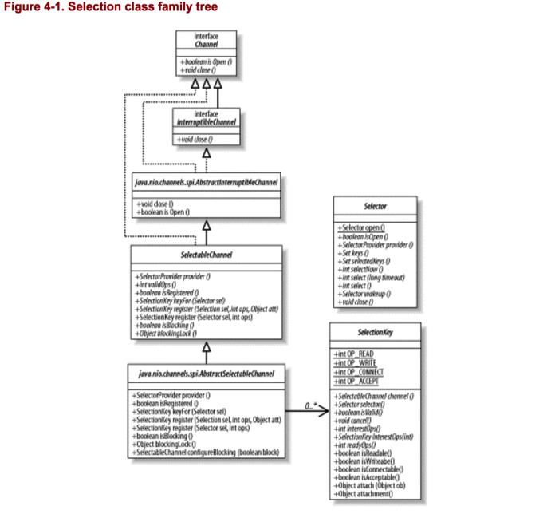
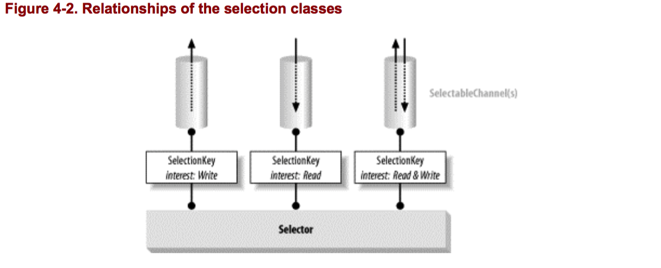

在这一章，我们将探索Selectors。Selectors提供了readiness selection的能力，这使得多路传输I/O成为可能。正如在第一章中所讨论的，readiness selection和多路传输使得单个线程同时、有效的管理许多I/O channels成为可能。C/C++ 程序员 许多年前已经有POSIX `select()`和`poll()`系统调用可供使用。大多数其他操作系统提供了相似的功能。但是readiness selection直到JDK 1.4才可供java 程序员使用。

## 4.1 Selector Basic
掌握本章中讨论的主题,在某种程度上,比直接理解缓冲区和通道类更困难一些。这会复杂一
些,因为涉及了三个主要的类,它们都会同时参与到整个过程中。如果您发现自己有些困惑,记录
下来并先看其他内容。一旦您了解了各个部分是如何相互适应的,以及每个部分扮演的角色,您就会理解这些内容了。

我们会先从总体开始,然后分解为细节。你注册了一个或多个之前创建的selectable channels到一个selector 对象。一个代表channel 和 selector关系的key返回。Selection Keys 记住了你在每个Channel中感兴趣的东西。它们也会追踪Channel上感兴趣的操作是否准备执行。当你调用selector 对象上的`select()`时，通过检查注册到这个selector上的所有channels,关联的keys被更新。你可以获取一组key，这些key所关联的channels 在此时都准备妥当。通过遍历这些keys，你可以使用每个自从最后一次调用`select()`后已经准备妥当的channel。

最基本的，Selectors提供了查询一个channel是否准备执行一个你感兴趣的I/O操作的能力。例如，一个`SocketChannel`对象可以查询是否有bytes 准备读取或者我们可能想知道一个`ServerSocketChannel`是否有任何刚收到的连接准备accept。

Selectors提供了这种服务，当和`SelectableChannel`对象结合使用时，但是不仅仅是这样。readiness selection的真正强大的地方是同时检查大量的channels的readiness的潜能。调用者可以很容易的确定哪些channel准备妥当。此外，执行线程可以请求sleep直到一个或多个注册到`Selector`的channel is ready，或者它可以周期性的轮询selector来查看自从最后一次检查以来是否有channel ready。如果你想到了web server，它必须管理大量的并发线程，很容易知道如何可以好好利用这些能力。

初步映象，readiness selection可能只是和nonblocking mode竞争，但实际上不是。nonblocking mode要么做你要求的，要么表明不能做。这和确定一种操作是否能做是语义上的不同。例如，如果你尝试一个nonblocking read并且他成功了，你不仅发现`read()`是可以的，你还可以读取一些数据。你必须处理这些数据。

 这有效的使你把check readiness的代码和处理数据的代码分开，至少复杂性降低了。即使查询每个channel是否ready 是很简单的事，这仍然可以造成困难，因为你的代码或者jar包中的一些代码，需要遍历所有的候选channel，逐个检查。这可能导致每测试一个channel是否 ready就要发起一个系统调用，这是很昂贵的，但是最主要的问题是check可能不是原子的。一个已经在check list中的channel可能在执行完check操作之后ready了，但是你不会知道直到下次轮询。最糟糕的是，你没有任何选择，只能继续轮询。你没有一种当一个你感兴趣的channel ready 时，可以得到通知的方法。

这就是为什么监控多个sockets的传统java的解决方案是为每个socket创建一个线程并且允许线程阻塞在`read()`方法，直到有数据可用。这实际上使得每一个阻塞的线程成为了一个socket监控器，并且JVM的线程调度成为了通知机制。对程序员和JVM，管理这些线程的复杂性和性能消耗，随着线程数目的增长而失控。

真正的readiness selection必须由操作系统来完成。操作系统完成的一个最重要的功能是处理I/O请求和当数据ready时通知进程。所以只有把这些功能委托给操作系统才是明智的。`Selector`类提供了这个抽象，通过它Java 代码可以从底层操作系统请求readiness selection服务，以可移植的方式。

我们看看`java.nio.channels`包中处理readiness selection的特殊类。

### 4.1.1 The Selector,SelectableChannel,and SelectionKey Classes
目前，你可能对Java中的selection是如何工作的感到困惑。参考图4-2，你将会看到实际上只有三个有关readiness selection的类。

### Selector
Selector类管理了一组注册的channels和它们的readiness状态的信息。Channels注册到selectors,一个selector 可以要求更新最近注册的channels的readiness状态。当这样做时，执行线程可以选择suspend直到注册调度channels中的一个is ready。

### SelectableChannel
这个抽象类提供了实现channel selectability 的公共方法。它是所有支持readiness selection的channel的父类。`FileChannel`不能selectable 因为它没有继承自`SelectableChannel`。所有的socket channel都是selectable的，从`Pipe`中获取的channel也是。`SelectableChannel`对象可以注册到`Selector`对象，同时表明对那个selector何种操作感兴趣。一个channel可以注册到多个selectors，但是对于每个selector只能注册一次。

### SelectionKey
`SelectionKey`封装了一个特定channel和一个特定selector的注册关系。`SelectableChannel.register()`返回一个`SelectionKey`对象，作为表示这种注册关系的token。`SelectionKey`包含 two bit sets(编码为整数)表明注册者对channel哪种操作感兴趣，以及channel上的哪种操作已经ready to perform。



我们看看`SelectableChannel`的相关方法：

````
public abstract class SelectableChannel extends AbstractChannel implements Channel{
  // This is a partial API listing
  public abstract SelectionKey register (Selector sel, int ops)
          throws ClosedChannelException;
  public abstract SelectionKey register (Selector sel, int ops,
         Object att)
          throws ClosedChannelException;
  public abstract boolean isRegistered();
  public abstract SelectionKey keyFor (Selector sel);
  public abstract int validOps();
  public abstract void configureBlocking (boolean block)
                throws IOException;
  public abstract boolean isBlocking();
  public abstract Object blockingLock();
}
````

非阻塞模式和多路传输关系密切--所以`java.nio`将他们的API放到了同一个类中。

我们已经讨论了如何配置和检查一个channel的阻塞模式（在第三章）。一个channel必须先置为非阻塞模式才能注册到selector。



调用selectable channel的`register()`方法将它注册到一个selector。如果你试着注册一个阻塞模式的channel，`register()`将会抛出一个unchecked `IllegalBlockingModeException`。同时，在注册之后，channel不能置为阻塞模式。尝试这样做，`configureBlocking()`方法会抛出`IllegalBlockingModeException`。

同样，注册一个已经关闭的`SelectableChannel`实例会抛出`ClosedChannelException`。

在我们详细讨论`register()`方法和`SelectableChannel`的另一个方法之前，让我们看看`Selector`的API：

````
public abstract class Selector
{
        public static Selector open() throws IOException
        public abstract boolean isOpen();
        public abstract void close() throws IOException;
        public abstract SelectionProvider provider();
        public abstract int select() throws IOException;
        public abstract int select (long timeout) throws IOException;
        public abstract int selectNow() throws IOException;
        public abstract void wakeup();
        public abstract Set keys();
        public abstract Set selectedKeys();
}
````

虽然`register()`方法定义在`SelectableChannel`类，但是channels却是注册到selectors,而不是反过来。一个selector 维护了一组要监控的channels。一个给定的channel可以注册到多个selector并且当前注册到哪个`Selector`对象。将`register()`方法放在`SelectableChannel`而不是`Selector`多少有点随意。它返回一个`SelectionKey`对象，这个key包装了两者之间的关系。重点要记住的是，`Selector`对象控制了注册到它的channel的selection process。

````
public abstract class SelectionKey
{
    public static final int OP_READ
    public static final int OP_WRITE
    public static final int OP_CONNECT
    public static final int OP_ACCEPT
    public abstract SelectableChannel channel(  );
    public abstract Selector selector(  );
    public abstract void cancel(  );
    public abstract boolean isValid(  );
    public abstract int interestOps(  );
    public abstract void interestOps (int ops);
    public abstract int readyOps(  );
    public final boolean isReadable(  )
    public final boolean isWritable(  )
    public final boolean isConnectable(  )
    public final boolean isAcceptable(  )
    public final Object attach (Object ob)
    public final Object attachment(  )
}
````

> Selectors负责管理的对象不是selectable channel对象。Selector对象执行注册到它的channel的readiness selection，并且管理selection keys。

每个key的感兴趣的操作和readiness，因channel不同而不同。每一个channel实现定义了自己的具体的`SelectionKey`类，在`register()`方法中构造，然后传递到`Selector`对象。

### 4.1.2 Setting Up Selectors
目前，你可能搞到困惑。在之前的三个API中看到很多方法，不知道他们做什么的。在深入这些方法的细节之前，我们先看一个典型用法的例子。

为了设置一个`Selector`对象监控三个`Socket`channels，你需要这样做：

````
Selector selector = Selector.open();
channel1.register(selector,SelectionKey.OP_READ);
channel2.register(selector,SelectionKey.OP_WRITE);
channel3.register(selector,SelectionKey.OP_READ | SelectionKey.OP_WRITE);

//wait up to 10 seconds for a channel to become ready
readyCount = selector.select(10000);
````

这些代码创建了一个新的selector，然后注册3个socket channels到selector,每一对不同的操作感兴趣。然后调用`select()`方法将线程置为sleep直到感兴趣的事件中的一个发生或10秒到期。

下面是`Selector`的详细API：

````
public abstract class Selector
{
// This is a partial API listing
public static Selector open(  ) throws IOException
public abstract boolean isOpen(  );
public abstract void close(  ) throws IOException;
public abstract SelectionProvider provider(  );
}
````

调用静态工厂方法`open()`实例化Selector对象。Selector不是像channels和streams一样重要的I/O对象：数据永远不会通过Selector传递。`open()`方法连接到SPI从默认的`SelectionProvider`对象请求一个新的实例。也可以通过调用自定义的SelectionProvider的`openSelector()`方法创建一个新的`Selector`实例。你可以通过调用它的`provider()`方法决定哪个`SelectionProvider`用来创建`Selector`实例。在大多数情况下，你不需要考虑SPI；仅仅调用`open()`方法来创建新的`Selector`对象。当你需要处理这些罕见的情况时，可以参考channel SPI package。

继续Selector的话题：当你用完之后，调用`close()`方法释放它占用的资源以及使所有关联的selection key失效。一旦`Selector`被关闭了，试图执行他的大多数方法都会抛出`ClosedSelectorException`。注意`ClosedSelectorException`是非检查异常（runtime）。你可以通过`isOpen()`方法确定一个`Selector`当前是否打开。

我们马上要说完`Selector`API了,但是现在我们要看看注册channels到selectors。

正如之前说的，`register()`方法定义在`SelectableChannel`类中，尽管实际上是channels注册到selectors（register方法定义在selector更合理）。`register()`方法接收一个`Selector`对象和一个叫`ops`的整数作参数。第二个参数代表了注册的channel感兴趣的操作集。这是一个比特掩码表示当检查这个channel的readiness时，selector应该测试的I/O操作。这个特殊的操作位定义在SelectionKey中为public static。

JDK 1.4中，有定义了4个selectable 操作：read,write,connect,accept。不是所有的操作在所有的selectable channel上都支持。例如，一个`SocketChannel`不能accept。尝试注册一个不支持的操作会导致抛出未检查的`IllegalArgumentException`。你可以发现一个特定的channel上支持的操作，通过调用它的`validOps()`方法。

Selectors包括了当前注册到它的一组channel。在任何给定的时刻，只有一个给定的channel和一个给定的register的注册关系是生效的。但是，一个给定的channel可以多次注册一个selector上。这样做会返回同一个的SelectionKey,并更新它感兴趣的操作为给定的值。之后的注册只是简单的更新这个key。

一个异常的情况是，当你试图再次注册一个channel到一个selector，它关联的key已经取消了
，但是channel仍然是注册的。当关联的key取消时，channel不是立即撤销注册。他们仍然注册直到下一次selection操作发生。在这种情况下，会抛出`CancelledKeyException`。

在之前的列表中，你可能注意到第二种`register()`方法，它接收一个object参数。这是一个方便的方法，你可以传递一个对象引用到这个新的selection key的`attach()`方法。

一个channel可以注册到多个selectors。一个channel可以通过调用`isRegistered()`方法查询当前是否注册到任何selectors。这个方法没有提供关于channel被注册到哪个selectors上的信息,而只能知道它至少被注册到了一个选择器上。另外，在一个注册的key取消和channel撤销注册之间有延迟。这个方法只是一个提议，而不是确切的答案。

任何一个channel和selector的注册关系都被封装在一个`SelectionKey`对象中。`keyFor()`方法将返回与该channel和指定的selector相关的key。如果channel被注册到指定的selector上,那么相关的key将被返回。如果它们之间没有注册关系,那么将返回 null。

## 4.2 Using Selection Keys
我们从`SelectionKey`类的API开始：

````
package java.nio.channels;
public abstract class SelectionKey
{
  public static final int OP_READ
  public static final int OP_WRITE
  public static final int OP_CONNECT
  public static final int OP_ACCEPT
  public abstract SelectableChannel channel(  );
  public abstract Selector selector(  );
  public abstract void cancel(  );
  public abstract boolean isValid(  );
  public abstract int interestOps(  );
  public abstract void interestOps (int ops);
  public abstract int readyOps(  );
  public final boolean isReadable(  )
  public final boolean isWritable(  )
  public final boolean isConnectable(  )
  public final boolean isAcceptable(  )
  public final Object attach (Object ob)
  public final Object attachment(  )
}
````

正如之前提到的，一个key代表了一个特定的channel对象和一个特定的selector对象的注册关系。`channel()`方法返回关联到这个key的`SelectableChannel`对象，`selector()`方法返回关联的`Selector`对象。

Key对象代表了一个具体的注册关系。当要终结这种关系时，调用`SelectionKey`对象的`cancel()`方法。调用它的`isValid()`方法可以检查一个key所代表的注册关系是否有效。当一个key被取消时，它被放在关联selector的取消队列中。注册关系不是立即取消，但是key是立即无效的。直到下一次执行`select()`，任何的取消key将会从取消队列中清除，对应的撤销注册将完成。channel可以再次注册，一个新的`SelectionKey`对象将会返回。

当一个channel关闭了，所有和它关联的key将自动取消（记住，一个channel可以注册到多个selectors）。当一个selector关闭了，所有注册到这个selector的channels会撤销注册，并且关联的key会无效。一旦一个key无效了，调用它的任何有关selection的方法将抛出`CancelledKeyException`。

一个`SelectionKey`对象包含两个集合编码为整数位掩码：一个是channel/selector感兴趣的操作集(the interest set)，一个表示channel当前准备执行的操作（the ready set）。通过执行key对象上的`interestOps()`可以获取当前感兴趣的操作集。起初，这将会是注册channel时传递的值。这个interest set 将永远不会被selector改变，但是你可以改变它通过调用`interestOps()`传递一个新的参数。interest set可以通过重新注册channel到selector而改变。当关联的`Selector`上正在执行`select()`时，key的interest set的改变不会影响正在执行的selection 操作。任何改变将会在下一次执行`select()`时生效。

通过调用key的`readyOps()`方法可以获取与key关联的channel上已经ready 的操作集（set）。这个ready set是interest set的子集，表示interest set中从上次调用`select()`以来已经 ready 的那些操作。例如，下面的代码测试关联这个key的channel是否ready for reading。如果ready，读取data到buffer中，然后发送到一个消费者线程。

````
if((key.readyOps() & SelectionKey.OP_READ) != 0){
  myBuffer.clear();
  key.channel.read(myBuffer);
  doSomethingWithBuffer(myBuffer.flip());
}
````

如之前所提到的，当前有四种channel 操作可以测试readiness。你可以像上面代码一样通过测试位掩码，但是`SelectionKey`定义了四个方便的方法来测试位：`isReadable()`,`isWritable()`,`isConnectable()`,`isAcceptable()`。每一个方法都与使用特定掩码来测试 `readyOps()`方法的结果的效果相同。例如:

````
if(key.isWritable()){

}
````

等于：

````
if ((key.readyOps() & SelectionKey.OP_WRITE) != 0){

}
````

在任何`SelectionKey`对象上调用这四个方法都是安全的。回想到一个channel不能注册它不支持的操作到interest set。因为一个不支持的操作永远不会在channel的interest set，它也永远不会出现在ready set。因此，调用一个不支持操作的这些方法将总是返回false，因为这些操作将永远不能ready。

需要注意的是，通过SelectionKey的`readyOps()`返回的readiness只是一个提示(hint)，而不是保证(guarantee)。底层channel的状态随时可能改变。其他线程可能在channel上执行操作而影响它的readiness 状态。操作系统的特性也可能影响。

>一个SelectionKey对象包含的ready set是在这个selector最后一次检查注册channel的状态的时刻。在此期间，单个channel的readiness 可能改变。

您可能会从`SelectionKey`的API中注意到尽管有获取ready set的方法,但没有重新设置那个set的成员方法。事实上,您不能直接改变key的 ready set。在下一节里,也就是描述选择过程时,我们将会看到selector和key是如何进行交互,以提供实时更新的readiness indication的。

让我们看`SelectionKey` API中剩下的来个方法：

````
public abstract class SelectionKey
{
  // This is a partial API listing
  public final Object attach (Object ob)
  public final Object attachment(  )
}
````

这两个方法允许你放一个`attachment`到一个key上，之后可以取回。这是很方便的允许你将任意一个object和key关联。这个object可以是任何对你有意义的引用，例如一个业务对象，session handle，另一个channel等等。

`attach()`方法将在key对象中保存所提供的object的引用。`SelectionKey`类除了保存它之外,不会将它用于任何其他用途。任何一个之前保存在key中的附件引用都会被替换。可以使用 `null`值来清除附件。可以通过调用 `attachment()`方法来获取与key关联的附件句柄。如果没有附件,或者显式地通过 null 方法进行过设置,这个方法将返回 null。

>如果SelectionKey 是 long-lived,但您附加的对象不应该存活那么长时间,请记得在完成后清理附件。否则,您附加的对象将不能被GC,您将会面临内存泄漏问题。

关于`SelectionKey`需要注意的最后一件事是并发性。通常，`SelectionKey`对象是线程安全的，但是修改interest set 的操作是通过`Selector`对象同步的，知道这一点很重要。这可能引起调用`interestOps()`方法阻塞不确定的时间。selector的锁定的策略是依赖于实现的。幸好,这种多元处理能力被特别地设计为 可以使用单线程来管理多个通道。被多个线程使用的选择器也只会在系统特别复杂时产生问题。坦白地说,如果您在多线程中共享选择器时遇到了同步的问题,也许您需要重新思考一下您的设计。

## 4.3 Using Selectors
现在我们来看`Selector`类，readiness selection的核心。

````
public abstract class Selector
{
  // This is a partial API listing
  public abstract Set keys(  );
  public abstract Set selectedKeys(  );
  public abstract int select(  ) throws IOException;
  public abstract int select (long timeout) throws IOException;
  public abstract int selectNow(  ) throws IOException;
  public abstract void wakeup(  );
}
````

### 4.3.1 The Selection Process
在深入API的细节之前，你应该直到`Selector`的一点内部工作原理。如之前讨论的，一个Selector维持了一组注册的channels，并且他们的注册关系包装在`SelectionKey`对象。每一个`Selector`对象维持了三组key。

### Registered key set
与selector关联的当前注册的key的集合。不是每一个注册的key都是有效的。Registered key set 由`keys()`返回，并且可能是空的。Registered key set 不能直接修改；试图这样做会抛出异常。

### Selected key set
Registered key set 的子集。这个集合中的每一成员所关联的channel都被selector确定为ready在interest set中的至少一个操作上。`selectedKeys()`方法可以返回这个set。

不要混淆selected key set 和 ready set。selected key set是key的集合，其中的每一个key所关联的channel都ready在至少一个操作上。每一个key有一个嵌入的ready set表示关联channel ready的操作集合。

可以直接从selected key set中移除key，但是不能添加。试图添加将会抛出异常。

### Cancelled key set
Registered key set的子集。这个集合包含了已经调用`cancel()`方法的key，但是他们还没有撤销注册。这个集合不能直接访问。

在新创建的`Selector`对象中，这三个集合都是空的。

`Selector`类的核心是selection过程。本质上，selector是对`select()`，`poll()`，或其他相似功能的操作系统系统调用的包装。但是`Selector`不仅仅是传递给本地代码。它在每一个selection操作上应用了一个特殊的处理。理解这个处理对掌握keys和他们代表的状态信息很重要。

一个selection 操作是由一个selector调用3个`select()`方法中的任何一个执行。不管哪一个方法被调用，下面3个步骤都被执行。

1. 检查Cancelled key set。如果不是空的，Cancelled key set中的每一个key都会从其他两个key set中移除，和Cancelled key 关联的channel撤销注册。当这个步骤完成时，Cancelled key set 为空。

2. Registered key set 中每一个key的interest set 操作将被检查。这个步骤的检查之后，对interest set的改变将不会影响之后的selection 操作。

  一旦readiness 标准确定了，底层操作系统查询来确定每个channel的感兴趣操作的实际的readiness状态。依赖于特定的`select()`方法调用,如果没有通道已经准备好,线程可能会在这时阻塞,通常会有一个超时值。

  一旦系统调用完成（这可能会引起执行线程短暂sleep），每个channel的当前readiness状态已经确定了。当前没有ready的channel将不会做任何操作。对于每一个操作系统标示的至少在一个感兴趣操作上ready的channel，会发生以下事情中的一件：
  
  + 如果channel的key没在selected key set，这个key的ready set将被清除，然后表示操作系统确定的当前已经ready的操作的比特掩码(bit)将被设置。

  + 否则，channel的key已经在selected key set。key的ready set更新为表示操作系统确定的当前已经ready的操作的比特掩码(bit)。任何之前设置的已经不再ready的操作的bit也不会被清除。实际上，不会清除任何的bits。操作系统确定的ready set和之前已经ready的set是按位分开（bitwise-disjoined）。一旦一个key被放置在selector的selected key set中，它的ready set 是累积的。bit可以设置，但不会清除。

3. 第二步可能会花费很长的时间，尤其是当执行线程sleep时。和这个selector关联的keys在此期间可能cancelled。当第二步完成时，第一步将重复执行以完成与cancelled的key关联的channel的撤销注册。

4. 从select 操作返回的值是 ready set在第二步中改变的key的数量，而不是selection key set中channel的全部数量。返回值不是ready channel的总数，而是自从上一次执行`select()`以来准备（ready）好的channel的数量。在前一次调用中已经ready并且这次调用仍然ready的channel不会算入，在前一次调用中已经ready但是这次调用中不再ready的channel也不会算入。这些channels仍然在selection key set但是不会算入返回值。返回值可以为零。

当他们cancel a key，使用内部的cancelled key set 来推迟撤销注册是一种优化措施，可以防止线程阻塞，并且防止和正在进行的selection 操作冲突。撤销注册是一种可能昂贵的操作，可能需要重新分配资源（记住,key是与channel相关的,并且可能与它们相关的channel对象之间有复杂的交互）。清除cancelled key并且在selection操作之前或之后立即撤销注册channel消除了在selection操作进行时撤销注册所带来的潜在的棘手的难题。这一另一个鲁棒性折中的例子。

`Selector`类的`select()`方法有三种形式：

````
public abstract class Selector
{
  // This is a partial API listing
  public abstract int select(  ) throws IOException;
  public abstract int select (long timeout) throws IOException;
  public abstract int selectNow(  ) throws IOException;
  public abstract void wakeup(  );
}
````

三种形式的select 只在 如果注册的channels当前没有一个ready时是否阻塞的方面有所不同。最简单的形式，没有任何参数：

````
int n = selector.select();
````

这样调用的话，如果没有channel ready，将无限期阻塞。只要至少有一个注册channel ready，selection key set被更新，每一个ready channel的ready set将被更新。返回值将会是ready channel的数量。通常，这个方法返回一个非零的值，因为它会阻塞直到一个channel ready。但是它可能返回零，如果另一个线程执行这个selector的`wakeup()`方法。

有时候，你想限制线程等待的时间。你可以调用`select()`的另一个方法，这个方法接收一个timeout参数：

````
int n = selector.select(int timeout ms);//毫秒
````

这个方法和之前的一样，除了如果在timeout 时间内没有channel ready，它将返回零。 如果timeout值为零，这个方法和无参的`select()`一样。

第三种形式的`select()`完全不会阻塞：

````
int n = selector.selectNow();
````

`selectNow()`将永远不会阻塞，如果当前没有channel ready，它立即返回零。

### 4.3.2 Stopping the Selection Process
`Selector`的最后一个API方法，`wakeup()`，提供了优雅地中断阻塞在`select()`方法上的线程的能力。

有三种方式可以唤醒一个sleep在`select()`上的线程：

#### 调用 wakeup()。
调用`Selector`对象上的`wakeup()`方法使得这个selector对象的第一个还没有返回的selection操作立即返回。如果当前没有selection，那么下一次执行三个`select()`方法中的任何一个将立即返回。此后的selection操作将恢复正常。在selection 操作之间执行多次`wakeup()`和执行一次效果一样。

有时候，这种推迟唤醒的行为可能不是你想要的。你可能想只唤醒一个sleeping线程但是允许此后的selection正常进行。在调用`wakeup()`之后，调用`selectNow()`做到。然而，如果你
的代码关注返回值并且合适的处理selection，那么即使下一个`select()`立即返回而没有任何channel ready，也不会有什么不同。无论如何，你应该为这些可能发生的事做准备。

#### 调用 close()
如果一个`selector`的`close()`方法被调用，任何阻塞在selection操作上的线程将会唤醒，好像调用了`wakeup()`方法一样。和Selector关联的channels将会撤销注册，keys将cancelled。

#### 调用 interrupt()
如果一个sleeping线程的`interrupt()`方法被调用，它的interrupt状态被设置。如果唤醒的线程在channel上尝试一个I/O 操作，channel将立即关闭，线程将catch一个异常。这是因为第三章的中断语义。使用`wakeup()`来优雅的唤醒一个sleeping在`select()`上的线程。

`Selector`对象catch `InterruptedException`，调用`wakeup()`方法。

注意，这些方法中的任何一个都不会自动关闭相关的channels。中断一个Selector和中断一个channel不一样（参考第三章）。Selector不会改变任意一个相关的channel的状态,它只会检查它们的状态。

### 4.3.3 Managing Selection Keys
`Selection`是累积的。一旦一个selector添加一个key到selected key set，它永远不会被移除。一旦一个key在selected key set 中，这个key在ready set中的ready 迹象被设置永远不会被清除。乍一看，这可能是令人烦恼的，因为一个selection操作可能没有真正描述注册channel的当前状态。这是一个有意的设计。它提供了很大的灵活性，但把合理地管理key以确保它们表示的状态信息不会变得陈旧的任务交给了程序员。

合理使用selector的秘诀是理解selector所维护的selected key set的角色。重要的是，当一个key已经不在selected set时会发生什么。当至少一个感兴趣的操作变得ready,key的ready set被清除，当前ready 的操作被添加到ready set。然后，key加到selected key set。

移除一个`SelectionKey`的ready set的方法是从selected key set中移除这个key。一个selection key的ready set只能被`Selector`对象在一个selection操作时移除。只有selected key set中的key有合理的readiness 信息。这些信息持续存在于key中直到key从selected key set中移除。下一次channel有感兴趣的操作发生时，key将被设置以反映channel的状态，这时key再一次被加入到selected key set。

这个结构提供了很大的灵活性。方便的方式是在selector上执行`select()`方法（更新selected key set），然后遍历`selectedKeys()`方法返回的key set。当顺序检查每个key时，根据每个key的ready set处理关联的channel。然后从selected key set中移除这个key（调用`Iterator`对象的`remove()`方法），检查下一个key。当完成时，重复到调用`select()`方法的步骤。下面的例子是一个典型的server 例子。

````
package com.dyh.tutorial.nio;

import java.io.IOException;
import java.net.InetSocketAddress;
import java.net.ServerSocket;
import java.nio.ByteBuffer;
import java.nio.channels.SelectionKey;
import java.nio.channels.Selector;
import java.nio.channels.ServerSocketChannel;
import java.nio.channels.SocketChannel;
import java.util.Iterator;

/**
 * Created by dengyunhui on 16/10/12.
 */
public class SelectedSocket {

    public static int PORT_NUMBER = 1234;

    public static void main(String[] args) throws IOException {
        new SelectedSocket().go(args);
    }

    protected void go(String[] args) throws IOException {
        int port = PORT_NUMBER;
        if (args.length > 0){
            port = Integer.parseInt(args[0]);
        }

        System.out.println("Listening on port:" + port);

        //allocate an unbound server socket channel
        ServerSocketChannel serverSocketChannel = ServerSocketChannel.open();

        //get the associated serversocket to bind it with
        ServerSocket serverSocket = serverSocketChannel.socket();

        //create a new selector for use below
        Selector selector = Selector.open();

        //set the port the server channel will listen to
        serverSocket.bind(new InetSocketAddress(port));

        //set nonblocking mode for the listen socket
        serverSocketChannel.configureBlocking(false);

        //register the channel with the selector
        serverSocketChannel.register(selector, SelectionKey.OP_ACCEPT);


        while(true){
            //this may block for a long time.upon returning,the selected set contains keys of the ready channel.
            int n = selector.select();

            if (n == 0){
                continue;
            }

            //get the iterator over the set of selected keys
            Iterator it = selector.selectedKeys().iterator();

            while(it.hasNext()){
                SelectionKey key = (SelectionKey) it.next();

                //is a new conection coming in
                if (key.isAcceptable()){
                    ServerSocketChannel serverSocketChannel1 = (ServerSocketChannel) key.channel();
                    SocketChannel channel = serverSocketChannel1.accept();

                    registerChannel(selector,channel,SelectionKey.OP_READ);

                    sayHello(channel);
                }

                //is there data to read on this channel
                if(key.isReadable()){
                    readDataFromSocket(key);
                }

                //remove key from selected set;it's been handled
                it.remove();
            }


        }


    }

    // Use the same byte buffer for all channels.  A single thread is
    // servicing all the channels, so no danger of concurrent acccess.
    private ByteBuffer buffer = ByteBuffer.allocateDirect(1024);

    protected void readDataFromSocket(SelectionKey key) throws IOException {
        SocketChannel socketChannel = (SocketChannel) key.channel();
        int count;

        buffer.clear();//empty buffer

        //loop while data is available,channel is nonblocking
        while((count = socketChannel.read(buffer)) > 0){
            buffer.flip();

            // Send the data; don't assume it goes all at once
            while(buffer.hasRemaining()){
                socketChannel.write(buffer);
            }
            // WARNING: the above loop is evil.  Because
            // it's writing back to the same nonblocking
            // channel it read the data from, this code can
            // potentially spin in a busy loop.  In real life
            // you'd do something more useful than this.

            buffer.clear();//empty buffer
        }

        if (count < 0){
            //close channel on EOF,invalidate the key
            socketChannel.close();
        }

    }

    protected void sayHello(SocketChannel channel) throws IOException {
        buffer.clear();
        buffer.put("Hi there! \r\n".getBytes());
        buffer.flip();

        channel.write(buffer);
    }

    protected void registerChannel(Selector selector, SocketChannel channel, int opRead) throws IOException {
        if (channel == null){
            return;
        }

        channel.configureBlocking(false);
        channel.register(selector,opRead);
    }
}
````

### 4.3.4 Concurrency
`Selector`对象是线程安全的，但是他们包含的key set不是。从`keys()`和`selectedKeys()`方法返回的key set是`Selector`对象中私有对象的直接引用。这些集合随时可能改变。registered key set是read-only的。如果尝试修改它，会抛出`java.lang.UnsupportedOperationException`，但是当你观看他们时，如果他们改变了，你仍然可能有麻烦。`Iterator`对象是fail-fast：如果底层的Set 改变了，他们将会抛出`java.util.ConcurrentModificationException`,所以在多线程中共享selector或key set时，要注意这些问题。你可以直接修改selection key set，但是你可能毁坏其他线程的`Iterator`对象。

如果在多线程并发访问一个selector的key set有问题时，你必须采取措施合理同步访问。当执行一个selection操作时，selector同步于`Selector`对象，the registered key set,and the selected key set。在步骤1和3中，他们也同步在cancelled key set上。

在多线程的场景中，如果你需要改变任何key set,不管是直接的或一个操作的副作用，你应该首先同步在同一个对象上，以同样的顺序。锁定顺序至关重要，如果竞争线程没有以同样的顺序请求同一个锁，有可能导致死锁。如果你确定没有其他线程同时访问selector,同步是没有必要的。

`Selector`对象的`close()`方法在同步方面和`select()`方法一样，所以有可能阻塞。一个线程调用`close()`将会阻塞直到正在进行的selection完成或执行selection的线程sleep。在后一种情况下，一旦执行`close()`方法的线程获取了锁并且关闭了selector，执行selection的线程将会唤醒。

## 4.4 Asynchronous Closability
可能在任何时候关闭一个channel或取消一个selection key。除非你采取同步措施，keys和关联channel的state可能意外的改变。一个key出现在一个具体的key set中并不能保证这个key还是有效的或它关联的channel仍然打开着。

关闭channel不应该是一个费时的操作。NIO的设计者尤其想防止一个线程在关闭一个channel时无限期的阻塞，如果这个channel正在进行select 操作。当一个channel关闭时，和它关联的keys被cancelled。这不会直接影响一个正在进行的`select()`，但并不意味着当你调用`select()`时有效的selection key，返回之后会无效。你应该总是使用从`selectedKeys()`方法返回的key set。不要维护你自己的key set。理解4.3.1节的selection 过程很重要。

参考4.3.2节，了解当线程阻塞在`select()`时，怎样可以唤醒。

## 4.5 Selection Scaling
已经很多次提到，selector使得一个线程多路传输大量的可以选择(selectable)的channel变得容易。使用一个线程服务所有的channel降低了复杂性，通过消除管理大量线程的开支可能提高性能。但是，用一个线程服务所有的channel是否是一个好想法？像平时一样，看情况。

如果是单CPU系统，那么这是一个好想法，因为每次只有一个线程可以运行。通过消除线程间上下文切换的开销，总吞吐量可能更高。但是如果是一个多CPU系统呢？在一个有n个CPU的系统上，n-1个CPU可能空闲，然而一个线程顺序服务每个channel。

或者不同的channel需要不同的服务呢？假设一个应用从大量的分布式传感器记录信息。当服务线程遍历每一个ready的channel，任何给定的传感器可能等待几秒。如果响应时间不是很重要的话，这没问题。但是高优先级的连接（比如操作者命令）可能要在队列中等待，如果只有一个线程服务所有的channel。每一个应用的要求不同。

在第一种场景中，你想更多的线程服务channel，请抵抗住使用多个selector的欲望。在大量channels上执行readiness selection不是很昂贵的。大部分工作由底层操作系统完成。维护多个Selector和随机分配channel给其中的一个，并不是一个令人满意的解决方案。

一种更好的方式是对所有的channel使用一个selector，委托服务ready channel的任务给其他线程。你有一个监控channel readiness的地方和一个解耦的工作者线程池来处理到来的数据。线程池的大小可以根据部署情况调节。管理selectable channel又一次变得简单。

在第二中场景中，一些channel比其他的要求更快的响应速度，通过使用两个selector可以解决这个问题：一个用以command 连接，另一个用以普通连接。但是这个场景可以像第一个一样更简单的解决。不是分发所有的ready channels到同一个线程池，channels可以根据功能由不同的工作者线程处理。可能有一个日志线程池，一个控制线程池，一个状态请求线程池。

例4-2中的代码是例4-1中的代码的一个扩展。它重载了readDataFromSocket方法，使用一个线程池来服务channel。不是在main线程中同步读取数据，这个版本传递`SelectionKey`对象给一个工作线程服务。

例4-2：

````
package com.dyh.tutorial.nio;

import java.io.IOException;
import java.nio.ByteBuffer;
import java.nio.channels.SelectionKey;
import java.nio.channels.SocketChannel;
import java.util.LinkedList;
import java.util.List;

/**
 * Specialization of the SelectSockets class which uses a thread pool
 * to service channels.  The thread pool is an ad-hoc implementation
 * quicky lashed togther in a few hours for demonstration purposes.
 * It's definitely not production quality.
 * <p>
 * Created by dengyunhui on 16/10/13.
 */
public class SelectSocketsThreadPool extends SelectedSocket {

    private static final int MAX_THREADS = 5;
    private ThreadPool pool = new ThreadPool(MAX_THREADS);

    public static void main(String[] argv) throws IOException {
        new SelectSocketsThreadPool().go(argv);
    }

    /**
     * Sample data handler method for a channel with data ready to read.
     * This method is invoked from the go(  ) method in the parent class.
     * This handler delegates to a worker thread in a thread pool to
     * service the channel, then returns immediately.
     *
     * @param key A SelectionKey object representing a channel
     *            determined by the selector to be ready for reading.  If 	 * the
     *            channel returns an EOF condition, it is closed here, which
     *            automatically invalidates the associated key.  The selector
     *            will then de-register the channel on the next select call.
     */
    protected void readDataFromSocket(SelectionKey key) {
        WorkerThread worker = pool.getWorker();
        if (worker == null) {
            // No threads available. Do nothing. The selection
            // loop will keep calling this method until a
            // thread becomes available.  This design could
            // be improved.
            return;
        }
        // Invoking this wakes up the worker thread, then returns
        worker.serviceChannel(key);
    }


    /**
     * A very simple thread pool class.  The pool size is set at
     * construction time and remains fixed.  Threads are cycled
     * through a FIFO idle queue.
     */
    private class ThreadPool {

        List idle = new LinkedList();

        ThreadPool(int poolSize) {
            // Fill up the pool with worker threads
            for (int i = 0; i < poolSize; i++) {
                WorkerThread thread = new WorkerThread(this);
                // Set thread name for debugging. Start it.
                thread.setName("Worker" + (i + 1));
                thread.start();
                idle.add(thread);
            }
        }

        /**
         * Find an idle worker thread, if any.  Could return null.
         */
        WorkerThread getWorker() {
            WorkerThread worker = null;
            synchronized (idle) {
                if (idle.size() > 0) {
                    worker = (WorkerThread) idle.remove(0);
                }
            }
            return (worker);
        }

        /**
         * Called by the worker thread to return itself to the
         * idle pool.
         */
        void returnWorker(WorkerThread worker) {
            synchronized (idle) {
                idle.add(worker);
            }
        }

    }

    /**
     * A worker thread class which can drain channels and echo-back
     * the input.  Each instance is constructed with a reference to
     * the owning thread pool object. When started, the thread loops
     * forever waiting to be awakened to service the channel associated
     * with a SelectionKey object.
     * The worker is tasked by calling its serviceChannel(  ) method
     * with a SelectionKey object.  The serviceChannel(  ) method stores
     * the key reference in the thread object then calls notify(  )
     * to wake it up.  When the channel has been drained, the worker
     * thread returns itself to its parent pool.
     */
    private class WorkerThread extends Thread {
        private ByteBuffer buffer = ByteBuffer.allocate(1024);
        private ThreadPool pool;
        private SelectionKey key;

        WorkerThread(ThreadPool pool) {
            this.pool = pool;
        }

        public synchronized void run() {
            System.out.println(this.getName() + " is ready");
            while (true) {
                try {
                    //sleep and release object lock
                    this.wait();
                } catch (InterruptedException e) {
                    e.printStackTrace();
                    //clear interrupt status
                    this.interrupt();
                }

                if (key == null) {
                    continue;
                }

                System.out.println(this.getName() + " has been awakened");

                try {
                    drainChannel(key);
                } catch (Exception e) {
                    System.out.println("Caught '"
                            + e + "' closing channel");
                    // Close channel and nudge selector
                    try {
                        key.channel().close();
                    } catch (IOException ex) {
                        ex.printStackTrace();
                    }
                    key.selector().wakeup();
                }
                key = null;
                // Done. Ready for more. Return to pool
                this.pool.returnWorker(this);

            }

        }

        /**
         * Called to initiate a unit of work by this worker thread
         * on the provided SelectionKey object.  This method is
         * synchronized, as is the run(  ) method, so only one key
         * can be serviced at a given time.
         * Before waking the worker thread, and before returning
         * to the main selection loop, this key's interest set is
         * updated to remove OP_READ.  This will cause the selector
         * to ignore read-readiness for this channel while the
         * worker thread is servicing it.
         */
        synchronized void serviceChannel(SelectionKey key) {
            this.key = key;
            key.interestOps(key.interestOps() & (~SelectionKey.OP_READ));
            this.notify();        // Awaken the thread
        }

        /**
         * The actual code which drains the channel associated with
         * the given key.  This method assumes the key has been
         * modified prior to invocation to turn off selection
         * interest in OP_READ.  When this method completes it
         * re-enables OP_READ and calls wakeup(  ) on the selector
         * so the selector will resume watching this channel.
         */
        void drainChannel(SelectionKey key)
                throws Exception {
            SocketChannel channel = (SocketChannel) key.channel();
            int count;
            buffer.clear();            // Empty buffer

            // Loop while data is available; channel is nonblocking
            while ((count = channel.read(buffer)) > 0) {
                buffer.flip();         // make buffer readable
                // Send the data; may not go all at once
                while (buffer.hasRemaining()) {
                    channel.write(buffer);
                }
                // WARNING: the above loop is evil.
                // See comments in superclass.
                buffer.clear();        // Empty buffer
            }
            if (count < 0) {
                // Close channel on EOF; invalidates the key
                channel.close();
                return;
            }
            // Resume interest in OP_READ
            key.interestOps(key.interestOps() | SelectionKey.OP_READ);
            // Cycle the selector so this key is active again
            key.selector().wakeup();
        }
    }


}
````
