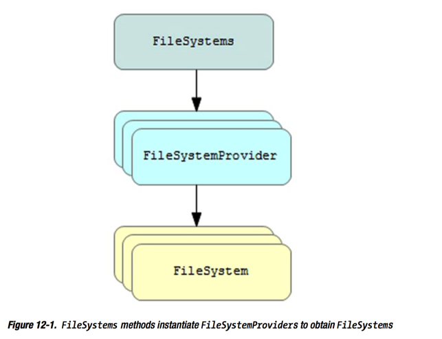

NIO.2 改善了之前限制于`java.io.File`类的文件系统接口。这一章，介绍改善了的文件系统接口的架构，展示你们如何使用新的API来完成各种各样的文件系统任务。

> 文件系统管理文件，通常分为普通文件，目录，软连接，硬连接。

## Architecting a Better File Class
基于文件的文件系统面临困难。几个问题如下：

+ 很多方法返回boolean而不是抛出异常。结果，你不知道为什么一个操作失败了。比如，当`delete()`返回false，你不知道问什么文件不能删除（是文件不存在，还是用户没有合适的权限执行删除操作）。
+ `File` 不支持文件系统特定的软连接和硬连接。
+ `File` 只提供访问有限的文件属性。例如，它不支持访问控制列表（access control lists,ACLs）
+ `File`不支持高效率的文件属性访问。每一次查询都需要调用底层操作系统。
+ `File` 不支持大目录。在服务端请求列出一个大目录可能导致应用挂起。大目录可能也会引起内存资源问题，导致服务被拒绝。
+ `File`限制在默认文件系统。它不支持其他的选择，比如基于内存的文件系统。
+ `File`没有提供文件复制或文件移动的能力。经常用于文件移动的`renameTo()`方法，在不同的操作系统上表现不一致。

NIO.2 提供了一个改善的文件系统接口，提供了之前这些问题的解决方案。一些特性如下所示：

+ 方法抛出异常
+ 支持软连接
+ 广泛的，有效的支持文件属性
+ 目录流（streams）
+ 支持其他文件系统，通过custom file system provider
+ 支持文件拷贝和文件移动
+ 支持生成文件树，访问文件，支持监控目录。

改善的文件系统接口主要通过下面的包实现：

+ `java.nio.file`: 提供了访问文件系统和文件的接口和类。
+ `java.nio.file.attribute`:提供了访问文件系统属性的接口和类。
+ `java.nio.file.spi`:提供了创建一个文件系统实现的类。

这三个包组织了很多类型。FileSystem，FileSystems，FileSystemProvider，是改善了的文件系统的主要接口。

## File Systems and File System Provider
一个操作系统可以有一个或多个文件系统。例如，Unix/Linux把所有安装的磁盘结合为一个虚拟文件系统。相反，Windows为每一个磁盘卷关联一个单独的文件系统，例如卷A为FAT16，卷C为NTFS。

`java.nio.file.FileSystem`类连接了java代码和一个文件系统。而且，`FileSystem`是一个获取很多文件系统相关的对象（比如file stores and path）和服务（比如监控服务，watch service）的工厂。

`FileSystem`不能被实例化，因为这个类是抽象的。但是，`java.nio.file.FileSystems`工具类被用于通过工厂方法获取`FileSystem`s。例如，`FileSystem`的`getDefault()`方法返回一个默认文件系统的`FileSystem`对象。

````
FileSystem fsDefault = FileSystems.getDefault();
````

`getFileSytem(URI uri)`方法可以用于获取一个文件系统，通过一个特殊统一资源定位符(URI)参数。而且，`FileSystems`声明了三个`newFileSystem()`方法用于创建新的文件系统。

抽象的`java.nio.file.spi.FileSystemProvider`类被用于`FileSystems`的工厂方法获取已经存在的文件系统或创建新的文件系统。`FileSystemProvider`的具体子类实现了它的各种方法来拷贝，移动，删除文件；来获取一个path；来读取属性和软连接的目标；来创建目录，连接，软连接；等等。

图12-1 展示了FileSystem,FileSystems,FileSystemProvider是如何关联的。



一个java实现提供具体的`FileSystemProvider`子类，它描述了不同种类的文件系统提供者。如果你对你的java 实现的文件系统提供者感兴趣，运行下面的代码：

````
FileSystemProvider fsDefaultProvider = FileSystems.getDefault().provider();
        System.out.println(fsDefaultProvider);
List<FileSystemProvider> fileSystemProviders = FileSystemProvider.installedProviders();
        for (FileSystemProvider fsp: fileSystemProviders) {
            System.out.println(fsp);
        }
````

在我的电脑上运行结果如下：

````
sun.nio.fs.MacOSXFileSystemProvider@2c7b84de
sun.nio.fs.MacOSXFileSystemProvider@2c7b84de
com.sun.nio.zipfs.ZipFileSystemProvider@3fee733d
````

这个结果告诉我们两件事：我的电脑的文件系统可以通过`MacOSXFileSystemProvider`获取，此外，我也可以获取基于 ZIP 文件的FileSystem。

## Locating Files with Paths
一个文件系统存储文件（普通文件，目录，软连接，硬链接）。文件通常以等级体系存储，并且通过具体的路径（path）定位。

`java.nio.file.Path`接口代表了一个到文件的等级的路径，这个文件可能不存在。

A `Path` 可以代表一个根目录，一个根目录和一系列的命名要素，或一个或多个命名要素。当它只由一个命名要素组成时，它表示一个空的路径。访问一个空的路径等于访问文件系统的默认路径。

> `Path` 声明了`File toFile()`方法返回一个代表他路径的`File`对象，当`Path`对象没有默认的provider关联时，`toFile()`抛出异常。`File` 声明了`Path toPath()`方法返回一个代表`File`对象的抽象路径的`Path`对象.`toPath()`抛出异常当`Path`不能从抽象路径中构造。这些方法使你混合`Path`和`File`，所以你可以慢慢的从基于文件的代码转到使用改善的文件系统接口。


## Getting a Path and Accessing its Name Elements
`FileSystem`提供了一个`Path getPath(String first,String... more)`方法以返回一个`Path`对象。传递给`first`的参数定义了路径的最开始部分。`more` 代表的可变参数定义了`first`的额外部分以组成完整路径。

> 当构造一个`Path`，它的命名元素是由`FileSystem`的`getSepartor()`返回的分隔符拼接在一起的。拼成的路径代表了一个取决于系统的路径。

考虑到下面的例子：

````
Path path = fsDefault.getPath("x","y");
````

这个例子构造了一个y从属于x的path。你也可以这样构造：

````
Path path = fsDefault.getPath("x\\y");
````

不像之前的例子，我使用了Windows 系统下的反斜线分隔符（\）。

`Path`必须遵从创建文件系统时文件系统提供者（file system provider）解析的句法来构造`Path`，也就是在调用`getPath()`时。否则，这个方法会抛出`InvalidPathException`。

> 当构造Path 时，要避免硬编码分隔符，例如Windows下的反斜线。虽然一下分隔符是合法的，例如Windows下的反斜线(\)或斜线(/)，其他分隔符可能会导致`InvalidPathException`。

NIO.2 提供了更加方便的`java.nio.file.Paths`工具类，提供了一对方法返回`Path`对象：

+ Path get(String first,String... more)
+ Path get(URI uri)

第一个方法等于在默认文件系统上调用`getPath()`：`FileSystems.getDefault().getPath(first,more);`

第二个方法更加的深入，它通过给定的URI，遍历安装了的文件系统提供者来定位提供者。当找到提供者，这个方法执行下面的代码：`return FileSystems.getDefault().provider().getPath(URI uri);`。

Path 声明了几个方法来访问名字元素：

+ `Path getFileName()`: 返回path对象表示的文件的名字。
+ `Path getName(int index)`: 返回Path对象表示的第index个名字。index从0开始，0表示最接近根目录的元素。
+ `int getNameCount()`:返回路径中的名字的总数。
+ `Path getRoot()`:返回Path中的根目录名字。
+ `Path subPath(int beginIndex,int endIndex)`:返回一个相对的path。

下面的例子说明了Path的构造和上面这些方法。

````
public static void main(String[] args)
    {
        FileSystem fsDefault = FileSystems.getDefault();
        Path path = fsDefault.getPath("a", "b", "c");
        System.out.println(path);
        System.out.println(path.toFile().exists());
        System.out.printf("File name: %s%n", path.getFileName());
        for (int i = 0; i < path.getNameCount(); i++)
            System.out.println(path.getName(i));
        System.out.printf("Parent: %s%n", path.getParent());
        System.out.printf("Root: %s%n", path.getRoot());
        System.out.printf("SubPath [0, 2): %s%n", path.subpath(0, 2));
    }
````

输出结果如下：

````
a/b/c
false
File name: c
a
b
c
Parent: a/b
Root: null
SubPath [0, 2): a/b
````

## Relative and Absolute Paths
前面的path的例子说明了相对路径。你可以自己执行Path上的`isAbsolute()`方法证明一下。这个方法返回false说明Path不是绝对的。为了创建绝对路径的Path，你需要传递一个根目录给第一个参数。

通过调用`FileSystem`的`Iterable<Path> getRootDirectories()`方法可以获取一个文件系统的根目录，这个方法返回一个Iterator。下面的例子说明了绝对路径。

````
public static void main(String[] args) {
        FileSystem fsDefault = FileSystems.getDefault();
        Path path = fsDefault.getPath("a", "b", "c");
        System.out.println(path);
        System.out.println(path.toFile().exists());
        System.out.printf("File name: %s%n", path.getFileName());
        for (int i = 0; i < path.getNameCount(); i++){
            System.out.println(path.getName(i));
        }

        System.out.printf("Parent: %s%n", path.getParent());
        System.out.printf("Root: %s%n", path.getRoot());
        System.out.printf("SubPath [0, 2): %s%n", path.subpath(0, 2));

        for (Path root: fsDefault.getRootDirectories())
        {
            path = fsDefault.getPath(root.toString(), "a", "b", "c");
            System.out.println(path);
            System.out.printf("Absolute: %b%n", path.isAbsolute());
            System.out.printf("Root: %s%n", path.getRoot());
        }
    }
````

输出结果如下所示：

````
a/b/c
false
File name: c
a
b
c
Parent: a/b
Root: null
SubPath [0, 2): a/b
/a/b/c
Absolute: true
Root: /
````

如果你有一个相对路径，你可以将它转换为绝对路径通过调用`Path`的`toAbsolutePath()`方法。

````
Path path = Paths.get("a", "b", "c");
        System.out.printf("Path: %s%n", path.toString());
        System.out.printf("Absolute: %b%n", path.isAbsolute());
        path = path.toAbsolutePath();
        System.out.printf("Path: %s%n", path.toString());
        System.out.printf("Absolute: %b%n", path.isAbsolute());
````

输出结果如下：

````        
Path: a/b/c
Absolute: false
Path: /Users/dengyunhui/Documents/code/tutorial/a/b/c
Absolute: true
````

根据`toAbsolutePath()`的jdk文档，如果这个path已经是绝对的，那么这个方法会返回这个path。否则这个方法以一种取决于实现的方式决定path，一般在文件系统默认目录下决定path。

## Normalization,Relativization,and Resolution
`Path` 声明了几个方法来移除path多余的，在两个path之间创建一个相对的path，和连接两个path：

+ `Path normalize()`
+ `Path relativize(Path other)`
+ `Path resolve(Path other)`
+ `Path resolve(String other)`

`normalize()`用于从一个path中消除多余的部分。例如，`report/./2015/jan`包括多余的"."。当调用`normalize()`之后，这个path变成`report/2015/jan`。

`relativize()`在两个path之间创建一个相对path。例如，考虑到当前目录`jan`在`report/2015/jan`中，导航到`report/2016/mar`的湘桂路径是`../../2016/mar`。

`resolve()`是`relativize()`的反面。它让你连接一部分path（一个没有root的path）到另一个path。例如，resolving `apr`到`report/2015`就变成了`report/2015/apr`。

此外，`Path`声明了下面的方法来resolve一个路径到当前路径的父路径。

+ `Path resolveSibling(Path other)`
+ `Path resolveSibling(String other)`

````
Path path1 = Paths.get("reports", ".", "2015", "jan");
        System.out.println(path1);
        System.out.println(path1.normalize());
        path1 = Paths.get("reports", "2015", "..", "jan");
        System.out.println(path1);
        System.out.println(path1.normalize());
        System.out.println();
        path1 = Paths.get("reports", "2015", "jan");
        System.out.println(path1);
        System.out.println(path1.relativize(Paths.get("reports", "2016",
                "mar")));
        try {
            Path root = FileSystems.getDefault().getRootDirectories()
                    .iterator().next();
            if (root != null)
            {
                System.out.printf("Root: %s%n", root.toString());
                Path path = Paths.get(root.toString(), "reports", "2016",
                        "mar");
                System.out.printf("Path: %s%n", path);
                System.out.println(path1.relativize(path));
            }
        }
        catch (IllegalArgumentException iae)
        {
            iae.printStackTrace();
        }
        System.out.println();
        path1 = Paths.get("reports", "2015");
        System.out.println(path1);
        System.out.println(path1.resolve("apr"));
        System.out.println();
        Path path2 = Paths.get("reports", "2015", "jan");
        System.out.println(path2);
        System.out.println(path2.getParent());
        System.out.println(path2.resolveSibling(Paths.get("mar")));
        System.out.println(path2.resolve(Paths.get("mar")));
````

结果如下：

````
reports/./2015/jan
reports/2015/jan
reports/2015/../jan
reports/jan

reports/2015/jan
../../2016/mar
java.lang.IllegalArgumentException: 'other' is different type of Path
	at sun.nio.fs.UnixPath.relativize(UnixPath.java:416)
	at sun.nio.fs.UnixPath.relativize(UnixPath.java:43)
	at com.dyh.tutorial.nio2.PathDemo.test1(PathDemo.java:66)
	at com.dyh.tutorial.nio2.PathDemo.main(PathDemo.java:42)
	at sun.reflect.NativeMethodAccessorImpl.invoke0(Native Method)
	at sun.reflect.NativeMethodAccessorImpl.invoke(NativeMethodAccessorImpl.java:62)
	at sun.reflect.DelegatingMethodAccessorImpl.invoke(DelegatingMethodAccessorImpl.java:43)
	at java.lang.reflect.Method.invoke(Method.java:497)
	at com.intellij.rt.execution.application.AppMain.main(AppMain.java:144)
Root: /
Path: /reports/2016/mar

reports/2015
reports/2015/apr

reports/2015/jan
reports/2015
reports/2015/mar
reports/2015/jan/mar
````

结果出现了一个`IllegalArgumentException`,是从`relativize()`方法抛出来的。这证明了一点：`relativize()`不能接受有root目录的path为参数。

## Additional Capabilities
`Path` 声明了额外的方法来比较paths，确定一个path是否从另一个path开始或者以另一个path结束，把一个path转换为`java.net.URI`对象，等等。下面的例子说明了这些方法：

````
Path path1 = Paths.get("a", "b", "c");
        Path path2 = Paths.get("a", "b", "c", "d");
        System.out.printf("path1: %s%n", path1.toString());
        System.out.printf("path2: %s%n", path2.toString());
        System.out.printf("path1.equals(path2): %b%n", path1.equals(path2));
        System.out.printf("path1.equals(path2.subpath(0, 3)): %b%n",
                path1.equals(path2.subpath(0, 3)));
        System.out.printf("path1.compareTo(path2): %d%n",
                path1.compareTo(path2));
        System.out.printf("path1.startsWith(\"x\"): %b%n",
                path1.startsWith("x"));
        System.out.printf("path1.startsWith(Paths.get(\"a\"): %b%n",
                path1.startsWith(Paths.get("a")));
        System.out.printf("path2.endsWith(\"d\"): %b%n",
                path2.startsWith("d"));
        System.out.printf("path2.endsWith(Paths.get(\"c\", \"d\"): " +
                        "%b%n",
                path2.endsWith(Paths.get("c", "d")));
        System.out.printf("path2.toUri(): %s%n", path2.toUri());
        Path path3 = Paths.get(".");
        System.out.printf("path3: %s%n", path3.toString());
        System.out.printf("path3.toRealPath(): %s%n", path3.toRealPath());
````

输出结果为：

````
path1: a/b/c
path2: a/b/c/d
path1.equals(path2): false
path1.equals(path2.subpath(0, 3)): true
path1.compareTo(path2): -2
path1.startsWith("x"): false
path1.startsWith(Paths.get("a"): true
path2.endsWith("d"): false
path2.endsWith(Paths.get("c", "d"): true
path2.toUri(): file:///Users/dengyunhui/Documents/code/tutorial/a/b/c/d
path3: .
path3.toRealPath(): /Users/dengyunhui/Documents/code/tutorial        
````

## Performing File System Tasks with Files
很多时候，你需要`FileSystem`,`FileSystems`,和`FileSystemProvider`来执行各种文件系统任务，例如，拷贝或移动一个文件。然而，有一个更简单的方式来完成这些任务：执行`java.nio.file.Files`工具类的静态方法。

### Accessing File Stores
`FileSystem`依赖`java.nio.file.FileStore`类来提供有关文件存储的信息，包括存储池，设备，分区，容量，具体文件系统或其他特殊实现的文件存储方式。一个文件存储包括名字，类型，容量和其他信息。

`Files` 声明了`FileStore getFileStore(Path path)`方法返回一个path所标明的文件所在的文件存储。一旦你有`FileStore`，你可以调用方法来获取空间，确定文件存储是否是read-only，和获取文件存储的名字和类型。

+ `long getTotalSpace()`:返回file store的大小（bytes）
+ `long getUnallocatedSpace()`:返回file store中未分配的bytes 数。返回值是一个hint，而不是保证。未分配的bytes数很可能是真实的在获取了存储空间属性之后。
+ `long getUsableSpace()`:返回JVM在这个file store上可用的bytes数。返回值是一个hint，而不是保证。可用的bytes数很可能是真实的在获取了存储空间属性之后。
+ `boolean isReadOnly()`:返回这个file store是否是只读的。
+ `String name()`:
+ `String type()`:

看下列代码：

````
FileStore fs = Files.getFileStore(Paths.get("."));
        System.out.printf("Total space: %d%n", fs.getTotalSpace());
        System.out.printf("Unallocated space: %d%n",
                fs.getUnallocatedSpace());
        System.out.printf("Usable space: %d%n",
                fs.getUsableSpace());
        System.out.printf("Read only: %b%n", fs.isReadOnly());
        System.out.printf("Name: %s%n", fs.name());
        System.out.printf("Type: %s%n%n", fs.type());
````

在我的电脑上输出结果为：

````
Total space: 499055067136
Unallocated space: 312345571328
Usable space: 312083427328
Read only: false
Name: /dev/disk1
Type: hfs
````

`getFileStore()`方法关注与一个具体的文件存储（file store）。如果你想遍历一个给定的`FileSystem`上所有的文件存储，你需要调用`FileSystem`的`Iterable<FileStore> getFileStores()`方法。

如下面的代码所示：

````
FileSystem fsDefault = FileSystems.getDefault();
      for (FileStore fileStore: fsDefault.getFileStores()){
        System.out.printf("Filestore: %s%n", fileStore);
      }
````

在我的电脑上输出即如果如下：

````
/ (/dev/disk1)
/dev (devfs)
/net (map -hosts)
/home (map auto_home)
````

### Managing Attributes         
文件和文件属性关联，比如大小，最后一次修改时间，隐藏，权限，和所有者。NIO.2 通过`java.nio.file.attribute`包中的类支持属性和`Files`类中面向属性的方法。

很多属性就聚集成视图（view），每一个视图对应了一个特殊的文件系统实现。一些视图提供`readAttributes()`方法让你大批读取属性。此外，你可以调用`Files`的`getAttribute()`和`setAttribute()`方法get和set属性。

视图继承自`AttributeView`的接口所描述，它的`String name()`方法返回视图的名字。这个接口的子类型为`FileAttributeView`，是和文件关联的属性的视图。`FileAttributeView`没有声明任何新的方法。

`FileAttributeView`的子类型有：

+ `BasicFileAttributeView`:提供大部分文件系统通用的文件属性的视图
+ `FileOwnerAttributeView`:为读取文件所有者或更新文件所有者提供支持  
+ `UserDefinedFileAttributeView`:提供一个文件的用户定义的属性的视图

`BasicFileAttributeView`有下面几种子类型：

+ `DosFileAttributeView`:提供老式的MS-DOS/PC-DOS文件属性的视图
+ `PosixFileAttributeView`:提供实现了POSIX 标准的操作系统的文件系统的文件属性的视图

`FileOwnerAttributeView`:有以下子类型：

+ `AclFileAttributeView`:提供读取文件的ACL（access control list）或文件所有者属性的支持
+ `PosixFileAttributeView`:

正如你所看到的，`PosixFileAttributeView`有两个父接口；它是一个专门的基本文件属性视图和文件所有者属性视图。

#### Determining View Support
在使用这些视图之前，确定它是支持的。调用`FileSystem`的`Set<String> supportedFileAttributeViews()`可以完成这个任务，它返回正在运行的`FileSystem`支持的view的名字。

````
FileSystem fs = FileSystems.getDefault();
        for(String view :fs.supportedFileAttributeViews()){
            System.out.println(view);   
        }
````

在我的电脑上运行结果如下：

````        
owner
basic
posix
unix
````

> 所有的文件系统都支持basic File attribute，所以你应该至少会看到输出结果中有 basic


你也可以使用`Files`的`<V entends FileAttributeView> V getFileAttributeView(Path path,Class<V> type,LinkOption...options)`方法完成这个任务。这个方法返回一个实现了view 接口的对象或null。

最后，`getFileAttributeView()`提供了一个和`FileSystem`关联的`Path`参数。`Paths.get(".")`返回默认文件系统。

最最后，一个文件存储（file store）可以支持各种文件属性view。调用`FileStore`的`supportedFileAttributeView()`方法确定一个文件存储是否支持某个给定的文件属性视图：

+ `boolean supportedFileAttributeView(Class<? extends FileAttributeView> type)`
+ `boolean supportedFileAttributeView(String name)`

如下所示：

````
System.out.printf("supports basic file attribute view: %b%n",
   fileStore.supportsFileAttributeView(BasicFileAttributeView.class));

System.out.printf("supports basic file attribute view: %b%n",
   fileStore.supportsFileAttributeView("basic"));
````

#### Exploring the Basic View
`BasicFileAttributeView`接口支持几种基本属性。下面列出了每一属性的名字和类型：

+ `creationTime (FileTime)`
+ `fileKey(Object)`
+ `isDirectory(Boolean)`
+ `isOther(Boolean)`
+ `isRegularFile(Boolean)`
+ `isSymbolicLink(Boolean)`
+ `lastAccessTime(FileTime)`
+ `lastModifiedTime(FileTime)`
+ `size(long)`

`creationTime`,`lastAccessTime`,`lastModifiedTime`中的每一种都是`java.nio.file.attribute.FileTime`，一个不可变类代表文件的时间戳。

`BasicFileAttributeView`声明了如下方法：

+ `BasicFileAttributes readAttributes()`:批量读取基础文件属性
+ `void setTimes(FileTime lastModifiedTime,FileTime lastAccessTime,FileTime creationTime)`：更新这些时间。

我们自己用代码试试：

````
BasicFileAttributes bfa = Files.readAttributes(Paths.get("."), BasicFileAttributes.class);
        System.out.printf("Creation time: %s%n", bfa.creationTime());
        System.out.printf("File key: %s%n", bfa.fileKey());
        System.out.printf("Is directory: %b%n", bfa.isDirectory());
        System.out.printf("Is other: %b%n", bfa.isOther());
        System.out.printf("Is regular file: %b%n", bfa.isRegularFile());
        System.out.printf("Is symbolic link: %b%n", bfa.isSymbolicLink());
        System.out.printf("Last access time: %s%n", bfa.lastAccessTime());
        System.out.printf("Last modified time: %s%n", bfa.lastModifiedTime());
        System.out.printf("Size: %d%n", bfa.size());
````

输出结果如下：

````
Creation time: 2016-08-01T15:31:34Z
File key: (dev=1000004,ino=9472458)
Is directory: true
Is other: false
Is regular file: false
Is symbolic link: false
Last access time: 2016-10-14T15:20:27Z
Last modified time: 2016-10-11T16:08:18Z
Size: 408
````

#### Getting and Setting Basic File Attribute Values
`Files` 声明了`getAttribute()`和`setAttribute()`方法，你可以调用它们set或get一个文件属性：

+ `Object getAttribute(Path path,String attribute,LinkOption options)`
+ `Path setAttribute(Path path,String attribute,Object value,LinkOption... options)`

`getAttribute()`方法读取单个文件属性的值。path参数确定了要读取的文件属性的文件，attribute参数确定属性的名字，options参数确定软连接如何处理。使用`LinkOption.NOFOLLOW_LINKS`当你想要一个软连接的属性值。如果你要这个连接的最终目标的属性值，你就忽略这个参数。

### Exploring the DOS View
`DosFileAttributeView`接口继承了`BasicFileAttributeView`,支持下面四个MS-DOS/PC-DOS文件属性：

+ `archive(Boolean)`
+ `hidden(Boolean)`
+ `readonly(Boolean)`
+ `system(Boolean)`

`DosFileAttributeView`声明了下列方法：

+ `DosFileAttributes readAttributes()`:批量读取 DOS 文件属性。
+ `void setArchive(boolean value)`
+ `void setHidden(boolean value)`
+ `void setReadOnly(boolean value)`
+ `void setSystem(boolean value)`
如果出现I/O错误，这些方法将抛出异常。

### Exploring the POSIX View
`PosixFileAttributeView`接口继承自`BasicFileAttributeView`,并且支持`POSIX` 群组所有者和9种访问权限属性：

+ `group(GroupPrincipal)`
+ `permissions(Set<PosixFilePermission>)`

`PosixFileAttributeView`声明以下方法：

+ `PosixFileAttributes readAttributes()`: read the POSIX file attributes as a bulk operation.
+ `void setGroup(GroupPrincipal group)`:update the file group owner
+ `void setPermissions(Set<PosixFilePermission>)`:update the file permissions

#### Read POSIX File Attribute Values in Bulk
下面的代码展示了如何读取一个文件的POSIX 文件属性：

````
PosixFileAttributes pfa = Files.readAttributes(Paths.get("."),PosixFileAttributes.class);
        System.out.println(pfa.group());
        System.out.println(pfa.permissions());
````

输出结果如下：

````
staff
[GROUP_EXECUTE, OTHERS_EXECUTE, OWNER_READ, OTHERS_READ, OWNER_WRITE, OWNER_EXECUTE, GROUP_READ]
````

#### Getting and Setting Single POSIX File Attribute Values
省略了，自己去看看API

### Exploring the File Owner View
许多文件系统支持文件所有者的概念。一个文件所有者是创建这个文件的人。NIO.2 支持文件所有者通过提供`FileOwnerAttributeView`接口，它支持如下属性：

+ `owner(UserPrincipal)`

`FileOwnerAttributeView`声明了下列方法来访问这个属性：

+ `UserPrincipal getOwner()`:read the file owner
+ `void setOwner(UserPrincipal owner)`:update the file owner

你不需要直接使用这些方法，因为`Files`提供了更加方便的方法：

+ `UserPrincipal getOwner(Path path,LinkOption...options)`
+ `Path setOwner(Path path,UserPrincipal owner)`

> 你也可以通过`Files.getAttribute()`或`Files.setAttribute()`方法访问文件所有者属性，你需要指明`owner:owner`前缀。

## Managing Files and Directories
Paths 让你定位文件。你需要使用paths和各种各样的`Files`方法来管理普通文件，目录，等等。

### Checking Paths
`Files` 类声明一对方法来检查一个路径所代表的文件是否存在：

+ `boolean exists(Path path,LinkOption...options)`:检查path所代表的文件是否存在。默认，symbolic link are followed,but if you pass `LinkOption.NOFOLLOW_LINKS` to options,symbolic link are not followed.返回true当文件存在，返回false当文件不存在或它的存在性无法确定。
+ `boolean notExists(Path path,LinkOption...options)`:检查path所代表的文件确定它不存在。方法和`exists()`类似。       

>表达式 `!exists(path)`不等于`notExists(path)`。因为`!exists()`不是原子的，而`notExists()`是原子的。此外，当`exists()`和`notExists()`返回false,文件的存在性无法证实。

`Files`类也声明了多个以`is`为前缀的方法来检查path的其他情况。

### Creating Files
你可以通过调用`Files`类的`Path createFile(Path path，FileAttribute<?>... attrs)`方法，创建一个新的空得普通文件。当创建一个文件时，你必须指定一个路径和可选的文件属性列表。

`attrs`参数指定了一个文件属性列表对象，它们实现了`java.nio.files.attribute.FileAttribute`接口。每一个属性通过它的名字识别。如果列表中有多个同名的属性，那么最后出现的会忽略。

`createFile()`返回`Path`当文件成功创建。它抛出`UnsupportedOperationException`当列表中包含一个不能自动设置的属性，当相同名字的文件已经存在时，它抛出`FileAlreadyExistsException`；抛出`IOException`，当发生I/O异常或父目录不存在时。

````
Files.createFile(Paths.get(“x”));
````

你应该在当前目录下可以看到一个名字为"x"的空文件。如果你再次运行上面的代码，你会看到抛出`FileAlreadyExistsException`。

### Creating and Deleting Temporary Files
应用经常需要创建和使用临时普通文件。例如，临时文件可能用于耗内存的视频编辑应用。此外，一个执行内部排序将会输出中间的排序数据到临时文件。

你可以创建临时文件通过以下方法中的任意一个:

+ `Path createTempFile(Path dir,String prefix,String suffix,FileAttribute<?>... attrs)`
+ `Path createTempFile(String prefix,String suffix,FileAttribute<?>... attrs)`


第一个方法在`dir`所表示的目录中创建临时文件。第二个方法在默认的临时文件目录（`java.io.tmpdir`）创建.临时文件的名字开始于`prefix`，接着是一串数字，然后以`suffix`结束。`prefix`和`suffix`都可能为null。当`prefix`为null时，一串数字之前什么也没有，当`suffix`为null时，一串数字之后什么也没有。

一旦成功，每一个方法返回新创建的文件的path，这个path在这个方法执行之前不存在。

````
Files.createTempFile(Paths.get("."),null,null);
````

如上面的代码所示，你将在当前目录下看到一个以”.tmp“”结尾的文件。

当运行完上面的代码之后，临时文件还是会继续存在，这可能回消耗磁盘空间。在应用停止前删除临时文件更好。有三种方法可以完成这个任务：

+ 添加一个 shutdown hook(一种Runtime 机制，让你在JVM shutdown时可以清理资源或保存数据)通过`java.lang.Runtime`的`void addShutdownHook()`方法。
+ 转换返回的`Path`对象为`File`对象（通过`Path`的`toFile()`），并且执行`File`的`deleteOnExit()`；
+ 使用NIO.2的`Files`类的`newOutputStream()`方法和`DELETE_ON_CLOSE`常量。

### Reading Files
`Files`类提供了读取普通文件内容的方法，下列的方法可以读取所有的bytes或所有的行到**内存**。

+ `byte[] readAllBytes(Path path)`
+ `List<String> readAllLines(Path path)`
+ `List<String> readAllLines(Path path,Charset cs)`

`readAllBytes(Path path)`方法读取path所表示的文件的内容到一个字节数组，并且返回这个字节数组。它保证在所有bytes读取之后文件关闭了。当读取文件发生I/O错误时，抛出`IOException`,`java.lang.OutOfMemoryError`将会抛出当不能分配要求的数组时。`readAllBytes()`是为简单情况准备的方法，它可以方便的把所有bytes读到一个字节数组。**它不适用于大文件**。

之前的三个方法都只限于读取很小的文件到内存。对于大文件，`Files`提供了下列方法：

+ `BufferedReader newBufferedReader(Path path)`
+ `BufferedReader newBufferedReader(Path path,Charset cs)`
+ `InputStream newInputStream(Path path,OpenOption... options)`

`newBufferedReader(Path path)`等于`newBufferedReader(path,StandardCharsets.UTF-8)`。

`newBufferedReader(Path path,Charset cs)`打开path所表示的文件,返回一个`java.nio.BufferedReader`（默认buffer大小）。文件中的字节使用`cs`字符集编码成字符。

### Writing Files
`Files`方法提供了方法支持写普通文件。下列方法可以写入所有的bytes或所有行到文件。

+ `Path write(Path path,byte[] bytes,OpenOption...options)`
+ `Path write(Path path,Iterable<? extends Charsequence> lines,Charset cs,OpenOption... options)`
+ `Path write(Path path,Iterable<? extends Charsequence> lines,OpenOption... options)`

`write(Path path,byte[] bytes,OpenOption... options)`写入bytes到path所表示的文件。`options`参数指定文件是创建还是打开。如果没有任何的`options`,这个方法运行像`CREATE, TRUNCATE_EXISTING,WRITE`options 指定了。所有的bytes都写入文件。然后文件关闭，即使有异常抛出。

`write(Path path, Iterable<? extends CharSequence> lines, OpenOption... options)`behaves as if you specified `Files.write(path, lines, StandardCharsets.UTF_8, options);`.

同样，这些方法也只限于写入很少的内容到文件。如果要写入大量文件，`Files`提供了如下方法：

+ `BufferedWriter newBufferWriter(Path path,Charset cs,OpenOption...options)`
+ `BufferedWriter newBufferWriter(Path path,OpenOption...options)`
+ `OutputStream newOutputStream(Path path,penOption...options)`

### Randomly Accessing Files
`java.io.RandomAccessFile`可以创建和打开文件以随机访问。NIO.2 提供了一个相等的接口`java.nio.channels.SeekableByteChannel`。

`SeekableByteChannel`继承`java.nio.channels.ByteChannel`接口，描述一个byte channel，它维护了当前位置并且允许位置改变。它主要有如下方法：

+ `long position()`
+ `SeekableByteChannel position(long newPosition)`
+ `int read(ByteBuffer dst)`
+ `long size()`
+ `SeekableByteChannel truncate(long size)`
+ `int write(ByteBuffer src)`

`Files`类提供如下方法来获取`SeekableByteChannel`：

+ `SeekableByteChannel newByteChannel(Path path,OpenOption...options)`
+ `SeekableByteChannel newByteChannel(Path path,Set<? extends OpenOption> options,FileAttribute<?>... attrs)`

>NIO.2 added FileChannel open(Path path, OpenOption... options) and FileChannel open(Path path, Set<? extends OpenOption> options, FileAttribute<?>... attrs) methods to the FileChannel class so that you would no longer have to rely on a classic I/O type (such as RandomAccessFile) to obtain a file channel.

### Creating Directories
你可以创建一个目录通过调用`Files`类的`Path createDirectory(Path path,FileAttribute<?>... attrs)`方法。

### Creating and Deleting Temporary Directories
+ `Path createTempDirectory(Path dir, String prefix,FileAttribute<?>...attrs)`
+ `Path createTempDirectory(String prefix, FileAttribute<?>... attrs)`

### Listing Directory Content
经常需要获取一个目录的条目列表。NIO.2提供了`java.nio.file.DirectoryStream<T>`接口来协助这个任务。`DirectoryStream`继承自`java.lang.Iterable<T>`，这使得目录可以方便的`for`循环。

`DirectoryStream`也继承了`java.io.Closeable`，它继承了`java.lang.AutoCloseable`。这种安排使得`DirectoryStream`可以用在`try-with-resources`中。

> 当没有使用 try-with-resources，在遍历完成之后，执行Directory stream 的`close()`方法释放打开目录所占有的资源。

`DirectoryStream`继承`Iterable`的`Iterator<T> iterator()`方法，使得DirectoryStream 可以用于增强的for循环。此外，`DirectoryStream`声明了一个内部`Filter<T>`接口，实现此接口可以决定一个目录项应该接受还是过滤。

你可以获取一个`DirectoryStream`通过执行`Files`类的`newDirectoryStream()`方法：

+ `DirectoryStream<Path> newDirectoryStream(Path dir)`
+ `DirectoryStream<Path> newDirectoryStream(Path dir,DirectoryStream.Filter<? super Path> filter)`
+ `DirectoryStream<Path> newDirectoryStream(Path dir,String glob)`

`newDirectoryStream(Path path)`打开一个目录，返回一个`DirectoryStream`来遍历目录中所有的项。`DirectoryStream`的iterator返回的类型是`Path`，每一个path代表目录中的一个项。`Path`对象是通过在dir中resolve 目录中项的。

如下代码展示了上述方法的用法：

````
Path path = Paths.get(".");
      DirectoryStream<Path> ds = Files.newDirectoryStream(path);
      for (Path p: ds){
        System.out.println(p);
      }
````

需要注意的是，`DirectoryStream`不可以递归目录。

`DirectoryStream.Filter`的用法和`FileFilter`差不多，就不详述了。

### Copying Files
很多开发者很头疼的一件事是，`File`类没有`copy()`方法，复制文件到其他文件。`Files`类通过提供三种`copy()`方法解决了这个缺点：

+ `long copy(InputStream in, Path target, CopyOption...options)`: Copy from a classic I/O input stream to a path.        
+ `long copy(Path source, OutputStream out)`: Copy from a path to a classic I/O output stream.
+ `Path copy(Path source, Path target, CopyOption... options)`: Copy from one path to another.

`Path copy(Path source, Path target, CopyOption... options)`:
默认的，当target已经存在或者是一个软连接时，copy 操作失败。然而，当source和target是同一个时，这个方法不会执行一个copy操作。还有几点要记住：

+ 文件属性不需要复制到target
+ 当支持软连接(symbolic link)，并且source是软连接时，软连接最终指向的文件被复制。
+ 当source是一个目录，copy操作在target的位置创建一个空目录（目录内的项不会被复制）

关于copy option的可选项：
+ COPY_ATTRIBUTES: Attempt to copy the attributes associated with this path to the target. The exact attributes that are copied are file system-dependent and therefore unspecified. Minimally, lastModifiedTime is copied to the target when supported by both the source and target file stores. Note that copying timestamps may result in precision loss.

+ COPY_ATTRIBUTES: Attempt to copy the attributes associated with this path to the target. The exact attributes that are copied are file system-dependent and therefore unspecified. Minimally, lastModifiedTime is copied to the target when supported by both the source and target file stores. Note that copying timestamps may result in precision loss.

+ REPLACE_EXISTING: When the target exists, the target is replaced unless it’s a nonempty directory. When the target exists and is a symbolic link, the symbolic link itself and not the target of the link is replaced.

这个方法返回 `target`的`Path`对象。


### Moving Files
+ `move(Path source, Path target, CopyOption... options)`
CopyOption:
+ ATOMIC_MOVE: The move is performed as an atomic file system operation and all other options are ignored. When the target exists, either the existing target is replaced or this method fails by throwing IOException. If the move cannot be performed as an atomic file system operation, java.nio.file. AtomicMoveNotSupportedException is thrown.

+ REPLACE_EXISTING: When the target exists, the target is replaced unless it’s a nonempty directory. When the target exists and is a symbolic link, the symbolic link itself and not the target of the link is replaced.


### Deleting Files
`Files`类提供了一对方法以删除文件：

+ `void delete(Path path)`
+ `boolean deleteIfExists(Path path)`

`delete(Path path)`方法删除一个path代表的文件。如果path表示一个目录，那么这个目录一定要是空的。如果path表示一个软连接（symbolic link),那么这个软连接被删除，软连接所指向的文件并不会被删除。

## Walking the File Tree
`Files`的`copy()`,`move()`,`delete()`，拷贝，移动，删除单个文件而不是多个对象。当和NIO.2的File Tree-Walking API结合，你可以使用这些方法拷贝，移动，删除多个文件。

### Exploring the File Tree-Walking API
The File Tree-Walking API 提供了walk a file tree 并且 访问所有文件（普通文件，目录，连接）的能力。

公共接口集中在`java.nio.file.FileVisitor<T>`接口，描述为visitor。在walk的各种各样的点上，File Tree-Walking 实现了调用接口的方法通知visitor已经遇到了一个文件并且提供了其他的通知：

+ `FileVisitResult postVisitDirectory(T dir, IOException ioe)`
+ `FileVisitResult preVisitDirectory(T dir, BasicFileAttributes attrs)`
+ `FileVisitResult visitFile(T file, BasicFileAttributes attrs)`
+ `FileVisitResult visitFileFailed(T file, IOException ioe)`

当方法完成时，它返回下面常量中的一个，这些常量都是`java.nio.file.FileVisitResult`枚举类：

+ `CONTINUE`:继续walk.当从`preVisitDirectory()`方法返回时，它表明目录中的项也应该访问。
+ `SKIP_SIBLINGS`:继续但不访问这个文件的siblings.如果从`preVisitDirectory()`方法返回，这个目录中的项被跳过并且`postVisitDirectory()`方法不会执行。
+ `SKIP_SUBTREE`:继续但是不访问这个目录中的项。这个结果只有从`preVisitDirectory()`方法返回时才有意义，否则，这个常量相当于`CONTINUE`。
+ `TERMINATE`:终止walk。

`FileVisitResult postVisitDirectory(T dir,IOException ioe)`是在目录`dir`中执行，在这个目录中所有的项和所有的descendants(后代)都被访问了之后。它也可以在遍历目录时过早结束时（通过`visitFile()` 返回 `SKIP_SIBLINGS`,或者遍历目录时发生I/O异常）执行。当遍历目录完成而没有发生异常时，传递给`ioe`的值是null；否则这个值是I/O 异常。

`FileVisitResult preVisitDirectory(T dir, BasicFileAttributes attrs)`是在目录`dir`中，当目录中的项被访问之前执行。如果这个方法返回`CONTINUE`，目录中的项被访问。如果这个方法返回`SKIP_SIBLINGS`或`SKIP_SUBTREE`,目录中的项不会被访问。对于`SKIP_SIBLINGS`，`postVisitDirectory()`不会被调用。

`FileVisitResult visitFile(T file, BasicFileAttributes attrs)`是在一个目录中的非目录文件上执行。

`FileVisitResult visitFileFailed(T file, IOException ioe)`当一个文件不能访问时执行，因为它的属性不能读取，文件是个目录所以不能打开，或者其他原因。

每一个方法在发生I/O 异常时都会抛出。

`java.nio.file.SimpleFileVisitor<T>`实现了这四个方法，提供了访问所有文件的默认行为。每一个方法除了`visitFileFailed()`返回`CONTINUE`;`visitFileFailed()`方法重新抛出异常以阻止文件被访问。

`SimpleFileVisitor`声明了 `protected`构造方法，这意味着你不能直接实例化。你必须继承`SimpleFileVisitor`，像下面这样：

````
class DoNothingVisitor extends SimpleFileVisitor<Path>{

}
````

在声明和实现了一个visitor类之后，你可以传递这个类的实例和表示 walk 开始的地方的Path对象给`Files`的如下方法：

`Path walkFileTree(Path start,FileVisitor<? super Path> visitor)`

这个方法从`start`开始一个深度优先的 walk，访问所有的file tree。如果有必要它会执行visitor中的各种方法。如果其中的一个方法发生抛出`IOException`，`walkFileTree()`也会抛出`IOException`。下面的例子展示了一个walk,从当前目录开始：

`Files.walkFileTree(Paths.get("."),new DoNothingVisitor())`

下面的代码 visiting a file tree并且报告最后修改时间和大小。

````
public static void main(String[] args) throws IOException {

        class DoNothingVisitor extends SimpleFileVisitor<Path>  {
            @Override
            public FileVisitResult preVisitDirectory(Path dir, BasicFileAttributes attrs) throws IOException {
                System.out.printf("preVisitDirectory: %s%n", dir);
                System.out.printf("   lastModifiedTime: %s%n",
                        attrs.lastModifiedTime());
                System.out.printf("   size: %d%n%n", attrs.size());
                return super.preVisitDirectory(dir, attrs);
            }

            @Override
            public FileVisitResult postVisitDirectory(Path dir, IOException exc) throws IOException {
                System.out.printf("postVisitDirectory: %s %s%n%n", dir, exc);
                return super.postVisitDirectory(dir, exc);
            }

            @Override
            public FileVisitResult visitFile(Path file, BasicFileAttributes attrs) throws IOException {
                System.out.printf("visitFile: %s%n%n", file);
                System.out.printf("   lastModifiedTime: %s%n",
                        attrs.lastModifiedTime());
                System.out.printf("   size: %d%n%n", attrs.size());
                return super.visitFile(file, attrs);
            }

            @Override
            public FileVisitResult visitFileFailed(Path file, IOException exc) throws IOException {
                System.out.printf("visitFileFailed: %s %s%n%n", file, exc);
                return super.visitFileFailed(file, exc);
            }
        }

        Files.walkFileTree(Paths.get("."),new DoNothingVisitor());
    }
````

`Path walkFileTree(Path start, FileVisitor<? super Path> visitor)`方法是下面方法的快捷方法：

`Path walkFileTree(Path start, Set<FileVisitOption> options, int maxDepth,FileVisitor<? super Path> visitor)`

正如我们需要一个path和visitor，这个方法还需要一个`java.nio.file.FileVisitOption`集合和一个整数。`FileVisitOption`是一个枚举，声明了file visit option 常量。当前支持的唯一选项是`FOLLOW_LINKS`(follow symbolic link)。整数值标识walk的目录最大深度。`Integer.MAX_VALUE`表明所有文件都walk。

如果`options`参数包括`FOLLOW_LINKS`选项，这个方法会记录已经visit的目录这样循环可以检测。一个循环出现当目录中的一项是这个目录的祖先。通过记录目录文件key或当文件key不可用时，执行`isSameFile()`测试一个目录是否和祖先是同一个文件来检测循环。当检测到循环时，它被当做I/O 异常，并且`visitFileFailed()`方法执行，以`java.nio.file.file.FileSystemLoopException`对象为参数。

前一个`walkFileTree()`方法和下面的方法意思一样：

`walkFileTree(start, EnumSet.noneOf(FileVisitOption.class),Integer.MAX_VALUE, visitor)`

### Copying a File Tree
File Tree-Walking API 可以用来拷贝file tree。下面代码展示了如何完成这个任务：

````
package com.dyh.tutorial.nio2;

import java.io.IOException;
import java.nio.file.*;
import java.nio.file.attribute.BasicFileAttributes;
import java.util.EnumSet;

/**
 * Created by dengyunhui on 16/10/16.
 */
public class CopyFileTreeDemo {

    public static void main(String[] args) throws IOException {
        copy(Paths.get("."),Paths.get("/Users/dengyunhui/Documents"));
    }

    public static void copy(Path source, Path target) throws IOException {
        if (!Files.exists(source)) {
            System.err.printf("%s source path doesn't exist%n", source);
            return;
        }

        if (!Files.isDirectory(source)) // Is source a nondirectory?
        {
            if (Files.exists(target))
                if (Files.isDirectory(target)) // Is target a directory?
                    target = target.resolve(source.getFileName());
            try {
                Files.copy(source, target, StandardCopyOption.REPLACE_EXISTING);
            } catch (IOException ioe) {
                System.err.printf("I/O error: %s%n", ioe.getMessage());
            }
            return;
        }

        if (Files.exists(target) && !Files.isDirectory(target)){
            //is target an existing file
            System.err.printf("%s is not a directory%n", target);
            return;
        }

        EnumSet<FileVisitOption> options
                = EnumSet.of(FileVisitOption.FOLLOW_LINKS);
        CopyVisitor copier = new CopyVisitor(source, target);
        Files.walkFileTree(source, options, Integer.MAX_VALUE, copier);
    }

    static class CopyVisitor extends SimpleFileVisitor<Path> {
        private Path fromPath;
        private Path toPath;
        private StandardCopyOption copyOption = StandardCopyOption.REPLACE_EXISTING;

        CopyVisitor(Path fromPath, Path toPath) {
            this.fromPath = fromPath;
            this.toPath = toPath;
        }


        @Override
        public FileVisitResult preVisitDirectory(Path dir, BasicFileAttributes attrs) throws IOException {
            System.out.println("dir = " + dir);
            System.out.println("fromPath = " + fromPath);
            System.out.println("toPath = " + toPath);
            System.out.println("fromPath.relativize(dir) = " +
                    fromPath.relativize(dir));
            System.out.println("toPath.resolve(fromPath.relativize(dir)) = " +
                    toPath.resolve(fromPath.relativize(dir)));
            Path targetPath = toPath.resolve(fromPath.relativize(dir));
            if (!Files.exists(targetPath))
                Files.createDirectory(targetPath);
            return FileVisitResult.CONTINUE;
        }


        @Override
        public FileVisitResult postVisitDirectory(Path dir, IOException exc) throws IOException {
            return super.postVisitDirectory(dir, exc);
        }


        @Override
        public FileVisitResult visitFile(Path file, BasicFileAttributes attrs) throws IOException {
            System.out.println("file = " + file);
            System.out.println("fromPath = " + fromPath);
            System.out.println("toPath = " + toPath);
            System.out.println("fromPath.relativize(file) = " +
                    fromPath.relativize(file));
            System.out.println("toPath.resolve(fromPath.relativize(file)) = " +
                    toPath.resolve(fromPath.relativize(file)));
            Files.copy(file, toPath.resolve(fromPath.relativize(file)),
                    copyOption);
            return FileVisitResult.CONTINUE;
        }


        @Override
        public FileVisitResult visitFileFailed(Path file, IOException exc) throws IOException {
            System.err.println(exc);
            return FileVisitResult.CONTINUE;
        }
    }
}
````

如果你需要在目标目录保持源目录的文件属性（比如最后修改时间,lastModifiedTime)，你可以在`postVisitDirectory()`方法中执行合适的代码完成这个任务。例如，如下所示，保留lastModifiedTime：

````
@Override
public FileVisitResult postVisitDirectory(Path dir, IOException ioe)
{
if (ioe == null)
   {
      Path newdir = toPath.resolve(fromPath.relativize(dir));
      try
      {
         FileTime time = Files.getLastModifiedTime(dir);
         Files.setLastModifiedTime(newdir, time);
      }
      catch (IOException ioe2)
      {
         System.err.printf("cannot change lastModifiedTime: %s%n",
                           newdir);
} }
   else
      System.err.println(ioe); // should probably throw the exception
                               // to terminate the walk
   return FileVisitResult.CONTINUE;
}
````

在结束讨论之前，我们需要考虑一下当循环检测到时，如何拷贝。如果是上面的代码，如果拷贝时检测到循环，那么拷贝将无限期的，无终止的执行。因为即使`visitFileFailed()`报告了cycle（循环），`postVisitDirectory()`返回还是返回了CONTINUE。所以`postVisitDirectory()`方法要在检测到循环时抛出异常。

````
@Override
public FileVisitResult postVisitDirectory(Path dir, IOException ioe) throws IOException {
    if (ioe == null) {
        Path newdir = toPath.resolve(fromPath.relativize(dir));
        try {
            FileTime time = Files.getLastModifiedTime(dir);
            Files.setLastModifiedTime(newdir, time);
        } catch (IOException ioe2) {
            System.err.printf("cannot change lastModifiedTime: %s%n",
                    newdir);
        }
    } else {
            throw ioe;
        }
    }

    // to terminate the walk
    return FileVisitResult.CONTINUE;
}
````

### Deleting a File Tree
File Tree-Walking API 可用于删除 file tree。

````
package com.dyh.tutorial.nio2;

import java.io.IOException;
import java.nio.file.FileVisitResult;
import java.nio.file.Files;
import java.nio.file.Path;
import java.nio.file.SimpleFileVisitor;
import java.nio.file.attribute.BasicFileAttributes;

/**
 * Created by dengyunhui on 16/10/16.
 */
public class Delete {

    public static void main(String[] args) throws IOException {
        delete(Paths.get(".","target"));
    }

    public static void delete(Path path) throws IOException {
        Files.walkFileTree(path, new DeleteVisitor());
    }

    static class DeleteVisitor extends SimpleFileVisitor<Path> {
        @Override
        public FileVisitResult postVisitDirectory(Path dir, IOException exc) throws IOException {
            if (exc == null) {
                if (Files.deleteIfExists(dir)) {
                    System.out.printf("deleted directory %s%n", dir);
                } else {
                    System.out.printf("cannot deleted directory %s%n", dir);
                }
            } else {
                throw exc;
            }

            return FileVisitResult.CONTINUE;
        }

        @Override
        public FileVisitResult visitFile(Path file, BasicFileAttributes attrs) throws IOException {
            if (Files.deleteIfExists(file)) {
                System.out.printf("deleted regular file %s%n", file);
            } else {
                System.out.printf("couldn't delete regular file %s%n", file);
            }
            return FileVisitResult.CONTINUE;
        }
    }


}
````

上面的`main()`方法完成了删除。需要注意的是，`delete`只会删除软连接（如果有的话），而不会删除它们实际指向的文件。因为实际指向的文件可能在file tree之外。

### Moving a File Tree
File Tree-Walking API 可用于move a file tree。如下列代码所示：

````
package com.dyh.tutorial.nio2;

import java.io.IOException;
import java.nio.file.*;
import java.nio.file.attribute.BasicFileAttributes;

/**
 * Created by dengyunhui on 16/10/16.
 */
public class Move {
    public static void main(String[] args) throws IOException {
        //move(Paths.get(".","target"), Paths.get("/Users/dengyunhui/Documents/tmp"));
    }

    public static void move(Path source, Path target) throws IOException {
        Files.walkFileTree(source, new MoveVisitor(source, target));
    }

    static class MoveVisitor extends SimpleFileVisitor<Path> {
        private Path source, target;

        MoveVisitor(Path source, Path target) {
            this.source = source;
            this.target = target;
        }

        @Override
        public FileVisitResult preVisitDirectory(Path dir, BasicFileAttributes attrs) throws IOException {
            Path dst = target.resolve(source.relativize(dir));
            Files.copy(dir, dst, StandardCopyOption.REPLACE_EXISTING, StandardCopyOption.COPY_ATTRIBUTES);
            return FileVisitResult.CONTINUE;
        }

        @Override
        public FileVisitResult postVisitDirectory(Path dir, IOException exc) throws IOException {
            if (exc == null) {
                Files.delete(dir);
            } else {
                throw exc;
            }
            return FileVisitResult.CONTINUE;
        }

        @Override
        public FileVisitResult visitFile(Path file, BasicFileAttributes attrs) throws IOException {
            Path dst = target.resolve(source.relativize(file));
            Files.move(file, dst, StandardCopyOption.REPLACE_EXISTING,
                    StandardCopyOption.ATOMIC_MOVE);
            return FileVisitResult.CONTINUE;
        }
    }

}
````

### Working with Additional Capabilities
你已经探索了`Fils`的大部分方法，但是还有一组方法要探索。这些方法设计和Java 8的Stream API和lambda 表达式一起使用的。

+ `Stream<Path> find(Path start, int maxDepth,BiPredicate<Path,BasicFileAttributes> matcher,FileVisitOption... options)`
+ `Stream<String> lines(Path path)`
+ `Stream<String> lines(Path path, Charset cs)`
+ `Stream<Path> list(Path dir)`
+ `Stream<Path> walk(Path start, FileVisitOption... options)`
+ `Stream<Path> walk(Path start, int maxDepth, FileVisitOption...options)`

`find()`方法返回`java.util.stream.Stream<Path>`
//to do


## Using Path Matchers and Watch Services
`Files`类为大多数文件系统任务提供了工具方法。然而，他没有提供方法来处理path-matching和watch service。对于这些任务，你需要直接使用`FileSystem`。

### Matching Paths
当获取目录列表时，我们通常利用模式识别（pattern matching)来过滤出感兴趣的项。例如，你可以使用`ls -l *.html`(Unix/Linux)或`dir *.html`来获取以".html" 结尾的文件。

NIO.2 提供了`java.nio.file.PathMatcher`以支持路径的模式识别。这个接口只有一个方法：

`boolean matches(Path path)`

`matches()`把`PathMatcher`的当前模式(pattern)和它的`path`参数比较。如果match返回true，否则返回false。

`FileSystem`的`PathMatcher getPathMatcher(String syntaxAndPattern)`返回一个`PathMatcher`对象，以识别`syntaxAndPattern`所表示的模式。`syntaxAndPattern`定义一个pattern 语言（syntax)和一个pattern（pattern)通过这种方式：

`syntax:pattern`

支持两种pattern语言：`regex`和`glob`。当你指定了`regex`为`syntax`，`pattern`中就可以使用正则表达式。例如，你可以指定`regex:([^\s]+(\.(?i)(png|jpg))$)`来match 所有的以.png和.jpg为后缀的文件。


### Watching Directories
改进的文件系统接口包括一个watch service API 用来watch 登记的目录的change和event。例如，一个文件管理者可以使用watch servie监控一个目录的改变，这样它可以更新它的文件列表展示当文件创建或删除。

Watch Service API 由`java.nio.file`中的下列类型组成：

+ `Watchable`:一个接口，描述任何可以注册到watch service的对象这样就可以监控改变和事件。因为`Path`继承了`Watchable`，目录中的所有的项表示为`Path`都可以监控。
+ `WatchEvent<T>`:一个接口，描述任何事件或为一个注册到watch service的对象重复事件。
+ `WatchEvent<T>.Kind`:一个内部接口定义一个事件种类（例如，目录项创建）
+ `WatchEvent<T>.Modifier`:一个内部接口限定一个Watchable 如何注册到一个watch service。
+ `WatchKey`:一个象征，它代表了一个Watchable和一个watch service的注册关系。
+ `WatchService`:一个接口描述了监测注册对象改变和事件的对象。
+ `StandardWatchEventKinds`:描述了四种事件类型常量的类（directory entry creation, deletion, or modification; and overflow）
+ `ClosedWatchServiceException`:一个类，描述了一个未检查异常，当尝试在一个已经关闭的watch service上执行操作时会抛出这个异常。

你一般执行下面的步骤来使用Watch Service API:

1. 创建一个`WatchService`对象来监控当前文件系统或其他文件系统的一个或多个目录。这个对象一般称为`watcher`
2. 注册每一个想监控的目录到`watcher`。注册目录时，指定你想收到通知的事件类型（由`StandardWatchEventKinds`类描述）。对于每一个注册，你将收到一个`WatchKey`实例作为注册象征。
3. 实现一个无限循环以等待到来的事件。当发生一个事件时，key收到信号（signaled），并且放入`watcher`的队列。
4. 从`watcher`的队列中取出key，你可以从key获取文件名字。
5. 从key中取出每一个待处理的事件（可能有多个事件），处理。
6. 重置key，继续等待事件。
7. 关闭watch service。当线程退出时或它显式关闭时(调用`close()`方法)，watch service退出，

你可以通过执行`FileSystem`的`WatchService newWatchService()`方法创建`WatchService`：

`WatchService watcher = FileSystems.getDefault().newWatchService();`

你注册一个`Path`对象到watch service,通过执行下列方法中的一个：

+ `WatchKey register(WatchService ws, WatchEvent. Kind<?>... events)`
+ `WatchKey register(WatchService ws, WatchEvent. Kind<?>[] events,WatchEvent.Modifier... modifiers)`

执行前一个方法，就像`watchable.register(watcher, events, new WatchEvent.Modifier[0]);`。

每一个`register()`方法返回一个`WatchKey`对象代表注册关系。

在循环中，你一般执行`WatchService`的`WatchKey take()`方法来取回和移除下一个watch key。**这个方法阻塞直到一个watch key可用**。或者，你可以调用`WatchService`的`poll()`方法来避免阻塞或者设置一个阻塞时间上限。

>一个watch key是有状态的。当开始创建时，它处于ready状态；当检测到事件时，它处于signaled状态（然后watch key排队，使得可以在`poll()`或`take()`时取回）。事件检测到了但是key处于signaled状态排队时，不会引起重新排队以取回。

取回watch key之后，你将调用它的`List<WatchEvent<?>> pollEvents()`方法取回和移除所有待处理的事件。然后你可以遍历返回的事件列表，识别事件类型，采取合适的措施。

最后，你重置key，通过调用`WatchKey`的`boolean reset()`方法。当有待处理事件时，调用`reset()`方法立即重新将watch key添加到watch service的队列。如果没有待处理事件，watch 可以置为ready状态，并且将会保持这个状态直到检测到一个事件或watch key被取消。这个方法返回true当watch key是有效的并且重置。当它返回false时，watch key不能被重置因为他不再有效。你可以使用这个条件退出无限循环。

下面代码说明了如何使用watch service。没有调用`close()`因为当JVM退出时，watch service自动关闭。

````
package com.dyh.tutorial.nio2;

import java.io.IOException;
import java.nio.file.*;

/**
 * Created by dengyunhui on 16/10/16.
 */
public class DirectoryWatch {

    public static void main(String[] args) throws IOException {
        FileSystem fsd = FileSystems.getDefault();
        //1.create a watch service
        WatchService ws = fsd.newWatchService();

        //2.create a path and register to watcher
        Path path = Paths.get(".");
        path.register(ws, StandardWatchEventKinds.ENTRY_CREATE
                , StandardWatchEventKinds.ENTRY_MODIFY
                , StandardWatchEventKinds.ENTRY_DELETE);

        //3. wait for incoming event
        for (; ; ) {
            WatchKey wk;
            try {
                //4. 阻塞,取回watch key
                wk = ws.take();

                //5. 取出待处理事件
                for (WatchEvent we : wk.pollEvents()) {
                    WatchEvent.Kind kind = we.kind();
                    if (kind == StandardWatchEventKinds.OVERFLOW) {
                        System.out.println("overflow");
                        continue;
                    }

                    WatchEvent event = we;
                    Path fileName = (Path) we.context();
                    System.out.printf("%s: %s%n", we.kind(), fileName);
                }
            } catch (InterruptedException e) {
                e.printStackTrace();
                return;
            }

            //6.重置key,继续等待事件
            boolean valid = wk.reset();
            if (!valid) {
                break;
            }
        }
    }
}
````

说明一点，在循环的最后，我们尝试重置key。如果重置失败，因为key不再有效（也许watch service已经关闭），退出循环，应用也退出。**重置key是非常重要的。如果没有执行`reset()`，那么这个key将不会再收到任何事件。**

# Summary
NIO.2 改善了之前限于`File`类的文件系统接口。改进了的文件系统接口以方法抛出异常，支持软连接（symbolic link),广泛有效的支持文件属性，目录流，支持可选文件系统，支持文件拷贝和移动，支持walk file tree 和 visit file,支持watch directory等。
