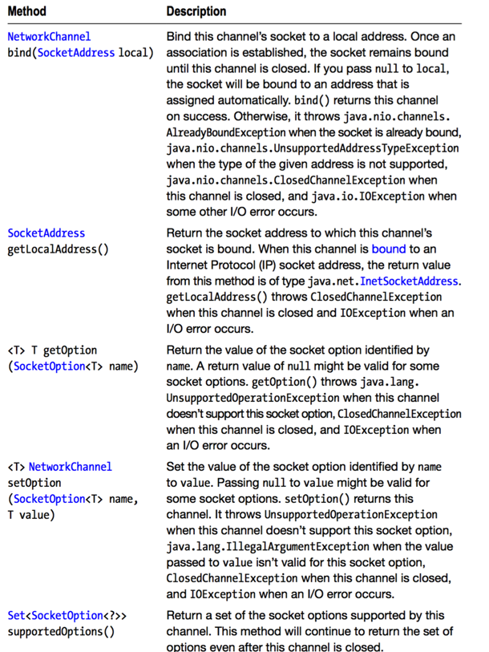

Completion of Socket Channel functionality是JDK 7对NIO.2的最后的贡献。`java.nio.channels`包的`DatagramChannel`,`ServerSocketChannel`和`SocketChannel`类被扩展以支持绑定和选项配置。基于Channel的多播也支持。这一章主要介绍这些特性。

### Binding and Option Configuration
NIO的`DatagramChannel`,`ServerSocketChannel`,`SocketChannel`类没有完全抽象一个网络socket。为了绑定channel的socket，或者get/set socket选项，你首先需要取回对等的socket,通过执行每个类的`socket()`方法。

这种socket channel和socket API的反直觉的混合的存在，因为他们没有足够的时间为JDk 1.4定义一个完全的socket channel API。JDk 7 克服了这些问题通过引入`java.nio.channels.NetworkChannel`接口。

`NetworkChannel`代表了一个到网络socket的channel。这个接口被`DatagramChannel`,`ServerSocketChannel`,`SocketChannel`,`java.nio.channels.AsynchronousServerSocketChannel`和`java.nio.channels.AsynchronousSocketChannel`实现。

下面是`NetworkChannel`的API：



传递给`getOption()`和`setOption()`的参数必须是`java.net.SocketOption`接口类型。JDK 7 增加了`java.net.StandardSocketOption`类，它实现了这个接口，枚举了各种SocketOption常量，比如：`SO_RCVBUF`(socket receive buffer 的大小)和TCP_NODELAY（禁用纳格算法 nagle）。

实现`NetworkChannel`的类并不支持`StandardSocketOption`中所有的选项。比如，`ServerSocketChannel`只支持`SO_RCVBUF`和`SO_REUSEADDR`.通过`supportedOptions()`获取支持的option。

提供了`NetworkChannel`，JDK 7 在`DatagramChannel`,`ServerSocketChannel`,`SocketChannel`中加入了几个有用的方法：

+ `DatagramChannel`增加了一个`SocketAddress getRemoteAddress()`的方法，它返回channel socket连接到的远程地址。
+ `ServerSocketChannel`增加了一个`ServerSocketChannel bind(SocketAddress local,int backlog)`的方法，它让你可以指定待处理connection的最大数。
+ `SocketChannel`增加了`SocketChannel shutdownInput()`和`SocketChannel shutdownOutput()`方法，它可以shutdown read/write 连接，而不会关闭channel。

下面代码说明了改进了的ServerSocketChannel:

````
public static void main(String[] args) throws IOException {
    System.out.println("Starting server...");
    ServerSocketChannel ssc = ServerSocketChannel.open();
    ssc.bind(new InetSocketAddress(9999));
    ssc.configureBlocking(false);
    String msg = "Local address: " + ssc.getLocalAddress();
    ByteBuffer buffer = ByteBuffer.wrap(msg.getBytes());
    while (true) {
        System.out.print(".");
        SocketChannel sc = ssc.accept();
        if (sc != null) {
            System.out.println();
            System.out.println("Received connection from " + sc.getRemoteAddress());
            buffer.rewind();
            sc.write(buffer);
            sc.close();
        } else {
            try {
                Thread.sleep(100);
            } catch (InterruptedException ie) {
                assert false; // shouldn't happen
            }
        }
    }
}
````

将`ssc.socket().bind(new InetSocketAddress(9999));`替换为`ssc.bind(new InetSocketAddress(9999));`,`ssc.socket(). getLocalSocketAddress();`替换为 `ssc.getLocalAddress();`, `sc.socket(). getRemoteSocketAddress()`替换为 `sc.getRemoteAddress()`.

下面的代码使用`supportedOptions()`获取支持的option。

````
public static void main(String[] args) {
    try {
        SocketChannel sc = SocketChannel.open();
        Set<SocketOption<?>> options = sc.supportedOptions();
        for (SocketOption<?> option : options)
            System.out.println(option);
        System.out.println(sc.getOption(StandardSocketOptions.SO_RCVBUF));
        sc.configureBlocking(false);
        InetSocketAddress addr = new InetSocketAddress("localhost", 9999);
        sc.connect(addr);
        while (!sc.finishConnect())
            System.out.println("waiting to finish connection");
        ByteBuffer buffer = ByteBuffer.allocate(200);
        while (sc.read(buffer) >= 0) {
            buffer.flip();
            while (buffer.hasRemaining())
                System.out.print((char) buffer.get());
            buffer.clear();
        }
        sc.close();
    } catch (IOException ioe) {
        System.err.println("I/O error: " + ioe.getMessage());
    }
}
````

### Channel-Based Multicasting
JDk 7引入了支持 基于channel的IP多播，它是传播IP数据报到群组的成员（零或多个主机用一个目的地址定义）。多播是互联网版本的广播。

一个群组被定义为一个D类IP地址，它是一个多播群组IPv4地址，从224.0.0.1到239.255.255.255。一个新的receiver（client）通过连接到这个group加入一个多播群组。receiver然后监听到来的数据报。

JDK 7 引入了`java.nio.channels.MulticastChannel`接口来支持多播。`MulticastChannel`继承`NetworkChannel`并且被`DatagramChannel`实现。他声明了一堆`join()`方法来加入一个群组，和一个`close()`方法来关闭channel。

receiver调用`MembershipKey join(InetAddress group, NetworkInterface ni)`方法加入一个多播群组，开始接受所有发送到这个群组的数据报。当这个方法成功，它返回一个`java.nio.channels.MembershipKey`实例作为代表群组关系的象征。

另外，receiver可以调用` MembershipKey join(InetAddress group,NetworkInterface ni, InetAddress source)`方法加入一个多播群组，并且接受来自一个特定源地址的数据报。因为群组关系是累积的，这个方法可以再次调用，使用相同的group和network interface，允许其他不同源地址的数据报发送到这个群组。

`MembershipKey`声明了几个方法：

+ `MembershipKey block(InetAddress source)`:阻塞来自给定源的多播数据报，当MembershipKey没有指定特定源并且操作系统支持源过滤。
+ `MulticastChannel channel()`:返回创建这个MembershipKey的channel
+ `void drop()`:丢弃MembershipKey
+ `InetAddress group()`:返回多播群组。
+ `boolean isValid()`:是否有效。
+ `NetworkInterface networkInterface()`:返回创建这个MembershipKey的networkInterface.
+ `InetAddress sourceAddress()`:返回源地址。
+ `MembershipKey unblock(InetAddress source)`:疏通之前阻塞（通过`block()`）的来自给定源的多播数据报。

你可以使用`MembershipKey.block()`方法执行第二种形式的源过滤。这种形式的源过滤，称为"排除模式过滤",说明如下：

`MembershipKey key = dc.join(group, nif).block(source1).block(source2);
`

一旦一个channel加入到一个群组，它用和单播(unicast)一样的方式接收数据报。当一个群组使用完，调用`drop()`来丢弃所有的Membership。在drop 所有的 Membership之后，它调用`MulticastChannel.close()`方法。

为了创建一个多播服务端或多播客户端，有三个重要的地方要记住：

+ 创建一个Datagram Channel时,指定channel将加入的多播群组的地址类型相对应的协议族。不保证一个协议族中的socket对应的channel可以加入和接收多播数据报，当多播群组的地址对应另一个协议族。例如，这取决于实现，是否一个channel是IPv6 socket可以加入一个IPv4多播群组和接收发送到这个群组的数据报。
+ 通过调用`DatagramChannel`的`DatagramChannel open(ProtocolFamily family)`创建一个Datagram channel.这个方法要求一个实现了`java.net.ProtocolFamily`接口的参数。因为`ProtocolFamily`被`java.net.StandardProtocolFamily`枚举实现，你可以传递这个枚举的`INET(IPv4)`或`INET6(IPv6)`给family。
+ channel的socket可以绑定到通配（wildcard）地址。如果socket绑定到一个具体的地址而不是通配地址，socket是否收到多播数据报取决于实现。
+ `InetSocketAddress`类声明了一个`InetSocketAddress(int port)`构造方法，它可以创建一个socket address，这个address的IP地址是通配地址，端口是指定的端口值。
+ `SO_REUSEADDR`option应该这绑定地址之前启用。这样允许群组的多个成员绑定到同一个地址。

下面代码创建了一个多播服务端和客户端应用，说明了多播。

````
public class MulticastServer {

    final static int PORT = 9999;

    public static void main(String[] args) {
        try {
            NetworkInterface ni = NetworkInterface.getByInetAddress(InetAddress.getLocalHost());

            DatagramChannel datagramChannel = DatagramChannel.
                    open(StandardProtocolFamily.INET)
                    .setOption(StandardSocketOptions.SO_REUSEADDR, true)
                    .bind(new InetSocketAddress(PORT))
                    .setOption(StandardSocketOptions.IP_MULTICAST_IF, ni);

            InetAddress group = InetAddress.getByName("239.255.0.1");

            int i = 0;
            while (true) {
                ByteBuffer bb = ByteBuffer.wrap(("line " + i).getBytes());
                datagramChannel.send(bb, new InetSocketAddress(group, PORT));
                i++;
            }

        } catch (java.io.IOException e) {
            e.printStackTrace();
        }

    }
}
````


````
public class MulticastClient {
    final static int PORT = 9999;

    public static void main(String[] args) throws Exception {
        NetworkInterface ni = NetworkInterface.getByInetAddress(InetAddress.getLocalHost());
        DatagramChannel dc = DatagramChannel.open(StandardProtocolFamily.INET)
                .setOption(StandardSocketOptions.SO_REUSEADDR, true)
                .bind(new InetSocketAddress(PORT))
                .setOption(StandardSocketOptions.IP_MULTICAST_IF, ni);

        InetAddress group = InetAddress.getByName("239.255.0.1");
        MembershipKey key = dc.join(group, ni);
        ByteBuffer response = ByteBuffer.allocate(50);
        while (true) {
            dc.receive(response);
            response.flip();
            while (response.hasRemaining())
                System.out.print((char) response.get());
            System.out.println();
            response.clear();
        }
    }

}
````
