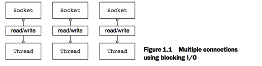
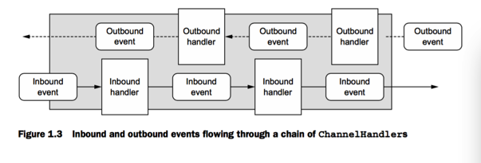

Netty是一个异步事件驱动框架。

Netty确实提供了非常丰富的网络工具库，我们将花大部分时间探索这些能力。但是Netty最终是一个框架，它的架构方法的设计原则和它的技术含量一样重要。因此我们将讨论以下几个点：

+ 事物分离(业务逻辑和网络通信解耦)
+ 模块化和重用性
+ 可测试性

在第一章，我们将从高性能网络编程的背景，特别是JDK的实现开始。这部分内容之后，我们将介绍Netty,它的主要概念，组成模块。

## 1.1 NetWorking in Java
java.net 提供了本地系统socket 库支持的阻塞方法。下面的代码是一个使用这些方法的服务端例子：

````
public static void main(String[] args) throws IOException {
        /**
         * A new ServerSocket listens for connection requests on the specified port.
         */
        ServerSocket serverSocket = new ServerSocket(9090);
        /**
         * accept() call blocks until a connection is established.
         */
        Socket clientSocket = serverSocket.accept();
        /**
         * Stream objects are derived from those of the Socket.
         */
        BufferedReader in = new BufferedReader(
                new InputStreamReader(clientSocket.getInputStream()));
        PrintWriter out =
                new PrintWriter(clientSocket.getOutputStream(), true);


        String request, response;
        while ((request = in.readLine()) != null) {
            //processing loop begin
            if ("Done".equals(request)) {
                break;
            }
            response = processRequest(request);
            out.println(response);
        }
    }
````

这些代码将一次只能处理一个连接。想管理多个并发的客户端，你需要为每一个新的客户端Socket分配一个新的Thread.如图1-1所示：



让我们考虑一下这种方法的可能后果。第一，在任何时候，可能有很多线程是休眠的，仅仅等待输入或输出数据出现。这似乎是一种资源浪费。第二，每一个线程需要分配栈内存，栈内存的默认大小从64 KB到1 MB不等，取决于OS。第三，即使JVM支持大量的线程，上下文切换的开销也会在线程达到极限时变得棘手，比如说当线程数达到10000。

### 1.1.1 Java NIO
除了上述1.1中的阻塞系统调用，本地socket库很早就包含了非阻塞的调用，它提供了很多对于网络资源利用的控制。

### 1.1.2 Selectors

## 1.2 Introducing Netty
## 1.3 Netty 核心组件
+ Channels
+ Callbacks
+ Futures
+ Events and Handlers

这些构成块代表了不同种类的构造： resources,logic, and notifications.

### Channels
Channel 是Java NIO中的一个基本构成。它表示：一个打开的、到一个实体，比如一个硬件设备，一个文件，一个网络socket的连接。

你可以把`Channel`想象成一个输入和输出的数据的方式。它可以打开，关闭，连接和断开连接。

### Callbacks
`callback`仅仅是一个方法，它的引用被提供给另一个方法。这使得后者在一个合适的时间可以调用前者。

Netty在内部使用callbacks处理事件。

### Futures
Future提供了另一种方式通知应用当一个操作完成时。这个对象是一个异步操作结果的placeholder。它将在将来的某个点完成，并且提供对结果的访问。

JDK提供了接口`java.util.concurrent.Future`，但是提供的实现只允许你自己检查操作是否完成或者阻塞直到它完成。这很笨重，所以Netty提供了自己的实现，ChannelFuture,用于一个异步操作执行时。

`ChannelFuture`提供了额外的方法允许我们注册一个或多个ChannelFutureListener 实例。Listener的callback方法，`operationComplete()`，在操作完成时调用。然后Listener可以确定操作是否成功完成或是发生异常。简短的说，`ChannelFutureListener`提供的通知机制消除了手动检查操作是否完成的需要。

每一个Netty的向外的I/O操作都返回一个ChannelFuture，所以他们都不是阻塞的。

### Events and handlers
Netty使用不同的事件通知我们操作的状态的改变。这允许我们基于发生的事件触发合适的操作。这些操作可能包括：

+ 记日志
+ 数据传输
+ 流程控制
+ 应用逻辑

Netty是一个网络框架，所以事件被他们关联的传入数据流或传出数据流概括。inbound事件可能被传入数据触发，或者一个相关的状态改变，包括：

+ 主动的连接，或者失去连接(active or inactive connections)
+ 数据读取
+ 用户事件
+ 异常事件

一个outBound/传出事件是一个操作的结果，它可能在将来触发一个操作，可能是：

+ 打开或关闭远程的连接
+ 写入或刷入数据到socket

每一个事件都可以分发到handler 类的一个用户实现的方法。



Netty的`ChannelHandler`提供了图1-3中的handler的基本的抽象。

Netty的异步编程模型是建立在Future和callback上的，分发事件到handler 方法。

### Selectors,Events,and Event loop
Netty 抽象了从应用中抽象了Selector，通过发起事件，消除了所有手写的分发代码。一个EventLoop被分配给每一个Channel来处理所有的事件，包括：

+ 注册感兴趣的事件
+ 分发事件到ChannelHandler
+ 安排进一步的处理

EventLoop被一个线程驱动来处理一个channel上的所有的I/O事件，并且在EventLoop的生命周期中不会改变。


+ ChannelHandler 在不同种类的事件执行
+ 应用实现或继承ChannelHandler来钩进事件的生命周期，并且提供自己的应用逻辑。
+

Transports 层:Transports层提供端到端或者主机到主机的交流。

Server 端：
当一个连接（connection）被accept,一个新的child channel将会被创建，ChannelInitializer 会把 你指定的ChannelHandler的实例加到 channel的ChannelPipeline.

channelActive():在到服务端的连接被建立后调用
channelRead0():当从服务端收到消息时被调用
