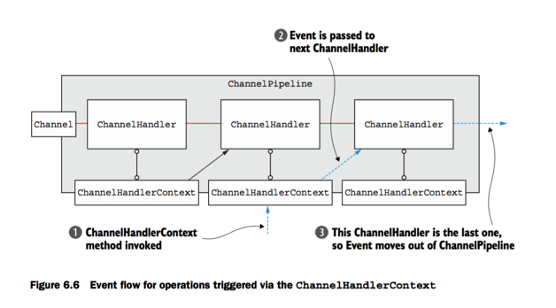

## Channel,EventLoop,and ChannelFuture

+ Channel---Sockets
+ EventLoop---控制流，多线程，并发
+ ChannelFuture---异步通知

### EventLoop
EventLoop定义了Netty对处理事件的核心抽象。

Channels,EventLoops,Threads,和EventLoopGroups之间的关系是：
+ 一个EventLoopGroup包含一个或多个EventLoop
+ 一个EventLoop在它的生命周期中被绑定到一个线程
+ EventLoop处理的所有I/O事件是在它的绑定的线程上处理
+ 一个Channel在它的生命周期中注册到一个EventLoop.
+ 一个EventLoop可以被分配给一个或多个Channel


### ChannelFuture
Netty里所有的I/O操作都是异步的。因为一个操作可能不会立即返回，我们需要一种方法来确定它的结果。为了这个目的，Netty 提供了ChannelFuture,它的`addListener()`方法注册一个`ChannelFutureListener`，当操作完成时被通知。

当一个ChannelHandler被加入到ChannelPipeline,它被分配了一个ChannelHandlerContext,这个ChannelHandlerContext表示了一个ChannelHandler和ChannelPipeline的绑定关系。ChannelHandlerContext可以用于获取底层的Channel,主要用来写入outBound数据。

## 4.Transport

**Netty的Channel实现是线程安全的，所以你可以保存一个Channel的引用，并且当你想写数据到远程时可以使用，即使是在多个线程在使用。（RocketMQ就是这样做的）**。

````
final Channel channel = ...
//Creates a ByteBuf that holds data to write
final ByteBuf buf = Unpooled.copiedBuffer("your data",
     CharsetUtil.UTF_8).retain();
//Creates Runnable, which writes data to channel
Runnable writer = new Runnable() {
    @Override
    public void run() {
        channel.write(buf.duplicate());
    }
   };
//Obtains reference to the thread pool Executor
Executor executor = Executors.newCachedThreadPool();

 // write in one thread
executor.execute(writer);
// write in another thread
executor.execute(writer);
...
````

Netty提供的Transports

| 名字     | 包    |     描述     |
| :------------- | :------------- | :------- |
|   NIO    | io.netty.channel.socket.nio       |  使用 java.nio.channels包为基础，一个基于Selector的方法        |
|  EPoll     | io.netty.channel.epoll       | 使用JNI来提供epoll() 和 非阻塞的IO，这个Transport只支持Linux可用的特性，比如 SO_REUSEPORT,并且比NIO Transport快，并且也是完全非阻塞的        |
|    OIO   |    io.netty.channel.socket.oio    |   使用java.net包为基础，并且使用阻塞流       |
|  Local     | io.netty.channel.local       | 一个本地的Transport 可以用来通过VM中的Pipe交流         |
|   Embedded    | io.netty.channel.embedded        | 测试使用         |


### NIO
NIO为I/O操作提供了一个完全异步的实现。它使用基于selector的API。Selector作为一个注册中心，当channel的状态改变时，你可以要求得到注册中心的通知。


### Zero-Copy
零拷贝只在NIO和epoll Transport中可用。它允许你快速有效的从一个文件系统移动数据到网络，而不用从内核空间到用户空间拷贝。这个特性并不是在所有的操作系统上都支持。只有一个文件的原始内容可以传递，所以它不支持加密或压缩的文件系统。

### Epoll
epoll提供了比旧的 POSIX 的select和poll系统调用更好的性能。并且比JDK的nio实现更快。

要使用Epoll，只需将`NioEventLoopGroup`换成`EpollEventLoopGroup`,将`NioServerSocketChannel.class`换成`EpollServerSocketChannel.class`

### 在一个JVM里交流的本地Transport
Netty提供了一个本地Transport用于运行在同一个JVM里的client和server的异步交流。

在这个Transport里，一个ServerChannel的`SocketAddress`不是和一个物理地址绑定，它是存储在一个注册中心，一旦Server运行，并且当Channel关闭时取消注册。因为这个Transport没有接收真实的网络请求，所以它不能和其他的Transport实现互相操作。因此，如果一个客户端希望连接到同一个JVM里的Server，可以使用这个Transport。

## 5.ByteBuf
ByteBuf API的优势：

+ 可以扩展为用户定义的 buffer 类型
+ 透明的零拷贝可以通过内建的复合buffer 类实现
+ 容量可以根据要求扩展
+ reader mode 和 writer mode的切换不需要调用ByteBuffer的flip方法
+ 读和写有不同的索引
+ 支持方法链
+ 支持引用统计
+ 支持池

ByteBuf包括两个索引，readerIndex和writerIndex，当你从一个ByteBuf中读取数据，readerIndex增长；同样的，当你写入数据到一个ByteBuf，它的writerIndex增长。

### ByteBuf用法
1. Heap  buffer

2. Direct buffer
Direct buffer分配更加昂贵，释放也更加昂贵。

3. CompositeByteBuf

4. 可读的 bytes
一个新分配的ByteBuf的readerIndex为0，任何一read和skip开头的操作将会增加readerIndex。
5. 索引管理
markReaderIndex(),markWriterIndex(),resetReaderIndex(),resetWriterIndex().

readerIndex(int)

writerIndex(int)

6. read/write操作
有两种read/write操作：

+ `get(int)`和`set(int)`，有index为参数的，不会改变index。
+ `read()`和`write()`会改变index。

### ByteBuf 分配

## 6.ChannelHandler and ChannelPipeline
1. 释放ByteBuf资源。
ReferenceCountUtil.release(msg).

ChannelHandlerContext 让一个ChannelHandler可以和它的ChannelPipeline交流，也可以和其他的ChannelHandler交流。

正常情况下，ChannelPipeline里的每一个ChannelHandler处理EventLoop传递过来的事件，不要阻塞这个线程很重要，因为可能会对整体的I/O处理有负面的影响。

+ ChannelPipeline保存了一个Channel关联的ChannelHandler。
+ ChannelPipeline可以动态的添加或移除ChannelHandler
+ ChannelPipeline 可以处理inbound和outBound事件。

ChannelHandlerContext 表示一个ChannelHandler和一个ChannelPipeline的关联，当一个ChannelHandler添加到一个ChannelPipeline时，创建ChannelHandlerContext。

ChannelHandlerContext的主要功能是： 让一个ChannelHandler可以和它的ChannelPipeline交流，也可以和其他的ChannelHandler交流。

ChannelHandlerContext有很多方法，有些方法Channel和ChannelPipeline也有，但是有重要的区别。如果你在Channel或ChannelPipeline的实例上执行这些方法，他们会在整个pipeline里传播，但是如果你在ChannelHandlerContext对象上执行的话，他们只会传递到下一个可以处理这个事件的ChannelHandler.

+ ChannelHandlerContext关联的ChannelHandler不会改变，所以缓存一个引用是安全的。
+ ChannelHandlerContext有很多方法，有些方法Channel和ChannelPipeline也有，但是有重要的区别。如果你在Channel或ChannelPipeline的实例上执行这些方法，他们会在整个pipeline里传播，但是如果你在ChannelHandlerContext对象上执行的话，他们只会传递到下一个可以处理这个事件的ChannelHandler.

Channel，ChannelPipeline,ChannelHandler和ChannelHandlerContext的关系：


如下图所示：虽然事件是通过Channel和ChannelPipeline在pipeline里传递，但是从一个ChannelHandler传递到另一个ChannelHandler的动作却是通过ChannelHandlerContext.


为什么你会想在ChannelPipeline里的某个特殊的点开始传递事件，因为：

+ 减少传递给不感兴趣的ChannelHandler的损失。
+ 阻止可能对这个事件感兴趣的ChannelHandler的处理。

这是你就可以使用ChannelHandlerContext处理事件。

````
//Gets a reference to a ChannelHandlerContext
ChannelHandlerContext ctx = ..;
ctx.write(Unpooled.copiedBuffer("Netty in Action", CharsetUtil.UTF_8));
````

如6-6所示：



ChannelHandler和ChannelHandlerContext的高级用法：
正如上图6-6所示，你可以执行ChannelHandlerContext的pipeline方法，获取它附属的ChannelPipeline的引用。这样可以在运行时，动态的操纵pipeline的ChannelHandler，这样可以实现一些高级功能，例如，你可以增加一个ChannelHandler来支持动态的协议改变。

另一个高级用法是，你可以保存一个ChannelHandlerContext的引用，之后在使用，可以不在任何的ChannelHandler的方法中，甚至可以在一个不同的线程。

一下代码展示了这种用法：

````
public class WriteHandler extends ChannelHandlerAdapter {
    private ChannelHandlerContext ctx;
    @Override
    public void handlerAdded(ChannelHandlerContext ctx) {
      //Stores reference to ChannelHandler- Context for later use
        this.ctx = ctx;
    }
    public void send(String msg) {
      //Sends message using previously stored ChannelHandlerContext
        ctx.writeAndFlush(msg);
} }
````

因为一个ChannelHandler可以属于多个ChannelPipeline,所以它可能绑定到了多个ChannelHandlerContext实例。如果你想这样做，你要把ChannelHandler申明为`@Sharable`，否则，将它绑定到多个ChannelPipeline将会发生异常。想要在多线程并发Channel中使用，这样的ChannelHandler必须是线程安全的（无状态）


### ChannelPromise
通过调用ChannelPromise的setSuccess()和setFailure()方法，你可以使得这个操作的状态在ChannelHandler方法返回时，被调用者通知。

## 7. EventLoop 和 线程模型
### 线程模型概览
一个基本的线程池模式是这样的：
+ 从线程池的空闲列表中取出一个线程，分配去运行一个已经提交的任务。
+ 当任务完成，线程回到线程池的空闲列表，可以重新使用

池和重用线程对于为每一个文物创建和销毁线程是一个提升，但是它并没有消除上下文切换的开销，当线程数量增加是这种开销是很明显的，在重负载下可能是致命的。

EventLoop的继承体系：


一个EventLoop被一个线程支持，并且任务(Runnable,Callable)可以直接提交到EventLoop实现来立即执行或定时执行。一个EventLoop可能服务多个Channel。

Event和任务是按照先入先出的顺序执行的。这消除了数据冲突的可能性，通过保证字节内容按正确的顺序处理。

在Netty里所有的I/O操作和事件都是被分配给EventLoop的线程处理的。

Netty 4中通过使用EventLoop处理channel的所有的I/O操作和事件，消除了线程切换和ChannelHandler中的同步。

### 线程管理
Netty的高性能取决于当前执行线程是否是分配给当前Channel和它的EventLoop的这个线程。（EventLoop在channel的生命周期中负责处理所有的事件）。

如果调用的线程是EventLoop的线程，那么这个代码块被执行，否则，EventLoop计划这个任务稍后执行，并且将任务放入它的内部队列。当EventLoop下次处理它的事件，它将执行队列中的任务。这就保证了任务只能被EventLoop的线程执行。

如下图所示：


记住，每一个EventLoop有它自己的任务队列，独立与其他的EventLoop。

我们之前说过，不要阻塞当前的I/O线程。现在再说一遍：永远不要讲一个长时间允许的任务放入执行队列，因为它将阻塞同一线程的任务队列中的其他任务的运行。

如果你一定要执行一个长时间运行的任务或阻塞调用，我们建议你使用一个专门的EventExecutor().

### EventLoop/线程分配
EventLoop被包含在一个EventLoopGroup里面。EventLoop的创建和分配因Transport而异。

1. 异步Transport
异步实现使用很少的EventLoop，并且在当前的模型里，它们可以在Channel间共享。这允许最少的线程服务很多Channel，而不是一个channel一个线程。

图7-4，展示了一个有固定三个EventLoop的EventLoopGroup，这些EventLoop在EventLoopGroup创建时分配，确保它们在需要时可用。

EventLoopGroup负责分配一个EventLoop给每一个新创建的Channel.在当期的实现中，使用round-robin来达到一个平衡的分布，并且同样的EventLoop可以被分配给多个Channel。


同时要注意EventLoop中的ThreadLocal，因为一个EventLoop可能被分配给多个Channel,多个关联的Channel中的ThreadLocal是一样的。

2. 阻塞Transport


这确保了每一个Channel的I/O事件只被一个Thread处理。

## 8.Bootstrapping


### Bootstrap 类
Bootstrap类的继承体系如上图所示。

一个server 用一个父channel接收来自客户端的连接，并且创造子channel与客户端交流。然而，一个client只需要一个channel来处理所有的网络互动。

> 为什么Bootstrap是cloneable？
因为有时候你需要创建多个有相同或一样配置的channel。为了支持这种模式，而不用创建一个新的Bootstrap实例，并且配置每一个channel,abstractBootstrap是cloneable。

1. Bootstrap 类用于客户端或者使用无连接协议的应用。


## 10. the Codec framework

## 11. Provided ChannelHandlers and Codec
空闲的连接:IdleStateHandler
当一个连接空闲太长时间就触发`IdleStateEvent`事件。你可以处理`IdleStateEvent`通过重写ChannelInboundHandler的`userEventTriggerd()`方法。

````
public class IdleStateInitialzier extends ChannelInitializer<Channel>{

    @Override
    protected void initChannel(Channel ch) throws Exception {
        ChannelPipeline pipeline = ch.pipeline();
        pipeline.addLast(new IdleStateHandler(0,0,60, TimeUnit.SECONDS));
        pipeline.addLast(new HeartBeatHandler());
    }

    private static final class HeartBeatHandler extends ChannelInboundHandlerAdapter{

        private static final ByteBuf HEARTBEAT_SEQUENCE =
                Unpooled.unreleasableBuffer(Unpooled.copiedBuffer(
                        "HEARTBEAT", CharsetUtil.ISO_8859_1));

        @Override
        public void userEventTriggered(ChannelHandlerContext ctx, Object evt) throws Exception {
            if (evt instanceof IdleStateEvent){
                    ctx.writeAndFlush(HEARTBEAT_SEQUENCE.duplicate())
                            .addListener(ChannelFutureListener.CLOSE_ON_FAILURE);
            }else {
                super.userEventTriggered(ctx, evt);
            }

        }
    }
 }
 ````

 写大文件：

 ````
 //Creates a FileInputStream
FileInputStream in = new FileInputStream(file);
//Creates a new Default- FileRegion for the full length of the file
FileRegion region = new DefaultFileRegion(
    in.getChannel(), 0, file.length());
    //Sends the DefaultFile- Region and registers a ChannelFutureListener
channel.writeAndFlush(region).addListener(
  new ChannelFutureListener() {
  @Override
  public void operationComplete(ChannelFuture future)
  throws Exception {
  if (!future.isSuccess()) {
    //Handles failure
      Throwable cause = future.cause();
      // Do something
  }
       });
````
