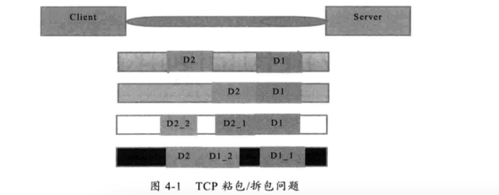

在上一篇文章[从零开始实现RPC-(1)基本原理](https://github.com/HeyMoon/rpc-note/blob/master/rpc%E5%8E%9F%E7%90%86/%E4%BB%8E%E9%9B%B6%E5%BC%80%E5%A7%8B%E5%AE%9E%E7%8E%B0RPC-(1)%E5%9F%BA%E6%9C%AC%E5%8E%9F%E7%90%86.md)中，我们介绍了RPC的步骤，以及提出了实现RPC要解决的一些问题。现在我们实现一个RPC框架最基本的功能：客户端调用服务端的服务。
实现的代码已经上传至github([项目链接](https://github.com/HeyMoon/alice)),下面有说的不明白的地方可以去看完整的代码。

比如服务端有这样的一个服务：

````
public interface SimpleService {
    Person echo(Person o);
}
````

客户端希望调用它就像调用本地服务一样,如下所示：

````
public class SomeService {

    @Resource
    private SimpleService simpleService;

    public void doSomething(){
        simpleService.echo(p);
    }
}
````

这里注入的`simpleService`并不是服务端的`SimpleService`的实现类，因为它的实现类并不在客户端，这个bean只是实现了`SimpleService`接口的代理类。在调用时，它将远程过程调用的参数打包，序列化，发送给服务端，它相当于`client stub`。

Java中的代理有两种方式：
+ Jdk动态代理
+ 字节码生成
尽管字节码生成方式实现的代理更加强大和高效，但代码不易维护，所以我们选择JDK动态代理。

`Object proxy = Proxy.newProxyInstance(classloader,interfaceList,invocationHandler);`

我们可以在代理类的`invoke`方法中封装与远程服务通信的细节:

````
public class InvokeInvocationHandler implements InvocationHandler {

    @Override
    public Object invoke(Object proxy, Method method, Object[] args) throws Throwable {
        ...
        //网络通信和接收
        RemoteResponse response = client.send(request,1000);
        ...
        return response.getResponseValue();
    }
}
````

这里的`invoke`方法参数中，`proxy`就是之前的`Proxy.newProxyInstance`返回的代理对象。`method`就是调用的方法，`args`就是传递给`method`方法的参数。这样就得到了一个`SimpleService`的代理类，这个类的任何方法调用都会传递给`InvokeInvocationHandler`来处理。实际中，我们可能只想代理`SimpleService`的声明的方法，而不想代理`toString()`,`hashCode()`等`Object`类的方法，所以我们在实际应用中可以过滤一下。

让Spring管理代理类的生命周期

代理类需要Spring来管理其生命周期，才能完成代理类的注入。定义代理类的Bean：

````
<bean id="simpleService" class="com.dyh.alice.client.proxy.ServiceProxyBeanFactory" factory-method="getService">
        <constructor-arg value="com.dyh.alice.server.api.SimpleService"/>
    </bean>
````

`ServiceProxyBeanFactory`是代理的工厂类，`getService`是静态工厂方法，生成代理bean的参数，目前为止，只需要一个类的全名：

````
public class ServiceProxyBeanFactory {

    public static Object getService(String serviceName) throws ClassNotFoundException {
        Class<?> clazz = Class.forName(serviceName);
        Class<?>[] classes = new Class[]{clazz};
        return JdkProxyFactory.getProxy(serviceName, classes);
    }

}
````

这样就可以通过Spring来管理代理类了。

> 在实际应用中，你可能并不会使用这种方式来获取bean。实际应用中你可能想借助spring container中的InitializingBean,BeanPostProcessor接口。

再一次说明，当我们调用`SimpleService.echo()`方法时，就会被`InvokeInvocationHandler`的`invoke()`方法拦截。我们可以把网络发送和接收报文的代码放在这里。`InvokeInvocationHandler`就充当了`client stub`的角色。

那么问题来了，如何传递参数，如何表示数据，消息的数据结构，使用哪种传输协议呢？一个一个来解决。

1. 如何传递参数。我们选择值传递。
2. 客户端和服务端通信中要传递那些数据呢？  

  首先我们需要传递哪些数据给服务端呢？
  + 接口名称。接口名称肯定要传，不传的话服务端就不知道调用哪个接口。
  + 方法名。
  + 方法参数。
  + 超时时间。
  + requestId。

  那么，服务端要返回哪些数据给客户端呢？
  + 返回值
  + requestId
  + 状态码
  
3. 如何表示数据。我们打算使用Binary而不是XML。如何将数据序列化为Binary？如何反序列化？业界有很多成熟的序列化框架：hessian,protocol buffers,thrift等。选择哪个序列化方案主要要考虑序列化的速度，以及序列化后生成的byte的大小，以及对多语言的支持。因为每一个调用远程过程都要序列化，所以序列化的速度对远程过程调用影响很大。此外如果序列化后生成的byte小一些，在网络传输中就可以传输更少的报文，可以提高调用的响应速度。  
4. 使用哪种传输协议？TCP。

然后，我们来实现网络发送和接收的代码。

我们先定义几个类：
`Request`封装了客户端发送给服务端的请求信息。

````
public class Request implements Serializable{
    private static final long serialVersionUID = -5526644926486323305L;
    private String version;
    private static final AtomicLong INVOKE_ID = new AtomicLong(0);
    private long id;
    private boolean twoWay = true;
    private Object  data;

    public Request(){
        id = newId();
    }

    private long newId() {
        return INVOKE_ID.getAndIncrement();
    }
}
````    

序列化框架，我们选择hessian:

````
public class HessianSerializer {

    public static byte[] encoder(Object o) throws IOException {
        ByteArrayOutputStream bos = new ByteArrayOutputStream();
        Hessian2Output out = new Hessian2Output(bos);
        out.writeObject(o);
        out.close();
        return bos.toByteArray();
    }

    public static Object decoder(byte[] bytes) throws IOException {
        ByteArrayInputStream bis = new ByteArrayInputStream(bytes);
        Hessian2Input in = new Hessian2Input(bis);
        return in.readObject();
    }

    public static void main(String[] args) throws IOException {
        /*RemoteRequest message = new RemoteRequest();
        System.out.print(decoder(encoder(message)));*/
    }

}
````

下面要处理通信细节了。
在Java中我们可以使用Java NIO或NIO.2 提供的socket channel API，自己编写通信代码，处理细节，但这种方式较为复杂，而且可能有隐藏Bug（比如NIO的poll），一般不推荐这种方式。这里我使用Netty这个Java NIO 通信框架。

通信协议是什么或者说协议的格式是什么？

在这里我使用的通信协议很简单，协议格式： <length><body data>
其中length为4个字节，表明后面的body data的大小，body data为序列化后的数据。这种格式还能解决TCP粘包/拆包问题。

所以`NettyClient`的代码如下所示：

````
public class NettyClient {

    public void request(final Request request) throws TimeoutException, ExecutionException {
        EventLoopGroup group  = new NioEventLoopGroup();
        try {
            Bootstrap bootstrap = new Bootstrap();
            bootstrap.group(group)
                    .channel(NioSocketChannel.class)
                    .handler(new ChannelInitializer<SocketChannel>() {
                        @Override
                        protected void initChannel(SocketChannel ch) throws Exception {
                            ChannelPipeline pl = ch.pipeline();
                            pl.addLast(
                                    new HessianPojoEncoder(),
                                    new HessianPojoDecoder(),
                                    new NettyClientHandler(request));
                        }
                    });
            try {
                ChannelFuture channelFuture = bootstrap.connect(host,port).sync();
                channelFuture.channel().closeFuture().sync();
            } catch (InterruptedException e) {
                Thread.currentThread().interrupt();
            }

        }finally {
            group.shutdownGracefully();
        }
    }

    public RemoteResponse send(Object obj,int timeout) throws Exception {
        Request request = new Request();
        request.setData(obj);
        request.setTwoWay(true);
        request.setVersion("0.0.1");
        DefaultFuture future = new DefaultFuture(request,1000);
        request(request);
        return (RemoteResponse) future.get();
    }

}
````

`HessianPojoDecoder`的代码如下：

````
import com.dyh.alice.common.serializer.HessianSerializer;
import io.netty.buffer.ByteBuf;
import io.netty.channel.ChannelHandlerContext;
import io.netty.handler.codec.ByteToMessageDecoder;

import java.util.List;

/**
 * Created by dyh on 2016/6/6.
 */
public class HessianPojoDecoder extends ByteToMessageDecoder {

    /**
     * 每当有新字节接收到时，decode就会被调用
     *
     * @param ctx
     * @param in
     * @param out
     * @throws Exception
     */
    @Override
    protected void decode(ChannelHandlerContext ctx, ByteBuf in, List<Object> out) throws Exception {
        //接收到的字节还不足一个int，即写入数据的总长度，先不处理
        if (in.readableBytes() < 4) {
            return;
        }
        //此时收到的字节达到4个字节，提取一个int，即期望接收的数据总长度
        int datalength = in.readInt();
        //如果数据总长度<=0,则不再接收数据
        if (datalength <= 0) {
            ctx.close();
        }

        //接收的字节流除去int剩余的字节长度还未达到期望的长度，表示数据未接收完整
        in.markReaderIndex();
        if (in.readableBytes() < datalength) {
            in.resetReaderIndex();
        }

        //长度达到了，已经足够，读取出完整的数据
        byte[] data = new byte[datalength];
        in.readBytes(data);

        Object msg = HessianSerializer.decoder(data);
        out.add(msg);
    }
}
````

关于TCP粘包/拆包

TCP协议是一个面向流的协议，所谓流，就是没有界限的一串数据。大家可以想象河里的流水，是连成一片的，其间并没有分割线。TCP底层并不了解上层业务数据的具体含义，它会根据TCP缓冲区的实际情况进行包的划分，所以在业务上认为，一个完整的包可能会被TCP拆分为多个包进行发送，也有可能把多个小的包封装成一个大的数据包发送，这就是所谓的TCP粘包和拆包问题。

TCP粘包/拆包问题说明

我们可以通过图解对TCP粘包和拆包问题进行说明，粘包问题示例如下：



假设客户端分别发送了两个数据包，D1和D2给服务端，由于服务端一次读取到的字节数是不确定的，所以存在以下4种情况：

1. 服务端分两次读取到了两个独立的数据包，分别是D1和D2，没有粘包和拆包。
2. 服务端一次接收到了两个数据包，D1和D2粘在一起，称为TCP粘包。
3. 服务端分两个读取到了两个数据包，第一次读取到了完整的D1包和D2包的部分内容，第二次读取到了D2包剩余内容，这被称为TCP拆包。
4. 服务端分两个读取到了两个数据包，第一次读取到了D1部分内容，第二次读取到了D1包剩余内容和完整的D2包。

粘包问题的解决策略：

1. 消息定长，例如每个报文固定为200个字节，如果不够，空位补空格
2. 在包尾增加回车换行符进行分割，例如FTP协议
3. 将消息分为消息头和消息体，消息头包含表示消息长度(或消息体长度)的字段，通常设计思路为消息头的第一个字段使用int32 来表示消息的总长度。（本实现中使用这种方式）
4. 更复杂的协议

来源：[Netty 权威指南，第四章](https://book.douban.com/subject/25897245/)


`HessianPojoEncoder`的代码如下：

````
import com.dyh.alice.common.serializer.HessianSerializer;
import io.netty.buffer.ByteBuf;
import io.netty.channel.ChannelHandlerContext;
import io.netty.handler.codec.MessageToByteEncoder;

/**
 * Created by dyh on 2016/6/6.
 */
public class HessianPojoEncoder extends MessageToByteEncoder<Object> {

    @Override
    protected void encode(ChannelHandlerContext ctx, Object msg, ByteBuf out) throws Exception {
        byte[] bytes = HessianSerializer.encoder(msg);
        out.writeInt(bytes.length);
        out.writeBytes(bytes);
    }
}
````

`NettyClientHandler`的代码如下：

````
import com.dyh.alice.common.DefaultFuture;
import com.dyh.alice.common.RemoteResponse;
import com.dyh.alice.common.Request;
import io.netty.channel.ChannelHandlerContext;
import io.netty.channel.ChannelInboundHandlerAdapter;

/**
 * Created by dyh on 2016/6/17.
 */
public class NettyClientHandler extends ChannelInboundHandlerAdapter {
    private Request request;

    public NettyClientHandler(Request request) {
        this.request = request;
    }


    @Override
    public void channelActive(ChannelHandlerContext ctx) {
        ctx.writeAndFlush(request);
    }

    @Override
    public void channelRead(ChannelHandlerContext ctx, Object msg) {
        DefaultFuture.received((RemoteResponse) msg);
    }

    @Override
    public void exceptionCaught(ChannelHandlerContext ctx, Throwable cause) {
        cause.printStackTrace();
        ctx.close();
    }
}
````

接下来有又一个问题了，我们如何知道远程服务位于哪个机器和端口？

当然，你可以在客户端写死每个服务的地址和端口，但是当远程服务地址变更时，客户端地址也要改变。更重要的是，当远程服务不可用时，客户端不会知道。所以这种方式并不可取。我们需要的是一个服务注册中心，管理提供服务的Server列表。在有新服务加入时、服务不可用时，注册中心可以更新列表。注册中心还应该可以检测一个服务的心跳来判断一个服务可不可用。更重要的是，服务注册中心还应该保证高可用性，不能因为一台机器宕机，导致服务注册中心不可用，所以服务还需要集群支持。我们可以选择Zookeeper来实现。

另外，如果每次远程调用都访问服务注册中心，无疑会增加远程调用的耗时。所以客户端也可以维护一份服务Server列表，在启动时，访问注册中心初始化，当注册中心列表变化时接收通知同步修改，这样就不用每次调用都访问服务注册中心。

另外，还有一个问题，如果远程服务有多台机，那么如何选择调用哪台机上的服务呢？

我们需要一个负载均衡机制，它可以帮助我们选择调用远程的服务地址。当远程机器上一台机过于忙碌时，可以将调用分发到其他的相对不忙碌的机器。

在本次demo中，我并不打算实现这些功能，而是选择将服务端地址写死的方式。

好了现在我们已经发出了网络报文。Server端要如何接收呢？

Server端先启动Netty，注册服务。好像有点问题，Server端是先启动netty，还是先到服务注册中心注册服务呢？

如果到服务注册中心注册服务了而netty还没有启动，但是此时服务调用进来了，这时就会发生异常。所以我们应该先启动netty，后注册服务。

RemoteServiceBean中有两个参数，serviceName即之前和客户端统一的服务接口类的全名，serviceImpl即服务接口对应的服务实现类。
我们把这个映射用一个静态类的静态成员Map<String, Object>的方式维护在内存中，并且在spring加载这个bean的时候执行init方法，把当前的Impl加入Map。

````
public class RemoteServiceBean {
    private String serviceName;
    private Object serviceImpl;

    public void init() {
        Server.addService(serviceName, serviceImpl);
    }
}
````

````
public class Server {
    private static ConcurrentHashMap<String, Object> serviceImplMap = new ConcurrentHashMap<String, Object>();

    public static void addService(String serviceName, Object serviceImpl) {
        serviceImplMap.putIfAbsent(serviceName, serviceImpl);
    }
````

启动Netty服务：

````
public class Server {
    private static volatile boolean started = false;

    private static ConcurrentHashMap<String, Object> serviceImplMap = new ConcurrentHashMap<String, Object>();

    static {
        bootstrap();
    }

    public static void addService(String serviceName, Object serviceImpl) {
        serviceImplMap.putIfAbsent(serviceName, serviceImpl);
    }

    public static void bootstrap() {
        if (!started) {
            synchronized (Server.class) {
                if (!started) {
                    doStartup();
                }
            }
        }
    }

    private static void doStartup() {
        //netty bootstrap
        EventLoopGroup bossGroup = new NioEventLoopGroup();
        EventLoopGroup workerGroup = new NioEventLoopGroup();

        ServerBootstrap bootstrap = new ServerBootstrap();
        bootstrap.group(bossGroup, workerGroup)
                .channel(NioServerSocketChannel.class)
                .handler(new LoggingHandler(LogLevel.INFO))
                .childHandler(new ChannelInitializer<SocketChannel>() {
                    @Override
                    protected void initChannel(SocketChannel ch) throws Exception {
                        ch.pipeline().addLast(
                                new HessianPojoDecoder(),
                                new HessianPojoEncoder(),
                                new NettyServerHandler());
                    }
                }).option(ChannelOption.SO_BACKLOG, 128)
                .childOption(ChannelOption.SO_KEEPALIVE, true);

        try {
            ChannelFuture f = bootstrap.bind(8090).sync();
            f.addListener(new ChannelFutureListener() {
                @Override
                public void operationComplete(ChannelFuture future) throws Exception {
                    if (future.isSuccess()) {
                        started = true;
                    }
                }
            });
        } catch (InterruptedException e) {
        }
    }

    public static Object getActualServiceImpl(String serviceName) {
        if (!started) {
            bootstrap();
        }
        return serviceImplMap.get(serviceName);
    }

}
````

在Server的静态块中执行启动，当spring加载第一个RemoteServiceBean并执行其init方法时，Server.addService时JVM加载Server类，进而执行启动bootstrap流程。
除去服务端第一次启动时需要执行bootstrap之外，考虑到后续可能在某些情况下，比如初始化启动失败，在请求到来时发现服务未能启动成功而重试启动等，用volatile的started标志位加上double-check的方式对bootstrap做一个并发的控制以保证线程安全。

服务端接收到客户端的报文之后，解码，反序列化出调用接口、方法和方法参数调用相应的接口处理：

````
public class NettyServerHandler extends ChannelInboundHandlerAdapter {
    @Override
    public void channelRead(ChannelHandlerContext ctx, Object msg) throws NoSuchMethodException, InvocationTargetException, IllegalAccessException {
        if (msg instanceof Request){
            System.err.println(msg);
            Request request1 = (Request) msg;
            RemoteRequest request = (RemoteRequest) request1.getData();
            Object serviceImpl = Server.getActualServiceImpl(request.getServiceName());
            //根据request中的方法名，参数类型，参数等信息，反射调用serviceImpl
            Class<?> serviceInterface = serviceImpl.getClass();
            Method method = serviceInterface.getMethod(request.getMethodName(), request.getParameterTypes());
            //反射计算得到结果
            Object result = method.invoke(serviceImpl, request.getParameters());
            //构造response
            RemoteResponse response = new RemoteResponse();
            response.setRequestId(request1.getId());
            response.setResponseValue(result);
            //向客户端返回构造完成的response
            ctx.writeAndFlush(response).addListener(ChannelFutureListener.CLOSE);
        }else {

        }

    }

    @Override
    public void channelReadComplete(ChannelHandlerContext ctx) {
        ctx.flush();
    }

    @Override
    public void exceptionCaught(ChannelHandlerContext ctx, Throwable cause) {
        cause.printStackTrace();
        ctx.close();
    }
}
````

之后再将处理结果发送回客户端。到这里一次RPC调用就完成了。

还有一个问题，在第一篇中已经提到：当调用发生时，机器A上的这个进程挂起(suspended)，机器B上的程序执行。当B返回时，返回值传递给A，然后A继续执行。

Netty 是一个异步框架，我们使用`channel.writeAndFlush()`发送报文，这个方法调用后对于整个远程调用来说是一个异步，即对于当前线程来说，将请求发送后，线程就可以往后继续执行了，至于服务端的结果，是服务端处理完成后，在发送回客户端的，所以这里有两个问题了：

1. 如何让客户端线程suspended,等服务端处理结果返回后，再将线程唤醒继续执行。
2. 如果有多个线程同时执行远程调用，Server处理完之后，如何知道该唤醒哪个线程？

解决方法：
+ 为每一次调用生成一个唯一的ID，即之前的requestId。
+ 将requestId和DefaultFuture存放到一个全局的ConcurrentHashMap里。

````
public class DefaultFuture implements ResponseFuture{

    private static final Map<Long, DefaultFuture> FUTURES   = new ConcurrentHashMap<Long, DefaultFuture>();

    public DefaultFuture(Request request,int timeout){
        this.request = request;
        this.id = request.getId();
        this.timeout = timeout > 0 ? timeout : 1000;
        // put into waiting map.
        FUTURES.put(id, this);
    }
}
````
+ 当客户端调用`channel.writeAndFlush()`之后，执行`future.get()`方法获取服务端处理结果。

````
public RemoteResponse send(Object obj,int timeout) throws Exception {
        Request request = new Request();
        request.setData(obj);
        request.setTwoWay(true);
        request.setVersion("0.0.1");
        DefaultFuture future = new DefaultFuture(request,1000);
        request(request);
        return (RemoteResponse) future.get();
    }
````        

````
public void request(final Request request) throws TimeoutException, ExecutionException {
        EventLoopGroup group  = new NioEventLoopGroup();
        try {
            Bootstrap bootstrap = new Bootstrap();
            bootstrap.group(group)
                    .channel(NioSocketChannel.class)
                    .handler(new ChannelInitializer<SocketChannel>() {
                        @Override
                        protected void initChannel(SocketChannel ch) throws Exception {
                            ChannelPipeline pl = ch.pipeline();
                            pl.addLast(
                                    new HessianPojoEncoder(),
                                    new HessianPojoDecoder(),
                                    new NettyClientHandler(request));
                        }
                    });
            try {
                ChannelFuture channelFuture = bootstrap.connect(providerInfo.getHost(),providerInfo.getPort()).sync();
                channelFuture.channel().closeFuture().sync();
            } catch (InterruptedException e) {
                Thread.currentThread().interrupt();
            }

        }finally {
            group.shutdownGracefully();
        }
    }
````

在`future.get()`方法内，判断是否已经完成，如果没有完成则阻塞。

````
public class DefaultFuture implements ResponseFuture{

    private static final Map<Long, DefaultFuture> FUTURES   = new ConcurrentHashMap<Long, DefaultFuture>();

    // invoke id.
    private final long                            id;

    private final Request                         request;

    private final int                             timeout;

    private final Lock lock = new ReentrantLock();

    private final Condition done = lock.newCondition();

    private final long                            start = System.currentTimeMillis();

    private volatile long                         sent;

    private volatile RemoteResponse                     response;

    public DefaultFuture(Request request,int timeout){
        this.request = request;
        this.id = request.getId();
        this.timeout = timeout > 0 ? timeout : 1000;
        // put into waiting map.
        FUTURES.put(id, this);
    }

    @Override
    public Object get() throws Exception {
        return get(timeout);
    }

    @Override
    public Object get(int timeoutInMillis) throws Exception {
        if (timeoutInMillis < 0){
            timeoutInMillis = 1000;
        }

        if (!isDone()){
            long start = System.currentTimeMillis();
            lock.lock();
            try {
                while (!isDone()){
                    done.await(timeoutInMillis, TimeUnit.MILLISECONDS);
                    if (isDone() || System.currentTimeMillis() - start > timeoutInMillis){
                        break;
                    }
                }
            }catch (InterruptedException e){
                throw new Exception(e);
            }finally {
                lock.unlock();
            }
            if (!isDone()){
                throw new Exception("timeout");
            }
        }

        return returnFromResponse();
    }

    private Object returnFromResponse() {
        RemoteResponse res = response;
        if (res == null){
            throw new IllegalStateException("response cannot be null");
        }
        return res;
    }

    @Override
    public boolean isDone() {
        return response != null;
    }

}
````

+ 服务端接收到报文，处理完之后将处理结果返回客户端，客户端的`channel.channelRead()`方法中，调用`DefaultFuture.received()`方法。在received方法中取出requestId，从之前的全局ConcurrentHashMap中取出DefaultFuture对象，再获取锁设置服务端返回对象到DefaultFuture中，唤醒之前等待在get方法上的线程。

````
public class NettyClientHandler extends ChannelInboundHandlerAdapter {
  @Override
  public void channelRead(ChannelHandlerContext ctx, Object msg) {
      DefaultFuture.received((RemoteResponse) msg);
  }
}
````

````
public class DefaultFuture implements ResponseFuture{
  public static void received(RemoteResponse response){
      try {
          DefaultFuture future = FUTURES.remove(response.getRequestId());
          if (future != null){
              future.doReceived(response);
          }
      }finally {
      }

  }

  private void doReceived(RemoteResponse res) {
      lock.lock();
      try {
          response = res;
          if (done != null){
              done.signal();
          }
      }finally {
          lock.unlock();
      }
  }
}
````  

这样就完成了同步等待远程处理结果返回。
