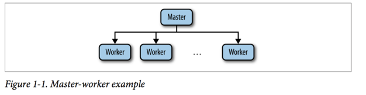

ZooKeeper可以为我们做什么？

他使得分布式系统的协同任务成为可能。一个协同任务是一个需要多个进程参与的任务。这样的任务是为了写作和控制争用的目的。合作意味着多个进程需要一起完成任务，一个进程运行使得其他的进程可以开始工作。例如，在典型的master-worker架构中，worker通知master它可以接受任务了，master因此安排任务给worker。争用和合作不同：争用指的是两个进程不能并发运行的情况，所以一个进程必须等待另一个。同样用master-worker的例子，我们只需要一个master，但是多个进程会试着成为master。这多个进程因此需要实现互斥。我们实际上可以把取得领导权的任务当做取得一个锁的任务：取得了领导权锁的进程就成为了master。

如果你已经有多线程编程的经验的话，你将会意识到有很多相似的问题。实际上，多个线程运行在同一个计算机上和多个线程运行在多个计算机上，没有任何的不同。在多线程环境下有用的同步语义，在分布式系统的环境下同样有用。但是，一个重要的不同是，在一个完全不共享的架构里，计算机除了网络外不会共享任何的东西。虽然有很多消息传送的算法实现了同步语义，依赖于一个提供了特殊有序性的共享存储的组件将会更加容易，比如Zookeeper。

协作并不总是采取leader选举和锁的同步语义的形式。

Zookeeper提供了：

1. 强一致性，有序性和耐久性保证
2. 实现典型的同步语义的能力
3. 一个更简单的方式处理并发性，这些多方面的并发性经常导致实际分布式系统中的错误的行为。

在分布式系统中的线程，有两种选择来交流：他们可以直接交换消息通过网络或者读写共享的存储。Zookeeper采取共享的存储模型让应用实现合作和同步语义。但是共享的存储需要进程和存储之间的网络通信。网络通信是分布式系统中很多并发症的来源。

在实际的系统中，我们要重点关注以下问题:

1. Message delay
消息可能任意的延迟，例如：由于网络阻塞。这种任意的延迟可能会造成不希望出现的情况。比如：进程P可能在另外一个进程Q发送消息之前已经发送了一个消息，根据一个参考时钟，但是Q的消息可能会先传送。

2. Processor Speed
操作系统调度和超载可能会引发arbitrary  delays 在消息处理中。当一个进程发送消息给另外的进程，总共的延迟大概是发送方处理消息，传输时间，接收方处理消息的总和。如果发送/接收进程需要被调度来处理消息，那么消息延迟会很高。

3. Clock Drift
处理器的时钟是不可靠的，依靠处理器的时钟可能会导致错误的决定。

以上问题的重要的结论是：在实际中很难判断是进程崩溃了还是以上的因素导致的arbitrary delay。没有收到消息可能是进程崩溃了，也可能是网络阻塞，也可能是进程处理超时，也可能是时钟抖动。

master-worker架构：

master 进程负责跟踪worker，如果worker可以接受任务，就安排任务给worker。在Zookeeper中这种结构是很有代表性的，因为他阐明了一些重要的任务，比如：选举master，跟踪可用的worker，维护应用的元数据。

为了实现master-worker系统，我们要解决三个重要的问题：

1. master crashes
如果master发生错误，不可用了，系统不能分配新的任务给失败的worker，也不能把之前的任务再分配给失败的worker。

2. worker crashes
如果一个worker崩溃了，安排给他的任务将不会完成

3. Communication failures
如果master和worker不能交换信息，那么worker可能不会知道安排给他的新任务。

为了解决这些问题，系统必须可靠的选举一个新的master如果之前的master发生错误，决定哪一个worker是可用的，决定什么时候worker的状态过期了。

### Master Failures
为了掩盖(mask)master crash，我们需要一个备用的master。当主master crash，备用的master将接管主master的角色。故障转移(fail over)不是简单的开始处理master收到的请求。新的主master必须能够恢复系统的状态到旧的主master崩溃的时候。为了恢复master的状态，我们不能依靠从出错的master拉取状态信息，因为它已经crash了。我们需要从其他地方获取。这个其他的地方就是Zookeeper。

恢复状态不是唯一重要的问题。假定主master启动了，但是备用master怀疑主master已经crash了。这个错误的怀疑可能发生，比如，因为主master严重负载了，并且它的消息可能任意的延迟。备用master将会执行所有必要的过程来接管主master的角色，并且最后可能开始执行主master的角色，成为第二个主master。更糟糕的是，如果一些worker因为网络隔断不能和主master通信，它们可能最后跟随第二个主master。这种场景导致的问题通常称为`split-brain`：系统中的两个或更多部分独立进行，导致不一致的行为。在处理master failure中，避免`split-brain`场景是很重要的。

### Worker Failures
客户端提交任务到master，master分配任务给可用的workers。Worker接收分配的任务，在任务执行后报告执行的状态。master接下来通知客户端执行的结果。

如果worker crash，所有分配给它的并且没有完成的任务都必须重新分配。master的第一个要求是具有检测worker crash的能力。当一个worker crash，master必须能够检测到，并且能够决定其他哪些worker可以执行它的任务。如果一个worker crash了，它可能导致有些任务部分执行，或执行完了但是没有报告执行结果。如果计算有副作用，对于清除这些状态，一些恢复过程可能是必须的。

### Communication Failures
如果一个worker失去了和master的连接，可能是由于网络隔墙(network partition),重新分配一个任务可能导致两个worker执行同样的任务。如果多次执行一个任务是可以接受的，我们可以重新分配而不用验证第一个worker是否已经执行这个任务了。如果是不可以接受的，那么应用必须可以接受这个可能性：多个worker可能执行这个任务了。

> Exactly Once and At-Most-Once Semantics
> 使用锁来避免任务执行多次是不够的，因为我们可能有下面一连串的事件：
> 1. Master M1 分配任务到 Worker W1
> 2. W1 获取锁来执行任务 T1，执行任务，然后释放锁
> 3. Master M1 推测W1已经crash了，重新分配任务T1到Worker W2
> 4. W2 获取锁，执行T1，然后释放锁。
这里，T1的锁并没有阻止任务执行2次。为了处理只能一次或最多一次的语义，an application relies on mechanisms that are specific to its nature.例如，如果应用数据有时间戳，并且一个任务被认为会修改应用数据，那么一个成功执行的任务可以以它修改的数据的时间戳值为条件。应用也要有回滚部分修改的能力，防止应用状态不是原子修改的情况。否则，可能导致不一致的状态。

Communication Failure的另一个主要的问题是它们对于同步语义比如锁的影响。因为节点可能crash并且系统可能network partition，锁可能会造成困难:如果一个节点crash了或者网络隔离了，锁可以阻止其他人取得进展。Zookeeper因此需要实现处理这种情景的功能。首先，它允许客户端指定一些数据在Zookeeper中的状态是`ephemeral`（短暂）的。第二，Zookeeper要求客户端周期性的通知它们还活着。如果一个客户端不能及时通知，那么所有的属于这个客户端的`ephemeral`状态的
数据被删除。

回想到我们争论，在系统中我们不能控制消息的延迟，所以不能分辨客户端延迟了还是crash了。因此，当我们推测一个客户端crash了，我们实际上需要假定它可能只是变慢了，并且将来可能执行其他的操作。

### Summary of Tasks
从之前的描述，我们可以提取出master-worker架构的下述要求：

1. Master election
对于需要master分配任务给worker的过程来说，这是很重要的。

2. Crash detection
master必须能够检测到当worker crash或者失去连接

3. Group membership management
master 必须能够知道哪个worker能够执行任务

4. MetaData management
master和worker必须能够以一种可靠地方式存储分配和执行的状态

最合适的是，每一个任务以原生的方式暴露给应用，完全隐藏实现细节。Zookeeper提供了重要的机制来实现这种原生，这样开发者可以实现最符合他们需求的，并且聚集在业务逻辑上。

### Why Is Distributed Coordination Hard？
写分布式应用的一些难题是很明显的。例如，当我们的应用启动时，所有的不同过程组要找到应用配置。随着时间的过去，配置可能改变。我们可以shut down，重新分配配置文件，重新启动，但是在重新分配时，可能导致应用宕机时间延长。

和配置问题相关的是组关系(group membership)。当负载改变时，我们想能够增加或移除新的机器和过程。

当开发分布式应用时真正的难题是你必须处理`faults`--crash 和 Communication faults.这些故障在任何时刻都可能触发。

### 拜占庭问题
拜占庭问题是一种可能引起一个组件表现出一种任意的行为。
Wiki的解释：

可能的解决方法：

N：计算机总数

F：有问题计算机总数

信息在计算机间互相交换后，各计算机列出所有得到的信息，以大多数的结果作为解决办法。

条件

在 N ≥ 3F + 1 的情况下一致性是可能解决。
