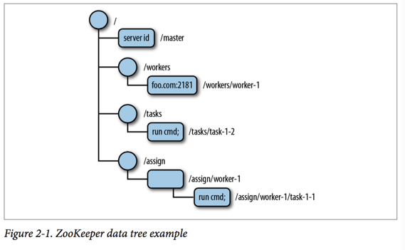
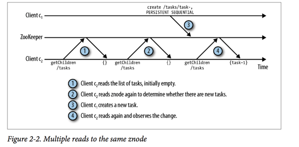
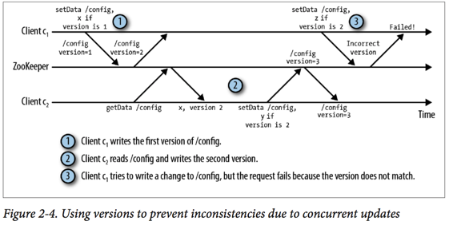
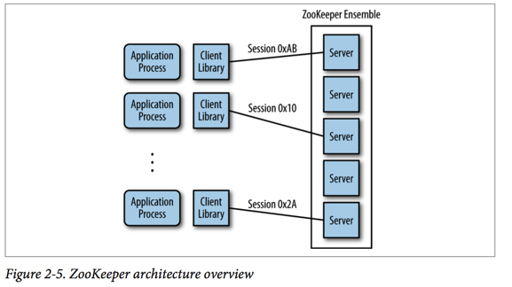
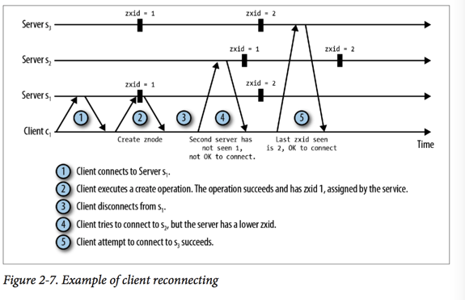

### Zookeeper Basics
用于协作的一些原语是可以在很多应用之间共享的。因此，设计一个用于协作的服务的一种方法是提供一系列的原语，暴露创建每一个原语实例的调用，然后直接操作这些实例。例如，我们可以认为分布式锁构成了一个重要的原语，并且暴露创建，获取，释放锁的调用。

这种设计，带来一些重要的缺点。第一，我们要么需要提前提供全面的原语列表，要么持续扩展API来引入新的原语。第二，使用这种服务的应用不能灵活的实现最适合他们的原语。

因此，我们在Zookeeper中我们采用不同的方法。Zookeeper没有直接暴露原语。相反，它暴露了一个和文件系统类似的API，由很多小的调用组成，能够让应用实现他们自己的原语。我们用食谱来表示这些原语的实现。食谱包括了操作小的数据节点，`znode`,以树的组织方式，的操作。图2-1是一个znode 树。



缺乏的数据总是传递了关于znode的重要数据。在一个master-worker 的例子中，master znode的缺乏意味着当前没有master被选出来。图2-1 包括了一下其他的znode，这些znode可能在master-worker 配置中有用。

+ `/workers` znode是所有表示系统中可用的一个worker的znode的父节点。
+ `/tasks` znode是所有已经创建并且等待worker执行的任务的父节点。master-worker 应用的客户端增加一个新的znode作为`/tasks`的子节点，表示一个新任务。
+ `/assign` znode是所有表示分配一个任务到一个worker的znode的父节点。当一个master分配一个任务到一个worker，它增加一个子节点到`/assign`

### API Overview
Znode可能包含数据也可能没有包含数据。如果一个znode包含了数据，这些数据以字节数组(byte array)存储。字节数组的确切格式因应用的不同而不同，并且Zookeeper没有提供直接的支持来解析它。序列化包比如`Protocol Buffers`,`Thrift`,`Avro`和`MessagePark`都是非常方便的处理存储在Znode里的数据，但是有时候字符串的编码例如 UTF-8 就已经足够了。

Zookeeper API暴露了如下的操作：

+ create /path data。创建一个以`/path`为名的znode，包含数据`data`
+ delete /path
+ exists /paht
+ setData /path data
+ getData /path
+ getChildren /path

Zookeeper不允许部分写或部分读znode中的数据。当设置znode中的数据或读取数据，znode中的内容被代替或者完全读出。

Zookeeper客户端连接到一个Zookeeper服务，通过API调用建立session。

### Different Modes for Znodes
当你创建了一个新的znode，你需要指定一个mode。不同的mode决定了不同的行为。

#### Persistent and ephemeral Znodes
一个znode要么是persistent（持久的）或者ephemeral（短暂的）的。一个persistent的znode只能通过调用`delete`删除。一个ephemeral的znode，当创建它的客户端crash或者只是关闭和Zookeeper的连接时，被删除。

持久的znode是有用的，当znode存储一些应用的数据，并且这些数据需要保持即使它的创建者不再是系统的一部分。例如，在master-worker例子中，我们需要维护任务分配给worker的分配信息，即使执行这些分配的master crash。

短暂的znode传递了应用的其他方面的信息，只有在它的创建者的session有效时这些数据才存在。例如，我们的master-worker例子中的master节点是ephemeral的。他的出现意味着有一个master，并且这个master正在运行。如果当master 没有了但是master znode 存在，那么系统将不能检测到master crash。这可能阻止系统采取措施，所以当master crash时，master znode也消失了。我们使用ephemeral znode表示worker。如果一个worker变得不可用，它的session过期，在`/workers`下的znode 自动消失。

一个ephemeral znode在两种情况下可以删除：

1. 当创建者的session 结束了，要么是过期要么是显式的关闭。
2. 当一个客户端（不必是它的创建者）删除它。

因为当它的创建者的session过期时，ephemeral znode被删除，目前我们不允许ephemeral 类型的znode有子节点。

####  Sequential Znodes
一个znode 可以设置为`Sequential`。一个Sequential（顺序的） znode可以分配一个唯一的,自动增加的整数。这个序列号用于创建znode时追加到path。例如，如果一个客户端创建了一个顺序的znode，它的path为`/tasks/task-`，Zookeeper分配一个序列号，比如 1，追加到这个path。这个znode的path变成`/tasks/task-1`.顺序znode提供了一个简单的方式来创建有唯一名字的znode。

#### 总结一下
有四种可选的mode:persistent,ephemeral,persistent_sequential,ephemeral_sequential.

### Watches and Notifications
因为Zookeeper作为远程服务访问，每当客户端想知道一个znode的内容就访问一次znode可能会非常昂贵：它可能导致更高的延迟。考虑图2-2中的例子，第二个调用`getChildren /task` 返回同样的值，一个空的集合，因此是没有必要的。



这是轮询的普遍问题。为了取代客户端轮询，我们选择了一种基于通知的机制：客户端注册到Zookeeper，接收znode改变的通知。注册来接收一个给定znode的通知组成了设置一个`watch`。一个watch 是一个一次性的操作，意味着他触发一个通知。为了接收多个通知，客户端必须在接收每个通知时设置一个新的watch。在图2-3中，客户端只有在它接收到表示`/tasks`改变的通知时，从Zookeeper读取新的值。


当使用通知时，有一些的事情要注意。因为通知是一次性的操作，一个新的对znode的改变可能在客户端收到这个znode的通知和设置一个新的watch之间发生。我们看一个快速的例子看看它是如何发生的。假定如下的事件以下面的顺序发生：

1. 客户端 c1 设置了`/tasks`的数据改变的 watch
2. 客户端 c2 增加一个任务到`/tasks`
3. 客户端 c1 接收到通知
4. 客户端 c1 设置一个新的watch，但是在设置之前，第三个客户端 c3，增加了一个新的任务到 `/tasks`。

客户端c1 最终设置了新的watch，但是c3做出的改变没有触发通知。为了观察到这个改变，c1需要在设置watch时读取`/tasks`的状态。因此，c1 没有错过任何的改变。

通知的一个重要的保证是，他们在同一个znode上任何其他的改变做出之前被传递到客户端。如果客户端设置了一个znode的watch，有两个连续的更新到这个znode，客户端在第一个更新之后接收到通知，在它观察到第二个更新之前，读取znode的数据。通知保持了客户端观察到的更新的顺序。虽然zookeeper状态的改变传递给任何客户端可能更加慢，我们保证客户端以全局的顺序观察到zookeeper状态的改变。

Zookeeper产生不同类型的通知，取决于watch是如何设置的。一个客户端可以为znode的数据改变设置一个watch，也可以是znode的子节点的改变，或者znode创建或删除。为了设置一个watch，我们可以使用API中的读取Zookeeper状态的调用。这些API调用可以选择传递一个`Watcher`对象，或者使用默认的watcher。

### Versions
每一个Znode都有一个关联的版本号，数据改变时会递增。API中的一对操作可以有条件的执行：setData,delete。这两个调用以版本号为参数，当且仅当客户端传入的版本号等于服务端当前版本号时，操作成功。版本号的用法是很重要的，当多个Zookeeper客户端在同一个Znode上执行操作时。如图2-4所示：



### Zookeeper 架构
应用通过客户端库调用Zookeeper，客户端库负责和Zookeeper 服务端的交互。

图2-5 展示了客户端和服务端的关系。每一个客户端导入客户端库，然后可以和任何的Zookeeper 节点交互。



Zookeeper 服务端可以允许在两种模式：standalone 和 quorum。单例模式是一个服务端，并且Zookeeper的状态不会被复制。在`quorum`模式，Zookeeper 服务端集群，复制状态，共同服务客户端请求。

### Zookeeper Quorums
在 `quorum`模式，Zookeeper复制它的数据到集群中的所有的Server。但是如果一个客户端需要等每一个Server存储它的数据才能继续，这种延迟可能是无法接受的。在公共管理领域，`quorum`是立法者要求的投票的最少人数。在Zookeeper中，它是Zookeeper 可以work的正在运行和可用的Server的最少数量。这个数也是在告诉客户端数据安全存储之前存储客户端数据的Server的最少数量。例如，我们总共有5个Server，但是`quorum`是3.所以只要有3个Server存储了数据，客户端就可以继续，其他两个Server最后也会赶上，存储这些数据。

为`quorum`选择合适的数量是很重要的。Quorums必须保证，不管系统延迟还是crash，任何收到的更新请求都必须持久化，直到另一个请求代替它。

为了理解这是什么意思，我们看一个例子，看看如果Quorum太小的话，会出现怎么的错误。假设我们有5个Server，quorum是其中的2个。现在假设Server s1和s2确认他们已经复制了创建znode `/z`的请求。服务端返回客户端znode已经成功创建。现在假设Server s1 和 s2与其他的Server和客户端分隔开了，在它们复制新的znode到其他客户端之前。在这种状态下，服务还是可以使用的，因为还有3个可用的Server，并且quorum是2，但是这三个Server可能看不到新的znode `/z`。因此创建znode `/z`没有持久化。

这是一个`split-brain`的例子。为了避免这种问题，在这个例子中quorum至少应该为3.为了确认一个更新状态的请求已经成功，集群要求至少3个Server确认它们已经复制了。因此，如果集群 is able to make progress，我们至少有一台Server包含更新的拷贝。

使用这样的多数方案，我们可以容忍f 个Server crash，f 小于集群中一半的Server数。比如，我们有5个Server，那么可以容忍的f = 2。集群中的Server数不强制是奇数，但是偶数可能使得系统更加脆弱。假设集群中有4个Server，多数的Server是3个，这样我们只能容忍1个Server crash。因为2个 Server crash的话会使得系统失去多数性。我们应该总是有奇数个Server。

#### Sessions
在向Zookeeper集群执行任何的请求之前，客户端要和服务端间里session。session的概念是很重要的，并且对于zookeeper的操作是很关键的。客户端提交给Zookeeper的所有操作都和一个session关联。当一个session 结束时（超时或显式关闭），这个session创建的ephemeral znode 消失。

当一个客户端创建使用具体的语言绑定创建一个Zookeeper handle时，他建立了和和Zookeeper服务的session。客户端开始连接到集群中任何Server，或单个Server。它使用TCP 连接和Server交互，但是session可能移动到一个不同的Server如果当前Server没有响应。移动一个session到一个不同的Server由Zookeeper客户端库处理。

session 提供了 顺序保证，这意味着同一个session中的请求是以FIFO的顺序执行的。一般的，一个客户端只有一个session是打开的，所以他的请求都是以FIFO顺序执行。如果一个客户端有多个并发的session，在跨session中，FIFO顺序不需要保持。同一个客户端的连续的session，即使他们没有在时间上重叠，也不需要保持FIFO顺序。如下所示：

+ 客户端建立一个session，执行两个连续的异步调用来创建`/tasks` 和 `/workers`。

+ 第一个session过期了。

+ 客户端创建另一个session，执行一个异步调用来创建`/assign`

在这种顺序的调用中，可能只有`/tasks` 和 `/assign` 已经创建了，在第一个session中保持了FIFO，但是跨session中可以违反。

### Getting Started with Zookeeper
#### First Zookeeper Session
改变data 目录,可以在zoo.cfg中:`dataDir = /users/me/zookeeper`

启动Server:`bin/zkServer.sh start`

启动Client:`bin/zkCli.sh`

### States and the Lifetime of a Session
一个Session的生命周期与它创建和结束的周期相同，不管是显式关闭还是因为timeout 而过期。为了讨论在一个session中会发生什么，我们需要考虑session的可能的状态和可能改变session状态的事件。

session的可能状态时：CONNECTING,CONNECTED,CLOSED,NOT_CONNECTED.如图2-6所示：


一个session开始为NOT_CONNECTED状态，当初始化一个Zookeeper 客户端时过渡为CONNECTING.

> Waiting on CONNECTING During NetWork Partitions
>
> 当一个客户端因为超时而没有连接到服务端时，客户端保持CONNECTING状态。如果没有连接上是因为客户端和Zookeeper 集群网络分隔了，那么客户端将保持CONNECTING状态直到要么它显式的关闭session，要么网络不在分隔了，客户端收到Zookeeper Server 声明这个Session已经过期了。有这种行为是因为是Zookeeper 集群负责声明一个Zookeeper session 过期，客户端不能声明session 过期。客户端可以选择关闭这个session。

创建session时需要设置的一个重要的参数是session timeout.如果服务在时间 t 内没有看到消息和一个给定的session 关联，它声明这个session 过期。在客户端，如果它在 1/3 t 时间内，没有收到Server端的消息，那么它发送一个心跳消息到Server。在2/3 t时间内，Zookeeper 客户端开始寻找一个不同的Server，并且它有1/3 t的时间找到一个。

当尝试连接到一个不同的Server时，这个Zookeeper Server的状态和客户端观察到的最后一个Zookeeper Server的要同样的 fresh（不能落后）。Zookeeper根据服务中的顺序更新来确定freshness。

图2-7说明了使用事务id（zxids）来重新连接。客户端因为超时从s1失去连接后，它尝试s2,但是s2落后了，没有反应一个客户端知道的改变。但是s3 和客户端看到了同样的改变，所以连接到s3是安全的。



### Zookeeper with Quorums
我们目前使用的配置只适合单个Server。

即使在同一台机器上我们也可以部署多个Server。

为了达到这个目的，我们可以使用以下的配置文件：

````
tickTime=2000
initLimit=10
syncLimit=5
dataDir=./data
clientPort=2181
server.1=127.0.0.1:2222:2223
server.2=127.0.0.1:3333:3334
server.3=127.0.0.1:4444:4445
````

我们主要关注最后三行，server.n 条目。

每一个server.n 条目指定了Zookeeper Server n使用的地址和端口。我们可以看到被`:`分割的区域。第一个区域是主机名或IP 地址。第二和第三个区域是TCP端口用于集群交流和领导选举(leader election)。

如何在一台机上建立Zookeeper 集群呢？

1. 先在Zookeeper 目录下建立 z1,z2,z3三个文件夹。

````
mkdir z1
mkdir z1/data
mkdir z2
mkdir z2/data
mkdir z3
mkdir z3/data
````
当启动Server时，它需要知道自己是哪台机。一个Server通过读取`data`目录中的名为`myid`的文件识别自己的Id。我们可以使用如下命令创建这些文件：

````
echo 1 > z1/data/myid
echo 2 > z2/data/myid
echo 3 > z3/data/myid
````

当一个Server启动时，它需要使用配置文件中的`dataDir`参数找到`data`目录。它从`myid`获取对应的Server Id，然后使用对应的`server.n`条目设置监听的端口。当我们在不同的机器上运行Zookeeper集群时，我们可以使用相同的客户端端口，甚至使用相同的配置文件。但是在这个例子中，在同一台机器上运行，我们需要为每一个Server指定不同的客户端端口。

所以，我们首先创建z1/z1.cfg，使用我们之前的配置文件。然后创建z2/z2.cfg,z3/z3.cfg将`clientPort`改为2182,2183。

现在我们启动一个Server，我们首先启动z1:

````
cd z1
../bin/zkServer.sh start ./z1.cfg
````
当前Server的日志打入了zookeeper.out文件中，因为我们只启动了三个Zookeeper Server中的一个，服务不能启动。在日志中，我们可以看到如下的日志：

````
2016-11-29 15:02:13,709 [myid:1] - INFO  [QuorumPeer[myid=1]/0:0:0:0:0:0:0:0:2181:FastLeaderElection@818] - New election. My id =  1, proposed zxid=0x0
2016-11-29 15:02:13,710 [myid:1] - INFO  [WorkerReceiver[myid=1]:FastLeaderElection@600] - Notification: 1 (message format version), 1 (n.leader), 0x0 (n.zxid), 0x1 (n.round), LOOKING (n.state), 1 (n.sid), 0x0 (n.peerEpoch) LOOKING (my state)
2016-11-29 15:02:13,714 [myid:1] - WARN  [WorkerSender[myid=1]:QuorumCnxManager@400] - Cannot open channel to 2 at election address /127.0.0.1:3334
java.net.ConnectException: Connection refused
       	at java.net.PlainSocketImpl.socketConnect(Native Method)
       	at java.net.AbstractPlainSocketImpl.doConnect(AbstractPlainSocketImpl.java:350)
       	at java.net.AbstractPlainSocketImpl.connectToAddress(AbstractPlainSocketImpl.java:206)
````

这个Server拼命的尝试连接到其他的Server，但是失败了，如果我们启动其他的Server，我们可以组成一个集群。

````
cd z2
../bin/zkServer.sh start ./z2.cfg
````

如果我们检查第二个Server的zookeeper.out日志，我们可以看到：

````
2016-11-29 15:03:33,438 [myid:2] - INFO  [QuorumPeer[myid=2]/0:0:0:0:0:0:0:0:2182:Leader@361] - LEADING - LEADER ELECTION TOOK - 5243
2016-11-29 15:03:33,450 [myid:2] - INFO  [LearnerHandler-/127.0.0.1:63867:LearnerHandler@329] - Follower sid: 1 : info : org.apache.zookeeper.server.quorum.QuorumPeer$QuorumServer@1a516d77
````

这意味着Server 2已经是选举的leader了。Server 1 是Server 2的Follower.

````
cd z3
../bin/zkServer.sh start ./z3.cfg
````

> 客户端随机的连接到一个指定的Server中的一个。这允许Zookeeper实现简单的负载均衡。

### 实现原语：Locks with Zookeeper
假设我们有一个应用，有n 个进程试图获取一个锁。回想到Zookeeper不直接暴露原语，所以我们需要使用Zookeeper接口操作znode，实现锁。为了获取一个锁，每一个进程P 尝试创建znode `/lock`。如果p成功的创建znode，那么它获取这个锁，并且可以执行临界区。一个可能发生的问题是p可能会crash，并且永远不会释放这个锁。在这种情况下，其他的进程都不能获取这个锁了，系统可能因为死锁卡住。为了避免这种情况，我们可以把`/lock`置为ephemeral。

其他进程尝试创建`/lock`失败只要这个znode存在。所以他们设置`/lock`的watch，并且一旦他们检测到`/lock`已经被删除了，就再次尝试获取锁。一旦受到`/lock`被删除的通知，如果进程 `p'`仍然想获取这个锁，它将重试创建`/lock`，如果其他进程已经创建了这个znode，设置一个watch。

### 实现master-worker
Master-Worker 模型包括三个角色：

1. Master
master检测新的worker和tasks，安排任务到可用的worker。

2. Worker
Worker 注册自己到系统，保证master可以看到自己可以执行任务，然后检测新的任务。

3. Client
客户端创建新的任务，等待系统的响应。

#### The Master Role
因为只有一个进程可以成为master，一个进程应该在成为master之后，锁定mastership。为了达到这样，这个进程创建一个ephemeral znode,称为 `/master`。

````
[zk: 127.0.0.1:2181,127.0.0.1:2182,127.0.0.1:2183(CONNECTED) 1] create -e /master "master1.example"  ①
Created /master

[zk: 127.0.0.1:2181,127.0.0.1:2182,127.0.0.1:2183(CONNECTED) 3] get /master           ②
master1.example
cZxid = 0x100000002
ctime = Tue Nov 29 16:29:27 CST 2016
mZxid = 0x100000002
mtime = Tue Nov 29 16:29:27 CST 2016
pZxid = 0x100000002
cversion = 0
dataVersion = 0
aclVersion = 0
ephemeralOwner = 0x258aee54f530000
dataLength = 15
numChildren = 0
````

①创建一个master znode获取领导权。我们可以使用`-e` 标识来表明我们创建了一个ephemeral znode.

②获取metadata和`/master` znode的数据。

可能当前的master crash了，那么备用master可能需要接管当前master的角色。为了检测到这个，我们需要这`/master` znode上设置一个watch。

````
[zk: 127.0.0.1:2181,127.0.0.1:2182,127.0.0.1:2183(CONNECTED) 4] stat /master true
cZxid = 0x100000002
ctime = Tue Nov 29 16:29:27 CST 2016
mZxid = 0x100000002
mtime = Tue Nov 29 16:29:27 CST 2016
pZxid = 0x100000002
cversion = 0
dataVersion = 0
aclVersion = 0
ephemeralOwner = 0x258aee54f530000
dataLength = 15
numChildren = 0
````

`stat`命令获取一个znode的属性，并且允许我们在一个已经存在的znode上设置watch。在path后面指定参数`true`以设置watch。如果活跃的主master crash了，我们可以观察到如下的：

````
[zk: 127.0.0.1:2181,127.0.0.1:2182,127.0.0.1:2183(CONNECTED) 5]
WATCHER::

WatchedEvent state:SyncConnected type:NodeDeleted path:/master
````

### Workers,Tasks，and Assignments
我们创建三个重要的znode，`/workers`,`/tasks`,`/assign`。

````
[zk: 127.0.0.1:2181,127.0.0.1:2182(CONNECTED) 1] create /workers ""
Created /workers
[zk: 127.0.0.1:2181,127.0.0.1:2182(CONNECTED) 2] create /tasks ""
Created /tasks
[zk: 127.0.0.1:2181,127.0.0.1:2182(CONNECTED) 3] create /assign ""
Created /assign
[zk: 127.0.0.1:2181,127.0.0.1:2182(CONNECTED) 4] ls /
[zookeeper, workers, tasks, assign]
````

这三个znode都是持久化的，没有包含数据。

master 需要设置`/workers`和`/tasks`的子节点的改变的watch。

````
[zk: 127.0.0.1:2181,127.0.0.1:2182(CONNECTED) 5] ls  /workers true
[]
[zk: 127.0.0.1:2181,127.0.0.1:2182(CONNECTED) 6] ls /tasks true
[]
````

`true`参数表示设置watch。

### The Worker Role
一个worker的第一步是通知master它可以执行任务。通过在`/workers`下创建一个ephemeral znode。Worker使用它们的主机名来标识它们自己。

````
[zk: 127.0.0.1:2181,127.0.0.1:2182(CONNECTED) 7] create -e /workers/worker1.example.com "sfdsf:2224"

WATCHER::

WatchedEvent state:SyncConnected type:NodeChildrenChanged path:/workers
Created /workers/worker1.example.com
````

因为master设置了watch，一旦worker在`/workers`下创建了一个znode，master观察到上面的通知。

下一步，worker需要创建一个父级znode，`/assign/worker1.example.com`来接受分配的任务，并且为新的任务设置watch。

````
[zk: 127.0.0.1:2181,127.0.0.1:2182(CONNECTED) 8] create /assign/worker1.example.com ""
Created /assign/worker1.example.com
[zk: 127.0.0.1:2181,127.0.0.1:2182(CONNECTED) 9] ls /assign/worker1.example.com true
[]
````

worker现在准备好接受分配了。我们下面看看分配。

### The Client Role
客户端增加tasks到系统。要增加一个任务到系统，客户端执行以下的命令：

````
[zk: 127.0.0.1:2181,127.0.0.1:2182(CONNECTED) 10] create -s /tasks/task- "cmd"

Created /tasks/task-0000000000
````

我们让task znode为Sequential，可以让添加的任务有序。客户端现在需要等待直到任务执行。执行任务的Worker为任务创建一个状态znode，一但任务完成。当看到相关任务的状态znode已经创建，客户端确定任务已经执行了。因此，客户端必须检测状态znode的创建。

````
[zk: localhost:2181(CONNECTED) 1] ls /tasks/task-0000000000 true
[]
````

执行任务的Worker创建一个status znode，作为`/tasks/task-0000000000`的子节点。这就是上面要监测`/tasks/task-0000000000`的子节点的原因

一旦task znode创建了，master观察到如下的事件：

````
[zk: localhost:2181(CONNECTED) 6]
WATCHER::
WatchedEvent state:SyncConnected type:NodeChildrenChanged path:/tasks
````

接下来master检查新的任务，获取可用worker的列表，分配到`worker1.example.com`。

````
[zk: 6] ls /tasks
[task-0000000000]
[zk: 7] ls /workers
[worker1.example.com]
[zk: 8] create /assign/worker1.example.com/task-0000000000 ""
Created /assign/worker1.example.com/task-0000000000
[zk: 9]
````

worker接收到一个新任务分配的通知：

````
[zk: localhost:2181(CONNECTED) 3]
WATCHER::
WatchedEvent state:SyncConnected type:NodeChildrenChanged
path:/assign/worker1.example.com
````

worker 检查新的任务，查看分配给他的新的任务：

````
WATCHER::
WatchedEvent state:SyncConnected type:NodeChildrenChanged
path:/assign/worker1.example.com
[zk: localhost:2181(CONNECTED) 3] ls /assign/worker1.example.com
[task-0000000000]
````

一旦worker执行任务完成，它新增一个状态znode 到`/tasks`:

````
[zk: localhost:2181(CONNECTED) 4] create /tasks/task-0000000000/status "done"
Created /tasks/task-0000000000/status
````

客户端接收到通知，并且检查结果：

````
WATCHER::
WatchedEvent state:SyncConnected type:NodeChildrenChanged
path:/tasks/task-0000000000

[zk: localhost:2181(CONNECTED) 2] get /tasks/task-0000000000
    "cmd"
    cZxid = 0x7c
    ctime = Tue Dec 11 10:30:18 CET 2012
    mZxid = 0x7c
    mtime = Tue Dec 11 10:30:18 CET 2012
    pZxid = 0x7e
    cversion = 1
    dataVersion = 0
    aclVersion = 0
    ephemeralOwner = 0x0
    dataLength = 5
    numChildren = 1
[zk: localhost:2181(CONNECTED) 3] get /tasks/task-0000000000/status
    "done"
    cZxid = 0x7e
    ctime = Tue Dec 11 10:42:41 CET 2012
    mZxid = 0x7e
    mtime = Tue Dec 11 10:42:41 CET 2012
    pZxid = 0x7e
    cversion = 0
    dataVersion = 0
    aclVersion = 0
    ephemeralOwner = 0x0
    dataLength = 8
    numChildren = 0
````

客户端检查状态znode的内容，确定task的状态。
