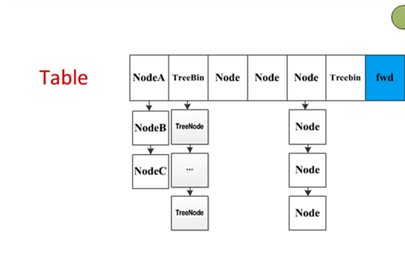

ConcurrentHashMap提供了完全并发的检索和高并发的更新。这个类遵守和`HashTable`一样的方法规范，对于`HashTable`中的每个方法都提供了对应的版本。但是虽然所有的操作都是线程安全的，检索（获取）操作不需要锁定（索取锁），也没有任何支持锁定整个table从而阻止其他访问的方法。

获取操作（get）通常不需要阻塞，所以可能和更新操作（包括put和remove）有重叠的地方。获取反映了最近完成的更新操作的结果，从他们hold开始。更加正式的是，对于一个给定key的更新操作和任何非null的获取操作服从happens-before关系，获取时会反映更新了的值。对于聚合操作，比如`putAll`和`clear`，并发获取可能反映只有少数entries的insertion或removal。相似的，iterators，spliterators和enmuerations返回的元素反映了hash table在某个时刻的状态，或者自从iterator/enumeration创建时的状态。他们不会抛出`java.util.ConcurrentModificationException`.然而，iterators被设计为在同一时间只能被一个线程使用。牢记这一点，总体状态方法包括`size`和`isEmpty`和`containsValue`的结果，通常只当一个Map没有被其他线程并发更新时有用。否则这些方法的结果反映的短暂的状态可能只适用于监控或者估计的目的，而不能用于程序控制。

当有太多的碰撞时（例如，keys有不同的hash code但是却落在同一个槽里），table会自动扩容，以预期平均效果维持大概两个bins一个映射（对应于用于调整大小的0.75的负载因子阈值）.当mapping添加或移除时，这种平均依然有很多的差异，但是整体上，这维持了一个通常可以接收的时间/空间折衷。然而，调整ConcurrentHashMap或其他种类的哈希表的大小，可能是一个相对慢的操作。当可能时，提供一个估计的大小作为`initialCapacity`可选的构造参数.一个另外的可选的`loadFactor`构造参数提供了自定义初始table容量的更加有用的参数，通过指定表的用于计算可分配的数量的密度。

Overview:

ConcurrentHashMap设计的主要目的是维持并发的读性能(主要是get()方法，但也包括iterators和相关方法)，最小化update竞争。第二个目的是，比`java.util.HashMap`有相同的或更好的空间消耗，也支持许多线程在空的table上的高的初始插入率。(也就是读不需要加锁，高并发的写)

这个map一般作为桶（bin）的hash table.每一个key-value mapping被保存在一个Node中。大多数nodes是基本的Node类的实例，有hash,key,value,和next fields。然而，有许多子类：TreeNode,被安排在平衡树，而不是lists.TreeBins 持有TreeNodes的根节点的集合。在调整大小时，ForwardingNodes 被放在桶的头部。ReservationNodes 在computeIfAbsent和相关方法确定值时被用作placeholds。TreeBin,ForwardingNode和ReservationNode并不持有正常的用户keys,values,或者hashs，在搜索时可以轻而易举的区别，因为他们有负的hash值，null的key和value。（这些特殊的nodes要么是不寻常的要么是transient的，所以有这些没有使用的field是没有影响的）


直到第一次插入时，table被延迟初始化为2的N次方的大小。table中的每一个bin(桶)通常包含一列Nodes。table的访问需要volatile/atomic read，writes,和cas。

我们使用Node hash域的高位（有符号）来控制--这是可行的因为寻址限制。有负的hash 域的Nodes会被特殊处理，或者忽略。

在一个空桶的第一个node插入(通过put或者他的变体)是通过在这个桶(bin)上执行cas操作完成。这是目前为止最普遍的put操作under most key/hash distributions。其他的更新操作（insert，delete，和replace）需要获取锁。我们不想浪费空间来将每一个桶(bin)和每一个不同的锁(lock)对象关联起来，所以使用每个bin list中的第一个node作为一个锁。在这些lock上的锁定依赖于內建的`synchronized`监视器。

使用一个list中的第一个node作为锁对象并不是很足够的：当一个node被锁定了，任何的update必须首先验证在锁定之后，仍然是第一个node被锁定，如果不是的话，就要重试。因为新的node总是被追加到list，一旦一个node是bin中的第一个，他总是第一个，直到被删除或者这个bin变得无效（一旦调整大小）。

以每一bin作为锁定单位的主要的缺点是，在这个bin list里的被同一个锁保护的其他node的更新操作可能暂缓。例如当用户的`equals`或mapping 方法花费很长时间。然而，从统计上来说，以随机的hash code,这不是一个普遍的问题。理想情况下，bin中的node的频率服从平均参数为0.5的泊松分布，假设调整大小阈值为0.75，尽管由于调整粒度，方差仍然较大。忽略方差，以k为大小的list，期望出现的概率是 (exp(-0.5) * pow(0.5, k) / factorial(k))。第一个值是：

````
 0:    0.60653066
 1:    0.30326533
 2:    0.07581633
 3:    0.01263606
 4:    0.00157952
 5:    0.00015795
 6:    0.00001316
 7:    0.00000094
 8:    0.00000006
 more : 小于千万分之一
````

在random hash 下，两个线程访问不同元素发生锁竞争的可能性大概为 1 / (8 * #elements)

在实践中遇到的实际哈希码分布有时会偏离均匀随机性。这包括了当 N > (1<<30)的情况，所以一些key必须抵触。 类似的，对于多个key被设计为有相同hash code或者仅在被屏蔽的高位上不同的愚蠢的或有敌意的用法。所以，当bin中node的数量超过一个阈值时，我们使用第二种策略。这些TreeBins使用一个平衡树（红黑树的一种具体形式）来保存node,边界搜索时间为O（log n）。在TreeBin中的每一个搜索步骤至少比普通list慢两倍，但是考虑到N cannot exceed (1<<64) (before running out of addresses) this bounds search steps, lock hold times,等等。TreeBin nodes（TreeNode）也和普通node一样维护了相同的下一个横向指针，所以可以以同样的方式在iterator中横向移动。

当占用率超过一个概率阈值（通常为0.75）时，table调整大小。

延迟初始化到第一次使用，也可以避免当第一次操作是从一个putAll,有map参数的构造器，或者反序列化时的调整大小。这些情况下，会试着覆盖initialCapacity设置，但是在竞争的情况下，会无害的失败。

 The element count is maintained using a specialization of
 LongAdder. We need to incorporate a specialization rather than
 just use a LongAdder in order to access implicit
 contention-sensing that leads to creation of multiple
 CounterCells.  The counter mechanics avoid contention on
 updates but can encounter cache thrashing if read too
 frequently during concurrent access. To avoid reading so often,
 resizing under contention is attempted only upon adding to a
 bin already holding two or more nodes. Under uniform hash
 distributions, the probability of this occurring at threshold
 is around 13%, meaning that only about 1 in 8 puts check
 threshold (and after resizing, many fewer do so).

TreeBins使用一种特殊形式的比较来搜索以及相关的操作（这也是为什么我们不能用已经存在的集合例如TreeMap）。TreeBin 包含了可以比较的元素，但是也可能包含其他的，比如可以比较但是对于同一的T不需要比较的元素，所以我们不能在他们上执行`compareTo`方法。为了处理这种情况，Tree首先使用hash 值排序，如果可行的话再使用`Comparable.compareTo`排序。在节点上查找时，如果元素不能比较或者比较等于0，那么左边和右边的子节点可能都需要以绑定的hash值查询。一旦插入，为了在调整平衡时保持整体的顺序，we compare classes and identityHashCodes as tie-breakers.The red-black balancing code is updated from pre-jdk-collections(http://gee.cs.oswego.edu/dl/classes/collections/RBCell.java)

TreeBins 也需要一个额外的锁定机制。尽管list的横向移动即使在update时也可以读取，tree 的横向移动就不可以了，只要是因为树旋转可能改变根节点和（或）他的连接。TreeBins在主要的bin锁定策略上寄生了一个简单的read-write lock 机制：与插入和移除相关的结构调整已经在bin上锁定了（所以不能和其他的写入者冲突），但是必须等待进行中的读取者完成。因为可能只有一个这样的等待者，我们使用一个简单的结构，使用单个`waiter` field来阻塞写入者。但是读取者需要永不阻塞。如果root 锁被持有了，他们沿着缓慢的横向路径前进（通过next-pointer）直到锁变得可用，或者list穷尽了，无论哪个先发生。这种情况不会很快，但是最大化总预期吞吐量。

维护API和与之前版本的一致性引出了几个古怪的事。主要是：我们去掉了没有使用的构造参数`concurrencyLevel`。我们接收一个`loadFactor`作为构造参数，但是只是在初始化table容量时使用它。我们也声明了一个不用的`Segment`类，只有当序列化时以最小的形式初始化。


先介绍几个相关的类：

### Node
Node作为 key-value entry，单向链表，实现了`Map.Entry<K,V>`接口。这个类永远不会作为用户可修改的Map.Entry 而暴露出去（不支持setValue方法），但是可以被用于bulk task中的read-only traversals。Node子类中，hashcode为负的是特别的，它们的key和value也是null。

### TreeNode
TreeNode表示一个红黑树节点。当桶中的Node太多时(大于8个)，并且table的长度大于64时，将Node转化为TreeNode（也就是将链表转化为红黑树）。

### TreeBin
TreeBin并不保存key和value,相反，它指向TreeNodes的根节点。TreeBin维护了一个读写锁，强迫写入者(也就是获取了这个桶的锁的人)在树的重新构造操作之前等待读者完成（意思就是，因为写会影响树的构成，所以在对某个桶开始写操作之前等待这个桶上的读操作先完成）。

### ForwardingNode
一个过渡节点，表明ConcurrentHashMap正在进行transfer操作。如果一个桶为null或者这个桶已经复制到新的table中（已经处理完），那么这个桶的头结点被设置为一个ForwardingNode。

### ReservationNode

### initTable方法
ConcurrentHashMap的初始化延迟到第一次put value时被调用。initTable方法主要做了两件事

1. 初始化table为一定容量的Node数组。

2. 设置sizeCtl

这里我们要注意，因为loadFactor为0.75，所以实际上，只要table的大小为`0.75 * capacity`就会扩容。


````
/**
 * Initializes table, using the size recorded in sizeCtl.
 */
private final Node<K,V>[] initTable() {
    Node<K,V>[] tab; int sc;
    while ((tab = table) == null || tab.length == 0) {
        if ((sc = sizeCtl) < 0) //说明有其他线程在初始化这个ConcurrentHashMap。
            Thread.yield(); // lost initialization race; just spin
        else if (U.compareAndSwapInt(this, SIZECTL, sc, -1)) {
            try {
                if ((tab = table) == null || tab.length == 0) {
                    int n = (sc > 0) ? sc : DEFAULT_CAPACITY;
                    @SuppressWarnings("unchecked")
                    Node<K,V>[] nt = (Node<K,V>[])new Node<?,?>[n];
                    table = tab = nt;
                    sc = n - (n >>> 2);
                }
            } finally {
                sizeCtl = sc;
            }
            break;
        }
    }
    return tab;
}
````

### put方法
put方法仍然是沿用HashMap的思想，那么put时如何确定该放在哪个桶里呢？

先根据key的hashcode做hash运算(`(hashcode ^ (hashcode >>> 16)) & 0x7fffffff`)得到一个hash值，在用桶的长度与这个hash值按位与(`(n - 1) & hash)`):

````
int hash = spread(key.hashCode());

static final int spread(int h) {
    return (h ^ (h >>> 16)) & HASH_BITS;
}

i = (n - 1) & hash)
i就是key在桶中的位置
````

现在确定了put的key-value在table中的位置。

1. 如果该位置i是null，说明该位置i是首次插入数据，那么new 一个Node放入该位置即可。

2. 如果该位置不是null，并且该位置的Node的hash属性为-1(MOVED)，那么这个ConcurrentHashMap正在进行扩容操作。

3.


````
/** Implementation for put and putIfAbsent */
final V putVal(K key, V value, boolean onlyIfAbsent) {
    if (key == null || value == null) throw new NullPointerException();
    //根据key的hashcode再次hash
    int hash = spread(key.hashCode());
    int binCount = 0;
    for (Node<K,V>[] tab = table;;) {
        Node<K,V> f; int n, i, fh;
        if (tab == null || (n = tab.length) == 0)
            //如果table是空的话，初始化table。
            tab = initTable();
        else if ((f = tabAt(tab, i = (n - 1) & hash)) == null) {//在根据之前的hash和table的长度按位与运算,确定key-value在table的位置i
            //如果位置i出的Node为null，则new Node放入此处。
            if (casTabAt(tab, i, null,
                         new Node<K,V>(hash, key, value, null)))
                break;                   // no lock when adding to empty bin
        }
        else if ((fh = f.hash) == MOVED)//如果该Node的hash为-1,则正在进行扩容，那么此时put的key-value也要加入到扩容后的table中
            tab = helpTransfer(tab, f);
        else {
            V oldVal = null;
            //在f上加锁，f是什么呢？从上面的代码可以看出f是位于同一个桶中的所有节点中的那个头结点，所以只会在同一个桶的头结点加锁
            synchronized (f) {
                if (tabAt(tab, i) == f) {
                    //fh>=0,说明它是一个链表的节点，不是红黑树的节点。
                    if (fh >= 0) {
                        binCount = 1;
                        for (Node<K,V> e = f;; ++binCount) {
                            K ek;
                            //如果key的hash值相同，并且key.equals方法为true(key不等于null的情况)或者 key==null
                            if (e.hash == hash &&
                                ((ek = e.key) == key ||  //这行代码处理key等于null的情况
                                 (ek != null && key.equals(ek)))) { //key不等于null的情况
                                oldVal = e.val;
                                if (!onlyIfAbsent)
                                    e.val = value;
                                break;
                            }
                            Node<K,V> pred = e;
                            if ((e = e.next) == null) { //遍历单向链表，如果遍历到单向链表的尾部了，那么将key-value追加到尾部
                                pred.next = new Node<K,V>(hash, key,
                                                          value, null);
                                break;
                            }
                        }
                    }
                    else if (f instanceof TreeBin) {//如果是红黑树，则插入树中
                        Node<K,V> p;
                        binCount = 2;
                        if ((p = ((TreeBin<K,V>)f).putTreeVal(hash, key,
                                                       value)) != null) {
                            oldVal = p.val;
                            if (!onlyIfAbsent)
                                p.val = value;
                        }
                    }
                }
            }
            if (binCount != 0) {
                if (binCount >= TREEIFY_THRESHOLD)//如果这个桶中Node的个数超过了8个
                    treeifyBin(tab, i);//treeifyBin的说明看下面的代码
                if (oldVal != null)
                    return oldVal;
                break;
            }
        }
    }
    addCount(1L, binCount);
    return null;
}

/**
 * Replaces all linked nodes in bin at given index unless table is
 * too small, in which case resizes instead.
 */
private final void treeifyBin(Node<K,V>[] tab, int index) {
    Node<K,V> b; int n, sc;
    /**
    *  接着上面，如果这个桶中Node的个数超过了8个
    */
    if (tab != null) {
      //如果table的长度没有超过64，那么将table的大小扩大一倍，扩容后的长度为lengen * 2
        if ((n = tab.length) < MIN_TREEIFY_CAPACITY)
            tryPresize(n << 1);
      //如果table的长度超过64，并且，table没有在扩容，则将链表转换为红黑树      
        else if ((b = tabAt(tab, index)) != null && b.hash >= 0) {
            synchronized (b) {
                if (tabAt(tab, index) == b) {
                    TreeNode<K,V> hd = null, tl = null;
                    for (Node<K,V> e = b; e != null; e = e.next) {
                        TreeNode<K,V> p =
                            new TreeNode<K,V>(e.hash, e.key, e.val,
                                              null, null);
                        if ((p.prev = tl) == null)
                            hd = p;
                        else
                            tl.next = p;
                        tl = p;
                    }
                    setTabAt(tab, index, new TreeBin<K,V>(hd));
                }
            }
        }
    }
}
````

所以ConcurrentHashMap中table的结构如下图所示:



### 扩容方法-transfer

````
/**
 * Moves and/or copies the nodes in each bin to new table. See
 * above for explanation.
 */
private final void transfer(Node<K,V>[] tab, Node<K,V>[] nextTab) {
    int n = tab.length, stride;
    if ((stride = (NCPU > 1) ? (n >>> 3) / NCPU : n) < MIN_TRANSFER_STRIDE)
        stride = MIN_TRANSFER_STRIDE; // subdivide range
    if (nextTab == null) {            // initiating
        try {
            @SuppressWarnings("unchecked")
            Node<K,V>[] nt = (Node<K,V>[])new Node<?,?>[n << 1];
            nextTab = nt;
        } catch (Throwable ex) {      // try to cope with OOME
            sizeCtl = Integer.MAX_VALUE;
            return;
        }
        nextTable = nextTab;
        transferIndex = n;
    }
    int nextn = nextTab.length;
    ForwardingNode<K,V> fwd = new ForwardingNode<K,V>(nextTab);
    boolean advance = true;
    boolean finishing = false; // to ensure sweep before committing nextTab
    for (int i = 0, bound = 0;;) {
        Node<K,V> f; int fh;
        while (advance) {
            int nextIndex, nextBound;
            if (--i >= bound || finishing)
                advance = false;
            else if ((nextIndex = transferIndex) <= 0) {
                i = -1;
                advance = false;
            }
            else if (U.compareAndSwapInt
                     (this, TRANSFERINDEX, nextIndex,
                      nextBound = (nextIndex > stride ?
                                   nextIndex - stride : 0))) {
                bound = nextBound;
                i = nextIndex - 1;
                advance = false;
            }
        }
        if (i < 0 || i >= n || i + n >= nextn) {
            int sc;
            if (finishing) {
                nextTable = null;
                table = nextTab;
                sizeCtl = (n << 1) - (n >>> 1);
                return;
            }
            if (U.compareAndSwapInt(this, SIZECTL, sc = sizeCtl, sc - 1)) {
                if ((sc - 2) != resizeStamp(n) << RESIZE_STAMP_SHIFT)
                    return;
                finishing = advance = true;
                i = n; // recheck before commit
            }
        }
        /**
        * 判断桶i是否是null,如果是的话，则插入一个ForwardingNode。
        */
        else if ((f = tabAt(tab, i)) == null)
            advance = casTabAt(tab, i, null, fwd);
        else if ((fh = f.hash) == MOVED)
            advance = true; // already processed
        else {
            synchronized (f) {
                if (tabAt(tab, i) == f) {
                    Node<K,V> ln, hn;
                    if (fh >= 0) {
                      /**
                      * 因为n是旧的table的length，所以n是2的指数。所以(hash & n)只有两种结果，0和n。这样就可以把桶中的元素分为两类。
                      */
                        int runBit = fh & n;
                        Node<K,V> lastRun = f;
                        for (Node<K,V> p = f.next; p != null; p = p.next) {
                            int b = p.hash & n;
                            if (b != runBit) {
                                runBit = b;
                                lastRun = p;
                            }
                        }
                        if (runBit == 0) {
                            ln = lastRun;
                            hn = null;
                        }
                        else {
                            hn = lastRun;
                            ln = null;
                        }
                        for (Node<K,V> p = f; p != lastRun; p = p.next) {
                            int ph = p.hash; K pk = p.key; V pv = p.val;
                            if ((ph & n) == 0)
                                ln = new Node<K,V>(ph, pk, pv, ln);
                            else
                                hn = new Node<K,V>(ph, pk, pv, hn);
                        }
                        ////将原来桶i中的元素，移动到扩容后的i和i+n 桶中。
                        setTabAt(nextTab, i, ln);
                        setTabAt(nextTab, i + n, hn);
                        setTabAt(tab, i, fwd);
                        advance = true;
                    }
                    else if (f instanceof TreeBin) {
                        TreeBin<K,V> t = (TreeBin<K,V>)f;
                        TreeNode<K,V> lo = null, loTail = null;
                        TreeNode<K,V> hi = null, hiTail = null;
                        int lc = 0, hc = 0;
                        for (Node<K,V> e = t.first; e != null; e = e.next) {
                            int h = e.hash;
                            TreeNode<K,V> p = new TreeNode<K,V>
                                (h, e.key, e.val, null, null);
                            if ((h & n) == 0) {
                                if ((p.prev = loTail) == null)
                                    lo = p;
                                else
                                    loTail.next = p;
                                loTail = p;
                                ++lc;
                            }
                            else {
                                if ((p.prev = hiTail) == null)
                                    hi = p;
                                else
                                    hiTail.next = p;
                                hiTail = p;
                                ++hc;
                            }
                        }
                        ln = (lc <= UNTREEIFY_THRESHOLD) ? untreeify(lo) :
                            (hc != 0) ? new TreeBin<K,V>(lo) : t;
                        hn = (hc <= UNTREEIFY_THRESHOLD) ? untreeify(hi) :
                            (lc != 0) ? new TreeBin<K,V>(hi) : t;
                        //将原来桶i中的元素，移动到扩容后的i和i+n 桶中。
                        setTabAt(nextTab, i, ln);
                        setTabAt(nextTab, i + n, hn);
                        setTabAt(tab, i, fwd);
                        advance = true;
                    }
                }
            }
        }
    }
}
````

### get方法

````
public V get(Object key) {
    Node<K,V>[] tab; Node<K,V> e, p; int n, eh; K ek;
    //根据key的hashCode再次hash
    int h = spread(key.hashCode());
    if ((tab = table) != null && (n = tab.length) > 0 &&
        //(n - 1) & h 计算出在table中的哪个桶
        (e = tabAt(tab, (n - 1) & h)) != null) {
        //如果hash相同，则它是一个链表中的Node
        if ((eh = e.hash) == h) {
            //如果key是null，则调用==比较；否则调用equals比较
            if ((ek = e.key) == key || (ek != null && key.equals(ek)))
                return e.val;
        }
        //如果eh<0,则说明这个Node可能是ForwardingNode或TreeBin或TreeNode
        else if (eh < 0)
            return (p = e.find(h, key)) != null ? p.val : null;
        while ((e = e.next) != null) {
            if (e.hash == h &&
                ((ek = e.key) == key || (ek != null && key.equals(ek))))
                return e.val;
        }
    }
    return null;
}
````

### ConcurrentHashMap的迭代器
说到ConcurrentHashMap的迭代器就不得不说说`Traverser`这个类了。

在遍历过程中，如果已经遍历的数组上的内容变化了，迭代器不会抛出ConcurrentModificationException异常。如果未遍历的数组上的内容发生了变化，则有可能反映到迭代过程中。这就是ConcurrentHashMap迭代器弱一致的表现。
