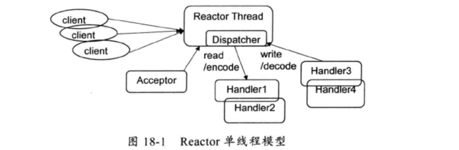
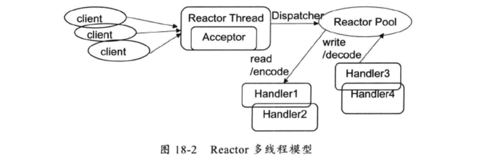

EventLoop本质上就是处理网络读写事件的Reactor线程，
在Netty中，它不仅仅用来处理网络事件，也可以用来执行
定时任务和用户自定义的NIO任务。


NioSocketChannel的`doWrite()`方法中writeSpinCount的作用是什么？

````
ByteBuffer nioBuffer = nioBuffers[0];
for (int i = config().getWriteSpinCount() - 1; i >= 0; i --) {
    final int localWrittenBytes = ch.write(nioBuffer);
    if (localWrittenBytes == 0) {
        setOpWrite = true;
        break;
    }
    expectedWrittenBytes -= localWrittenBytes;
    writtenBytes += localWrittenBytes;
    if (expectedWrittenBytes == 0) {
        done = true;
        break;
    }
}
````

因为Netty的buffer中的数据可能要好几次才能写入到底层的Socket。writeSpinCount（默认16次）就是用来控制每个Netty写操作要调用多少次底层Socket的`Socket.wirte()`。如果buffer没有完全写入，一般的做法是I/O线程注册OP_WRITE事件，并且在底层Socket可写时被唤醒。这个操作可能是昂贵的。所以我们可以让一个I/O线程多次尝试写一个buffer来提高效率。

如果写入的字节为0，说明TCP发送缓冲区已满，`setOpWrite`为true，注册OP_WRITE事件。

````
if (localWrittenBytes == 0)
````

读操作一样。


实际的网络I/O操作基本都是由Unsafe功能类负责实现的。

比如Unsafe的注册方法，主要用于将当前Unsafe对应的Channel注册到EventLoop的Selector,然后调用DefaultChannelPipeline的fireChannelRegistered方法。

````
if (eventLoop.inEventLoop()) {
    register0(promise);
} else {
    try {
        eventLoop.execute(new OneTimeTask() {
            @Override
            public void run() {
                register0(promise);
            }
        });
    } catch (Throwable t) {
        logger.warn(
                "Force-closing a channel whose registration task was not accepted by an event loop: {}",
                AbstractChannel.this, t);
        closeForcibly();
        closeFuture.setClosed();
        safeSetFailure(promise, t);
    }
}
}
````

首先判断当前所在的线程是否是Channel对应的NioEventLoop线程，如果是，则直接调用register0注册，如果不是，则说明是用户线程，则需要将注册操作封装成Runnable，放入EventLoop的任务队列中。这样注册操作，就只会由EventLoop执行。


当调用`ChannelPipeline.flush()`时，再次调用`Unsafe.flush`,最终调用`ChannelOutboundHandler.addFlush()`

````
private volatile int writeBufferHighWaterMark = 64 * 1024;
private volatile int writeBufferLowWaterMark = 32 * 1024;
````

`writeBufferHighWaterMark`,`writeBufferLowWaterMark`是什么意思呢？

如果队列的长度大于`writeBufferHighWaterMark`，那么停止从socket中读取数据到队列中，等待队列被消耗；如果队列的长度小于`writeBufferLowWaterMark`，再次从socket中读取数据。

`ChannelConfig`是这样说的：

````
If the number of bytes queued in the write buffer exceeds writeBufferHighWaterMark value, Channel.isWritable() will start to return false.
````

AbstractNioUnsafe的connect方法，连接成功之后调用`ChannelPipeline.fireChannelActive()`,`ChannelPipeline.fireChannelActive()`再调用`pipeline.read()`，它最终将NioSocketChannel的SelectionKey设置为SelectionKey.OP_READ，监听读操作。

所以，`writeBufferHighWaterMark`,`writeBufferLowWaterMark`就是流控。

### NioByteUnsafe
`AdaptiveRecvByteBufAllocator.record()`,根据本次读取的实际字节数对下次接收的buffer容量进行预测。


## ChannelPipeline，ChannelHandler
为了事件拦截和用户业务逻辑的定制。

Netty中的事件分为inbound事件和outbound事件。


inbound事件通过HeadContext进行传播，outbound通过TailContext进行传播。

### EventLoop 和 EventLoopGroup

#### Reactor 单线程模型
所有的I/O操作都在同一个线程上完成。比如：

1. accept,connect,以及I/O事件的epoll

2. 从socket读取数据，或将数据写入socket

3. decode,encode等。



因为使用的是非阻塞I/O，所以所有的I/O操作都不会阻塞，理论上一个线程可以处理所有的I/O相关的操作。但是这种架构仅适合I/O密集型，而不适合CPU密集型。

#### Reactor 多线程模型
Reactor多线程模型和单线程模型最大的区别是有一组线程来处理I/O事件。如下图所示：



Reactor多线程模型的特点如下所示：

1. 有一个专门的Reactor线程，用于处理监听客户端(accept)

2. socket I/O--读、写，编码、解码由其他一组线程（可以用一个jdk的线程池实现）完成。

3. 一个线程可以对应多个channel，但是一个channel只能对应一个线程。

在绝大多数情况下，Reactor多线程模型可以满足新能要求。但是只用一个线程来监听服务端和处理所有的客户端连接请求，可能会存在新能问题。为了解决这个问题，产生了第三种Reactor线程模型--主从Reactor多线程模型。

#### 主从Reactor 多线程模型
特点是，服务端用于接收客户端连接的不再是一个单独的线程，而是一个独立的线程池。Acceptor线程池接收到到客户端TCP连接请求并处理后，将新创建的SocketChannel注册到I/O线程池(sub Reactor线程池)的某个线程上，由他负责SocketChannel的读写和编解码工作。Acceptor线程池仅仅用于客户端的登录、握手和安全认证，一旦链路建立成功，就将链路注册到后端sub Reactor线程池的线程上，由他负责后续的I/O操作。

利用主从Reactor线程模型，可以解决一个服务端监听线程无法有效处理所有客户端连接的性能不足问题。

Netty中推荐使用该线程模型。


为了尽可能的提升性能，Netty在很多地方进行了无锁化设计，例如调用用户的handler，读写，编码解码，只要用户不主动切换线程，都是在同一个NioEventLoop。这种串行化设计避免了多线程操作导致的锁的竞争，以及线程上下文切换。表面上看，串行化设计似乎CPU利用率不高，并发程度不够，但是通过调整线程池的线程参数，可以同时启动多个线程并行允许，这种局部无锁化设计性能更优。

Netty的多线程编程最佳实践：

1. 创建两个NioEventLoopGroup.

2. 尽量不要在ChannelHandler中启动用户线程（解码后用于将POJO派发到后端业务线程除外）

3. 解码要放在EventLoop中进行，不要切换到用户现场完成消息的解码

4. 如果业务逻辑非常简单，没有复杂的业务逻辑计算，没有可能会导致线程被阻塞的操作，可以直接在EventLoop中完成业务逻辑，不需要切换到用户线程。

5. 如果业务逻辑处理复杂，不要在EventLoop上完成，建议将解码后的POJO消息封装成Task，派发到业务线程池中有业务线程执行，以保证EventLoop尽快释放，处理其他的I/O操作。

#### NioEventLoop
ioRatio:Sets the percentage of the desired amount of time spent for I/O in the child event loops.也就是设置处理I/O的时间和执行EventLoop任务队列中的任务的时间比。默认50%

epoll bug：

This is an issue with poll (and epoll) on Linux. If a file descriptor for a connected socket is polled with a request event mask of 0, and if the connection is abruptly terminated (RST) then the poll wakes up with the POLLHUP (and maybe POLLERR) bit set in the returned event set. The implication of this behaviour is that Selector will wakeup and as the interest set for the SocketChannel is 0 it means there aren't any selected events and the select method returns 0.

如果将一个文件描述符上的感兴趣的事件设置为0（0是一个无意义的事件），并且这个connection被异常关闭了(RST),那么epoll_wait会唤醒，但是由于SocketChannel的感兴趣的事件是0，所以没有任何ready的事件会返回，所以select方法返回0（表示没有channel ready）.

Selector空转，造成CPU 100%被占用的问题。

该bug修复策略：

1. 在一个周期内，对Selector的空select操作进行计数，如果空操作次数超过一定的阈值，则rebuild selector(重新创建一个新的Selector)。

## Future和Promise
### 关于超时
异步I/O操作有两类超时：一个是TCP层面的I/O超时；另一个是业务逻辑层面的超时等待（就是等待I/O操作完成的时间）。两者没有必然的联系，但是通常情况下是业务逻辑的超时时间应该大于I/O超时时间。

比如`connect`操作，TCP层面的超时是这样设置的：

````
Bootstrap b = new Bootstrap();
b.group(group)
 .option(ChannelOption.CONNECT_TIMEOUT_MILLIS,3000)    
````

TCP层面的超时是怎么回事呢？我们知道在NIO里面，connect操作是非阻塞的，socket调用了connect方法之后，就返回了。实际的连接过程是在后台进行的。这个就是CONNECT_TIMEOUT_MILLIS，如果在这段时间内都没有连接成功，那么就关闭sSocketChannel(调用close方法)，将Promise设置为true.

业务逻辑层面的超时是这样设置的：

````
// Start the client.
ChannelFuture f = b.connect(HOST, PORT).await(2000, TimeUnit.MILLISECONDS);
````

如果业务层面的超时小于TCP层面的超时，那么可能connect操作实际完成了，但是我们却没有等到它的结果。所以通常情况下是业务逻辑的超时时间应该大于I/O超时时。

Netty自己起一个定时任务来监控建立连接是否超时，默认30秒太长谁也受不了，一般会弄短它。

Future表示一个异步操作的结果，Future只能等待异步操作完成，或者取消异步操作。

Promise是可以设置异步操作结果的Future。

## Netty 架构剖析
Netty主要包括三层：

1. 第一层,Transport，传输层。
该层主要包括EventLoop,NioServerSocketChannel,NioSocketChannel,Unsafe等。改层的主要作用是监听网络事件（包括客户端的接入，连接，以及读写），然后在Pipeline中触发这些事件。

2. Pipeline层
它负责事件在Pipeline中的有序传播，同时负责动态的编排Pipeline。Pipeline可以选择自己感兴趣的事件。通常情况下，该层往往负责消息的编解码，来实现不同的协议。

3. 业务逻辑层


Netty 高性能之道

1. 采用异步非阻塞IO，基于Reactor模式实现，解决了传统同步阻塞I/O模式下一个服务端无法平滑地处理线性增长的客户端问题。

2. TCP接收和发送缓冲区使用直接内存代替堆内存，避免了内存复制，提升了I/O读取和写入的性能。

3. 支持通过内存池的方式循环利用ByteBuf，避免了频繁创建和销毁ByteBuf带来的性能损耗

4. 可配置的I/O线程数，TCP参数等，为不同的用户场景提供定制化的调优参数，满足不同的性能场景

5. 单线程串行化的方式，避免了多线程访问带来的锁竞争和额外的CPU资源消耗问题

6. 通过引用计数器及时地申请释放不再被引用的对象，细粒度的内存管理降低了GC的频率，减少了频繁GC带来的时延增大和CPU损耗。

### 可靠性检测
#### 1. 链路空闲检测（类似于TCP的keepalive选项）
周期性的心跳对链路进行有效性检测。为了支持空闲检测，Netty提供了两种链路空闲监测机制

1. 读空闲超时机制：当连续周期T没有消息可读时，触发超时Handler

2. 写空闲超时机制：

### 内存保护机制
1. 通过对象引用计数器对Netty的ByteBuf等内置对象进行细粒度的内存申请和释放，对非法的对象引用进行检测和保护

2. 通过内存池来重用ByteBuf,节省内存

3. 可以设置内存的容量上限，包括内存池，线程池线程数等。


#### 优雅停机
通过JVM的shutdown hook

### 可定制性
1. 责任链模式：ChannelPipeline基于责任链模式开发，便于业务逻辑的拦截、定制和扩展

2. 基于接口开发：

3. 提供了大量工厂类

4. 提供了大量的系统参数攻用户按需设置

## 高性能之道
1. 异步非阻塞I/O
采用NIO的非阻塞以及多路复用技术，将多个I/O的阻塞复用到同一个select的阻塞上，使得使用一个线程就可以处理大量的客户端请求。I/O多路复用的最大优势是系统开销小，系统不需要创建大量的线程，以及维护这些线程，降低了系统的维护工作量，节省了系统资源。

2. 高效的Reactor线程模型

3. 无锁化的串行设计

4. 零拷贝

+ Netty的接收和发送ByteBuffer采用direct buffer，使用堆外直接内存进行Socket读写，不需要进行字节缓冲区的二次拷贝。

## 可靠性
1. 客户端连接超时

`ChannelOption.CONNECT_TIMEOUT_MILLIS`

传统的的同步阻塞编程模式下，客户端Socket发起网络连接，往往需要指定连接超时时间，这样做的目的主要有两个：

+ 在同步阻塞I/O模型中，连接操作是阻塞的，如果不设置超时时间，客户端可能被永久阻塞，这会导致系统可用I/O线程数的减少

+ 业务层的需要。大多数系统都会对业务流程的执行时间有限制.客户端设置超时时间是为了业务层的超时。


2. 通信对端强制关闭连接

3. 链路有效性检测
要解决链路的可靠性问题，必须周期性的对链路进行有效性检测。目前最流行、最通用的做法就是心跳检测。

心跳检测分为3个层面：

+ TCP层面的心跳检测，即TCP的keepalive机制。

+ 应用层的心跳检测

心跳检测的目的就是确认当前链路可用，对端系统活着，并且能正常接收和发送消息。

4. Reactor线程保护

5. 内存保护

6. 优雅停机


### 优化建议

1. 发送队列容量上限设置
socket.setReceiveBufSize(),socket.setSendBufSize()

2. ChannelOutboundBuffer

Netty里的ChannelOutboundBuffer这个东西的。这个buffer是用在netty向channel write数据的时候，有个buffer缓冲，这样可以提高网络的吞吐量(每个channel有一个这样的buffer)。初始大小是32(32个元素，不是指字节)，但是如果超过32就会翻倍，一直增长。大部分时候是没有什么问题的，但是在碰到对端非常慢(对端慢指的是对端处理TCP包的速度变慢，比如对端负载特别高的时候就有可能是这个情况)的时候就有问题了，这个时候如果还是不断地写数据，这个buffer就会不断地增长，最后就有可能出问题了(我们的情况是开始吃swap，最后进程被linux killer干掉了)。
为什么说这个地方是坑呢，因为大部分时候我们往一个channel写数据会判断channel是否active，但是往往忽略了这种慢的情况。
那这个问题怎么解决呢？其实ChannelOutboundBuffer虽然无界，但是可以给它配置一个高水位线和低水位线，当buffer的大小超过高水位线的时候对应channel的isWritable就会变成false，当buffer的大小低于低水位线的时候，isWritable就会变成true。所以应用应该判断isWritable，如果是false就不要再写数据了。高水位线和低水位线是字节数，默认高水位是64K，低水位是32K，我们可以根据我们的应用需要支持多少连接数和系统资源进行合理规划。
.option(ChannelOption.WRITE_BUFFER_HIGH_WATER_MARK, 64 * 1024)
.option(ChannelOption.WRITE_BUFFER_LOW_WATER_MARK, 32 * 1024)


2. 回推发送失败的消息
