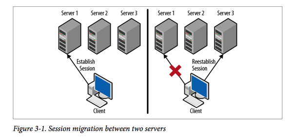

在前一章中，我们使用`zkCli`介绍了基本的Zookeeper操作。在这一章中我们将要看到如何在应用中使用这些API。这里，我们将介绍如何使用Zookeeper API编程，展示如何创建一个Session和实现一个watcher。我们也开始码出master-worker例子。

### Creating a Zookeeper Session
Zookeeper API 是围绕着一个传给每个API调用的Zookeeper 句柄建立的。这个句柄代表了一个和Zookeeper的session。正如图3-1所示，和一个Zookeeper 服务器建立的session，当这个连接断开时，会转移到另一个Zookeeper服务器。只要session 是活跃的，这个句柄就有效，并且Zookeeper 客户端将不断的和服务器保持活跃的连接以使session alive。如果这个句柄被关闭了，Zookeeper 客户端将告诉Zookeeper服务端杀死这个session。如果Zookeeper 决定一个客户端已经死了，它将使得这个session无效。如果一个客户端以后使用无效的session对应的那个句柄来重新连接到Zookeeper 服务器，Zookeeper服务器将会通知客户端，这个session已经无效了，并且这个句柄的所有操作都将返回error。



创建一个Zookeeper句柄的构造器通常是这样的：

````
ZooKeeper(
String connectString,
int sessionTimeout,
 Watcher watcher)
````

在这里：

1. connectString
包含了Zookeeper 服务器的hostname 和 port.

2. sessionTimeout
单位是毫秒.当Zookeeper没有收到客户端的心跳时，Zookeeper宣布一个session死亡之前的等待时间。比如，我们设置这个值为15000，也就是15秒。这意味着，如果Zookeeper 和一个客户端中断交流的时间超过15秒，Zookeeper 将会终止客户端的session。记住，这个时间是有点高的，但是对于我们后面的实验是有用的。一般情况下，Zookeeper session的超时时间为5-10秒。

3. watcher
我们需要创建的用于接收session 事件的对象。因为`Watcher`是一个接口，我们需要实现一个类，然后初始化一个实例，传递给Zookeeper构造器。客户端用`Watcher`接口来监控和Zookeeper session的健康状况。当一个连接建立或者失去和Zookeeper Server的连接，事件都会产生。他们也可以用于监控Zookeeper 数据的改变。最后，如果和Zookeeper的session过期了，一个事件将会通过`Watcher`接口传递来通知客户端应用。

### Implementing a Watcher
为了接收Zookeeper的通知，我们需要实现`Watcher`。更进一步的看一下`Watcher`接口，它有如下的声明：

````
public interface Watcher{
  void process(Watcher watcher);
}
````

我们会大量的使用它，但是现在我们只是简单的打印事件。所以，让我们开始实现`Master`：

````
import org.apache.zookeeper.WatchedEvent;
import org.apache.zookeeper.Watcher;
import org.apache.zookeeper.ZooKeeper;

import java.io.IOException;

/**
 * Created by dengyunhui on 2016/12/8.
 */
public class Master implements Watcher{

    ZooKeeper zk;
    String hostPort;

    Master(String hostPort){
        this.hostPort = hostPort;
    }

    void startZK() throws IOException {
        zk = new ZooKeeper(hostPort,15000,this);
    }

    public void process(WatchedEvent watchedEvent) {
        System.out.print(watchedEvent);
    }

    public static void main(String[] args) throws Exception {
        Master m = new Master("localhost:2181");
        m.startZK();

        /**
         * 一旦我们连接到Zookeeper,有一个后台线程将维护Zookeeper的Session.这个线程是一个守护线程,
         * 这意味着,程序可能退出,即使这个线程仍然是活的.我们sleep一会,这样我们就可以在程序退出之前,看到一些事件.
         */
        Thread.sleep(60000);

    }

}
````

可以看到如下事件:

````
WatchedEvent state:SyncConnected type:None path:null
````

### Running the Watcher Example
如果我们启动Master但是却没有启动Zookeeper服务会发生什么呢？试试，停止Zookeeper服务，然后运行Master。之前输出的最后一行，`WatchedEvent`没有出现。Zookeeper library不能连接到Zookeeper服务器，所以没有告诉我们任何事。

现在启动服务器，启动Master，然后停止服务器但是Master仍在运行。你应该可以看到一个`SyncConnected`事件后跟着一个`Disconnected`事件。

````
WatchedEvent state:SyncConnected type:None path:null
WatchedEvent state:Disconnected type:None path:null
````

当开发者看到`Disconnected`事件，一些人认为他们需要创建一个新的Zookeeper handler重新连接到服务器。不要这样做。你启动服务器，启动Master，然后保持Master运行再停止服务器再启动服务器。你应该会看到`SyncConnected`事件跟着一个`Disconnected`事件在跟着一个`SyncConnected`事件。Zookeeper客户端 library会为你处理好重连到服务的事。不幸的是，网络中断和服务器failure会发生。通常，Zookeeper可以处理这些failures。

记住，Zookeeper也会发生这些failure。Zookeeper服务器可能fail或者失去网络连接，会引起我们模拟的停止Master时的场景。只要Zookeeper服务由至少三个服务器组成，单个服务器的failure不会引起服务停止。相反，客户端在看到`Disconnected`事件后会很快看到一个`SyncConnected`事件。

>  ZooKeeper Manages Connections
>
> Don’t try to manage ZooKeeper client connections yourself. The Zoo‐
Keeper client library monitors the connection to the service and not
only tells you about connection problems, but actively tries to reestablish
communication. Often the library can quickly reestablish the
session with minimal disruption to your application. Needlessly closing
and starting a new session just causes more load on the system and
longer availability outages.

看起来客户端只是在sleeping，但是我们可以看到当事件进来时，有一些事情在后台发生。我们也可以看看在Zookeeper服务端发生了什么。Zookeeper有两个管理接口：JMX和four-letter words。我们在第十章讨论这些接口。现在，我们将使用`stat`和`dump`four-letter words来看看服务器发生了什么。

Server不会kill一个session直到session超时了。当然客户端将不断的延长超时时间只要它保持和Zookeeper server的活跃(active)的连接

当Master停止之后，如果他的session立即消失的话会很好。这就是`Zookeeper.close()`方法做的。一旦`close`方法被调用，Zookeeper对象代表的session被摧毁。

### Getting Mastership
现在我们有了一个session，我们的Master需要获取领导权。我们需要很小心，因为只能有一个master。我们也需要让多个进程运行，以防master fail时成为master。

为了保证只有一个master 进程，我们使用Zookeeper来实现简单的领导选举算法。在这个算法中，所有可能的master尝试创建`/master` znode，但是只有一个会成功。这个成功的进程成为master。

我们需要两个东西来创建`/master`。首先，我们需要znode的初始数据。通常我们放一些关于进程的信息在初始数据里。目前，我们让每一个进程选择一个随机的server id，并且使用这个作为初始数据。我们也需要给新的znode 一个access control list。通常，Zookeeper在一个可信的环境下使用，所以可以使用一个open ACL。

我们想`/master`节点在Master dies时也消失。正如之前提到的，Zookeeper有一个ephemeral znode。我们将定义一个EPHEMERAL znode，他将在创建他的session关闭或无效时自动的被Zookeeper删除。

````
String serverId = Integer.toHexString(random.nextInt());

void runForMaster() {
  zk.create("/master",
  serverId.getBytes(),
  OPEN_ACL_UNSAFE,
  CreateMode.EPHEMERAL);
}
````

然而，我们还没有完成。`create`抛出了两个异常：`KeeperException`和`InterruptedException`。我们需要保证我们处理了这些异常，特别是`ConnectionLossException`(是`KeeperException`的子类)和`InterruptedException`。对于其他的异常，我们可以终止操作，然后继续，但是对于这两个异常，`create`可能已经实际上成功了，所以，如果我们是master,我们需要处理他们。

当一个客户端和一个Zookeeper server失去连接时`ConnectionLossException`发生了。这通常是由于网络异常，比如网络分隔，或者Zookeeper server fail。当这个异常发生时，客户端不知道在Zookeeper server处理之前request是否丢失了，或者已经处理了，但是客户端没有收到response。正如我们之前讨论的，Zookeeper client library会为将来的request重新建立连接，但是进程必须知道一个未决的request是否已经被处理了还是应该重新发起请求。

当客户端线程调用`Thread.interrupt`时引起`InterruptedException`。这可能是部分由于应用shutdown。这个异常只是中断进程中处理的本地客户端请求，使得request在一种未知的状态。

因为两个异常都会引起正常的request处理break，开发者不能假设处理中的request的状态。当处理这些异常时，开发者必须在继续之前知道系统的状态。因为有一个leader 选举，我们不想已经选举除了Master而不知道。如果`create`真的成功了，除非真正的master dies,其他的进程不能成为master，if the acting master doesn't know it has mastership,no process will be acting as the master。

处理`ConnectionLossException`时，我们必须找出哪个进程，如果有的话，已经创建了`/master`znode，并且如果是我们的进程的话则开始leader的角色。我们可以使用`getData`方法。

````
byte[] getData( String path,bool watch,Stat stat)
````

参数说明：

+ path   znode的path
+ watch   表示我们是否想监听将来的返回的数据的改变。如果设置为true我们将会在我们创建Zookeeper handler是设置的`Watcher`对象上得到这个事件。有另一个版本的方法接收一个`Watcher`对象，这个对象将接收改变发生时返回的事件。

````
public static String serverId = Long.toString(new Random().nextLong());

public static boolean isLeader = false;

boolean checkMaster(){
    while (true){
        try{
            Stat stat = new Stat();
            byte[] data = zk.getData("/master",true,stat);
            isLeader = new String(data).equals(serverId);
            return true;
        }catch (KeeperException.NoNodeException e){
            //no master,so try create again
            return false;
        }catch (KeeperException.ConnectionLossException e){

        } catch (InterruptedException e) {
            e.printStackTrace();
        } catch (KeeperException e) {
            e.printStackTrace();
        }
    }
}

void runForMaster() throws InterruptedException{
    while (true){
        try {
            zk.create("/master",serverId.getBytes(),ZooDefs.Ids.OPEN_ACL_UNSAFE, CreateMode.EPHEMERAL);
            isLeader = true;
            break;
        }catch (KeeperException.NodeExistsException e){
            isLeader = false;
            break;
        } catch (KeeperException.ConnectionLossException e){

        }
        catch (KeeperException e) {
            e.printStackTrace();
        }
        if (checkMaster()){
            break;
        }
    }
}
````

In our example, we simply pass the InterruptedException to the caller and thus let it bubble up. Unfortunately, in Java there aren’t clear guidelines for how to deal with thread interruption, or even what it means. Sometimes the interruptions are used to signal threads that things are being shut down and they need to clean up. In other cases, an interruption is used to get control of a thread, but execution of the application continues.

Our handling of InterruptedException depends on our context. If the Interrupte dException will bubble up and eventually close our zk handle, we can let it go up the stack and everything will get cleaned up when the handle is closed. If the zk handle is not closed, we need to figure out if we are the master before rethrowing the exception or asynchronously continuing the operation. This latter case is particularly tricky and requires careful design to handle properly.

所以我们的main方法就变成了：

````
public static void main(String[] args) throws Exception {
    Master m = new Master("localhost:2181");
    m.startZK();

    m.runForMaster();
    if (isLeader){
        System.out.println("I'm the leader");
        Thread.sleep(60000);
    }else {
        System.out.println("Someone else is the leader");
    }

    m.stopZk();
}
````

### Getting Mastership Asynchronously
在Zookeeper中，所有的同步方法都有对应的异步方法。这允许我们在一个线程中发起很多调用。

如下是`create`的异步版本：

````
void create(String path, byte[] data,
        List<ACL> acl,
        CreateMode createMode,
        AsyncCallback.StringCallback cb,
        Object ctx)
````

这个调用会立即返回，通常在`create`请求发送到服务端之前。当`create`请求的结果从服务器返回时，context 参数会通过callback 对象给到应用。

这个方法没有抛出任何异常，这为我们简化了事情。因为我们不用在方法返回之前等待`create`返回，我们不需要担心`InterruptedException`；因为任何request error都被编码在callback对象的第一个参数，我们不需要担心`KeeperException`。callback对象实现了`StringCallback`的这个方法：

````
void processResult(int rc, String path, Object ctx, String name)
````

这个异步方法简单的将request排队。传输发生在另一个线程。当response被接收时，他们在一个专门的callback线程中处理。为了维护顺序，有一个callback线程，并且response以他们接收时的顺序被处理。

参数说明：

+ rc  Returns the result of the call, which will be OK or a code corresponding to a Keep erException

+ path  The path that we passed to the create

+ ctx   The name of the znode that was created

+ name  The name of the znode that was created  

> Callback Processing
>
> Because a single thread processes all callbacks, if a callback blocks, it blocks all callbacks that follow it. This means that generally you should not do intensive operations or blocking operations in a callback. There may be times when it’s legitimate to use the synchronous API in a callback, but it should generally be avoided so that subsequent callbacks can be processed quickly.

### Setting Up MetaData
我们的master-worker设计取决于三个其他的目录:`/task`,`/assign`,`workers`。We can count on some kind of system setup to make sure everything is created before the system is started, or a master can make sure these directories are created every time it starts up.下面的代码片段将创建这些路径。
