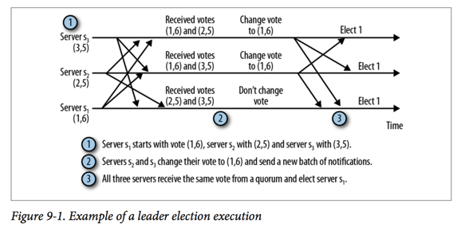
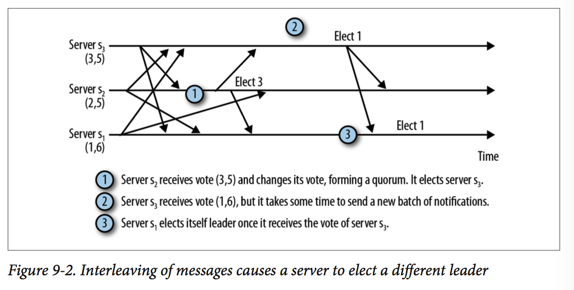
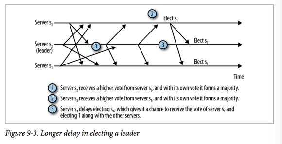
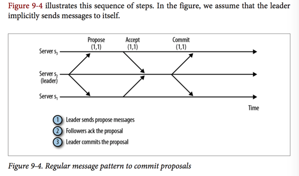
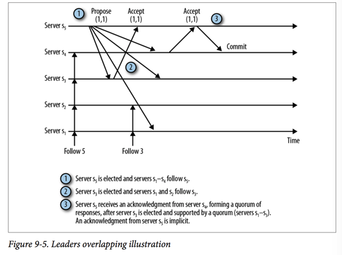
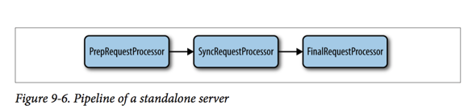
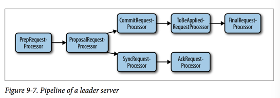
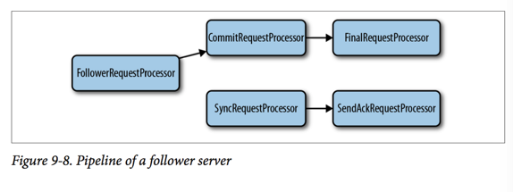

leader:

Follower:

observer:不参与任何数据变更的决定。

Zookeeper 服务器在本地处理读请求。当一个服务器从客户端收到一个读请求，读取状态然后返回客户端。因为他在本地处理读请求，Zookeeper在处理读请求时很快。我们可以增加更多的服务器来增加整体的吞吐能力。

客户端的改变Zookeeper状态的请求被转递到leader。leader处理请求，产生一个状态更新，称为Transaction。请求表示了客户端的执行的方式，Transaction构成了执行这个请求的步骤。

举个例子，比如客户端在一个特定的znode `/z`上提交一个`setData`请求。`setData`应该改变这个znode的数据，并且增加版本号。所以这个请求的transaction包含两个重要的field:znode的新的数据和znode的新的version number。当应用这个transaction时，服务器简单的替换znode中的数据和version number，而不是bump it up。

一个transaction被当做一个单元，它包含的所有的改变必须被原子的应用。当一个ZooKeeper 集群应用一个transaction时，他确保所有的的改变被原子的改变，并且不会干涉其他的transaction。不会像关系型数据库一样有rollback机制。相反，ZooKeeper保证transaction中的步骤不会和其他的transaction干涉。很长一段时间内，这个设计使用一个线程来应用transaction。使用一个线程保证了transaction被顺序的应用而不会彼此干涉。最近，Zookeeper增加了多线程的支持来加快transaction的处理。

一个transaction也是幂等的。就是说，我们可以应用同样的事务两次并且我们可以得到相同的结果。我们甚至可以应用多个事务多次，并且得到相同的结果，只要每次都是同样的顺序。在恢复时，我们利用这种幂等性。

当leader生成一个新的transaction时，他分配一个transaction id给这个transaction，称为zxid。Zxid标识了transaction，所以他们以被leader创建的顺序应用于server。当选举一个新的leader时，servers也交换zxids，所以他们可以决定那个没有出错的server接受了更多的transaction，可以同步他们的状态。

zxid是一个long型的整数，分为两部分:`epoch`和`counter`。每一个部分是32位。epoch和counter的用处会在我们讨论Zab时变得清楚，Zab是我们用于广播状态更新到servers的协议。

### Leader Elections
leader的目的是为改变Zookeeper状态的客户端请求排序:create,setData,delete。leader将每一个request转变为transaction，正如在上一节中解释的，将transaction提议给follower,以被leader提议的顺序应用他们。

为了获得leadership，一个服务器必须获得大部分servers的支持。

选择和支持一个leader的groups必须至少有一个交集。

每一个server启动时都是LOOKING状态，它要么选举一个新的leader，要么找到一个现有的leader。如果leader已经存在，其他的serers告诉这个新的server哪个server是leader。此时，这个新的server连接到leader，保证他的状态和leader的一致。

如果一个集群的server都是LOOKING状态，他们必须通信来选出一个新的leader。赢得选举的server进入LEADING状态，而集群中其他的servers进入FOLLOWING状态。

leader选举信息被称为leader 选举通知。这个协议非常简单。当一个server进入LOOKING状态时，它发送信息到集群中的其他服务器。信息包括当前的`vote`，vote包括server的id(sid)和他最近执行的transaction的zxid。因此(1,5)是一个vote，被一个server id为1和最近执行的zxid为5。(对于leader选举，zxid是一个简单的number，但是在其他的协议中，它表示epoch和counter)。

一旦接收到vote，server改变它的vote，根据下面的规则：

1. 假设`voteId`和`voteZxid`是当前vote中的id和zxid，`myZxid`和`mySid`是接收者自己的Id。

2. 如果`voteZxid > myZxid`或`voteZxid = myZxid && voteId > mySid`，keep the current vote。

3. 否则，更新我的vote，将`myZxid`赋值给`voteZxid`，`mySid`赋值给`voteId`。


````
/*
 * We return true if one of the following three cases hold:
 * 1- New epoch is higher
 * 2- New epoch is the same as current epoch, but new zxid is higher
 * 3- New epoch is the same as current epoch, new zxid is the same
 *     as current zxid, but server id is higher.
 */
````

很快的，最新的server赢得选举，因为他有最近的zxid。如果多个server有最近的zxid，sid最大的那个赢得选举。

一旦一个server从集群中的大部分服务器接收到相同的vote，这个Server宣称leader已经选出了。如果这个选出的leader是这个server自己，它开始执行leader角色。否则，它成为一个follower并且开始连接到这个选出的leader。不保证follower可以连接到这个选出的leader。例如，这个选出的leader可能crash了。一旦它连接了，follower和leader同步状态，只有在同步状态之后，follower才可以开始处理新的请求。

> Looking for a Leader
>
> The Java class in ZooKeeper that implements an election is QuorumPeer. Its run method implements the main loop of the server. When in the LOOKING state, it executes lookForLeader to elect a leader. This method basically executes the protocol we have just discussed. Before returning, the method sets the state of the server to either LEAD ING or FOLLOWING. OBSERVING is also an option that will be discussed later. If the server is leading, it creates a new Leader and runs it. If it is following, it creates a new Follower and runs it.

我们举个例子，图9-1中三个服务器，每一个开始一个不同的vote，对应服务器的id和最近的zxid。



不是所有的执行都是像图9-1中的。在图9-2中，我们展示了一个例子，s2做了过早的决定，从s1和s3中选择了不同的leader。This happens because the network happens to introduce a long delay in de‐ livering the message from s1 to s2 that shows that s1 has the higher zxid. In the meantime, s2 elects s3. In consequence, s1 and s3 will form a quorum, leaving out s2.



让s2选出不同的leader不会引起服务行为错误，因为s3不会响应s2作为leader。最后s2将在获得他作为选出的leader的响应时超时，然后重试（leader选举出来之后，follower会主动的连接到leader,leader会等待数量quorum(假如集群中有3个server,那么quorum为2.在这里只有s2会连接到s1和s3，所有他们都不会获得领导地位,详情请见`Leader.waitForEpochAck()`方法)的follower连接到它，如果没有连接到的话则会放弃leader角色，重新开始选举）。重试时，意味着，在这段时间内，s2不能处理客户端请求。

从这个例子里的一个简单的观察是，如果s2等待再长一点的时间来选举一个leader，它可能做出正确的选择。在图9-3里展示了这种情况。但是很难知道server应该等待多长的时间。目前的`FastLeaderElection`的实现（默认的leader election实现），使用一个固定的值:200ms。这个值比期望的消息延迟要长，但是不必recovery time长。如果这个延迟(200ms)不够长，一个或多个servers将会错误的选出一个leader，所以server将会重新开始选举。Falsely electing a leader might make the overall recovery time longer because servers will connect and sync unnecessarily, and still need to send more messages to elect another leader.

这里的意思是说，如果一个server之前投票给了一个leader,那么在投票给下一个leader之前会等待200ms。

````
// Verify if there is any change in the proposed leader
while((n = recvqueue.poll(finalizeWait,
        TimeUnit.MILLISECONDS)) != null){
    if(totalOrderPredicate(n.leader, n.zxid, n.peerEpoch,
            proposedLeader, proposedZxid, proposedEpoch)){
        recvqueue.put(n);
        break;
    }
}
````



为了实现新的leader选举算法，我们需要实现`quorum`包下的`Election`接口。To enable users to choose among the leader election implementations available, the code uses simple integer identifiers (see QuorumPeer.createElectionAlgorithm()). The other two implementations available currently are LeaderElection and AuthFastLeaderElection, but they have been deprecated as of release 3.4.0, so in some future releases you may not even find them.

### Zab:Broadcasting State Updates
一旦接收到一个写请求，follower转发给leader。leader执行这个请求，然后将执行结果广播，作为状态更新，用transaction的形式。

下一个问题是一个server如何决定一个transaction已经commit了。这引出了一个协议称为Zab:`the Zookeeper Atomic Broadcast Protocol`。假设有一个活跃的leader，并且它有 a quorum of followers支持他的领导权，commit 一个 transaction的协议是很简单的，类似于一个两阶段提交：

1. leader 发送一个PROPOSAL 消息，p，到所有的followers。

2. 一旦接收到p,follower回复一个`ACK`给leader，通知leader它已经接受了这个提议。

3. 一旦接收到a quorum的follower的`ACK`，leader发送一个信息通知follower commit 这个transaction。



在回复`ACK`之前，follower需要执行两个额外的检查。follower需要检查这个提议是来自当前following的leader，并且以leader广播的同样顺序ACK和commit transaction。

Zab 保证两个重要的特性：

+ If the leader broadcasts T and Tʹ in that order, each server must commit T before committing Tʹ .

+ If any server commits transactions T and Tʹ in that order, all other servers must also commit T before Tʹ .

第一个特性保证transactions在多个服务器间以同样的顺序传递，而第二个特性保证服务器不会跳过transactions。考虑到transactions是state update，并且每一个state update取决于前一个state update，跳过transactions可能导致不一致。两阶段提交保证transactions的顺序。Zab在a quorum of servers上记录一个transaction。a quorum 必须在leader提交之前,确认(ACK)一个transaction，并且a follower在磁盘上记录它已经ACK了这个transaction。

正如我们在"Local Storage"上看到的，transaction可能任然在一些server而不再另一些上，因为在写transaction到Storage时，server可能fail。Zookeeper可以将所有的server更新到最新，当一个新的quorum被创建以及一个新的leader被选举出来。

Zookeeper并没有期望一直只有一个leader。leader可能crash，或者变得暂时失去连接，所以server可能需要选出一个新的leader，保证系统是可用的。`epoch`表示领导权随着时间的改变。一个epoch表示一个特定的server执行领导的时期。在一个epoch之间，一个leader广播提议和id到每一个，根据一个counter。记得，一个zxid包括一个`epoch`和`counter`，所以每一个zxid可以很容易的和transaction在哪个epoch被创建的联系起来。

epoch number在每一个新的leader被选举出来时增加。同一个server可能是不同的epoch的leader，但是对于协议来说，一个server在不同的epoch执行领导权被当做不同的leader。

Recording accepted proposals in a quorum is critical to ensure that all servers eventually commit transactions that have been committed by one or more servers, even if the leader crashes.完美的检测leader crash是很难的，如果不能检测，在很多的设置里，可能会错误的怀疑leader已经crash了。

实现一个广播协议的最困难的部分和同时出现的leader有关，在split-brain的场景下不是必须的。多个同时出现的leader可能使得server无序的commit transactions或者跳过transactions，使得Server处于不一致的状态。阻止两个服务器都认为他们是leader是很难的，所以广播协议不能依赖于这个假设。为了get around这个问题，Zab保证：

+ 一个选举出来的leader已经commit了所有的transactions,并且在开始广播新的transactions之前，会commit来自前一个epoch的transactions。

+ 两个servers任何时候都不可能有a quorum of supporters。就是说任何时候都只有一个server有超过半数的支持者。

为了实现第一个要求，leader在它确保a quorum of servers agrees on the state it should start with for the new epoch之前都是不可用的（因为state是由transactions改变的，所以state就代表了已经commit的transactions，所以这句话的意思是确保a quorum of servers和leader已经commit的transactions一样）。一个epoch的初始状态必须包含他之前已经提交过得所有的transactions，可能包括之前已经接受的(ACK)但是还没提交的(Commit)。在leader开始提出任何新的提议之前（比如是epoch e），它已经提交了epoch e-1 之前所有的提议。如果有一个来自e1 的提议没有被leader在e(e1 < e)提出第一个新的提议之前提交，那么旧的提议永远不会被提交。

第二个点很棘手，因为不能阻止两个leader独立的运行。比如leader l正在行使领导权，广播transactions。某个时刻，a quorum of servers Q相信l已经crash 了，它开始选举一个新的leader l1。假如transaction T在Q抛弃 l时被广播，并且Q中的大部分server已经记录了T。在l1被选举出来后，很多不在Q中的server也记录了T，形成了a quorum for T。在这种情况下，T在l1被选举出来之后也会被commit。但是不要担心，这不是bug。Zab保证T是被l1提交的协议的一部分，通过保证l1的supporters至少包含一个已经ACK T的follower。重要的点是，l1和l没有同时有a quorum of supporters。

图9-5说明了这种场景。在图中，l是server s5,l1是server s3，Q由s1,s2,s3组成，T的zxid是（1，1）。在接收到第二个ACK之后，s5可以发送commit信息到s4，告诉s4提交这个transaction。其他的servers忽略来自s5的消息，一旦他们开始following s3。注意到，s3 ACK了(1,1),所以当它取得领导权时，它知道了这个transaction。



我们刚刚承若Zab保证新的leader l不会丢失(1,1),但是他是如何做到呢？在变得active之前，新的leader l1必须知道旧的quorum的server已经accepted的所有的提议，它必须承若这些servers不会在接收到之前leader的提议。这图9-5的例子中，组成quorum和支持l1的servers承若不会在接收到任何来自leader l的提议。At that point, if leader l is still able to commit any proposal, as it does with m1,1m, the proposal must have been accepted by at least one server in the quorum that made the promise to the new leader. Recall that quorums must overlap in at least one server, so the quorum that l uses to commit and the quorum that lʹ talks to must have at least one server in common. Consequently, lʹ includes m1,1m in its state and propagates it to its followers.

回想一下，当选举leader时，servers选择zxid最大的那个。这使得Zookeeper不必从followers传输提议到leader；它只需要从leader传输状态到followers。假如，我们至少有一个follower已经接受了一个leader没有接受到的提议。在开始同步到其他follower之前，leader需要receive and accept 这个提议。然而，如果我们选择zxid最大的server，那么我们完全可以跳过这个步骤，直接将followers更新到最新。

当处于两个epoch的过渡期时，Zookeeper使用两个不同的方式来更新followers，为了优化过程。如果follower不是太落后与leader，leader简单的发送丢失的transactions。他们都是最近的transactions，因为followers以严格的顺序接收所有的transactions。这个更新被称为`DIFF`。如果follower落后太多，Zookeeper使用一个full snapshot 传输，称为`SNAP`。做一个full snapshot传输增加了recovery时间，所以发送一些丢失的transactions更好，但是不是总是更好，如果follower落后太多的话。

leader发送给follower的`DIFF`对应于leader的transaction log中的提议，然而，`SNAP`是leader有的最近的有效的快照。

>Diving into the Code
>
>Here is a small guide to the code. Most of the Zab code is in Leader, LearnerHandler, and Follower. Instances of Leader and LearnerHan dler are executed by the leader server, and Follower is executed by followers. Two important methods to look at are Leader.lead and Follower.followLeader. They are actually the methods executed when the servers transition from LOOKING to either LEADING or FOLLOW ING in QuorumPeer.
>
>For DIFF versus SNAP, follow the code in LearnerHandler.run to see how the code decides which proposals to send during a DIFF, and how snapshots are serialized and sent.

选举过程完成之后，Follower会主动连接到leader,leader为每一个follower创建一个LearnerHandler。Leader会等待quorum的follower连接到它，如果没有等到的话，就会退出lead过程，开始一轮leader选举：

````
Leader.waitForEpochAck():

QuorumVerifier verifier = self.getQuorumVerifier();
if (electingFollowers.contains(self.getId()) && verifier.containsQuorum(electingFollowers)) {
    electionFinished = true;
    electingFollowers.notifyAll();
} else {    

// We have to get at least a majority of servers in sync with
// us. We do this by waiting for the NEWLEADER packet to get
// acknowledged
try {
    waitForNewLeaderAck(self.getId(), zk.getZxid(), LearnerType.PARTICIPANT);
} catch (InterruptedException e) {
    shutdown("Waiting for a quorum of followers, only synced with sids: [ "
            + getSidSetString(newLeaderProposal.ackSet) + " ]");
    HashSet<Long> followerSet = new HashSet<Long>();
    for (LearnerHandler f : learners)
        followerSet.add(f.getSid());

    if (self.getQuorumVerifier().containsQuorum(followerSet)) {
        LOG.warn("Enough followers present. "
                + "Perhaps the initTicks need to be increased.");
    }
    Thread.sleep(self.tickTime);
    self.tick++;
    return;
}
````

同时在Leader运行过程中也会检查follower的数量是否符合quorum,如果不符合也会退出lead过程。同时，Leader每半个tick发送消息到所有的learners，learner收到PING消息后要发送回复给Leader。每收到Follower的消息时，便更新下一次消息的过期时间，代码在`LeaderHandler::run()`:

````
public void run() {
    ......
    while (true) {
        qp = new QuorumPacket();
        ia.readRecord(qp, "packet");
        ......
        // 收到Follower的消息后
        // 设置下一个消息的过期时间
        tickOfNextAckDeadline = leader.self.tick.get() + leader.self.syncLimit;
        ......
    }
    ......
}
````

Leader节点也会检测Follower节点的状态，如果多数Follower节点不再响应Leader节点（可能是Leader节点与Follower节点之间产生了网络分区），那么Leader节点可能此时也不再是合法的Leader了，也必须要进行一次新的选主。

````
void lead() throws IOException, InterruptedException {
    ......
    while (true) {
        ......
        // 判断每个每个Follower节点的状态
        // 是否与Leader保持同步
        for (LearnerHandler f : getLearners()) {
            if (f.synced()) {   
                syncedAckSet.addAck(f.getSid());
            }
        }
        ......
    }
    if (!tickSkip && !syncedAckSet.hasAllQuorums()) {
        // 如果失去了大多数Follower节点的认可，就跳出Leader主循环，进入选主流程
        break;
    }
    ......
}

// LearnerHandler::synced()逻辑
// 即判断当前是否已经过了期望得到的Follower的下一个消息的期限：tickOfNextAckDeadline
public boolean synced() {
    return isAlive() && leader.self.tick.get() <= tickOfNextAckDeadline;
}
````

通过这两个检查，可以确保Leader有quorum的支持者。

````
if (!tickSkip && !self.getQuorumVerifier().containsQuorum(syncedSet)) {
  //if (!tickSkip && syncedCount < self.quorumPeers.size() / 2) {
      // Lost quorum, shutdown
      shutdown("Not sufficient followers synced, only synced with sids: [ "
              + getSidSetString(syncedSet) + " ]");
      // make sure the order is the same!
      // the leader goes to looking
      return;
}
````

### Observers
Observers和followers在一些方面有相同点。特别的，他们commit 来自leader的提议。不像followers，Observers不参与投票过程。他们只是简单的学习通过`INFORM`消息已经commit的提议。followers和Observers都被称为learners因为leader告诉他们关于状态的改变。

> Rationale Behind INFORM Messages
>
> Because observers do not vote to accept a proposal, a leader does not send proposals to observers, and the commit messages that leaders send to followers do not contain the proposal itself, only its zxid. Consequently, just sending the commit message to an observer does not enable the observer to apply the proposal. That’s the reason for using INFORM messages, which are essentially commit messages containing the proposals being committed.

> In short, followers get two messages whereas observers get just one. Followers get the content of the proposal in a broadcast, followed by a simple commit message that has just the zxid. In contrast, observers get a single INFORM message with the content of the committed proposal.

参与投票，决定哪个提议committed的servers被称为`PARTICIPANT` servers。一个`PARTICIPANT`Server要么是leader，要么是follower。Observers，相反的，被称为`OBSERVER` servers。

有observers的一个主要原因是扩展读请求。通过添加更多的observers，我们可以服务更多的读请求而不用牺牲写请求的吞吐量。注意，写的吞吐量由quorum 大小决定。如果我们添加更多的可以投票的servers，我们可以等到更大的quorums,这会减小写的吞吐。然而，添加observers，不是完全没有成本的；每一个新的observer在每次commit transition时引入一个额外的消息成本。这个成本比添加可以投票的server的成本小。

observers的另一个原因是跨多个数据中心部署。将participants跨数据中心部署可能会显著的让系统变慢，因为数据中心的连接的延迟(the latency of links connecting data centers)。有了observers，更新请求可以以高吞吐和低延迟的方式在一个数据中心执行，并且传送到其他数据中心所以位于其他地方的客户端可以消费他们。注意，使用observers并没有消除跨数据中心的网络消息，因为observers需要转发更新请求到leader和处理`INFORM`消息。It instead enables the messages necessary to commit updates to be exchanged in a single data center when all participants are set to run in the same data center.

### The Skeleton of a Server
Leader,Followers,Observers 归根到底都是servers。每一个server都是请求处理器(request processor)。A request processor is an abstraction of the various stages in a processing pipeline, and each server implements a sequence of such request processors.我们可以将每一个processor当作添加到request处理中的一个元素。在被server的pipeline中所有的processors处理之后，一个特定的request可以被认为是完全处理了。

> Request Processors
>
> ZooKeeper code has an interface called RequestProcessor. The main method of the interface is processRequest, which takes a Request parameter. In a pipeline of request processors, the processing of requests for consecutive processors is usually decoupled using queues. When a processor has a request for the next processor, it queues the request, where it can wait until the next processor is ready to consume it.

### Standalone Servers
在Zookeeper中最简单的pipeline是standalone server（class ZookeeperServer,no replication）。图9-6展示了这种类型的server的pipeline。它有三个request processors:`PrepRequestProcessor`,`SyncRequestProcessor`,`FinalRequestProcessor`。



PrepRequestProcessor accepts a client request and executes it, generating a transaction as a result. Recall that the transaction is the result of executing an operation that is to be applied directly to the ZooKeeper data tree. The transaction data is added to the Request object in the form of a header and a transaction record. Also, note that only operations that change the state of ZooKeeper induce a transaction; read operations do not result in a transaction. The attributes referring to a transaction in a Request object are null for read requests.

The next request processor is SyncRequestProcessor. SyncRequestProcessor is re‐ sponsible for persisting transactions to disk. It essentially appends transactions in order to a transaction log and generates snapshots frequently. We discuss disk state in more detail in the next section of this chapter.

The next and final processor is FinalRequestProcessor. It applies changes to the Zoo‐ Keeper data tree when the Request object contains a transaction. Otherwise, this pro‐ cessor reads the data tree and returns to the client.

### Leader Servers
当我们切换至quorum 模式，server的pipeline有一点改变。图9-7说明了：



第一个processor仍然是`PrepRequestProcessor`，但是之后的processor变成了`ProposalRequestProcessor`。它准备proposal,并且发送它们到followers。`ProposalRequestProcessor`转发所有的请求到`CommitRequestProcessor`，此外，将写请求转发到`SyncRequestProcessor`。`SyncRequestProcessor`将transaction持久化到磁盘。它触发`AckRequestProcessor`而结束，`AckRequestProcessor`是一个简单的生成一个ACK到自己的processor。正如我们之前提到的，leader期望从quorum中的每一个server获得ACK，包括自己。`AckRequestProcessor`就是做这个。

`ProposalRequestProcessor`之后的另一个processor是`CommitRequestProcessor`。`CommitRequestProcessor`commit 已经接收到足够ACK的提议。

最后一个processor是`FinalRequestProcessor`，和standalone模式下的一样。`FinalRequestProcessor`applies update request and executes read request。Before FinalRequestProcessor, there stands a simple request processor that removes elements of a list of proposals to be applied. This request processor is called ToBeAppliedRequestProcessor. The list of to-be-applied requests contains requests that have been acknowledged by a quorum and are waiting to be applied. The leader uses this list to synchronize with followers and adds to this list when processing acknowledgments. ToBeAppliedRequestProcessor removes elements from this list after processing the request with FinalRequestProcessor.

Note that only update requests get into the to-be-applied list that ToBeAppliedRequest Processor removes items from. ToBeAppliedRequestProcessor does not do any extra processing for read requests other than processing them with FinalRequestProcessor.

### Follower and Observer Servers
我们讨论一下followers(类`FollowerRequestProcessor`)。图9-8展示了follower使用的request processors。



我们从`FollowerRequestProcessor`开始，它接收和处理客户端请求。`FollowerRequestProcessor`转发request到`CommitRequestProcessor`，也转发写请求到leader。`CommitRequestProcessor`直接转发读请求到`FinalRequestProcessor`，而对于写请求，`CommitRequestProcessor`在转发到`FinalRequestProcessor`之前等待commit.

当leader接收到一个新的写请求时，直接接收到或者通过一个learner，它生成一个提议，并且转发提议给他的followers。一旦接收到提议，a follower发送到`SyncRequestProcessor`。`SyncRequestProcessor`处理request,记录日志到磁盘，转发到`SendAckRequestProcessor`。`SendAckRequestProcessor`向leader确认这个提议。在leader接收到足够多的ACK来commit 提议，leader发送commit 消息到follower(并且发送`INFORM`消息到Observers)。一旦接收到commit 消息，follower使用`CommitRequestProcessor`处理它。

为了保证执行的顺序，`CommitRequestProcessor`推迟pending request的处理，一旦它遇到一个写请求。这意味着，任何的在一个写请求接收到之后的读请求都会阻塞，直到写请求传递给`CommitRequestProcessor`。通过等待，它保证了请求以接收到的顺序执行。

Observers的request pipeline和follower的很相似。但是因为Observers不需要ACK 提议，他不需要发送ACK消息回leader，或者持久化transaction到磁盘。

### Local Storage
我们已经提到了transaction log和snapshots,已经`SyncRequestProcessor`是处理写提议的processor。

#### Logs and Disk Use
回想到，servers使用transaction log来持久化transactions。在accept一个提议之前，server(follower 或 leader)持久化提议中的transaction到transaction log，transaction log是一个本地磁盘上的文件，transaction顺序追加（append）到这个文件。Every now and then, the server rolls over the log by closing the current file and creating a new one.

因为写入transaction log是写请求的一个重要的部分，Zookeeper需要很高效。在磁盘上追加到文件可以很高效，但是Zookeeper有两个诀窍使得它很快：group commits 和 padding。`Group Commits`是在一个写磁盘中追加多个transactions。这允许许多transactions可以被持久化，以一次磁盘寻道的代价。

持久化transaction到磁盘有一个很重要的警告。现代操作系统通常cache dirty pages，并且异步将它们写入磁盘。然而，我们需要保证在我们继续之前，transaction已经持久化了。结果，我们需要`flush`transaction到磁盘。flushing 仅仅意味着我们告诉操作系统将dirty pages写入磁盘并且在操作完成时返回。因为我们在`SyncRequestProcessor`里持久化transaction，这个processor负责flush。当到了flush一个transaction到磁盘时，我们实际上为所有的处于队列中的transaction实现了group commit优化。如果有一个transaction 处于队列中，processor仍然执行flush。processor不会等待更多的排队的transactions，因为这样可能会增加执行延迟。For a code reference, check SyncRequestProcessor.run().

> Disk Write Cache
>
> A server acknowledges a proposal only after forcing a write of the transaction to the transaction log. More precisely, the server calls the commit method of ZKDatabase, which ultimately calls FileChannel.force. This way, the server guarantees that the transaction has been persisted to disk before acknowledging it. There is a caveat to this observation, though. Modern disks have a write cache that stores da‐ ta to be written to disk. If the write cache is enabled, a call to force does not guarantee that, upon return, the data is on media. Instead, it could be sitting in the write cache. To guarantee that written data is on media upon returning from a call to FileChannel.force(), the disk write cache must be disabled. Operating systems have different ways of disabling it.

`Padding`是预分配磁盘块给文件。这样，对于块分配的文件系统元数据(metadata)的更新不会显著的影响文件的顺序写。如果transaction以很高的速度被追加到log，并且如果块没有预分配给文件，当它写到文件的最后一个块时，文件系统需要分配一个新的块。这将引入至少两个磁盘寻道：一个是更新metadata,另一个是返回文件。

为了避免和其他的写干涉，我们强烈推荐你写transaction log到一个独立的设备。第二个设备可以用于操作系统文件和snapshots。

### Snapshots
Snapshot是Zookeeper data tree的拷贝。每个server经常抓取data tree的快照，通过序列化整个data tree并且将它写入一个文件。servers 不需要协调的抓取快照，也不需要停止处理requests。因为servers在抓取快照时，仍然执行requests,当快照抓取好时，data tree改变了。我们称这样的快照为`fuzzy`，因为他们不需要反映某个特别时刻Data tree的真实状态。

我们看一个例子。假设一个data tree 只有两个znode：`/z`和`/z1`。最初，`/z`和`/z1`的数据都是1。现在考虑如下顺序的步骤：

1. 开始抓取快照

2. Serialize 并且写入`/z = 1`到快照

3. 设置`/z`的数据为2（transaction T）

4. 设置`/z1`的数据为2（transaction T1）

5. Serialize 并且写入`/z1 =2 `到快照

这个快照包含`/z =1,/z1 =2`。但是在时间上没有任何一个点，两个znode的值是这样的。然而，这不是一个问题，因为server replay transactions。它以快照开始时已经提交的最后一个transaction（称它为TS）为每一个快照打标签(比如lastZxid)。如果server最终load 这个快照，他重放(replay)TS之后的所有的transactions。在上述情况下，有T和T1。在replay T和T1之后，server获得`/z =2,/z1=2`，它是一个有效的状态。

An important follow-up question to ask is whether there is any problem with applying Tʹ again because it had already been applied by the time the snapshot was taken. As we noted earlier, transactions are idempotent, so as long as we apply the same transactions in the same order, we will get the same result even if some of them have already been applied to the snapshot.

### Servers and Sessions
Session是Zookeeper里一个重要的抽象。顺序保证，ephemeral znode，watch和session紧密耦合。Session追踪机制对于Zookeeper很重要。

Zookeeper servers的一个重要的任务就是追踪session。单个server以standalone 模式运行时，追踪所有的session，leader在quorum模式时追踪他们。leader server和standalone server实际上运行同样的session 追踪器(see SessionTracker and SessionTrackerImpl)。Follower server只是简单的转发所有连接到它的客户端的session信息到leader。

为了保持一个session alive，server需要接收来自session的心跳。心跳以新的request的形式或直接的ping 信息(see LearnerHandler.run())。在这两种情况下，server `touch` session，通过更新session的过期时间(see SessionTrackerImpl.touchSession())。在quorum模式，leader发送一个PING消息到learners，这些learners发送回自从上一次PING依赖已经touch的sessions。leader每 half a tick发送ping 消息到learners。a tick是Zookeeper中使用的最小色时间单元，以毫秒数表示。所以，如果tick是2秒，那么leader每秒发送一个ping消息。

两个重要的点管理session过期。一个数据结构称为`expiry queue`以过期的目的保存session信息。这个数据结构以buckets保存Sessions，每一个bucket对应一个时间区间，在这个时间区间内session被认为会过期，and the leader expires the sessions in one bucket at a time.为了决定哪个bucket过期，如果有的话，一个线程检查这个`expiry queue`来找出下一个deadline是什么时候。这个线程sleep直到这个deadline，并且当它被唤醒时，它查询`expiry queue`获取要过期的sessions。

````
HashMap<Long, SessionSet> sessionSets = new HashMap<Long, SessionSet>();// expiry queue

long expireTime = roundToInterval(System.currentTimeMillis() + timeout);
s.tickTime = expireTime;
set = sessionSets.get(s.tickTime);

private long roundToInterval(long time) {
    // We give a one interval grace period
    return (time / expirationInterval + 1) * expirationInterval;
}

从上面的代码可以看出，sessionSets的key是过期时间，SessionSet就是在这个时间内过期的Session。
````

为了维护buckets，leader将时间分为`expirationInterval`单元，and assigns each session to the next bucket that expires after the session expiration time.The function doing the assignment essentially rounds the expiration time of a session up to the next higher interval. More concretely, the function evaluates this expression to determine which bucket a session belongs in when its session expiration time is updated:

````
(expirationTime / expirationInterval + 1) * expirationInterval
````

举例说明，假设`expirationInterval`是2,一个给定session的`expirationTime`是10。我们分配这个session到bucket 12(`(10/2 + 1) * 2`)。记住，当我们touch session时，`expirationTime`会增加，所以我们移动session到对应的bucket。

使用bucket的一个重要原因是减少检查session过期的开支。Zookeeper 部署可能有上千个客户端，结果就有上千个sessions。在这种情况下，以细粒度的方式检查session 过期是不适合的。如果`expirationInterval`太短，Zookeeper以细粒度的方式检查session 过期。`expirationInterval`目前是一个tick，通常是秒。

### Servers and Watches
watch是一次性触发器，被read 操作设置，每一个watch通过一个特殊的操作被触发。为了管理服务端的Watches，Zookeeper实现了一个watch managers。一个`WatchManager`的实例负责保存当前注册的watch以及触发它们。所有类型的Servers(standalone,leader,follower,observer)以同样的方式处理watch。

`DataTree`类为child watches保存了一个watch manager，为data watches保存了另一个watch manager。当处理一个设置watch的读操作时，这个类添加这个watch到manager的watch 列表。相似的，当处理一个transaction时，这个类找出对应的更改是否要触发任何watch。如果有watch需要触发，这个类调用manager的触发器方法。添加watch和触发watch和一个read request或transaction的执行开始。

server端的watch 触发被传递到客户端。负责这个的类是server的`cnxn`对象(`ServerCnXn`),它表示客户端和server的连接，并且实现了`Watcher`接口。`Watcher.process`方法序列化watch event到一种格式，可以被用于通过光缆传输。Zookeeper客户端接收到序列化的watch event，转换会一个watch event，传送给应用。

Watch只在内存中追踪了。他们没有持久化到磁盘。当客户端和服务器失去连接后，它的所有watch从内存中移除了。因为客户端 library也会记录他们未完成的watch，他们将重新建立任何未完成的watch到一个新的他们连接到的server。

### Clients
There are two main classes in the client library: ZooKeeper and ClientCnxn.

### Serialization
For the serialization of messages and transactions to send over the network and to store on disk, ZooKeeper uses Jute, which grew out of Hadoop. Now the two code bases have evolved separately. Check the org.apache.jute package in the ZooKeeper code base for the Jute compiler code. (For a long time the ZooKeeper developer team has been dis‐ cussing options for replacing Jute, but we haven’t found a suitable replacement so far. It has served us well, though, and it hasn’t been critical to replace it.)

The main definition file for Jute is zookeeper.jute. It contains all definitions of messages and file records. Here is an example of a Jute definition we have in this file:

````
module org.apache.zookeeper.txn {
    ...
class CreateTxn {
  ustring path;
  buffer data;
  vector<org.apache.zookeeper.data.ACL> acl;
  boolean ephemeral;
  int parentCVersion;
  }
  ...
}    
````
