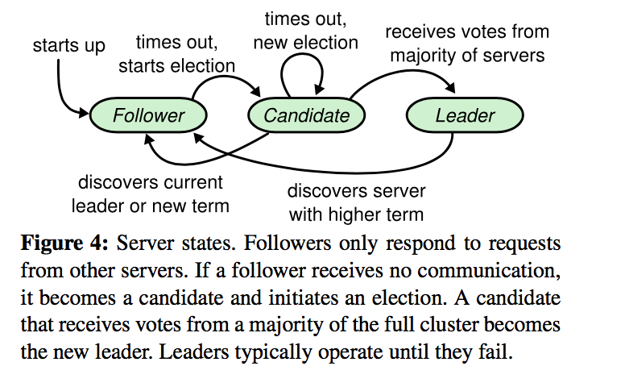

## 1. Introduction
Raft和现有的一致性算法在很多地方有相似之处，但是它有几个新颖的特性：

+ Strong leader：Raft比其他一致性算法使用了一个更强形式的leadership。例如，log entries only flow from the leader to other servers。这简化了replicated log的管理，使得Raft更容易理解。

+ Leader election:Raft使用randomized timers于领导选举。这仅仅在任何一致性算法已经要求的心跳机制上添加了一点点功能，但是却简单快速的解决了冲突。

+ Membership Changes: Raft使用一个新的joint consensus 算法用于集群中服务器的改变，在过渡期内，在两种不同配置的大部分重叠。这允许集群在配置更换的过程中继续正常的运行。

## 2. Replicated State machines
一致性算法通常在Replicated State machines的context下提出。在这种方法中，一系列服务器上的状态机计算同一个状态的相同拷贝，即使有一些服务器宕机了也能继续运行。Replicated State machines被用于解决分布式系统中的各种fault tolerance问题。Replicated State machines的例子包括Chubby和Zookeeper。

Replicated State machines通常使用一个replicated log来实现，如下图1所示。每一个server存储一个包含一系列命令的log，state machine顺序执行这些命令。每一个log包含了同样顺序的同样的命令，所以每一个state machine处理同样序列的命令。因为state machine是确定性的，每一个计算同样的状态和同样顺序的输出。

一致性算法的工作是保持replicated log的一致性。服务器上的一致性模块从客户端接收命令，将它们添加到log。它和其他服务器上的一致性模块通信来保证每一个log最终包含同样顺序的同样请求，即使某些服务器fail了。一旦命令正确的复制了，每一个服务器上的state machine以log 顺序处理它们，输出返回至客户端。结果，服务器集群似乎形成了一个单个的高可靠性的state machine。

实际系统的一致性算法通常有如下特性：

+ 它们保证所有非拜占庭情况下的safety(永远不会返回一个错误的结果)，包括网络延迟，网络隔离（partitions），数据报丢失（packet loss），重复和重排序。

+ 只要服务器的大多数是运转的，并且可以彼此通信以及和客户端通信，那么他们是完全可用（available）的。因此，一个典型的有5个服务器的集群，可以容忍任何两个服务器的failure。如果服务器关机了，那么被认为是fail的；它们可能稍后从稳定存储中的state恢复重新加入集群。

+ 他们不依赖于timing来保证logs 的一致性：错误的时钟和极端的消息延迟可能，最坏的情况是，引起可用性（availability）问题。

+ 通常情况下，只要集群的大部分已经回复了一轮远程过程调用，一个命令就可以认为是完成了；小部分缓慢的服务器不需要影响整体系统的性能

## 3. The Raft consensus algorithm
Raft是一个管理replicated log的算法。下图简要的总结了Raft一致性算法(不包括Membership changes和log compaction)。

### State
在`State`这一张图片我们可以看到，所有的servers在回复RPCs之前都会将以下状态持久化到稳定存储：

+ `currentTerm` server当前的term(初始为0，单调递增)。

+ `votedFor` 在当前term内vote的candidateId(如果没有，则为null)

+ `log[]` log entries;每一个entry包含了command和term。

所有的servers上的变化(volatile)的状态:

+ `commitIndex` 已经committed的log entry的最大的index（初始为0，单调递增）

+ `lastApplied` 已经应用于state machine的log entry的最大的index（初始为0，单调递增）

leader上的变化(volatile)的状态（每次选举之后重新初始化）：

+ `nextIndex[]`  for each server,index of the next log entry to send to that server(initialized to leader last log index + 1)

+ `matchIndex[]` for each server,index of highest log entry known to be replicated on server(initialized to 0,increases monotonically)

### AppendEntries RPC
AppendEntries RPC由leader执行来复制log entries,也被用于心跳。

#### 参数
+ `term`  leader的term

+ `leaderId`  leader的id,这样follower就可以重定向client的请求到leader

+ `prevLogIndex`  新的log entry的前一个entry的index。

+ `prevLogTerm`   `prevLogIndex`的term

+ `entries[]`   将要存储的log entries（用于心跳时为空，为了效率可能会发送多个entries）

+ `leaderCommit` leader的commitIndex

#### 返回值
+ `term`   currentTerm，leader用于更新自己

+ `success`   如果follower包含符合`prevLogIndex`和`prevLogTerm`的entry，为true

#### 接收者执行
通过以上，我们可以知道每一个server都会存储`currentTerm`,`votedFor`等信息。

1. 如果`term`小于接收者上存储的`currentTerm`，返回false.

2. 如果接收者的log不包含符合`prevLogIndex`和`prevLogTerm`的entry,返回false.

3. 如果一个现有的entry和一个新的entry冲突(相同的index,不同的terms),删除这个现有entry以及之后所有的entries。

4. Append any new entries not already in the log

5. 如果`leaderCommit`大于接收者存储的`commitIndex`,设置`commitIndex`为`min(leaderCommit,index of last new entry)`

### RequestVote RPC
candidates执行来收集投票

#### 参数
+ `term`  candidate的term

+ `candidateId`  

+ `lastLogIndex`  candidate的最后一个log entry的index

+ `lastLogTerm`  candidate的最后一个log entry的term

#### 返回值
+ `term`  currentTerm,candidate用于更新自己

+ `voteGranted`  true意味着candidate接收到一个投票

#### Receiver implementation
1. 如果`term`小于接收者存储的`currentTerm`，返回false.

2. 如果接收者上的`votedFor`为null或者是candidateId,并且candidate的log至少和接收者的log一样新，给予投票(返回true).

### Rules for Servers

#### All Servers
+ 如果`commitIndex`大于`lastApplied`，lastApplied增加，将`log[lastApplied]`应用于state machine

+ 如果RPC request或response 包含的term T 大于 `currentTerm`，设置`currentTerm = T`,转变为follower

#### Followers
follower的行为是被动的，只会回复来自leader和candidates的RPCs

+ Response to RPCs from candidates and leaders

+ 如果在`election timeout`的时间内没有接收到来自当前leader的AppendEntries RPC(心跳)或者没有投票给candidates,转变为candidate

#### Candidate
+ 一旦转变为candidate,开始一个选举：
   + 增加`currentTerm`
   + 投票给自己
   + 重置election timer
   + 发送RequestVote RPC到其他所有的Servers

+ 如果接收到来自大多数servers的投票,成为leader

+ 如果接收到来自新的leader的AppendEntries RPC,转变为follower

+ 如果`election timeout`过去了，开始一个新的选举

#### Leaders    
+ 一旦选举上，发送空的AppendEntries RPC到每一个Server；在idle periods重复发送以阻止election timeouts。

+ 如果接收到来自客户端的命令(command)，append entry to local log,respond after entry applied to state machine。

+ If last log index ≥ nextIndex for a follower: send AppendEntries RPC with log entries starting at nextIndex
   + If successful: update nextIndex and matchIndex for
follower
   + If AppendEntries fails because of log inconsistency:
decrement nextIndex and retry

+ If there exists an N such that N > commitIndex, a majority
of matchIndex[i] ≥ N, and log[N].term == currentTerm: set commitIndex = N

以下是算法的主要特性：

+ Election Safety: 在一个给定的term内，最多只有一个leader被选举。

+ Leader Append-Only: leader永远不会删除或者覆盖它的log上的entries;它只追加新的entries。

+ Log Matching: 如果两个logs包含一个有相同index和term的entry，那么这两个logs中这个entry之前的所有的entries都是相同的。

+ Leader Completeness: 如果一个log entry在一个特定的term内committed了，那么这个entry将会出现在所有term更大的leader的log上。

+ State Machine Safety: if a server has applied a log entry at a given index to its state Machine,no other server will ever apply a different log entry for the same index。

Raft首先通过选举一个distributed leader，然后让这个leader负责replicated log的管理来实现一致性。leader接收来自客户端的log entries,复制他们到其他的服务器，告诉服务器何时可以安全的应用到他们的state machine。有一个leader简化了replicated log的管理。例如，leader 可以决定新的entries 存放在log的什么地方而不用询问其他服务器，从leader到其他服务器的数据流也很简单。一个leader可能fail或者和其他服务器失去连接，在这种情况下，一个新的leader被选举出来。

考虑到leader的方法，Raft将一致性问题分为三个相对独立的子问题：

+ leader election: 当当前的leader fail时，一个新的leader必须被选择

+ log replication: leader必须接受来自客户端的log entries,在集群中复制它们，强迫其他logs和leader的一致。

+ Safety: Raft安全性的主要特性是`State Machine Safety`：如果任何server已经在它的state machine上应用了一个具体的log entry，那么其他的服务器都不能在同样的log index上应用一个不同的命令。

## 4. Raft basics
一个Raft集群包含多个服务器；5是一个典型的数字，允许系统容忍2个failure。在任何给定的时候，每一个server处于三个状态中的一个：leader,follower,candidate。在正常的运行中，只有一个leader，其他所有的服务器都是follower。follower是被动的：它们自己不会发起请求，只是简单的回复来自leader和candidate的请求。leader处理所有的客户端请求（如果一个客户端和一个follower通信，那么这个follower将请求重定向到leader）。第三个状态candidate，被用于选举一个新的leader。下图是这些状态之间的转变：

Raft 将时间分成任意的长度，如图5所示。每一个term都用连续的整数编号。每一个term从一个`election`开始，在选举中，一个或多个candidate尝试成为leader。如果一个candidate赢了选举，它在这个term的剩余时间内作为leader。在某些情况下，一个选举可能会导致分裂投票(split vote)。在这种情况下，这个term将会以没有leader而结束；一个新的term（每一个term都是以一个`election`开始）不久将开始。Raft保证在一个给定的任期内最多有一个leader。

不同的server可能在不同时间观察到term之间的过渡，在某些情况下，一个server可能不会观察到一个选举或者甚至全部的term。term作为Raft里的一个逻辑时钟，他们允许servers检测过期的信息，比如过期的leader。每一个server存储一个当前的任期（term）number，随着时间递增。Current terms are exchanged whenever servers communicate;如果一个server的`currentTerm`比其他服务器的小，那么它更新它的`currentTerm`到这个更大的值。如果一个candidate 或者 leader发现它的term过期了，它立即回到follower 状态。如果一个server接收到一个有过期term number的request，它拒绝这个request。

Raft servers 使用RPC彼此通信，基本的一致性算法只要求两类RPCs。RequestVote RPCs被candidates在选举期间开始，AppendEntries RPCs被leaders开始，用于复制log entries和提供一种心跳。第7节增加了第三种RPC(InstallSnapshot RPC) 用于servers之间传输快照(snapshots)。如果在一定的时间内没有收到回复，servers重试RPCs,为了最好的效率，他们并行发起RPC。

## Leader election
Raft使用心跳机制来触发leader选举。当server启动时，它们作为follower。只要它们接收到来自leader或candidates的有效的RPC(比如，接收到leader的心跳(AppendEntries RPC)，以及投票给candidate（RequestVote RPC）),server将保持follower状态。leader发送周期性心跳（没有携带任何log entry的AppendEntries RPC）到所有的follower来维护它们的leadership。如果一个follower在一个周期的时间内（称为`election timeout`）没有接受到任何信息，那么它假定没有任何存活的leader，并且开始一个选举来选择一个新的leader。

为了开始一个选举，一个follower增加它的当前的任期，过渡到candidate 状态。然后它为自己投票，并且并行发起RequestVote RPCs到集群中的其他servers。一个candidate 保持这种状态直到这三件事中的一件发生：(a)它赢得了选举，(b)另一个server证实它自己为leader，(c)这段时期过去了，没有人赢得选举。这些结果在接下来的段落里单独讨论。

如果它接收到来自集群中通一个term的大部分server的投票，一个candidate将赢得选举。每一个server在给定的term内最多投给一个candidate，使用先来先得的根据(5.4节增加了投票中的一个额外的限制)。大多数原则保证在一个特定的term内最多有一个candidate会赢得选举（图3中的 Election Safety Property）。一旦一个candidate赢得了选举，他成为leader。然后它发送心跳信息到其他所有的servers证实它的权威，阻止新的选举。
