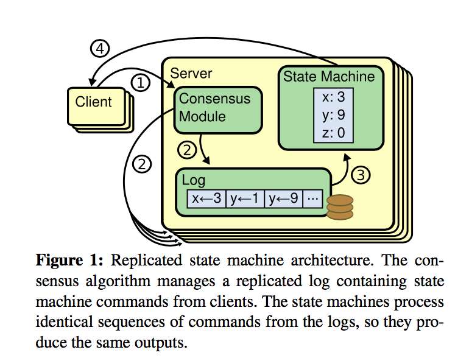
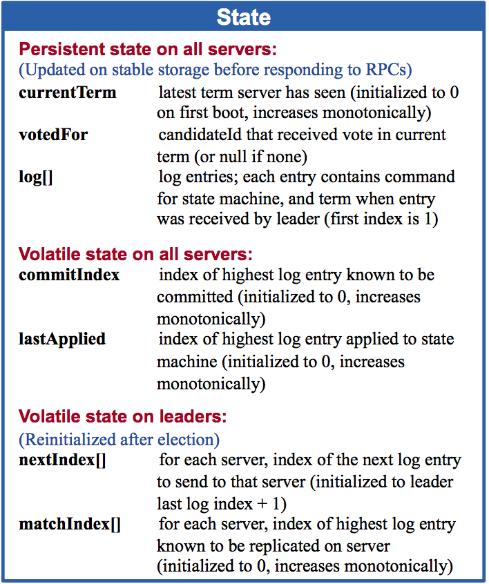
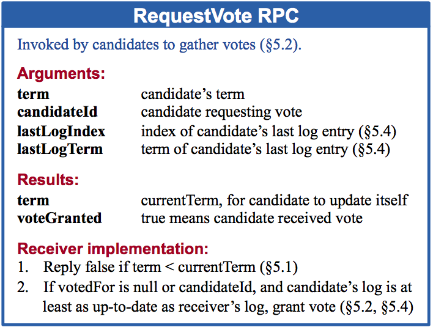
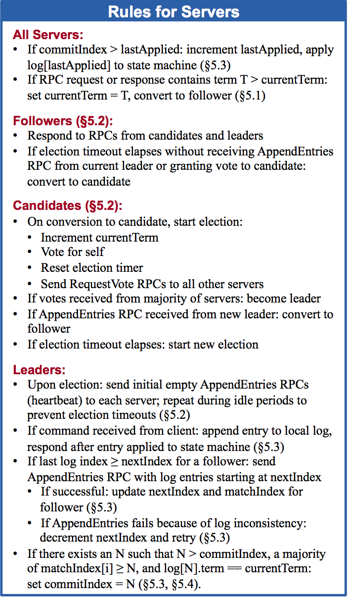
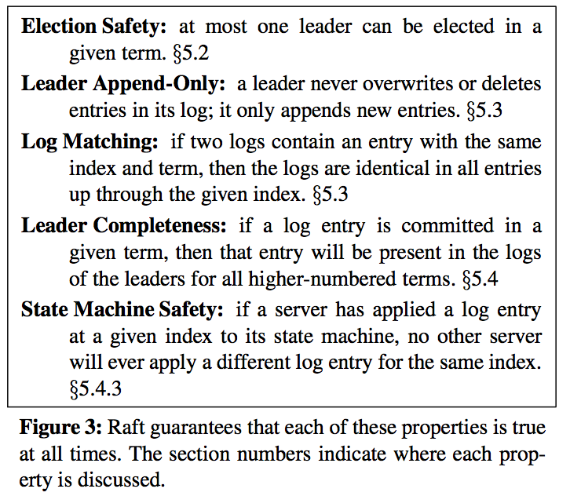
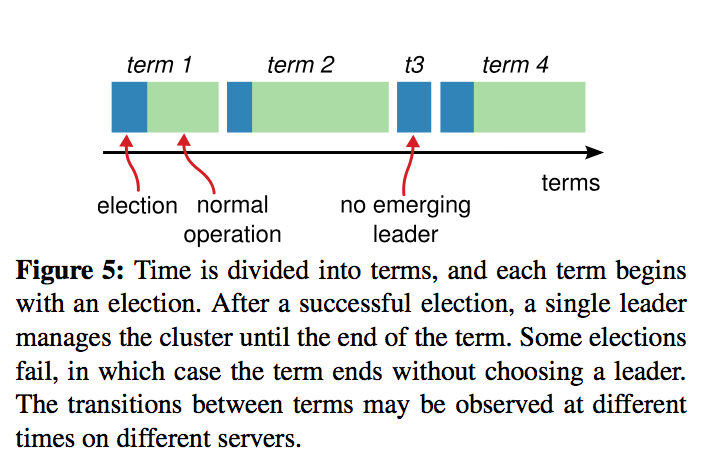

## 1.Introduction
Raft和现存的一致性算法在很多地方有相似之处，但是它有几个新颖的特性：

+ Strong leader:Raft 比其他一致性算法使用了一个更强形式的领导形式。例如，log entries only flow from the leader to other servers。这简化了replicated log的管理，使得Raft 更容易理解。

+ Leader election:Raft使用randomized timers于领导选举。这仅仅在任何一致性算法已经要求的心跳机制上添加了一点点功能，但是却简单快速的解决了冲突。

+ Membership changes:Raft使用一个新的joint 一致性算法用于集群中服务器的改变，在过渡期内，两种不同配置的大部分重叠。这允许集群在配置更换的过程中继续正常的运行。

## 2.replicated state machines
一致性算法通常在replicated state machines的Context下提出。在这种方法中，一系列服务器上的状态机计算同一个状态的相同拷贝，即使有一些服务器宕机了也能继续运行。replicated state machines被用于解决分布式系统中各种fault tolerance（容错）问题。例如有单个集群leader的大规模系统，比如GFS，HDFS，RAMCloud，通常使用一个独立的replicated state machine来管理领导选举和存储一些即使leader宕机了也要保存下来的配置信息。replicated state machine的例子包括Chubby和Zookeeper。

Replicated state machine通常使用一个replicated log来实现，如下图1所示。每一个server存储一个包含一系列命令的log，state machine顺序执行这些命令。每一个log包含了同样顺序的同样的命令，所以每一个state machine处理同样序列的命令。因为state machine是确定性的，每一个计算同样的状态和同样顺序的输出。

一致性算法的工作是保持replicated log的一致性。服务器上的一致性模块从客户端接收命令，将它们添加到log。它和其他服务器的一致性模块通信来保证每一个log最终包含同样顺序的同样请求，即使某些服务器fail了。一旦命令正确的复制了，每一个服务器上的state machine以log 顺序处理它们，输出返回至客户端。结果，服务器集群似乎形成了一个单个的高可靠性的state machine。

实际系统的一致性算法通常有如下特性：

+ 它们保证所有非拜占庭情况下的safety(永远不会返回一个错误的结果)，包括网络延迟，网络隔离（partitions），数据报丢失（packet loss），重复和重排序。

+ 只要服务器的大多数是运转的，并且可以彼此通信以及和客户端通信，那么他们是完全可用（available）的。因此，一个典型的有5个服务器的集群，可以容忍任何两个服务器的failure。如果服务器关机了，那么被认为是fail的；它们可能稍后从稳定存储中的state恢复重新加入集群。

+ 他们不依赖于timing来保证logs 的一致性：错误的时钟和极端的消息延迟可能，最坏的情况是，引起可用性（availability）问题。

+ 通常情况下，只要集群的大部分已经回复了一轮远程过程调用，一个命令就可以认为是完成了；小部分缓慢的服务器不需要影响整体系统的性能

## 3. What’s wrong with Paxos?
在过去的10年中，Leslie Lamport的Paxos协议几乎已经成为了一致性的同义词。Paxos首先定义了可以在单个决定上取得一致的协议，比如单个replicated log entry。我们称这个子集为single-decree Paxos。Paxos然后将协议的多实例结合来促进一系列的决定，例如 a log（multi-Paxos）。Paxos保证safety和liveness，也支持集群Membership的改变。它的正确性已经被证明了，正常情况下它的效率很高。

不幸的是，Paxos有两个重大的缺点。第一个缺点是，Paxos特别难理解。完整的解释是众所众知的难懂。很少人成功的理解了它，除非付出很大的努力。结果，有几个企图以更简单的方式解释Paxos,这些解释关注于single-decree Paxos，但仍然是挑战。我们假设Paxos的难懂来源于它选择single-decree作为它的基础。single-decree Paxos是难懂的，巧妙的：它分为两阶段，并且没有简单的解释，不能独立理解。因为这样，很难只觉得理解为什么single-decree可行。multi-Paxos的组成角色添加了重要的额外的复杂性和微妙性。我们相信在多个决定上达到一致性的整体问题可以以其他方式分解的更为直接和明显。

Paxos的第二个问题是，它没有提供一个构建实际实现的好的基础。一个原因是对于multi-Paxos没有一个得到广泛认同的算法。Lamport的描述主要是single-decree Paxos；它概述了multi-Paxos的可能的方法，但是很多细节遗漏了。有很多尝试来充实和优化Paxos，例如[26],[39],[13]，但是它们彼此不同，也和Lamport的概述不同。诸如Chubby[4]，已经实现了类似Paxos算法的系统，但是它们的具体细节没有公开。

而且，Paxos架构对于构建实际的系统来说很差的；这是single-decree 分解（有两个阶段）的另一个结果。例如，选择一系列独立的log entries然后将它们融合到一个顺序的log中没有任何的益处；这只是增加了复杂性，更加简单和有效的设计一个系统的方式是围绕一个log，new entries以严格的 ***顺序*** 追加到log。另一个问题是Paxos使用对称的点对点方法作为它的核心(虽然最终建议了一个弱的形式的leadership作为性能优化)。这在只有一个决定作出时是有意义的,但是很少实际的系统使用这种方法。如果一系列的决定要做出，更简单更快的是首先选出一个leader，然后让这个leader协调这些决定。

结果，实际系统和Paxos只有一点点相似之处。每一个实现都是从Paxos开始，发现实现它的困难，然后开发一个大不相同的架构。这是很耗时，容易出错的，理解Paxos的难度加剧了这个问题。The following comment from the Chubby implementers is typical:

>There are significant gaps between the description of the Paxos algorithm and the needs of a real-world system. . . . the final system will be based on an unproven protocol [4].

因为这些问题，我们得出Paxos没有为系统构建和教育提供一个良好的基础。考虑到一致性算法在大规模系统中的重要性，we decided to see if we could design an alternative consensus algorithm with better properties than Paxos. Raft is the result of that experiment.

## 4. Designing for understandability
设计Raft时，我们有几个目标：它必须提供为构建系统提供一个完整的，实用的基础，所以它显著的减少了开发人员的设计工作；它必须在所有的情况下都是安全的，在通常的运行情况下是可用的；并且在普通操作下是高效的。但是我们最重要的目标-也是做困难的挑战-是可理解性。它必须对大部分人是容易理解的。此外，它必须可以直观的理解这个算法，因此系统创建者可以在实际实现中添加扩展。在设计Raft时，有很多点，我们需要从可选的方法中选择。在这些情况中，我们基于可理解性评估这些选择。

我们意识到在这些分析中有很大程度的主观性；尽管如此，我们使用两种可应用的技术。第一个技术是问题分解的众所周知的方法：wherever possible, we divided problems into separate pieces that could be solved, explained, and understood relatively independently. 例如，在Raft中，我们区分leader election,log replication,safety,和Membership change。

我们第二个方法是通过减少需要考虑的状态的数量简化状态空间，使得系统更加条理清楚和尽可能的消除不确定性。具体来说，logs不允许有holes，Raft限制logs彼此之间变得不一致的方法。尽管大多数情况下，我们试着消除不确定性，有一些情况下不确定性提高了可理解性。In particular, randomized approaches introduce nondeterminism, but they tend to reduce the state space by handling all possible choices in a similar fashion (“choose any; it doesn’t matter”). We used randomization to simplify the Raft leader election algorithm.

## 5. The Raft consensus algorithm
Raft是一个管理在第二部分描述的replicated log的算法。图2简要总结了参考中的算法，图3列出了这些算法的主要特性；

图2：A condensed summary of the Raft consensus algorithm (excluding membership changes and log compaction). The server behavior in the upper-left box is described as a set of rules that trigger independently and repeatedly. Section numbers such as §5.2 indicate where particular features are discussed. A formal specification [31] describes the algorithm more precisely.

Raft通过首先选取一个不同的leader，然后让这个leader完全负责replicated log的管理来实现一致性。leader 接受来自客户端的log entries,复制他们到其他的服务器，告诉服务器何时可以安全的应用到它们的state machine。有一个leader简化了replicated log的管理。例如，leader可以决定新的entries存放在log的什么地方而不用和询问其他服务器，从leader到其他服务器的数据流也很简单。一个leader可能fail或者和其他服务器失去连接，在这种情况下，一个新的leader被选举出来。

考虑到leader的方法，Raft将一致性问题分解为三个相对独立的子问题，在下面的子章节讨论：

+ Leader election:当目前的leader fail时，一个新的leader 必须被选择。

+ Log replication:leader必须接受来自客户端的log entries,在集群中复制它们，强迫其他logs同意leader的。（5.3节）

+ Safety:Raft安全性的主要特性是图3中的State Machine Safety Property:如果任何server已经在它的state machine上应用了一个具体的log entry，那么其他的服务器都不能在同样的log index上应用一个不同的命令。5.4节描述了Raft如何保证这个性质；解决方案涉及了5.2节中描述的选举机制中的一个额外的限制。

After presenting the consensus algorithm, this section discusses the issue of availability and the role of timing in the system.

### 5.1 Raft basics
一个Raft集群包括几个服务器；5是一个典型的数字，允许系统容忍2个failure。在任何给定的时候，每一个server在三个状态中的一个：leader,follower,or candidate。在正常的运行中，只有一个leader，其他所有的服务器是follower。follower是被动的：他们自己不会发起请求，只是简单的回复来自leader和candidate的请求。leader处理所有的客户端请求（如果一个客户端和一个follower通讯，这个follower将请求重定向到leader）。第三个状态candidate，被用于选举一个新的leader，如5.2节所描述。图4展示了这些状态和他们的过渡；过渡会在接下来讨论。

Raft将时间分成任意的长度，如图5所示。每一任期(term)都用连续的整数编号。每一任期从一个`election`（选举）开始，在选举中，一个或多个candidate（候选人）尝试称为leader，如5.2节所描述。如果一个candidate赢了选举，它在这个任期的剩余时间内作为leader。在某些情况下，一个选举将导致分裂投票（split vote）。在这种情况下，这个任期将会以没有leader而结束；一个新的任期（和一个新的选举）不久将开始。Raft保证在一个给定的任期内最多有一个leader。

不同的server可能在不同时间观察到任期之间的过渡，在某些情况下，一个server可能不会观察到一个选举或者甚至全部的任期。任期作为Raft里的一个逻辑时钟，他们允许servers检测过期的信息，比如过期的leader。每一个server存储一个当前的任期（term）number，随着时间递增。Current terms are exchanged whenever servers communicate;如果一个server的当前任期比其他服务器的小，那么它更新它的当前任期到这个更大的值。如果一个candidate 或者 leader发现它的任期过期了，它立即回到follower 状态。如果一个server接收到一个有过期term number的request，它拒绝这个request。

Raft servers 使用RPC彼此通信，基本的一致性算法只要求两类RPCs。RequestVote RPCs被candidates在选举期间开始（5.2 节），AppendEntries RPCs被leaders开始，用于复制log entries和提供一种心跳（5.3节）。第7节增加了第三种RPC 用于servers之间传输快照(snapshots)。如果在一定的时间内没有收到回复，servers重试RPCs,为了最好的效率，他们并行发起RPC。

### 5.2 Leader election
Raft使用以个心跳机制来触发leader 选举。当server启动时，他们作为follower。一个server保持follower状态只要它接收到来自leader和candidates的有效的RPCs。leader发送周期性的心跳（没有携带任何log entry的AppendEntries RPCs）到所有的follower来维护他们的权威性。如果一个follower在一个周期的时间内（称为`election timeout`）没有接受到任何信息，那么它假定没有任何存活的leader，并且开始一个选举来选择一个新的leader。

为了开始一个选举，一个follower增加它的当前的任期，过渡到candidate 状态。然后它为自己投票，并且并行发起RequestVote RPCs到集群中的其他servers。一个candidate 保持这种状态直到这三件事中的一件发生：(a)它赢得了选举，(b)另一个server证实它自己为leader，(c)这段时期过去了，没有人赢得选举。这些结果在接下来的段落里单独讨论。

一个candidate 赢得选举，如果它接收到全部集群中的同一个任期的大部分server的投票。每一个server在给定的任期内最多投给一个candidate，使用先来先得的根据(5.4节增加了投票中的一个额外的限制)。大多数原则保证在一个特定的任期内最多有一个candidate会赢得选举（图3中的 Election Safety Property）。一旦一个candidate赢得了选举，他成为leader。然后它发送心跳信息到其他所有的servers证实它的权威，阻止新的选举。

在等待投票的过程中，一个candidate可能接受到来自另一个server的AppendEntries RPCs要求成为leader。如果这个leader的任期（包括在AppendEntries RPC中）和这个candidate的当前任期一样大或者更大，那么这个candidate认为这个leader是合法的，并且返回到follower状态。如果RPC中的任期比这个candidate的当前任期小，那么这个candidate拒绝这个RPC，保持在candidate状态。

第三种可能的后果是这个candidate既没有赢得选举也没有选举失败：如果很多follower在同一时间称为candidate，投票可能分裂，所以没有candidate获得大多数。当这种情况发生时，每一个candidate将超时，并且通过增加它们的任期和开始另一轮的RequestVote RPCs，开始一个新的选举。然而，没有额外的保证，分裂投票可能无止尽的重复下去。

Raft使用随机的选举超时来保证分裂投票是很罕见的，并且他们可以很快的解决。首先，为了阻止分裂投票，选举超时(election timeout)是在一个固定的间隔内（比如，150-300 ms）随机选择。这将servers分散开来，所以大多数情况下只有一个server会超时（就是说只有一个follower会转变为candidate）；它将赢得选举，在任何其他server超时之前发送心跳。相同的机制也用于处理分裂投票。每一个candidate在一个选举开始之前重置它的随机选举超时时间（reset election timers），并且在开始下一个选举之前等待这个超时时间过期；这减少了新的选举中另一个分裂投票的可能性。9.3节展示了这种方法快速的选举出一个leader。

所以Raft使用了两种方法来阻止分裂投票：

1. 每一个server的`election timeout`是随机的，这将Server分散开来，所以大多数时间内只有一个server超时，并且开始选举，它将赢得选举。

2. 每一个candidate在一个选举开始之前重置它的随机选举超时时间（reset election timers），并且在开始下一个选举之前等待这个超时时间过期。

选举是可理解性如何指导我们在可选方案中做出选择的例子。起初，我们打算使用一个ranking system（排位系统）：每一个candidate被分配一个唯一的rank，它被用于竞争的candidate之间的选举。如果一个candidate发现其他的candidate有更高的rank，它将回到follower状态，所以更高rank的candidate 可以更容易的赢得接下来的选举。我们发现这个方法在可行性方面创造了一个微妙的问题（如果更高rank的server fail，一个lower-rank的Server可能需要超时，又变成candidate，但是如果它太快超时，可能会重置选举领导的过程）。我们几次调整算法，但是每一个调整后新的问题又会出现。最后我们得出，随机尝试方法是更明显和可理解的。

### 5.3 Log replication
一旦a leader已经被选择，它开始接收客户端请求。每一个客户端请求包含一个被replication state machine执行的命令。leader将命令作为一个新的entry追加到它的log，然后并行发起AppendEntries RPCs到每一个其他服务器来复制这个entry。当这个entry已经被安全复制时（如下所描述的），leader将这个entry应用于它的state machine,并且将这次执行的结果返回给客户端。如果follower crash或运行缓慢，或者网络数据报丢失，leader无限重试AppendEntries RPCs（即使在它已经回复了客户端后）直到所有的follower最终存储了所有的log entry。

Logs的组织方式如图6所示。每一个log entry存储一个包含term number 的state machine命令，当这个entry被leader接受到时。log entry中的term number被用于检测logs之间的不一致性和保证图3中的一些特性。每一个log entry也有一个整数的index 表明它在log中的位置。

leader决定什么时候将一个log entry应用于state machine是安全的；这样的一个entry被称为已经commit了(committed)。Raft保证已经commit的entries是持久化的，将最终被所有可用的state machine执行。一个log entry被认为是committed的，一旦创建它的leader将它复制到大多数的servers（比如图6中的entry 7）。这也会将leader log中的所有在前的entriescommit，包括被先前的leader创建的entries。5.4节讨论了当leader 变了之后，这个规则的一些细微之处，这也展示了commit的定义是安全的。leadercommit它知道的要commit的最大的index,这也包括了在将来的AppendEntries RPCs（包括心跳）中的index，这样其他的servers最终知道(find out)。一旦一个follower知道一个log entry被commit了，它将这个entry应用于它本地的state machine（以log 中的顺序）.

我们设计Raft log机制来维护不同servers上logs之间的高的协调一致(coherency)。这不仅仅简化了系统的行为，使得它更加可以预测，也是保证安全的一个重要组件。Raft 维护了以下特性，组成了图3中的Log Matching Property：

+ 如果不同logs中的两个entries有相同的index和term，那么他们存储相同的命令

+ 如果不同logs中的两个entries有相同的index和term，那么所有之前的entries中的logs是相同的。

第一个特性由这个事实得出：一个leader在一个给定的term最多创建有给定的log index的一个entry,log entries不会改变他们在log中的位置。第二个特性由一个简单的由AppendEntries做出的一致性检查保证。当发送一个AppendEntries RPC,the leader includes the index and term of the entry in its log that immediately precedes the new entries.如果follower没有在它的logs中找到一个有相同index和term的entry，那么它拒绝这个新的entry。这个一致性检查作为一个Introduction step:logs的初始empty state满足了Log Matching Property,一致性检查在logs 扩展时保护Log Matching Property.结果，无论AppendEntries 什么时候返回成功，leader 都知道follower的logs 和它自己（leader）的是完全相同的，直到新的entries。

在正常的操作中，leader的logs和follower的保持一致，所以AppendEntries 一致性检查永远不会失败。然而，leader crash可能让logs不一致（旧的leader可能没有完全复制所有的entries到其它的log中）。如果一系列leader和follower crash，这种不一致可能加剧。图7说明了这种follower的log和新的leader的log的不同的情形。follower可能丢失leader上出现的entries,可能有leader上没有出现的entries，或者两者都有。log中 丢失和外来的entries 可能持续多个term。

在Raft中，leader通过followers的log复制它的来处理不一致性。这意味着，follower logs中的冲突的entry将会被leader logs中的覆盖。5.4节 展示了将这个和另一个限制联系起来 是安全的。

为了把follower的log和它自己的一致，leader必须找到两个logs中一致的最近的log entry，删除follower log中那个点之后的任何entries，将leader log中那个点之后的所有entries发送给follower。所有这些操作由AppendEntries RPCs执行的一致性检查做出。leader为每一个follower维护一个nextIndex，它是leader将发送给follower的下一个log entry的index。当一个leader刚取得领导权时，it initializes all nextIndex values to the index just after the last one in its log(图7中的11)。如果一个follower的log和leader的不一致，在下一次的AppendEntries RPC中，AppendEntries一致性检查将失败。在拒绝之后，leader减小nextIndex，重试AppendEntries RPC。最后nextIndex将达到leader和follower log一致的点。当上述情况发生时，AppendEntries RPC 将成功，它将移除follower log中任何冲突的entries,从leader log中追加entries（如果有的话）。一旦AppendEntries 成功了，follower的log 和leader一致，在这个term的剩余时间内将保持如此。

如果需要，协议可以优化为减少被拒绝的AppendEntries RPC 的数量。例如，当拒绝一个AppendEntries请求时，follower可以包括冲突entry的term和这个term中存储的第一个index。有了这些信息，leader可以通过绕过这个term中所有的冲突entries而减小nextIndex；每一个有冲突entries的term都要求一个AppendEntries RPC请求，而不是一个entry一个RPC。在实践中，我们怀疑这种优化是否是有必要的，因为失败不经常发生并且可能没有很多冲突的entries。

使用这个机制，当一个leader开始领导权时，不需要采取任何特殊的措施来恢复log 一致性。它只是开始正常的操作，然后随着AppendEntries RPC 一致性检查的失败，log自动的趋于一致。leader从不覆盖或者删除它自己log上的entry（图3中的Leader Append-Only Property）。

log复制机制展示了第二节中描述的一致性特性：Raft 可以接受，复制，和apply new log entry，只要大部分Servers是启动的；在正常的情况下，一个新的entry可以用一个单程的RPCs复制到集群中的大多数；单个缓慢的follower不影响性能。

### 5.4 Safety
前一节描述了Raft如何选举leader和复制log entries。然而，目前为止描述的机制不是很有效的确保每一个state machine以同样的顺序执行相同的命令。For example, a follower might be unavailable while the leader commits several log entries, then it could be elected leader and overwrite these entries with new ones; as a result, different state machines might execute different command sequences.

本节通过添加一个哪台server可以被选举为leader的限制，使Raft算法完整了。这个限制保证任何给定term的leader包括了之前term中commit的所有entries（图3中的Leader Completeness Property）。假设这个选举限制，我们然后使得commit的规则更加清晰。Finally, we present a proof sketch for the Leader Completeness Property and show how it leads to correct behavior of the replicated state machine.

#### 5.4.1 Election restriction
在任何的基于leader的一致性算法中，leader必须最终存储所有的**已经commit**的log entries（没有commit的log entries则不一定会包括）。在一些一致性算法中，比如Viewstamped Replication,leader可以被选举即使它开始没有包括所有的已经commit的entries。这些算法包含额外的机制来识别丢失的entries然后传递到新的leader，要么在选举期间要么不就之后。不幸的是，这导致这个额外的机制相当复杂。Raft 使用一个更简单的方法，这个方法保证来自之前term的所有的已经commit的entries已经存在于每一个新的leader（从它选举上的那个时刻），不用传输这些entries到leader。这意味着这个log entries只往一个方向流动，从leader到followers，leaders从来不覆盖他们log中已经既有的entries。

Raft 使用投票过程来阻止一个candidate赢得选举除非它的log包括所有已经commit的entries。为了被选举上，一个candidate必须和集群中的大部分server联系上，这意味着每一个已经commit的entry必须存在于至少这些服务器上的一个上。If the candidate’s log is at least as up-to-date as any other log in that majority (where “up-to-date” is defined precisely below), then it will hold all the committed entries.RequestVote RPC实现了这个限制：RPC包括了candidate 的log的信息，如果投票者自己的log 比candidate的更加新，投票者就拒绝投票。

Raft通过比较两个logs中的最后一个entry的index和term来决定哪个log更加新。如果两个logs的最后一个entry有不同的term，那么term更大的log更加新。如果两个logs有相同的term，那么哪个log更长哪个log更加新。

#### 5.4.2 Committing entries from pervious terms
正如在5.3节所描述的，leader知道一旦这个entry被存储在servers上的大部分上，这个entry已经被commit了。如果在commit一个entry之前，leader crash了，将来的leader将尝试完成复制这个entry（到其他Server）。However, a leader cannot immediately conclude that an entry from a previous term is committed once it is stored on a majority of servers.图8说明了一种情况，一个旧的log entry已经存储在大部分服务器上，还是可以被以后的leader覆盖。

为了消除像图8中的问题，Raft从来不commit来自前一个term的log entries，通过复制计数（counting replicas）。只有来自leader当前term的log entries才会通过复制计数而commit；一旦来自当前term的某个entry用这种方式commit了，所有在先的entries都间接的commit了因为 Log Matching Property。有这样一些情况，leader可以安全的得出一个更加旧的log entry已经commit了（例如，如果那个entry已经存储在每一个sever上了），但是为了简单性，Raft采取一个更加谨慎的方法。

Raft 在commit规则中引入了这个额外的复杂性，因为当leader从前一个term复制entries 时，log entries保留他们原来的term number。在其他的一致性算法中，如果一个新的leader从先前的term再次复制entries，它必须使用它的新的term number。Raft的方法使得推理log entries更加容易，因为他们维护相同的term number over time and across logs。此外，Raft中新的leader比其他算法中的发送更少的来自之前terms的log entries（other algorithms must send redundant log entries to renumber them before they can be committed）。

#### 5.4.3 Safety argument
为了完善Raft 算法，我们现在可以更加详细的讨论Leader Completeness Property。我们假设Leader Completeness Property不需要遵守，然后我们证明一个矛盾。假设term T 的leader（下面称为leader T）在它的term内commit了一个log entry，但是这个log entry没有将来的term的leader存储。假设最小的term U > T，它的leader（称为leader U）没有存储这个entry。

1. 在它选举的时间内，已经commit的这个entry没有在leader U 的log 上（leaders never delete or overwrite entries）

2. leader T 复制这个entry到集群中的大部分服务器上，leader U 收到集群中大部分服务器的投票。因此，最少有一个Server(投票者)即接收了来自leader T的entry也投票给了leader U。如图9所示。这个投票者是造成矛盾的关键。

3. 这个投票者在投票给leader U之前，肯定已经接受了来自leader T的已经commit了的entry；否则，它将拒绝来自leader T的AppendEntries（它目前的term已经比T高了）。

4. 这个投票者在投票给leader U之前已经存储了这entry，因为每一个介入的leader包含这个entry（假设），leaders从不移除entries,并且followers只移除和leader冲突的entries。

5. 这个投票者投票给leader U,所以leader U的log肯定已经和这个投票者的是同步的。这导致了两个矛盾中的一个。

6. 首先，如果这个投票者和leader U有相同的last log term，那么leader U的log肯定至少和这个投票者的一样长，所以它的log包含了这个投票者的每一个entry。这是一个矛盾，因为这个投票者包含了这个已经commit的entry并且leader U被认为是没有包含的。

7. 否则，leader U的last log term肯定大于这个投票者的。此外，它也比leader T大，因为这个投票者的last log term最少是T（它包含来自term T的那个已经commit的entry）。创建了leader U的last log entry的那个前一点的leader肯定已经包含了那个已经commit的entry在它的log中（假设）。那么由于 Log Matching Property，leader U的log肯定也包含这个已经commit了的entry，这也是一个矛盾。

8. 这就完成了这个矛盾。Thus, the leaders of all terms greater than T must contain all entries from term T that are committed in term T.

9. Log Matching Property保证将来的leaders也包含间接commit的entries,比如图8中的index 2。

考虑到Leader Completeness Property，我们可以证明图3中的State Machine Safety Property，它陈述了如果一个server已经将一个给定index的log entry应用于它的状态机，没有其他Server将会将一个不同的log entry应用于这个相同的index。At the time a server applies a log entry to its state machine,its log must be identical to the leader’s log up through that entry and the entry must be committed. Now consider the lowest term in which any server applies a given log index; the Log Completeness Property guarantees that the leaders for all higher terms will store that same log entry, so servers that apply the index in later terms will apply the same value. Thus, the State Machine Safety Property holds.

最后，Raft要求servers以log index的顺序应用entries。和State Machine Safety Property结合，这意味着所有servers将应用同样的log entries集合到他们的state machine，以相同的顺序。

### 5.5 Follower and candidate crashes
现在，我们专注于leader failure。Follower and candidate crashes are much simpler to handle than leader crashes, and they are both handled in the same way.如果一个Follower 或者candidate crashes，那么将来发送给他们的RequestVote 和AppendEntries RPC 将会fail。Raft 通过无线重试来处理这种failure。如果crashed server重新启动了，那么RPC将会成功完成。如果一个Server在完成RPC 之后，返回回复之前crash了，那么它将在重启之后又接收到相同的RPC。Raft RPC 是幂等的，所以这不会引起任何的错误。例如，如果一个follower接收到一个包含了已经存在于它的log中的log entries的AppendEntries request，那么在新的request中它将忽略这些entries。

### 5.6 Timing and availability
我们对Raft 的一个要求是Safety一定不能取决于时机：系统必须不会产生不正确的结果仅仅因为一些事件发生的比预料的更快或更慢。然而，可用性(the ability of the system to respond to clients in a timely manner)必须不可避免的依赖于时机。例如，如果消息交换所花费的时间长于服务器崩溃的典型时间，candidate将不会停留足够长来赢得选举；没有一个稳定的leader，Raft不能工作。

Leader选举是Raft中时机非常重要的一方面。Raft可以选出和维持一个稳定的leader只要系统满足如下的时间要求：

`broadcastTime ≪ electionTimeout ≪ MTBF`

在上面的不等式中，`broadcastTime`是server并行发送RPC到集群中每一个server和接收他们的回复的平均时间；`electionTimeout`是5.2节中描述的选举超时时间；`MTBF`is the average time between failures for a single server. 广播时间应该小于选举超时时间，那么leader可以可靠地发送心跳消息来阻止follower开始选举；考虑到用于选举超时时间的随机方法，这个不等式也使得分裂投票不大可能。选举超时时间应该小于MTBF，那么系统可以稳定的工作。当leader crash，系统将在大概选举超时时间内不可用；这将占据整体时间的相当小一部分。

广播时间和MTBF时间是底层系统的特性，然而选举超时时间是我们必须选择的。Raft 的RPC通常要求接收者持久化信息到稳定存储，所以广播时间可能在0.5ms到20ms，取决于存储技术。结果，选举超时时间可能在10ms到500ms之间。典型server的MTBF时间是几个月或更多，可以很容易的满足时间要求。

## 6 Cluster membership changes
直到现在我们已经假设集群结构（configuration）（参与一致性算法的服务器集合）是固定的。在实践中，可能偶尔需要改变结构，例如当server fail时将它们更换或者change the degree of replication。虽然可以在让整个集群off-line时，更新配置文件，然后重启集群，但这可能让集群在更换期间不可用。另外，如果有任何的人工步骤，他们可能有操作错误的风险。为了避免这些问题，我们决定自动更换结构，合并他们到Raft一致性算法中。

为了结构更换机制是安全的，在过渡期内必须没有同一个term内有两个leader被选举的时刻。不幸的是，任何直接从旧的Server结构直接转到新的server结构上都是不安全的。一次性转换所有的servers是不可能的，所以集群在这个过渡期内可以分割为两个独立的部分。（如图10）

为了保证安全性，结构更换必须使用一个两阶段方法。有多种方式来实现这个两阶段方法。例如，一些系统（比如[22]）使用第一阶段来让旧的结构失效，所以它不能在处理客户端request；然后第二个阶段启用新的结构。在Raft中集群首先转换到一个过渡结构称为joint consensus;一旦这个joint consensus被记下(committed)。系统然后过渡到这个新的结构(configuration)。joint consensus结合了旧的和新的结构：

+ log entries被复制到所有存在于两个结构中的Servers上。

+ 来自每个结构的任意server都可能作为leader。

+ 一致意见（对于选举和entry commit(commitment)）既要求old configuration的大多数，也要求new configuration的大多数。

The joint consensus allows individual servers to transition between configurations at different times without compromising safety.更重要的是，joint consensus允许集群在结构改变期间继续服务客户端request。

集群结构在复制的log中使用特殊的entries存储和交换；图11说明了结构改变的过程。

当leader接收到一个 结构从C old改变到C new 的request时，它为了joint consensus(图中的C old,new)将configuration存储为一个log entry,并且使用之前描述的机制复制这个entry。一旦一个特定的server增加这个新的configuration entry到它的log中，它将这个configuration用于未来所有的决定（a server总是使用它的log中的最新的configuration，不管这个entry是否committed）。This means that the leader will use the rules of Cold,new to determine when the log entry for Cold,new is committed.If the leader crashes, a new leader may be chosen under either Cold or Cold,new, depending on whether the winning candidate has received Cold,new. In any case, Cnew cannot make unilateral decisions during this period.

Once Cold,new has been committed, neither Cold nor Cnew can make decisions without approval of the other, and the Leader Completeness Property ensures that only servers with the Cold,new log entry can be elected as leader. It is now safe for the leader to create a log entry describing Cnew and replicate it to the cluster. Again, this configuration will take effect on each server as soon as it is seen. When the new configuration has been committed under the rules of Cnew, the old configuration is irrelevant and servers not in the new configuration can be shut down. As shown in Figure 11, there is no time when Cold and Cnew can both make unilateral decisions; this guarantees safety.

对于reconfiguration 还有三个问题要提出。第一个问题是新的servers开始时可能没有存储任何的log entries。如果他们在这种状态下被加入到集群，他们可能需要花费一点时间赶上，在这个时间内它可能不能commit 新的log entries。为了避免可用性空隙，Raft 在configuration 改变之前引入了一个额外的阶段，在这个阶段中新的server作为不能投票的成员加入集群中（leader复制log entries给他们，但是他们不能作为 '大多数'）。一旦新的server已经赶上了集群中其余的服务器，reconfiguration 可以如上面描述的继续。

第二个问题是集群的leader可能不是新的 configuration的一部分。在这种情况下，leader 一旦已经committe 了C new log entry就回到follower的状态。这意味着会有这样一段时间(leader 正在commit C new)，leader正在管理一个集群，但是不包括自己；它复制log entries但是不把自己算作 '大多数'。当C new 被commit时，leader 过渡期发生，因为这是新的configuration可以独立运行的第一时刻（总是可以从C new中选择一个新的leader）。在那个时刻之前，可能有这种情况，只有一个来自C old的server可以被选举为leader。

第三个问题是那些被移除的Server（这些Server不在C new里）可能扰乱集群。这些servers不会接受到心跳，所以他们会超时，开始新的选举。然后，他们将使用新的term number发送RequestVote RPCs，这将导致当前leader回到follower 状态。一个新的leader将最终被选举，但是这些被移除的Server将再次time out这个步骤将重复，导致底可用性。

为了防止这个问题，当servers相信当前已经有一个leader存在时，他们将不理会RequestVote RPCs。Specifically, if a server receives a RequestVote RPC within the minimum election timeout of hearing from a current leader, it does not update its term or grant its vote. This does not affect normal elections, where each server waits at least a minimum election timeout before starting an election. However, it helps avoid disruptions from removed servers: if a leader is able to get heartbeats to its cluster, then it will not be deposed（废黜） by larger term numbers.

## split-brain
假设集群中有5个服务器(server 1 - server 5),server 1是leader。如果server 1-3和server 4-5网络隔离了，导致server 1-3不能和server 4-5通信，那么可能发生脑裂。server 4-5不能接收到server 1(leader)的心跳，然后发生election timeout超时，Server4-5最终会选出一个leader。这样就发生了split-brain。

如何阻止这种情况发生呢？我觉得可以这样，每一个leader在获取领导权之后都要将集群中的所有的servers的信息持久化到一个log entry中。Leader节点也会检测Follower节点的状态，如果多数Follower节点不再响应Leader节点（可能是Leader节点与Follower节点之间产生了网络分区），那么Leader节点可能此时也不再是合法的Leader了，也必须要进行一次新的选主。这样，假如server 4-5 发生了网络隔离了，那么在leader选举时，他们必须得到log中保存的集群中的大多数节点的投票，如果不能得到，就当选为新的leader，进而可以阻止split-brain。

所以，关键是将集群的元信息持久化到log中（zookeeper就是将集群的信息写在配置文件中），并且在leader选举时判断有没有Lost quorum。

## 7.Log compaction
Raft 的log 在正常的运行中增长来容纳更多的客户端request，但是在实际的系统中，它不可能无限增长。随着log 增长的越长，它占据更多的空间，并且花费更多的时间来replay。这将最终导致可用性问题，如果没有一些机制来丢弃log中积累的过期的信息。

快照(snapshots）是压缩（compaction）的最简单的方法。在snapshotting中，当前这个系统的状态被写入稳定存储里的一个快照，然后 那个时刻之前的log 被丢弃。Snapshoting被用于Chubby和Zookeeper，以及本节描述Raft中的snapshotting。

采用递增式的方法压缩，比如log cleaning[36]和log-structured merge tree[30,5]，也是可能的。这些方法一次只在一小部分数据上操作，所以他们将压缩的压力分配的更加均衡。他们首先选择一个已经积累了很多已经删除和覆盖了的对象的数据区域，然后他们将那个区域还存活的对象更加紧凑的的写入，然后释放那个区域。这要求其他机制，并且比起snapshots更加复杂，snapshots通过总是操作整个数据集简化了这个问题。虽然log 清理可能要求对Raft做出更改，state machine可以使用同样的接口实现LSM(log-structured tree) 树作为snapshotting。

图12展示了Raft中 snapshotting基本的idea。每一个server独立的抓取快照，只包括log中已经committed的entries。主要的工作是state machine将它的当前状态写入snapshot。Raft也会将小部分metadata包括在snapshot中：`the last included index`是snapshot取代的最后一个entry的index（state machine已经应用的最后一个entry）。`the last included term`是这个entry的term。这些信息被保留来支持snapshot 后第一个log entry的AppendEntries 一致性检查，因为这个entry需要先前的log index和term。为了保证集群membership改变时，snapshot也将最新的configuration包括在log中（作为last included index）。一旦server完成了写snapshot，它可能删除`last included index`之前的所有log entry，也包括任何之前的snapshot。

虽然servers通常是独立的抓取快照，leader必须偶尔的发送快照到落后的follower。当leader已经丢弃了他需要发送给follower的写一个log entry时发生这种情况。幸运的是，这种情况在正常的运行中不太可能：一个已经跟上leader的follower 已经有这个entry了。然而，一个特别慢的follower或者一个新加入集群的server可能没有这个entry。让这样的一个follower跟上leader的方式是通过网络发送一个快照。

leader使用一个称为InstallSnapshot的新RPC来发送快照到落后太多的follower；如图13所示

当一个follower通过这个RPC接收到一个snapshot时，它必须根据现有的log entries对这个snapshot处理。通常，snapshot将包括不存在于这个接收者log中的新信息。在这种情况下，follower将丢弃它自己的整个log；log被snapshot取代，并且（log中）可能有uncommitted 的和snapshot冲突的entries。如果，与此相反，follower接收到一个在log之前的snapshot（就是说，snapshot中的内容比log中的落后）（由于重复传输或者错误），那么log entries删除这个snapshot，但是在snapshot之后的entries仍然是有效的，必须保留。

snapshotting 方法违背了Raft的强leader原则，因为follower可以在leader不知道的情况下take snapshot。然而，我们认为这个背离是正当的。因为有一个leader帮助避免冲突的决定来达到一致性，当snapshotting时，一致性已经达到了，所以不会有决定冲突。数据还是只从leader流向follower，只有follower可以重新组织它的数据。

我们考虑一个可选的基于leader的方法，在这个方法里，只有leader可以创建snapshot，然后它将snapshot发送到每一个follower。然而，这有两个坏处。首先，发送snapshot到每一个follower会浪费网络带宽和减缓snapshotting过程。每个follower已经有生成它自己快照的必要的信息，并且通常来说对于一个server从本地状态生成生成一个快照比发送和从网络接收一个更加cheaper。第二，leader的实现更加复杂了。例如，leader需要并行发送快照到follower，复制新的log entry给他们，so as not to block new client request。

还有两个影响snapshotting性能的问题。首先，servers必须决定什么时候生成快照。如果server生成快照过于频繁，这会浪费带宽；如果快照生成的过于不频繁，有耗尽存储空间的风险，并且增加了重启时重现(replay)log所需要的时间。一个简单的策略是当log 达到一个固定的大小时抓取快照。如果这个大小比期望的snapshot的大小大很多，then the disk bandwidth overhead for snapshotting will be small.

第二个性能问题是写快照可能花费很多时间，并且我们不想让它延迟正常的操作。解决方案是使用一个copy-on-write技术，这样新的更新可以接收而不用影响正在写的快照。例如用函数式数据结构构造的state machine天然支持它。此外，操作系统的copy-on-write（例如Linux 的fork）支持可以用于为整个state machine创建一个内存快照（我们的实现使用这种方法）。

## 8 Client interaction
这一节描述客户端如何和Raft交互，包括客户端如何发现集群leader以及Raft如何支持线性语义[10]。这些问题适用于所有基于一致性的系统，Raft的解决方案和这些系统类似。

Raft的客户端发送所有request到leader。当一个客户端首次启动时，它连接到一个随机选择的server。如果客户端的首次选择不是leader，server将会拒绝客户端的request，并且提供关于最近的leader的信息（AppendEntries request包括leader 的网络地址）。如果leader crash了，客户端request将超时；客户端然后重新选择一个随机选择的server重试。

我们对Raft的目标是实现线性语义（每一个操作像是立即执行的，只执行一次，at some point between its invocation and its response）。然而，正如目前所描述的，Raft可以执行一个命令多次：例如，如果leader 在Committing 一个log entry后但是在恢复客户端之前crash了,客户端将在一个新的leader上重试这个命令，导致命令被执行两次。解决方案是客户端为每一个命令分配一个唯一的序列号。然后state machine为每个客户端commit他处理的latest的序列号和对应的回复。如果它接收到一个已经被执行过的命令，他立即回复不会重新执行这个request。

只读操作可以被处理而不用写任何东西到log。然而，没有其他的measures，这也可能引起过期的数据，因为回复这个request可能被一个新的leader取代了，但是却没有意识到。线性(linearizable)读必须不能返回过期数据，Raft需要两个额外的预防措施来保证而不使用log。首先，leader必须有哪些entries已经committed的最新的信息。Leader Completeness Property保证leader有所有已经committed entries，但是在term开始时，可能不知道哪些是。为了找出，需要commit 一个entry。Raft通过让每一个leader在term开始时commit一个空白的entry。第二，leader必须在处理一个read-only request之前检查自己是否已经被废黜了（its information may be stale if a more recent leader has been elected）。Raft通过让leader在回复read-only request之前和集群中的大部分交换心跳信息来处理这类情况。此外，leader可以依靠心跳机制来提供一种形式的租期[9]，但是这可能依赖于timing for safety。

## 9. Implementation and evaluation
The remainder of this section evaluates Raft using three criteria: understandability, correctness, and performance.

### 9.1 Understandability
为了衡量Raft相对于Paxos的可理解性，we conducted an experimental study using upper-level undergraduate and graduate students in an Advanced Operating Systems course at Stanford University and a Distributed Computing course at U.C. Berkeley. We recorded a video lecture of Raft and another of Paxos, and created corresponding quizzes.

### 9.2 Correctness
We have developed a formal specification and a proof of safety for the consensus mechanism described in Section 5. The formal specification [31] makes the information summarized in Figure 2 completely precise using the TLA+ specification language [17]. It is about 400 lines long and serves as the subject of the proof. It is also useful on its own for anyone implementing Raft. We have mechanically proven the Log Completeness Property using the TLA proof system [7]. However, this proof relies on invariants that have not been mechanically checked (for example, we have not proven the type safety of the specification). Furthermore, we have written an informal proof [31] of the State Machine Safety property which is complete (it relies on the specification alone) and relatively precise (it is about 3500 words long).

### 9.3 Performance
Raft’s performance is similar to other consensus algorithms such as Paxos. The most important case for performance is when an established leader is replicating new log entries. Raft achieves this using the minimal number of messages (a single round-trip from the leader to half the cluster). It is also possible to further improve Raft’s performance. For example, it easily supports batching and pipelining requests for higher throughput and lower latency. Various optimizations have been proposed in the literature for other algorithms; many of these could be applied to Raft, but we leave this to future work.

We used our Raft implementation to measure the performance of Raft’s leader election algorithm and answer two questions. First, does the election process converge quickly? Second, what is the minimum downtime that can be achieved after leader crashes?

To measure leader election, we repeatedly crashed the leader of a cluster of five servers and timed how long it took to detect the crash and elect a new leader (see Figure 16). To generate a worst-case scenario, the servers in each trial had different log lengths, so some candidates were not eligible to become leader. Furthermore, to encourage split votes, our test script triggered a synchronized broadcast of heartbeat RPCs from the leader before terminating its process (this approximates the behavior of the leader replicating a new log entry prior to crashing). The leader was crashed uniformly randomly within its heartbeat interval, which was half of the minimum election timeout for all tests. Thus, the smallest possible downtime was about half of the minimum election timeout.

The top graph in Figure 16 shows that a small amount of randomization in the election timeout is enough to avoid split votes in elections. In the absence of randomness, leader election consistently took longer than 10 seconds in our tests due to many split votes. Adding just 5ms of randomness helps significantly, resulting in a median downtime of 287ms. Using more randomness improves worst-case behavior: with 50ms of randomness the worst-case completion time (over 1000 trials) was 513ms.

The bottom graph in Figure 16 shows that downtime can be reduced by reducing the election timeout. With an election timeout of 12–24ms, it takes only 35ms on average to elect a leader (the longest trial took 152ms). However, lowering the timeouts beyond this point violates Raft’s timing requirement: leaders have difficulty broadcasting heartbeats before other servers start new elections. This can cause unnecessary leader changes and lower overall system availability. We recommend using a conservative election timeout such as 150–300ms; such timeouts are unlikely to cause unnecessary leader changes and will still provide good availability.

## 10 Related work
There have been numerous publications related to consensus algorithms, many of which fall into one of the following categories:

+ Lamport’soriginaldescriptionofPaxos[15],andattempts to explain it more clearly [16, 20, 21].

+ Elaborations of Paxos, which fill in missing details and modify the algorithm to provide a better foundation for implementation [26, 39, 13].

+ Systems that implement consensus algorithms, such as Chubby [2, 4], ZooKeeper [11, 12], and Spanner [6]. The algorithms for Chubby and Spanner have not been published in detail, though both claim to be based on Paxos. ZooKeeper’s algorithm has been published in more detail, but it is quite different from Paxos.

+ Performance optimizations that can be applied to Paxos [18, 19, 3, 25, 1, 27].

+ Oki and Liskov’s Viewstamped Replication (VR), an alternative approach to consensus developed around the same time as Paxos. The original description [29] was intertwined with a protocol for distributed transactions, but the core consensus protocol has been separated in a recent update [22]. VR uses a leaderbased approach with many similarities to Raft.

Raft和Paxos最大的不同之处是Raft的强leadership: Raft把leader 选举作为一致性协议的重要部分，并且将尽量多的功能给leader。这个方法导致一个更简单的更容易理解的算法。例如，在Paxos中，leader 选举和基本的一致性协议是互不相关的：他仅仅作为性能优化的方式，对于取得一致性不是必须的。然而，这导致了额外的机制：Paxos既包括基本一致性的两阶段协议也包括一个独立的leader 选举机制。相反的，Raft将leader选举合并到一致性算法里，把它作为一致性的两阶段中的第一阶段。这导致了比Paxos中更少的机制。

Like Raft, VR and ZooKeeper are leader-based and therefore share many of Raft’s advantages over Paxos. However, Raft has less mechanism that VR or ZooKeeper because it minimizes the functionality in non-leaders. For example, log entries in Raft flow in only one direction: outward from the leader in AppendEntries RPCs. In VR log entries flow in both directions (leaders can receive log entries during the election process); this results in additional mechanism and complexity. The published description of ZooKeeper also transfers log entries both to and from the leader, but the implementation is apparently more like Raft [35].

Raft has fewer message types than any other algorithm for consensus-based log replication that we are aware of. For example, we counted the message types VR and ZooKeeper use for basic consensus and membership changes (excluding log compaction and client interaction, as these are nearly independent of the algorithms). VR and ZooKeeper each define 10 different message types, while Raft has only 4 message types (two RPC requests and their responses). Raft’s messages are a bit more dense than the other algorithms’, but they are simpler collectively. In addition, VR and ZooKeeper are described in terms of transmitting entire logs during leader changes; additional message types will be required to optimize these mechanisms so that they are practical.

Raft’s strong leadership approach simplifies the algorithm, but it precludes some performance optimizations. For example, Egalitarian Paxos (EPaxos) can achieve higher performance under some conditions with a leaderless approach [27]. EPaxos exploits commutativity in state machine commands. Any server can commit a command with just one round of communication as long as other commands that are proposed concurrently commute with it. However, if commands that are proposed concurrently do not commute with each other, EPaxos requires an additional round of communication. Because any server may commit commands, EPaxos balances load well between servers and is able to achieve lower latency than Raft in WAN settings. However, it adds significant complexity to Paxos.

Several different approaches for cluster membership changes have been proposed or implemented in other work, including Lamport’s original proposal [15], VR [22], and SMART [24]. We chose the joint consensus approach for Raft because it leverages the rest of the consensus protocol, so that very little additional mechanism is required for membership changes. Lamport’s α-based approach was not an option for Raft because it assumes consensus can be reached without a leader. In comparison to VR and SMART, Raft’s reconfiguration algorithm has the advantage that membership changes can occur without limiting the processing of normal requests; in contrast, VR stops all normal processing during configuration changes, and SMART imposes an α-like limit on the number of outstanding requests. Raft’s approach also adds less mechanism than either VR or SMART.

## 11. Conclusion
Algorithms are often designed with correctness, efficiency, and/or conciseness as the primary goals. Although these are all worthy goals, we believe that understandability is just as important. None of the other goals can be achieved until developers render the algorithm into a practical implementation, which will inevitably deviate from and expand upon the published form. Unless developers have a deep understanding of the algorithm and can create intuitions about it, it will be difficult for them to retain its desirable properties in their implementation.

In this paper we addressed the issue of distributed consensus, where a widely accepted but impenetrable algorithm, Paxos, has challenged students and developers for many years. We developed a new algorithm, Raft, which we have shown to be more understandable than Paxos. We also believe that Raft provides a better foundation for system building. Using understandability as the primary design goal changed the way we approached the design of Raft; as the design progressed we found ourselves reusing a few techniques repeatedly, such as decomposing the problem and simplifying the state space. These techniques not only improved the understandability of Raft but also made it easier to convince ourselves of its correctness.
