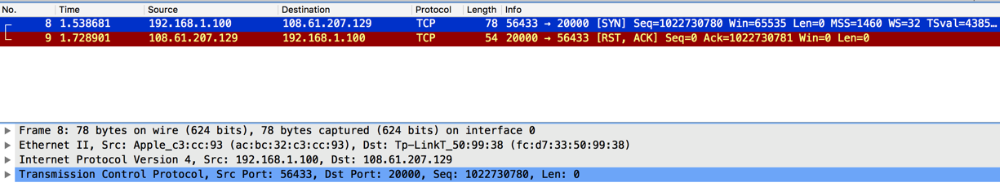
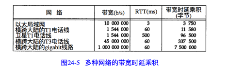

TCP提供一种面向连接的，可靠的字节流服务。

源端端口号，目的端端口号，源端IP地址，目的端IP地址，加上协议（IPv4）唯一确定一个TCP连接。

### Seq和ACK
序号用来标识从TCP发送端向TCP接收端发送的字节流，它表示在这个报文段中的第一个数据字节。Seq Num的增加和传输的字节有关。

TCP用序号对每个字节计数。序号是32 bit的无符号数，序号达到(2 的 32 次方后又从0开始).

SYN，FIN都会占用一个序号。

ACK 表示发送ACK的一端所期望接收的下一个序号。因此ACK是上次已成功收到的数据字节加1.

最常见的可选字段是最长报文大小，又称MSS(maximum Segment Size)。每个连接方通常都在通信的第一个报文段（为建立连接而设置SYN标志的那个段）中指明这个选项。它指明本端所能接收的最大长度的报文段。MSS默认值为536。


### SACK（selective acknowledgment)
这种方式需要在TCP的头里加一个SACK的东西，汇报收到的数据碎片。

这样发送端就知道哪些数据收到了，那些数据没有收到。于是就优化Fast Retransimit算法。

SACK会消耗发送方的资源，试想，如果一个攻击者给数据发送方发一堆SACK的选项，这会导致发送方开始要重传甚至遍历已经发出的数据，这会消耗很多发送端的资源。

### Duplicate SACK - 重复收到数据的问题
Duplicate SACK又称D-SACK，其主要使用了SACK来告诉发送方有哪些数据被重复接收了。RFC-2883 里有详细描述和示例。

D-SACK使用SACK的第一个段来做标志。当使用D-SACK时，SACK选项的第一个block应该是触发了ACK的重复的段(Segment)的序列号（seq)。如果重复的段是接收者数据队列中不连续数据中更大的一块，那么SACK选项的第二个block将用来指定这个更大的block。


D-SACK使用了SACK的第一个段来做标志，

+ 如果SACK的第一个段的范围被ACK所覆盖，那么就是D-SACK

+ 如果SACK的第一个段的范围被SACK的第二个段覆盖，那么就是D-SACK


### D-SACK 和PAWS
RFC 1323具体说明了一个PAWS(Protection Against Wrapped Sequence Numbers)算法。
PAWS gives a method for
distinguishing between sequence numbers for new data, and sequence
   numbers from a previous cycle through the sequence number space.
   Duplicate segments might be detected by PAWS as belonging to a
   previous cycle through the sequence number space.

RFC 1323 specifies that for such packets, the receiver should do the
      following:

         Send an acknowledgement in reply as specified in RFC 793 page 69,
         and drop the segment.

Since PAWS still requires sending an ACK, there is no harmful
            interaction between PAWS and the use of D-SACK.  The D-SACK block can
            be included in the SACK option of the ACK, as outlined in Section 4,
            independently of the use of PAWS by the TCP receiver, and
            independently of the determination by PAWS of the validity or
            invalidity of the data segment.

TCP senders receiving D-SACK blocks should be aware that a segment
            reported as a duplicate segment could possibly have been from a prior
            cycle through the sequence number space.  This is independent of the
            use of PAWS by the TCP data receiver.  We do not anticipate that this
            will present significant problems for senders using D-SACK
            information.


### 关于连接建立时的Seq
当一端为建立连接而发送它的SYN时，它为连接选择一个初始序号。ISN随着时间而变化，因此每一个连接都将具有不同的ISN。RFC 793 指出ISN可看作是一个32 bit的计数器，每 4 微秒 加1，序号到达(2的32次方减一)后又从0开始。这样选择序号的目的在于防止网络中被延迟的分组在以后又被传送，而导致某个连接的一方对它作错误的解释。


### 2MSL等待状态
TIME_WAIT状态也称为2MSL等待状态。每一个具体TCP实现必须选择一个报文段最大生存时间(Maximum Segment Lifetime)。它是任何报文段被丢弃前在网络内的最长时间。

对于一个具体实现给定的MSL值，处理的原则是：当TCP执行一个主动关闭，并发回最后一个ACK，该连接必须在TIME_WAIT状态停留的时间为2倍的MSL。这样可以让TCP再次发送最后的ACK以防这个ACK丢失（另一端超时并重发最后的FIN）.（执行主动关闭的一端在进入这个状态时要保持的时间为2MSL）

为什么要这有TIME_WAIT？为什么不直接给转成CLOSED状态呢？主要有两个原因：1）TIME_WAIT确保有足够的时间让对端收到了ACK，如果被动关闭的那方没有收到Ack，就会触发被动端重发Fin，一来一去正好2个MSL，2）有足够的时间让这个连接不会跟后面的连接混在一起（你要知道，有些自做主张的路由器会缓存IP数据包，如果连接被重用了，那么这些延迟收到的包就有可能会跟新连接混在一起）,在连接处于2MSL等待时，任何迟到的报文段将被丢弃，所以这个连接的报文段不会和后面连接的报文段混在一起。

这种2MSL等待的另一个结果是这个TCP连接在2MSL等待期间，定义这个连接的socket(客户端IP地址和端口，服务端IP地址和端口)不能再使用。这个连接只能在2MSL结束后才能再被使用。

遗憾的是，大多数TCP实现强加了更为严格的限制。在2MSL等待期间，socket中使用的本地端口在默认情况下不能再被使用。（某些实现和API提供了一种避开这个限制的方法。使用socket API时，可说明其中的SO_REUSEADDR选项。它将让调用者对处于2MSL等待的本地端口进行赋值）。

在连接处于2MSL等待时，任何迟到的报文段将被丢弃。因为处于2MSL等待的，由该socket pair定义的连接在这段时间内不能被再用。

客户端执行主动关闭并进入TIME_WAIT是正常的。服务器通常执行被动关闭，不会进入TIME_WAIT状态。这暗示如果我们终止一个客户端程序，并立即重新启动这个客户端程序，则这个新客户端程序将不能重用相同的本地端口。这不会带来什么问题，因为客户使用本地端口，而不关心这个端口号是什么。

然而，对于服务器，情况就有所不同，因为服务器使用熟知端口。如果我们终止一个已经建立连接的服务器程序（服务器执行主动关闭），并试图立即重新启动这个服务器程序，服务器程序将不能把他的这个熟知端口赋给它的端点，因为那个端口是处于2MSL连接的一部分。

需要再次强调2MSL等待的一个效果，一个socket 对(即包含本地IP地址，本地端口，远程IP地址，远程端口的4元组)在它处于2MSL等待时，将不能在被使用。尽管许多具体的实现中允许一个进程重新使用仍处于2MSL等待的端口(通常是设置选项 SO_REUSEADDR)，但TCP不能允许一个新的连接建立在相同的socket对上。


### TIME_WAIT数量太多
如果在大并发的短连接下，TIME_WAIT就会太多（socket无法释放），这会消耗很多系统资源，导致服务器效率下降（引发很多问题，比如no buffer space available）。

一般是由服务端去断开连接，所以服务器会出现很多TIME_WAIT状态的socket，如果让客户端断开连接这个问题就抛给客户端了。

tcp_tw_reuse,tcp_timestamps:开启重用，允许将TIME_WAIT sockets重新用于新的TCP连接 默认为0表示关闭

tcp_tw_recycle:开启TCP连接中TIME_WAIT sockets的快速回收 默认为0 表示关闭

### 3 复位报文段(RST)
TCP首部中的RST比特是用于“复位”的。一般来说，无论何时一个报文段发往基准的连接出现错误，TCP都会发出一个复位报文段（这里提到的基准的连接是指由目的IP地址和目的端口号以及源IP地址和源端口号指明的连接）。

#### 3.1 到不存在的端口的连接请求
产生复位的一种常见情况是当连接请求到达时，目的端口没有进程在监听。对于UDP，当一个数据到达目的端口时，该端口没在使用，它将产生一个ICMP端口不可达的信息。而TCP则使用复位。

产生这个例子也很容易，我们可使用Telnet程序来指明一个目的端口没在使用的情况：

````
~ telnet 108.61.207.129 20000
Trying 108.61.207.129...
telnet: connect to address 108.61.207.129: Connection refused
telnet: Unable to connect to remote host
````

下图是用wireshark捕获的分组交换过程：



需要注意的值是RST报文段中的序号字段和ACK字段。

#### 3.2 异常终止一个连接
我们在上一节看到终止一个连接的正常的方式是一方发送FIN。有时这也称为有序释放(orderly release)，因为在所有排队数据都已经发送之后才发送FIN,正常情况下没有任何数据丢失。但也有可能发送一个复位报文段而不是FIN来中途释放一个连接。有时称这为异常释放(abortive release)。

异常终止一个连接对应用程序来说有两个优点：

1. 丢弃任何待发送数据并立即发送复位报文段

2. RST的接收方会区分另一端执行的是异常关闭还是正常关闭。应用程序使用的API必须提供产生异常关闭而不是正常关闭的手段。

Socket API通过"linger on close"选项(SO_LINGER)提供这种异常关闭的能力。这将导致连接关闭时进行复位而不是正常的FIN。

需要注意的是，RST报文段不会导致另一端产生任何响应，另一端根本不进行确认。收到RST的一方将终止该连接，并通知应用层连接复位。

#### 3.2 检测半打开连接
如果一方已经关闭或异常终止连接而另一方却还不知道，我们将这样的TCP连接称为半打开的(half-open)。任何一端的主机异常都可能导致发生这种情况。只要不打算在半打开连接上传输数据，仍处于连接状态的一方就不会检测另一方已经出现异常。

半打开连接出现的另一个常见原因是当客户端主机突然掉电而不是正常的结束客户应用程序后再关机。使用TCP的keepalive选项能使TCP的一端发现另一端已经消失。

能很容易的建立半打开连接。在bsdi上运行Telnet客户程序，通过它和svr4上的discard 服务器建立连接。我们键入一行字符，然后通过tcpdump进行观察，接着断开服务器主机与以太网的电缆，并重启服务器主机。这可以模拟服务器主机出现异常（在重启服务器之前断开以太网电缆是为了防止它向打开的连接发送FIN，某些TCP在关机时会这么做）。服务器主机重启后，我们重新接上电缆，并从客户端向服务器发送另一行字符。由于服务器的TCP已经重新启动，它将丢失复位前连接的所有信息，因此他不知道数据报文段中提到的连接。TCP的原则是接收方以复位作为应答。

### 同时打开
TCP同时打开时，它仅仅建立一条连接而不是两条。

一个同时打开的连接需要交换4个报文段，比正常的3次握手多一个。

尽管很难，但仍然可能产生一个同时打开的连接。两端必须几乎在同时启动，以便收到彼此的SYN。只要两端有较长的往返时间就能保证这一点。

### TCP选项
+ 最大报文段长度：kind = 2 len = 4
+ 窗口扩大因子：kind = 3 len = 3
+ SACK :kind = 5
+ 时间戳：kind = 8,len = 8

当服务器的连接队列已满时，TCP将不理会传入的SYN，也不发回RST作为应答。由于不应答SYN，服务器程序迫使客户端TCP随后重传SYN。

# 19 TCP的交互数据流
## 经受时延的确认
通常TCP在接收到数据时并不立即发送ACK；相反，它推迟发送，以便将ACK与需要沿该方向发送的数据一起发送（有时这种现象称为数据捎带ACK）。绝大多数实现采用的时延为200 ms，也就是说，TCP将以最大200 ms的时延等待是否有数据一起发送。


## Nagle算法
在一个Rlogin连接上客户一般每次发送一个字节到服务器，这就产生了一些41字节长的分组：20字节的IP首部，20字节的TCP首部和1字节的数据。在局域网上，这些小分组通常不会引起麻烦，因为局域网一般不会出现拥塞。但在广域网上，这些小分组则会增加拥塞出现的可能。一种简单和好的方法就是采用RFC 896建议的Nagle算法。

该算法要求一个TCP连接上最多只能有一个未被确认的未完成的小分组，在该分组的确认到达之前不能发送其他的小分组。相反，TCP收集这些少量的分组，并在确认到来时以一个分组的方式发出去。该算法的优越之处在于它是自适应的：确认到达的越快，数据也就发送得越快。在希望减少微小分组数目的低速广域网上，则会发送更少的分组。

Nagle算法没有禁止小包发送，只是禁止了大量的小包发送。（减少小包的数量）

对于一些交互性强的场景，比如telnet，ssh,需要关闭Nagle算法。使用TCP_NODELAY选项来关闭Nagle算法。

# 20 TCP的成块数据流

### 慢启动
慢启动的算法如下(cwnd全称Congestion Window)：

1）连接建好的开始先初始化cwnd = 1，表明可以传一个MSS大小的数据。

2）每当收到一个ACK，cwnd++; 呈线性上升

3）还有一个ssthresh（slow start threshold），是一个上限，当cwnd >= ssthresh时，就会进入“拥塞避免算法”


通告窗口的容量计算：

capacity(bit) = bandwidth(b/s) * round-trip time(s)

# 21 TCP的超时和重传
TCP提供可靠的传输层。它使用的方法之一就是确认从另一端收到的数据。但是数据和确认都有可能会丢失。TCP通过在发送时设置一个定时器来解决这种问题。如果当定时器溢出时还没有收到确认，它就重传该数据。对任何实现而言，关键之处就在于超时和重传的策略，即怎么样决定超时间隔和如何确定重传的频率。

对每一个连接，TCP管理4个不同的定时器。

1. 重传定时器使用于当希望收到另一端的确认。

2. 坚持(persist) 定时器使窗口大小信息保持不断流动，即使另一端关闭了其接受窗口。

3. 保活(keepalive)定时器可检测到一个空闲连接的另一端何时崩溃或重启。

4. 2MSL定时器测量一个连接处于TIME_WAIT状态的时间。

## 往返时间测量
TCP超时和重传中最重要的部分就是对一个给定连接的往返时间（RTT）的测量。由于路由器和网络流量均会变化，因此我们认为这个时间可能会经常发生变化，TCP应该跟踪这些变化并相应的改变其超时时间。

### 1.经典算法
RFC 793中定义的经典算法是这样的：

1. 首先采样RTT，记下最近好几次的RTT值。
2. 然后计算平滑RTT（SRTT），公式为：`SRTT = (α * SRTT) + （（1-α）* RTT）`。这里的α是一个平滑因子（比如0.8，0.9），这样每个新估计的α 来自前一个估计，而（1-α）来自新的测量。

3. 开始计算RTO(Retransmission Timeout)。`RTO = RTO = min[UBOUND,max[LBOUND,(BETA*SRTT)]]`。其中UBOUND是最大的timeout时间，上限值；LBOUND是最小的timeout时间，下限值；β 值一般在1.3到2.0之间。

### 2. Karn 算法
在一个分组重传时会产生这样一个问题：假定一个分组被发送，当超时发生时，进行了重传，然后收到一个确认。那么这个确认是针对第一个分组还是针对第二个分组呢？这就是所谓的重传的多义性问题。

当更新RTT 时，Karn算法忽略了重传的段。重传的段不会被计入采样。RTT估计只基于确定的ACK，也就是那些没有发生重传的段。

这个简单的实现也会导致问题。如果在某一时间，网络闪动，突然变慢了，产生了比较大的延时，这个延时导致要重转所有的包（因为之前的RTO很小），于是，因为重转的不算入采样，所以RTO就不会被更新。
于是Karn算法用了一个取巧的方式——只要一发生重传，就对现有的RTO值翻倍（这就是所谓的 Exponential backoff）。

### 3. Jacobson 算法


### 滑动窗口
TCP的首部有一个字段叫 Window,这个字段是接收端告诉发送端自己还有多少缓冲区可以接收数据。于是发送端就可以根据这个接收端的处理能力来发送数据，而不会导致接收端处理不过来。

## 拥塞处理

### 拥塞避免算法
拥塞避免算法是一种处理丢失分组的方法。

该算法假定由于分组受到损坏引起的丢失是非常少的(远小于 1%)，因此分组丢失就意味着在源主机和目的主机之间的某处网络上发生了拥塞。有两种分组丢失的指示:发生超时和接收到重复的确认。

拥塞避免算法和慢启动算法是两个目的不同、独立的算法。但是当拥塞发生时，我们希望降低分组进入网络的传输速率，于是可以调用慢启动来做到这一点。在实际中这两个算法通常在一起实现。

拥塞避免算法和慢启动算法需要对每一个连接维持两个变量：一个拥塞窗口 cwnd和一个慢启动门限ssthresh。当`cwnd >= ssthresh` 就会进入用拥塞避免算法。一般来说，ssthresh为65535个字节。这样得到拥塞算法的工作过程如下：

1. 收到一个ACK时，将cwnd增加 1/cwnd

2. 我们希望在一个RTT内最多为cwnd增加一个报文段（不管在这个RTT中收到了多少ACK）。也就是说，每过一个RTT,cwnd = cwnd + 1。（然而慢启动将根据这个往返时间中所收到的ACK的个数增加cwnd。）

https://en.wikipedia.org/wiki/TCP_congestion_control

### 拥塞状态时的算法
当丢包（拥塞）发生时，有两种情况（定时器超时和收到重复的确认）

1. 等到RTO超时，重传数据包。TCP认为这种情况太糟糕(网络很慢,所以要尽快的降低数据段的发送速度，采用慢启动方法)。

   + ssthresh = cwnd(发生拥塞时的当前窗口)/2

   + cwnd 重置为1

   + 进入慢启动过程

2. Fast Retransmission算法，也就是在收到3个重复的ACK之后就开启重传丢失的数据报文段，而不用等RTO超时。

   + TCP Tahoe的实现和RTO超时一样（启动慢启动）

   + TCP Reno的实现是：
       + cwnd(new) = cwnd(发生拥塞时的当前窗口)/2
       + ssthresh = cwnd(new)
       + 进入快速恢复算法

### 快速恢复算法
TCP Reno

这个算法定义在RFC5681。快速重传和快速恢复算法一般同时使用。快速恢复算法是认为，你还有3个Duplicated Acks说明网络也不那么糟糕，所以没有必要像RTO超时那么强烈。 注意，正如前面所说，进入Fast Recovery之前，cwnd 和 sshthresh已被更新：

cwnd = cwnd /2
sshthresh = cwnd

然后，真正的Fast Recovery算法如下：

+ cwnd = sshthresh  + 3 * MSS （3的意思是确认有3个数据包被收到了）

+ 重传Duplicated ACKs指定的数据包

+ 如果再收到 duplicated Acks，那么cwnd = cwnd +1

+ 如果收到了新的Ack，那么，cwnd = sshthresh ，然后就进入了拥塞避免的算法了。

如果你仔细思考一下上面的这个算法，你就会知道，上面这个算法也有问题，那就是——它依赖于3个重复的Acks。注意，3个重复的Acks并不代表只丢了一个数据包，很有可能是丢了好多包。但这个算法只会重传一个，而剩下的那些包只能等到RTO超时，于是，进入了恶梦模式——超时一个窗口就减半一下，多个超时会超成TCP的传输速度呈级数下降，而且也不会触发Fast Recovery算法了。       

通常来说，正如我们前面所说的，SACK或D-SACK的方法可以让Fast Recovery或Sender在做决定时更聪明一些，但是并不是所有的TCP的实现都支持SACK（SACK需要两端都支持），所以，需要一个没有SACK的解决方案。而通过SACK进行拥塞控制的算法是FACK（后面会讲）

TCP New Reno

于是，1995年，TCP New Reno（参见 RFC 6582 ）算法提出来，主要就是在没有SACK的支持下改进Fast Recovery算法的——

+ 当sender这边收到了3个Duplicated Acks，进入Fast Retransimit模式，开始重传重复Acks指示的那个包。如果只有这一个包丢了，那么，重传这个包后回来的Ack会把整个已经被sender传输出去的数据ack回来。如果没有的话，说明有多个包丢了。我们叫这个ACK为Partial ACK。

+ 一旦Sender这边发现了Partial ACK出现，那么，sender就可以推理出来有多个包被丢了，于是乎继续重传sliding window里未被ack的第一个包。直到再也收不到了Partial Ack，才真正结束Fast Recovery这个过程

我们可以看到，这个“Fast Recovery的变更”是一个非常激进的玩法，他同时延长了Fast Retransmit和Fast Recovery的过程。


### ICMP差错
A large number of implementations completely ignore ICMP Source
   Quench messages meant for TCP connections.  This behavior has been
   implemented in, at least, Linux [Linux] since 2004, and in FreeBSD
   [FreeBSD], NetBSD [NetBSD], OpenBSD [OpenBSD], and Solaris 10 since
   2005.  Additionally, OpenSolaris [OpenSolaris] has always shipped
   with support for ICMP Source Quench messages disabled.


### 重新分组
当TCP超时并重传时，他不一定要重传同样的报文段。相反，TCP允许进行重新分组而发送一个较大的报文段，这将有助于提高性能。

# 22 TCP的persist定时器
TCP通过让接受方指明希望从发送方接收的数据字节数（即窗口大小）来进行流量控制。如果窗口大小为0会发生什么情况呢？这将有效的阻止发送方传送数据，直到窗口变为非0为止。

如果一个确认丢了，双方就有可能因为等待对方而使连接终止：接收方等待接收数据（因为它已经向发送方通告了一个非0窗口），而发送方在等待允许它继续发送数据的窗口更新。为了防止这种死锁情况发生，发送方使用一个persist timer（坚持定时器）来周期性的向接收方查询，以便发现窗口是否已增大。这些从发送方发出的报文段称为窗口探查(window probe)。

计算坚持定时器时使用了普通的TCP指数退避(backoff)。

窗口探查包含一个字节的数据。TCP总是允许在关闭连接前发送一个字节的数据。

坚持状态与第21章中介绍的重传超时之间一个不同的特点就是 TCP从不放弃发送窗口探查。这些探查每隔 60秒发送一次，这个过程将持续到或者窗口被打开，或者应用进程使用的连接被终止。

### 糊涂窗口综合征
Silly Window Syndrome

如果发生这种情况，则少量的数据通过连接进行交换，而不是满长度的报文段。

该现象可以发生在两端中的任何一端：接收方可以通告一个小的窗口（而不是一直等到有大的窗口才通告），而发送方也可以发送少量的数据（而不是等待其他数据以便发送一个大的报文段）。可以在任何一端采用措施避免出现糊涂窗口综合征。

1. 如果这个问题是由Receiver端引起的，那么就会使用 David D Clark’s 方案。在receiver端，如果收到的数据导致window size小于某个值，可以直接ack(0)回sender，这样就把window给关闭了，也阻止了sender再发数据过来，等到receiver端处理了一些数据后windows size 大于等于了MSS，或者，receiver buffer有一半为空，就可以把window打开让send 发送数据过来。


2. 如果这个问题是由Sender端引起的，那么就会使用著名的 Nagle’s algorithm。这个算法的思路也是延时处理，他有两个主要的条件：1）要等到 Window Size>=MSS 或是 Data Size >=MSS，2）收到之前发送数据的ack回包，他才会发数据，否则就是在攒数据。

# 23 TCP的保活定时器
一方需要了解另一方是否崩溃。

保活定时器时一个有争议的功能。

在连接两个端系统的网络出现临时故障的时候，保活选项会引起一个实际很好的连接终止。

如果一个给定的连接在两个小时内没有任何动作，则服务器就向客户发送一个探查报文段。客户主机必须处于以下4种状态之一。

1. 客户主机仍然正常运行，并从服务器可达。客户的TCP响应正常，而服务器也知道对方是正常工作的。服务器在两小时以后将保活定时器复位。如果在两小时定时器时间到之前有应用程序的通信量通过此连接，则定时器在交换数据后的未来2小时在复位。

2. 客户主机已经崩溃，并且关闭或者正在重新启动。在任何一种情况下，客户的TCP都没有响应。服务器将不能够收到对探查的响应，并在75秒后超时。服务器总共发送10个这样的探查，每个间隔75秒。如果服务器没有收到一个响应，它就认为客户主机已经关闭并终止连接。

3. 客户主机崩溃并已经重新启动。这是服务器将收到一个对其保活探查的响应，但是这个响应是一个复位，使得服务器终止这个连接。

4. 客户主机正常运行，但是从服务器不可达。和2相同。

# 24 TCP的未来和性能

### 路径MTU发现
路径MTU，就是当前两个主机之间的路劲上任何网络上的最小MTU。

路径MTU发现在IP首部中设置"不要分片（DF）"比特，来发现当前路径上的路由器是否需要对正在发送的IP数据报进行分片。如果一个待转发的IP数据报被设置DF比特，而其长度又超过了MTU，那么路由器将返回ICMP不可达的差错。在11章我们说明了某版本的Traceroute程序使用该机制来决定目的地的路径MTU。

路径MTU发现按如下方式操作。当一个连接建立时，TCP使用外出接口最小的MTU，或者对端系统声明的MSS，作为最初的报文段大小。路径MTU发现不允许TCP超过对端系统声明的MSS。如果对端没有指定MSS，那么默认使用536 byte。

一旦选定了起始的报文段的大小，在该连接上的所有被TCP发送的IP数据报都将被设置DF比特。如果某个中间路由器需要对一个设置了DF标志的数据报进行分片，它就丢弃这个数据报，并产生一个ICMP“不能分片”差错。

如果收到这个ICMP差错，TCP就减少段大小并进行重传。如果路由器产生的是一个较新的该类ICMP差错（会返回下一跳的MTU），则报文段大小被设置为下一跳的MTU减去IP和TCP首部长度。如果是一个较旧的该类ICMP差错，则必须尝试一个可能的最小MTU。当有这个ICMP差错引起的重传发生时，拥塞窗口不需要变化，但要启动慢启动。

由于路由可以动态变化，因此在最后一次减少路径MTU的一段时间后，可以尝试使用一个较大的值。


### 长肥管道
long falt pipe

在20章，我们把一个连接的容量表示为: `capacity(b) = bandwidth(b/s) * round-trip time(s)`

并称之为带宽时延乘积。也可称它为两端的管道大小。

当这个乘积变得越来越大时，TCP的某些局限性就会暴露出来。下图显示了多种类型的网络的某些数值。



具有大的带宽时延乘积的网络被称为长肥网络(long falt network)，而一个运行在LFN上的TCP连接被称为长肥管道。管道可以被水平拉长（一个长的RTT），或被垂直拉高（较高的带宽），或向两个方向拉伸。使用长肥管道会遇到多种问题。

1. TCP首部中窗口大小为16 bit，从而将窗口限制在65535字节内。但是需要一个更大的窗口来提供更大的吞吐量。使用窗口扩大选项可以解决这个问题。

2. SACK

3. 需要更精确的RTT测量。使用时间戳选项。

4. 序号回绕。使用PAWS。


### 时间戳选项

https://en.wikipedia.org/wiki/TCP_congestion_control

http://coolshell.cn/articles/11564.html

http://coolshell.cn/articles/11609.html
