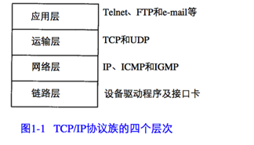
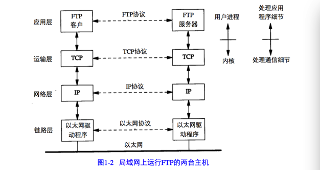
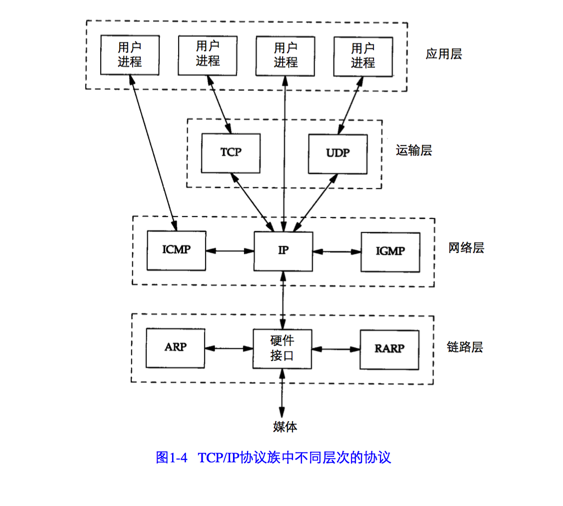
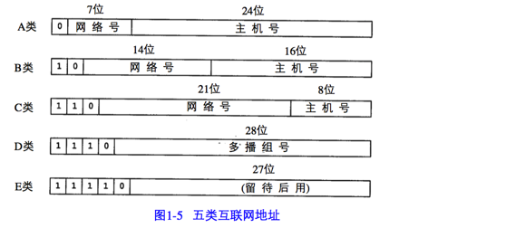
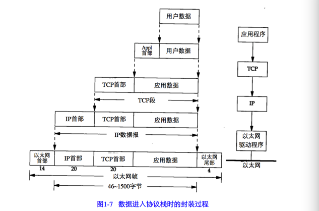
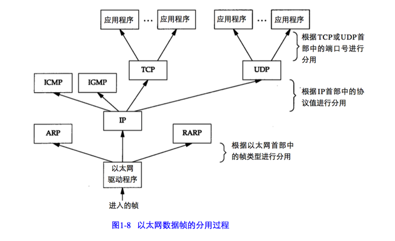

## 分层
网络协议通常分不同层次进行开发，每一层分别负责不同的通信功能。一个协议族，比如TCP/IP，是一组不同层次上的多个协议的组合。TCP/IP通常被认为是一个四层协议系统，如图1-1所示。

每一层负责不同的功能：

1. 链路层，有时也称为数据链路层或网络接口层，通常包括操作系统中的设备驱动程序和计算机中对应的网络接口卡。它们一起处理与电缆（或其他任何传输媒介）的物理接口细节。

2. 网络层，有时也称为互联网层，处理分组在网络中的活动，例如分组的选路。在TCP/IP协议族中，网络层协议包括IP协议（网际协议），ICMP协议（Internet互联网控制报文协议），以及IGMP协议（Internet组管理协议）。

3. 运输层主要为两台主机上的应用程序提供端到端的通信。在TCP/IP协议族中，有两个互不相同的传输协议：TCP（传输控制协议）和UDP（用户数据报协议）。TCP为两台主机提供高可靠性的数据通信。它所做的工作包括把应用程序交给他的数据分成合适的小块交给下面的网络层，确认接收到的分组，设置发送最后确认分组的超时时钟等。由于运输层提供了高可靠性的端到端通信，因此应用层可以忽略这些细节。另一方面，UDP则为应用层提供了一种简单的服务。它只是把称作数据报的分组从一台主机发送到另一台主机，但并不保证该数据报能到达另一端。任何必需的可靠性必须由应用层来提供。

4. 应用层负责处理特定的应用程序细节。几乎各种不同的TCP/IP实现都会提供下面这些通用的应用程序：

+ Telnet 远程登录
+ FTP 文件传输协议
+ SMTP 简单邮件传送协议
+ SNMP 简单网络管理协议

假设在一个局域网（LAN）如以太网中有两台主机，两者都运行FTP协议，图1-2 列出了该过程所涉及的所有协议。

  

如上图所示，在同一层，双方都有对应的一个或多个协议进行通信。例如某个协议允许TCP层进行通信，而另一个协议允许两个IP层进行通信。

网络接口层和应用层的目的是很显然的— 前者处理有关通信媒介的细节(以太网、令牌环网等 ), 而后者处理某个特定的用户应用程序(FTP、Telnet等)。 但是 , 从表面上看, 网络层和运输层之间的区别不那么明显。为什么要把它们划分成两个不同的层次呢?为了理解这一点,我们必须把视野从单个网络扩展到一组网络。

一个互连网就是一组通过相同协议族互连在一起的网络。构造互连网最简单的方法是把两个或多个网络通过路由器进行连接。它是一种特殊的用 于网络互连的硬件盒。路由器的好处是为不同类型的物理网络提供连接:以太网、令牌环网、 点对点的链接和 FDDI(光纤分布式数据接口)等等 。

图1-3是一个包含两个网络的互联网：一个以太网和一个令牌环网，通过一个路由器互连。尽管这里是两台主机通过路由器进行通信,实际上以太网中的任何主机都可以与令牌 环网中的任何主机进行通信。

在TCP/IP协议族中,网络层IP提供的是一种不可靠的服务 。也就是说 , 它只是尽可 能快地把分组从源结点送到目的结点,但是并不提供任何可靠性保证。而另一方面,TCP在不可靠的IP层上提供了一个可靠的运输层。为了提供这种可靠的服务,TCP采用了超时重传、发送和接收端到端的确认分组等机制。由此可见,运输层和网络层分别负责不同的功能。

连接网络的另一个途径是使用网桥。网桥是在链路层上对网络进行互连，而路由器则是在网络层上对网络进行互连。

TCP/IP 倾向于使用路由器而不是网桥来互联网络。

## TCP/IP 分层

IP是网络层中的主要协议，同时被TCP和UDP使用。TCP和UDP的每组数据都通过端系统和每个中间路由器中的IP层在互联网中进行传输（如图1-3所示）。

ICMP是IP协议的附属协议。IP层用它与其它主机或路由器交换错误报文和其他重要信息。Ping和Traceroute都使用了ICMP。

IGMP是Internet组管理协议。它用来把一个UDP数据报多播到多个主机。

ARP(地址解析协议)和RARP(逆地址解析协议)是某些网络接口(如以太网和令牌环网)使用的特殊协议,用来转换IP层和链路层使用的地址。

## 互联网的地址
互联网上的每个接口必须有一个唯一的Internet地址（也称为IP地址）。IP地址长32bit。五类IP地址格式如图1-5所示：

各类IP地址的范围：

| 类型 | 范围     |
| :------------- | :------------- |
| A      | 0.0.0.0 到 127.255.255.255      |
| B     | 128.0.0.0 到 191.255.255.255       |
| C      | 192.0.0.0 到 233.255.255.255     |
| D     | 224.0.0.0 到 239.255.255.255      |
| E     | 240.0.0.0 到 247.255.255.255      |

## 域名系统
域名系统是一个分布的数据库，由它来提供IP地址和主机名直接点的映射信息。

## 封装
当应用程序用TCP传送数据时，数据被送入协议栈中，然后逐个通过每一层直到被当做一串比特流送入网络。其中每一层对收到的数据都要增加一些首部信息（有时还要增加尾部信息），该过程如图1-7所示。TCP传给IP的数据单元称作TCP报文段或简称为TCP段（tcp segment）。IP传给链路层的数据单元称作IP数据报（IP datagram）。通过以太网传输的比特流称作帧（Frame）。

以太网数据帧的物理特性是其长度必须在46~1500字节之间。

回想1-4，由于TCP、UDP、ICMP、IGMP都要向IP传送数据，因此必须在生成的IP首部中加入某种标识，以表明数据属于哪一层。为此，IP首部中存入一个长度为8 bit的数值，称为协议域。

类似地，UDP和TCP，以及以太网的首部都有类似的标识位。

## 分用
当目的主机收到一个以太网数据帧时，数据就开始从协议栈中由底向上升，同时去掉各种协议加上的报文首部。每层协议盒都要去检查报文首部中的协议标识，以确定接收数据的上层协议。这个过程称作分用(demultiplexing).图1-8显示了该过程是如何发生的。

为协议ICMP和IGMP定位一直是一件很棘手的事情。在图1-4中,把它们与IP放在同一层上,那是因为事实上它们是IP的附属协议。但是在这里,我们又把它们放在IP层的上面,这是因为ICMP和IGMP报文都被封装在IP数据报中。

对于ARP和RARP, 我们也遇到类似的难题。在这里把它们放在以太网设备驱动程序的上方,这是因为它们和IP数据报一样,都有各自的以太网数据帧类型。但在图2-4中,我们又把ARP作为以太网设备驱动程序的一部分,放在IP层的下面 , 其原因在逻辑上是合理的。

这些分层协议盒并不都是完美的。
