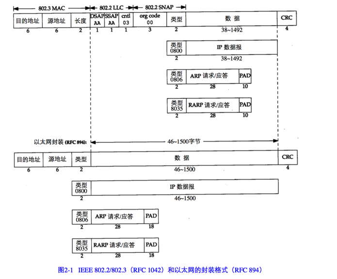

链路层主要有三个目的：

1. 为IP模块发送和接收IP数据报

2. 为ARP模块发送ARP请求和接收ARP应答

3. 为RARP发送和RARP请求和接收RARP应答。

TCP/IP 支持多种不同的链路层协议，这取决于网络所使用的硬件，如以太网，令牌环网，FDDI以及RS-232串行线路。

## 以太网

以太网的数据报的封装是在RFC 894中定义的，IEEE 802网络的IP数据报封装是在RFC 1042中定义的。

最常使用的封装格式是RFC 894定义的格式。图2-1 显示了两种不同形式的封装格式。图中每个方框下面的数据是它们的字节长度。

两种帧格式都采用 48 bit(6字节)的目的地址和源地址（802.3允许使用16 bit 的地址，但一般是48 bit 地址）。这就是我们在本书中所称的硬件地址。ARP 和 RARP 协议对32 bit的IP地址和48 bit的硬件地址进行映射。

接下来的两个字节在两种帧格式中互不相同。在802 标准定义的帧格式中，长度字段是指他后续数据的字节长度，但不包括CRC检验码。以太网的类型字段定义了后续数据的类型。在802 标准定义的帧格式中，类型字段则由后续的子网接入协议（Sub-network Access Protocol,SNAP）的首部给出。幸运的是，802 定义的有效长度值与以太网定义的有效类型值无一相同，这样就可以对两种帧格式进行区分。
也就是说，**目的地址和源地址后面的两个字节的值可以区分以太网封装和802 封装。**

CRC字段用于帧内后续字节差错的循环冗余码校验，也称FCS，帧检验序列。

802.3 标准定义的帧 和 以太网定义的 帧都有最小长度要求。802.3规定数据部分必须至少38字节，而对以太网，则要求最少46字节。为了保证这一点，必须在不足的空间插入填充(pad)字节。

最常见的封装格式为以太网封装。

## SLIP：串行线路IP
SLIP的全称是Serial Line IP.它是一种在串行线路上对IP数据报进行封装的简单形式，在RFC 1055中有详细描述。SLIP适用于家庭中每台计算机几乎都有的RS-232串行端口和高速调制解调器接入Internet。

下面的规则描述了SLIP协议定义的帧格式：

1. IP数据报以一个称作END（0xc0）的特殊字符结束。同时，为了防止数据报到来之前的线路噪声被当成数据报内容，大多数实现在数据报的开始处也传一个END 字符（如果线路有噪声，那么END字符将结束这份错误的报文。这样当前的报文得以正确地传输，而前一个错误报文交给上层后，会发现其内容毫无意义而被丢弃）。

2. 如果IP报文中某个字符为END（0xc0），那么就要连续传输两个字节 0xdb 和 0xdc 来取代它。0xdb这个特殊字符被称作SLIP的ESC字符，但它的值和ASCII码的ESC字符(0x1b)不同。

3. 如果IP报文汇总的某个字符为SLIP的ESC字符（0xdb），那么就要连续传输两个字节0xdb 和 0xdd 来取代它。

图2-2 中的例子就是含有END字符和一个ESC字符的IP报文。在这个例子中，在串行线路上传输的总字节数是原IP报文长度再加4个字节。

SLIP 是一种简单的帧封装方法，还有一些值得一提的缺陷：

1. 每一端必须知道对方的IP地址。没有办法把本端的IP地址通知给另一端。

2. 数据帧中没有类型字段（类似于以太网中的类型字段）。如果一条串行线路用于SLIP，那么它不能同时使用其他协议。

3. SLIP没有在数据帧中加上检验和（类似于以太网中的CRC字段）。如果SLIP传输的报文被线路噪声影响而发生错误，只能通过上层协议来发现（另一种方法是，新型调制解调器可以检测并纠正错误报文）。这样上层协议提供CRC就显得很重要。IP首部和TCP首部及其数据始终都有检验和。

## 压缩的SLIP
由于串行线路的速率通常较低，而且通信通常都是交互式的，因此在SLIP线路上有许多的TCP分组进行交换。为了传送1字节的数据需要20字节的IP首部和20字节的TCP首部，总数超过40字节。

由于这些性能上的缺陷，人们提出了一个被称作CSLIP的新协议。CSLIP一般能把上面的40字节压缩到3或5个字节。它能在CSLIP的每一端维持多达16个TCP连接，并且知道其中每个连接的首部中的某些字段一般不会发生变化。

## PPP：点对点协议
PPP，点对点协议修改了SLIP协议中的所有缺陷。PPP包括以下三个部分：

1. 在串行链路上封装IP数据报的方法。PPP既支持数据为8位和无奇偶检验的异步模式（如大多数计算机上都普遍存在的串行接口），还支持面向比特的同步链接。

2. 建立、配置及测试数据链路的链路控制协议（LCP：Link Control Protocol）。它允许通信双方协商，以确定不同的选项。

3. 针对不同网络层协议的网络控制协议（NCP：Network Control Protocol）。当前RFC 定义的网络层有IP，OSI网络层，等。IP NCP允许双方商定是否对报文首部进行压缩，类似于CSLIP。

图2-3是PPP数据帧格式：

每一帧都以标志字符0xfe开始和结束。紧接着是一个地址字节，值始终是0xff，然后是一个值为0x03的控制字节。

接下来是协议字段，类似于以太网类型字段中的功能。

    1. 当它的值为`0x0021`时，表示信息字段是一个IP数据报

    2. 当它的值为`0xc021`时，表示信息字段是链路控制数据

    3. 当它的值为`0x8021`时，表示信息字段是网络控制数据

CRC字段（或FCS，帧检验序列）是一个循环冗余检验码，以检测数据帧中的错误。

由于标志字符的值是`0x7e`，因此当该字符出现在信息字段中时，PPP需要对它进行转义。在同步链路中,该过程是通过一种称作比特填充 (bit stuffing)的硬件技术来完成的[Tanenbaum 1989]。在异步链路中,特殊字符 0x7d 用作转义字符。当它出现在 PPP 数据帧中时,那么紧接着的字符的第 6 个比特要取其补码,具体实现过程如下:

1. 当遇到字符 0x7e 时,需连续传送两个字符: 0x7d 和 0x5e ,以实现标志字符的转义。

2. 当遇到转义字符 0x7d 时,需连续传送两个字符: 0x7d 和 0x5d ,以实现转义字符的转义。

3. 默认情况下,如果字符的值小于 0x20 (比如,一个 ASCII 控制字符),一般都要 进行转义。例如,遇到字符 0x01 时需连续传送 0x7d 和 0x21 两个字符(这时,第 6 个比特取补码后变为 1,而前面两种情况均把它变为 0)

这样做的原因是防止它们出现在双方主机的串行接口驱动程序或调制解调器中,因为有 时它们会把这些控制字符解释成特殊的含义。另一种可能是用链路控制协议来指定是否需要对这32个字符中的某一些值进行转义。默认情况下是对所有的32个字符都进行转义。

如果我们把PPP的帧格式与前面的SLIP的帧格式进行比较会发现，PPP只增加了3个额外的字节：1个字节留给协议字段，另外2个给CRC字段使用。

总的来说，PPP比SLIP具有下面这些优点：

1. PPP 支持在单根串行线路上运行多种协议，不只是IP协议

2. 每一帧都有循环冗余检验

3. 通信双方可以进行IP地址的动态协商（使用IP网络控制协议）

4. 与CSLIP类似，对TCP和IP报文首部进行压缩

5. 链路控制协议可以对多个数据链路选项进行设置

为这些优点付出的代价是在每一帧的首部增加3个字节，当建立链路时要发送几帧协商数据，以及更为复杂的实现。

## 环回接口
大多数产品都支持环回接口，以允许允许在同一台主机上的客户程序和服务器程序通过TCP/IP进行通信。A 类网络号 127 就是为环回接口预留的。根据惯例，大多数系统把IP地址`127.0.0.1`分配给这个接口，并命名为localhost。一个传给环回接口的IP数据报不能再任何网络上出现。

我们想象,一旦传输层检测到目的端地址是环回地址时,应该可以省略部分传输层和所 有网络层的逻辑操作。但是大多数的产品还是照样完成传输层和网络层的所有过程,只是当 IP 数据报离开网络层时把它返回给自己。

图2-4是环回接口处理IP数据报的简单过程：

图中需要指出的关键点是:

1. 传给环回地址(一般是 127.0.0.1 )的任何数据均作为IP输入。

2. 传给广播地址或多播地址的数据报复制一份传给环回接口,然后送到以太网上。这是
因为广播传送和多播传送的定义包含主机本身。

3. 任何传给该主机IP地址的数据均送到环回接口。看上去用传输层和IP层的方法来处理环回数据似乎效率不高, 但它简化了设计,因为环回接口可以被看作是网络层下面的另一个链路层。网络层把一份数据报传送给环回接口,就像传给其他链路层一样,只不过环回接口把它返回到IP的输入队列。

在图2-4中,另一个隐含的意思是送给主机本身IP地址的IP数据报一般不出现在相应的网络上.由于一台主机必须处理发送给自己的 IP 数据报,因此图 2-4 所示的过程是最为简单的处理办法。

## 最大传输单元MTU
以太网和802.3对数据帧的长度都有一个限制，其最大值分别是1500和1492字节。链路层的这个特性称为MTU，最大传输单元。不同类型的网络大多数都有一个上限。

如果IP层有一个数据包要传，而且数据的长度比链路层的MTU要大，那么IP层就需要进行分片(fragmentation)，把数据报分成若干片，这样每一片都小于MTU。

图2-5俩除了一些典型的MTU值，它们摘自RFC 1191.

| 网络 | MTU字节     |
| :------------- | :------------- |
|  超通道    | 65535      |
|   16Mb/s 令牌环网（IBM）   |  17914     |
|    16Mb/s 令牌环网（IEEE802.5）  | 4464      |
|    FDDI  |   4352   |
|   以太网   | 1500     |
|     IEEE802.3/802.2 | 1492     |
|  X.25     |  576    |
|   点对点（低时延）   | 296     |

点到点的链路层(如 SLIP 和 PPP)的MTU并非指的是网络媒体的物理特性。相反,它是一个逻辑限制,目的是为交互使用提供足够快的响应时间。

## 路径MTU
当在同一网络上的两台主机互相通信时，该网络的MTU是非常重要的。但是如果两台主机之间的通信要通过多个网络，那么每个网络的链路层就可能有不同的MTU。两台通信主机路径中的最小MTU称为路径MTU。

两台主机之间的路径MTU不一定是个常数。它取决于当时所选择的路由。而选路不一定是对称的(从A到B的路由可能与从B到A的路由不同),因此路径MTU在两个方向上不一定是一致的。
