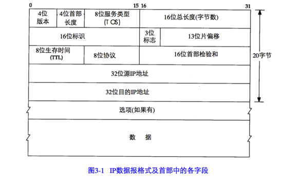
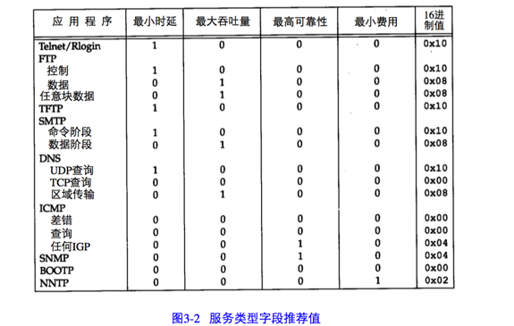
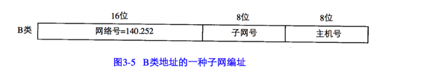
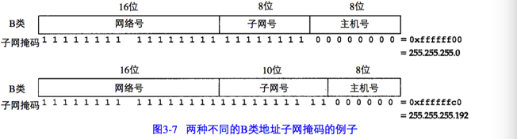
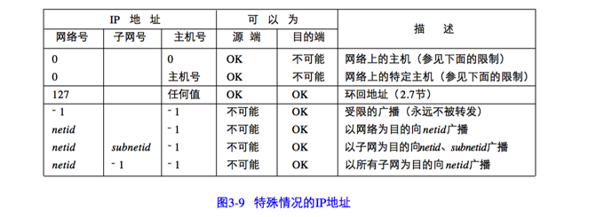

IP协议提供不可靠、无连接的数据报传送服务。

不可靠的意思是它不能保证IP数据报能成功地到达目的地。IP仅提供最好的传输服务。任何要求的可靠性必须由上层来提供（如TCP）。

无连接是IP并不维护后续数据报的状态信息。每一个数据报的处理都是独立的。这也说明，IP数据报可以不按发送顺序接收。如果一信源向相同的信宿发送两个连续的数据报（先是A，然后是B），每个数据报都是独立地进行路由选择，可能选择不同的路线，因此B可能在A到达之前先到达。

## IP首部
IP数据报的格式如图3-1所示。普通的IP首部长为20字节，除非含有选项字段。

网络传输中的字节序为 big endian 字节序。

首部长度指的是首部的长度，指明IP 首部包含多少个32 bit（4字节）。由于首部可能包含可变数量的可选项，所以这个字段可以用来确定IP数据报中数据部分的偏移位置。IP首部的最小长度为20个字节，因此这个字段的最小值用十进制表示就是5（5 * 4 = 20）。也就是说，它表示的是IP首部的总字节数是4 字节的倍数。

服务类型（TOS）字段包括一个3 bit的优先权子字段（现在已被忽略），4 bit的TOS字段和1 bit的未用位但必须置0.4 bit的TOS 分别代表：最小时延，最大吞吐量，最高可靠性和最小费用。4 bit中只能置其中1 bit。如果所有4 bit均为0，那么就意味着是一般服务。

总长度字段是指整个IP数据报的长度，以字节为单位。利用首部长度字段和总长度字段，就可以知道IP数据报中数据内容的起始位置和长度。由于该字段长16 bit，所以IP数据报最长可达65535字节（2的16次方）。当数据被分片时，该字段的值也随着变化。

标识字段唯一的标识主机发送的每一份数据报。通常每发送一份报文它的值就会加 1。

TTL（time-to-live）生存时间字段设置了数据报可以经过的最多路由器数。它指定了数据报的生存时间。TTL的初始值由源主机设置，一旦经过一个处理它的路由器，它的值就会减去 1.当该字段的值为 0时，数据报就被丢弃，并发送ICMP报文通知源主机。

首部检验和字段是根据IP首部计算的检验和码。它不对首部后面的数据进行计算。ICMP，IGMP，UDP和TCP在它们的首部中均含有同时覆盖首部和数据检验和码。

为了计算一份数据报的IP检验和,首先把检验和字段置为 0 。然后,对首部中每个16 bit 进行二进制反码求和(整个首部看成是由一串 16 bit的字组成),结果存在检验和字段中。当收到一份IP数据报后,同样对首部中每个16 bit进行二进制反码的求和。由于接收方在计算过程中包含了发送方存在首部中的检验和,因此,如果首部在传输过程中没有发生任何差错,那么接收方计算的结果应该为全1。如果结果不是全1(即检验和错误),那么IP就丢弃收到的数据报。但是不生成差错报文,由上层去发现丢失的数据报并进行重传。

ICMP、IGMP、UDP和TCP都采用相同的检验和算法,尽管TCP和UDP除了本身的首部和数据外,在IP首部中还包含不同的字段。

选项字段一直都是以32 bit作为界限，在必要的时候插入值为0的填充字符。这样就保证了IP首部始终是32 bit的整数倍。

## IP路由选择
从概念上说，IP路由选择是简单的，特别是对于主机来说。如果目的主机与源主机直接相连（如点对点链路）或者都在一个共享网络上（以太网或令牌环网），那么IP数据报就直接送到目的主机上。否则，主机把数据报发往一默认的路由器上，由路由器来转发该数据报。大多数主机都是采用这种简单机制。

在本节中，我们将讨论更一般的情况，即IP层既可以配置成路由器的功能，也可以配置成主机的功能。当今的大多数用户系统，包括几乎所有的Unix系统，都可以配置成一个路由器。我们可以为它指定主机和路由器都可以使用的简单路由算法。本质的区别是：

**主机从不把数据报从一个接口转发到另一个接口，而路由器则要转发数据报。**

在一般的体制中，IP可以从TCP，UDP，ICMP和IGMP接收数据报（即在本地生成的数据报）并进行发送，或者从一个网络接口接收数据报并进行发送。IP层在内存中有一个路由表。当收到一份数据报并进行发送时，它都要对该表搜索一次。当数据报来自某个网络接口时，IP首先检查目的IP地址是否为本机的IP地址或者IP广播地址。如果确实是这样，数据报就被送到由IP首部协议字段所指定的协议模块进行处理。如果数据报的目的地址不是这些地址，那么

1. 如果IP层被设置成路由器的功能，那么就对数据报进行转发

2. 否则数据报被丢弃

路由表中的每一项都包含下面这些信息：

+ 目的IP地址。它既可以是一个完整的主机地址，也可以是一个网络地址，由该表目中的标志字段来指定。主机地址有一个非0的主机号，以指定某一特定的主机，而网络地址中的主机号为0，以指定网络中的所有主机（如以太网，令牌环网）

+ 下一站路由器的IP地址，或者有直接连接的网络IP地址。下一站路由器是指一个在直接相连网络上的路由器，通过它可以转发数据报。

+ 标志。其中一个标志指明目的IP地址是网络地址还是主机地址，另一个标志指明下一个路由器是否为真正的下一站路由器，还是一个直接相连的接口。

+ 为数据报的传输指定一个网络接口。

IP路由选择是逐跳（hop-by-hop）地进行。所有的IP路由选择置为数据报传输提供下一站路由器的IP地址。

IP路由选择主要完成以下这些功能：

1. 搜索路由表，寻找能与目的IP地址完全匹配的表目（网络号和主机号都要匹配）。如果找到，则把报文发送给该表目指定的下一站路由器或直接连接的网络端口（取决于你的标志字段的值）

2. 搜索路由表，寻找能与目的网络号相匹配的表目。如果找到，则把报文发送给该表目指定的下一站路由器或直接相连的网络接口（取决于你的标志字段的值）。目的网络上的所有主机都可以通过这个表目来处理。例如，一个以太网上的所有主机都是通过这种表目进行寻径的。

3. 搜索路由表，寻找标为"default"的表目。如果找到，则把报文发送给该表目指定的下一站路由器。

如果上面这些步骤都没有成功，那么该数据报就不能被发送。

为一个网络指定一个路由器，而不必为每一个主机指定一个路由器，这是IP路由选择机制的另一个基本特性。这样可以极大的缩小路由表的规模。

## 子网寻址
现在所有的主机都要求支持子网编址。不是把IP地址看成由单纯的一个网络号和一个主机号组成，而是把主机号再分成一个子网号和一个主机号。

这样做的原因是A类和B类地址为主机号分配了太多的空间，可容纳的主机数为 2的24次方 - 2 和 2的16次方 - 2。事实上，在一个网络中人们并不安排那么多主机。由于全0或者全1的主机号是无效的，因此我们把总数减去2。

在InterNIC获得某类IP网络号后，就由当地的系统管理员来进行分配，由他来决定是否建立子网，以及分配多少bit给子网号和主机号。例如，这里有一个 B 类网络地址（140.252），在剩下的16 bit中，8 bit用于子网号，8 bit用于主机号，格式如图3-5所示。这样就允许有254个子网，每个子网可以有254台主机。

## 子网掩码
任何主机在引导时进行的部分配置是指定主机IP地址。

除了IP地址外，主机还需要知道有多少bit 用于子网号及多少 bit用于主机号。这是在引导过程中通过子网掩码来确定的。这个掩码是一个32 bit的值，其中值为1的bit留给网络号和子网号，为0的bit留给主机号。

图3-7是一个B类地址的两种不同的子网掩码格式。

给定IP地址和子网掩码以后,主机就可以确定IP数据报的目的是:(1)本子网上的主机;(2)本网络中其他子网中的主机;(3)其他网络上的主机。如果知道本机的IP地址,那么就知道它是否为A类、B类或C类地址(从IP地址的高位可以得知),也就知道网络号和子网号之间的分界线。而根据子网掩码就可知道子网号与主机号之间的分界线。

## 特殊情况的IP地址
经过子网划分的描述，现在介绍7个特殊的IP地址，如图3-9所示。在这个图中，0表示搜有的bit位全为0；-1表示所有的bit位全为1；netid、subnetid和hostid分别表示不全为0或全1的对应字段。子网号栏为空表示该地址没有进行子网划分。

## 命令
ifconfig -a

netstat -in
