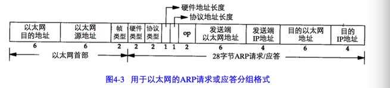

ARP:Address Resolution Protocol

当一台主机把以太网数据帧发送到位于局域网上的另一台主机时，是根据48 bit的以太网地址来确定目的接口的。设备驱动程序从不检查IP 数据报中的目的IP地址。

地址解析为这两种不同的地址形式提供映射：32 bit的IP地址和数据链路层使用的任何类型的地址。

ARP请求是在网络上广播的。

点对点链路不使用ARP。当设置这些链路时，必须告知内核链路每一端的IP地址。

## ARP高速缓存
ARP高效运行的关键是由于每一个主机上都有一个ARP高速缓存。这个高速缓存存放了最近Internet地址到硬件地址之间的映射记录。

## ARP的分组格式
在以太网上解析IP地址时，ARP请求和应答分组的格式如图4-3所示：

以太网的报头中的前两个字段是以太网的源地址和目的地址。目的地址为全 1的特殊地址是广播地址。

两个字节长的以太网帧类型表示后面数据的类型。对于ARP请求或应答来说，该字段的值为 0x0806.

硬件类型字段表示硬件地址的类型。它的值为 1表示以太网地址。协议类型字段表示要映射的协议地址类型。它的值为 0x0800表示IP地址。

硬件地址长度和协议地址长度都是以字节为单位。对于以太网上IP地址的ARP请求或应答来说，它们的值分别为6 和 4。

操作字段指出四种操作类型，它们是ARP请求(值为1)、ARP应答(值为2)、RARP请求(值为3)和RARP应答(值为4)

对于一个ARP请求来说,除目的端硬件地址外的所有其他的字段都有填充值。当系统收到一份目的端为本机的ARP请求报文后,它就把硬件地址填进去,然后用两个目的端地址分别替换两个发送端地址,并把操作字段置为 2,最后把它发送回去。

ARP请求的超时时间对应于TCP连接请求的超时时间（一般为75秒）

ARP请求对应于TCP试图发送的初始TCPSYN段。

## ARP代理
如果ARP请求是从一个网络的主机发往另一个网络的主机，那么连接这两个网络的路由器就可以回答该请求，这个过程称作委托ARP或者ARP代理。也就是说，这个时候路由器回答ARP请求，将路由器的以太网接口地址作为硬件地址。

## 免费ARP
它是指主机发送ARP请求查找自己的IP地址。通常，它发生在系统引导期间进行接口配置的时候。

免费ARP可以有连个方面的作用：

1. 一个主机可以通过它来确定另一个主机是否配置了相同的IP地址。如果收到应答，那么就表示有重复的IP地址。

2. 如果发送免费ARP的主机正好改变了硬件地址，那么这个分组就可以使其他主机高速缓存中旧的硬件地址进行相应的更新。
