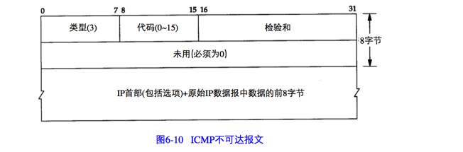

ICMP经常被认为是IP层的一个组成部分。它传递差错报文以及其他需要注意的信息。ICMP报文通常被IP层或更高层协议（TCP或UDP）使用。

ICMP报文是在IP数据报内部被传输的，如图6-1所示：

ICMP报文的格式如图6-2所示：

检验和字段覆盖整个ICMP报文。使用的算法和IP首部检验和算法相同。ICMP的检验和是必需的。

## ICMP 报文类型
各种类型的ICMP报文如图6-3所示，不同类型由报文中的类型字段和代码字段来共同决定。

当发送一份ICMP差错报文时，报文中始终包含IP首部和产生ICMP差错报文的IP数据报的前8个字节。这样，接收ICMP差错报文的模块就会把它与某个特定协议（根据IP数据报首部中的协议字段来判断）和用户进程（根据包含在IP数据报前8个字节中的TCP或UDP报文首部中的TCP或UDP端口号来判断）联系起来。

下面各种情况都不会产生ICMP差错报文：

1. ICMP差错报文（但是ICMP查询报文可能会产生ICMP差错报文）

2. 目的地址是广播地址或多播地址（D 类地址）的IP数据报

3. 作为链路层广播的数据报

4. 不是IP分片的第一片

5. 源地址不是单个主机的数据报。也就是说，源地址不能为零地址、环回地址、广播地址或多播地址

这些规则是为了防止过去允许ICMP差错报文对广播分组响应所带来的广播风暴。

## ICMP 地址掩码请求和应答
ICMP地址掩码请求用于无盘系统在引导过程中获取自己的子网掩码。系统广播它的ICMP请求报文。无盘系统获取子网掩码的另一种方法是BOOTP协议。ICMP地址掩码请求和应答格式如图6-4所示：

ICMP报文中的标识符和序列号字段由发送端任意选择设定，这些值在应答中将被返回。这样发送端就可以把应答与请求进行匹配。

## ICMP 端口不可达差错
端口不可达报文，它是ICMP目的不可达报文中的一种。

ICMP报文是在主机之间交换的，而不用目的端口号。

ICMP的一个规则是，ICMP差错报文必须包括生成该差错报文的数据报IP首部（包括任何选项），还必须至少包括跟在该IP首部后面的前8个字节。

导致差错的数据报中的IP首部要被送回的原因是因为IP首部中包含了协议字段，使得ICMP可以知道如何解释后面的8个字节。

ICMP不可达报文的一般格式如图6-10所示：

