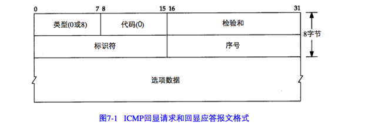
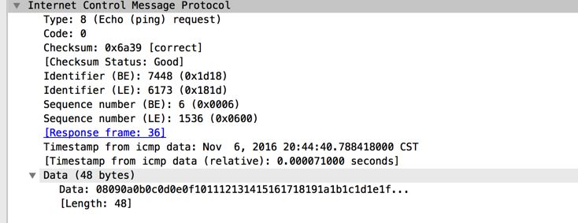
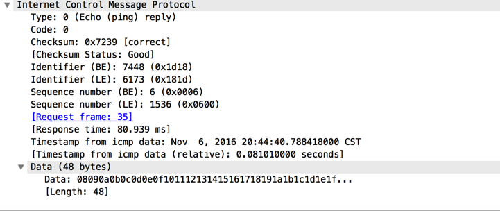
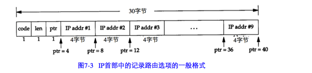
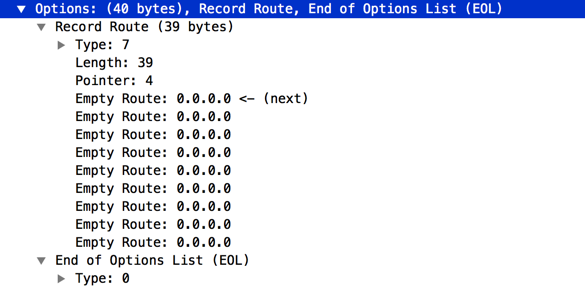
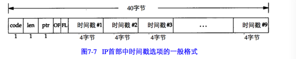
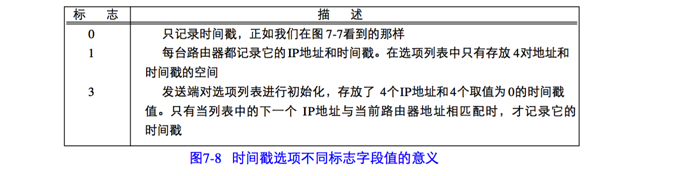
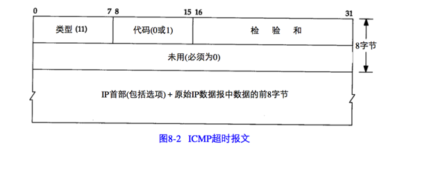
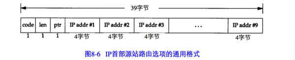
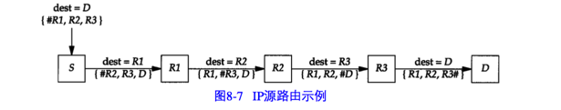

## Ping程序
Ping程序的目的是为了测试一个主机是否可达。该程序发送一份ICMP回显请求报文给主机，并等待返回ICMP回显应答。

一般来说，如果不能Ping到某台主机，那么就不能Telnet或者FTP到那台主机。反过来，如果不能Telnet到某台主机，那么通常可以通过Ping程序来定位问题。Ping程序还能测出这台主机的往返时间，以表明主机离我们有多远。

>几年前我们还可以做出这样的断言，如果不能Ping到某台主机，那么久不能Telnet或FTP到那台主机。随着Internet安全意识的增强，出现了提供访问控制清单的路由器和防火墙，那么像这样没有限定的断言就不再成立了。一台主机的可达性可能不只取决与IP层是否可达，还取决于使用何种协议以及端口号。Ping程序的运行结果可能显示某台主机不可达，但我们可以使用Telnet远程登录到该主机的25号端口（邮件服务器）。

ICMP回显请求和回显应答报文如图7-1所示：



对于其他类型的ICMP查询报文，服务器必须响应标识符和序列号字段。另外客户发送的选项数据必须回显。

Unix系统在实现Ping程序时是把ICMP报文中的标识符字段设置成发送进程的Id号，这样即使在同一台主机上同时运行了多个Ping程序，ping程序也可以识别出返回的信息。

序列号从0开始，每发送一次新的回显请求就加 1.

如下图所示是使用Wireshark捕获的 echo request 和echo reply,ICMP 报文部分。





从上面我们可以知道，默认情况下发送的ICMP报文有56个字节。

### IP记录路由选项
Ping程序为我们提供了查看IP记录路由（RR）选项的机会。大多数不同版本的Ping程序都提供 `- R`选项，已提供记录路由的功能。它使得Ping程序在发送出去的IP数据报中设置IP RR 选项（该IP数据报包含ICMP回显请求报文）。这样，每个处理该数据报的路由器都把它的IP地址放入选项字段中。当数据报到达目的端时，IP地址清单中应该复制到ICMP回显应答中，这样返回途中所经过的路由器地址也被加入清单中。当Ping程序收到回显应答时，他就打印这份IP地址清单。

这个过程听起来简单,但存在一些缺陷。源端主机生成RR 选项,中间路由器对 RR选项的处理,以及把ICMP回显请求中的RR清单复制到ICMP回显应答中,所有这些都是选项功能。幸运的是,现在的大多数系统都支持这些选项功能,只是有一些系统不把ICMP请求中的IP清单复制到ICMP应答中。

最大的问题是IP首部中只有有限的空间来存放IP地址。IP首部中的首部长度字段只有4 bit，因此整个IP首部最长只能包括15个32 bit长的字（即60字节）。由于IP首部固定长度为20字节，RR选项用去3个字节，这样只剩下37个字节来存放IP地址清单，也就是说只能存放9个IP地址。

如下所示是IP首部中记录路由选项的一般格式：





code 是一个字节，指明IP选项的类型。对于RR选项来说，它的值为7.

len是RR选项总字节长度，在这种情况下为39.

ptr称作指针字段。它是一个基于1的指针，指向存放下一个IP地址的位置。它的最小值为4，指向存放第一个IP地址的位置。

当路由器在清单中记录IP地址时，它应该记录哪个地址呢？是入口地址还是出口地址？为此RFC 791 指定路由器记录出口IP地址。

## IP时间戳选项
IP时间戳选项与记录路由选项类似。IP时间戳选项的格式如图7-7所示：



时间戳选项的代码为 0x44。其他两个字段len和ptr与记录路由选项相同：选项的总长度（一般为36或40）和指向下一个可用空间的指针（5，9，13等）

接下来的两个字段是4 bit的值：OF表示溢出字段，FL表示标志字段。时间戳选项的操作根据标志字段来进行，如图7-8所示：



如果路由器由于没有空间而不能增加时间戳选项，那么它将增加溢出字段的值。


Ping只是利用了ICMP回显应答请求和回显应答报文，而不用经过传输层。

## Traceroute
Traceroute程序可以让我们看到IP数据报从一台主机传到另一台主机所经过的路由。

为什么不适用这个选项（IP记录路由选项）而另外开发一个新的程序？有三个方面的原因：

1. 首先，并不是所有的路由器都支持记录路由选项。

2. 其次，记录路由一般是单向的选项。

3. 最后，IP首部中留给选项的空间有限，不能存放当前大多数的路径。IP首部中最多能存放9个IP地址。

Traceroute程序使用ICMP报文和IP首部中的TTL字段。TTL字段是由发送端初始设置一个8 bit字段。

每个处理数据报的路由器都需要把TTL的值减1或减去数据报在路由器中停留的秒数。由于大多数的路由器转发数据报的时延都小于1秒钟，因此TTL最终成为一个跳站的计数器，所经过的每个路由器都将其值减1。

当路由器收到一份IP数据报，如果其TTL字段是0或1，则路由器不转发该数据报，相反路由器将丢弃该数据报，并给信源机发一份ICMP 超时信息。Traceroute程序的关键在于包含这份ICMP信息的IP报文的信源地址是该路由器的IP地址。

我们现在可以猜想一下Traceroute程序的操作过程。它发送一份TTL字段为1的IP数据报给目的主机。处理这份数据报的第一个路由器将TTL值减 1,丢弃该数据报,并发回一份超时ICMP报文。这样就得到了该路径中的第一个路由器的地址。然后Traceroute程序发送一份TTL值为2的数据报,这样我们就可以得到第二个路由器的地址。继续这个过程直至该数据报到达目的主机。但是目的主机哪怕接收到TTL值为1的IP数据报,也不会丢弃该数据报并产生一份超时ICMP报文,这是因为数据报已经到达其最终目的地。那么我们该如何判断是否已经到达目的主机了呢?

Traceroute程序发送一份UDP数据报给目的主机,但它选择一个不可能的值作为UDP端口号(大于30000),使目的主机的任何一个应用程序都不可能使用该端口。因为,当该数据报 到达时,将使目的主机的UDP模块产生一份“端口不可达”错误(见6.5节)的ICMP报文。这样,Traceroute程序所要做的就是区分接收到的ICMP报文是超时还是端口不可达,以判断什么时候结束。

有两种不同的ICMP“超时”报文，它们的ICMP报文中code字段不同。图8-2给出了这种ICMP差错报文的格式：



我们所讨论的ICMP报文是在TTL值为0时产生的，其code字段为0。

主机在组装分片时可能发生超时，这时，它将发送一份“组装报文超时”的ICMP报文。这种差错报文将code字段置1.

````
$ traceroute www.baidu.com
traceroute: Warning: www.baidu.com has multiple addresses; using 14.215.177.37
traceroute to www.baidu.com (14.215.177.37), 64 hops max, 52 byte packets
 1  192.168.1.1 (192.168.1.1)  1.235 ms  0.792 ms  1.069 ms
 2  172.16.0.1 (172.16.0.1)  17.832 ms  3.071 ms  3.332 ms
 3  218.19.193.177 (218.19.193.177)  70.438 ms *
    218.19.193.173 (218.19.193.173)  3.935 ms
 4  59.42.127.53 (59.42.127.53)  76.926 ms
    183.56.30.33 (183.56.30.33)  68.936 ms *
 5  113.108.208.42 (113.108.208.42)  53.681 ms  9.222 ms
    113.108.208.30 (113.108.208.30)  8.840 ms
 6  * * *
 7  14.29.121.206 (14.29.121.206)  9.651 ms
    14.29.121.178 (14.29.121.178)  8.779 ms
    14.29.117.246 (14.29.117.246)  104.617 ms
 8  * 10.111.10.1 (10.111.10.1)  57.163 ms *
 ````

 关于Traceroute程序，还有一些必须指出的事项。

 1. 并不能保证现在的路由也是将来所要采用的路由，甚至两份连续的IP数据报都可能采用不同的路由。如果在运行程序时，路由发生变化，就会观察到这种变化，这是因为对于一个给定的TTL，如果其路由发生变化，Traceroute程序将打印出新的IP地址（如上3,4,5,7所示）。

2. 不能保证ICMP报文的路由与traceroute程序发送的UDP数据报采用同一路由。这表明所打印出来的往返时间可能并不能真正体现数据报发出和返回的时间差(如果UDP数据报从信源到路由器的时间是1秒,而ICMP报文用另一条路由返回信源用了3秒时间,则打印出来的往返时间是 4秒)。

3. 返回的ICMP报文中的信源IP地址是UDP数据报到达的路由器接口的IP地址.这与IP记录路由选项(7.3节)不同,记录的IP地址指的是发送接口地址。由于每个定义的路由器都有2个或更多的接口,因此,从A主机到B主机上运行traceroute程序和从B主机到A主机上运行traceroute程序所得到的结果可能是不同的。

## IP源站选路选项
通常IP路由是动态的，即每个路由器都要判断数据报下面该转发到哪个路由器。

源站选路（source routing）的思想是由发送者指定路由。它可以采用以下两种形式：

+ 严格的源路由选择。发送端指明IP数据报所必须采用的确切路由。如果一个路由器发现源路由所指定的下一个路由器不在其直接连接的网络上,那么它就返回一个“源站路由失败”的ICMP差错报文。

+ 宽松的源站选择。发送端指明了一个数据报经过的IP地址清单,但是数据报在清单上指明的任意两个地址之间可以通过其他路由器。

源站路由选项的格式：



源站路由选项的实际称呼为“源站及记录路由”（对于宽松的源站选路和严格的源站选路，分别用 LSRR和SSRR 表示），这是因为在数据报沿路由发送过程中，对 IP地址清单进行了更新。下面是其运行过程：

1. 发送主机从应用程序接收源站路由清单，将第1表项去掉（它是数据报的最终目的地址），将剩余的项移到1个项中，并将原来的目的地址作为清单的最后一项。指针仍然指向清单的第 1项（即，指针的值为4）。

2. 每个处理数据报的路由器检查其是否为数据报的最终地址。如果不是，则正常转发数据报（在这种情况下，必须指明宽松源站选路，否则就不能接收到该数据报）。

3. 如果该路由器是最终目的，且指针不大于路径的长度，那么

   1. 由ptr 所指定的清单中的下一个地址就是数据报的最终目的地址；

   2. 由外出接口(outgoing interface) 相对应的IP地址取代刚才使用的源地址；

   3. 指针加4 。

可以用下面的例子很好的解释上述过程。在图8-7中，我们假设主机S上发送应用程序发送一份数据报给D，指定源路由为R1，R2，R3。



在上图中，# 表示指针字段，其值分别是4、8、12和16.长度字段恒为15.可以看出每一跳IP数据报中的目的地址都发生变化。  

在一个 T C P / I P 网 络 中 ， t r a c e r o u t e 程 序 是 不 可 缺 少 的 工 具 。 其 操 作 很 简 单 : 开 始 时 发 送一个 T T L 字段为 1 的 U D P 数据报，然后将 T T L 字段每次加 1 ， 以 确 定 路 径 中 的 每 个 路 由 器 。 每个路由器在丢弃 U D P 数据报时都返回一个 I C M P 超时报文，而最终目的主机则产生一个
I C M P 端口不可达的报文。
