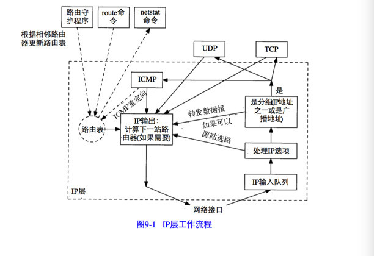
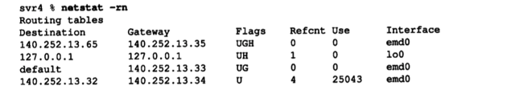
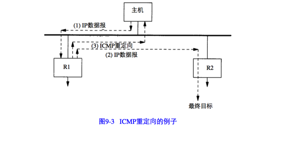
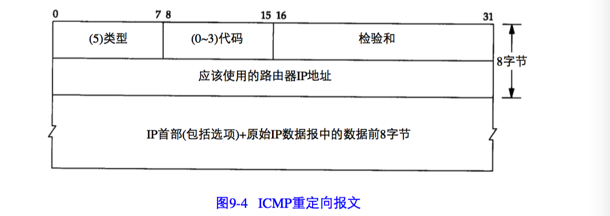
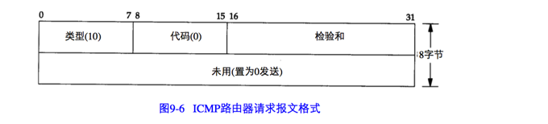
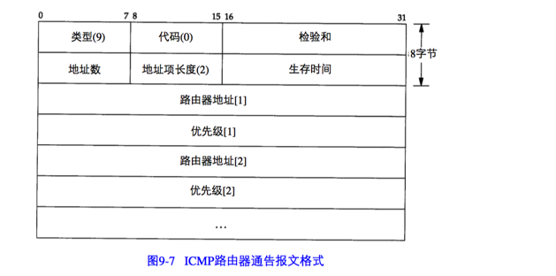

选路是IP最重要的功能之一。图9-1是IP层处理过程的简单流程：

## 选路的原理
IP搜索路由表的几个步骤：

1. 搜索匹配的主机地址

2. 搜索匹配的网络地址

3. 搜索默认表项

匹配主机地址步骤始终发生在匹配网络地址步骤之前。

IP层进行选路实际上是一种选路机制，它搜索路由表并决定向哪个网络接口发送分组。

### 简单路由表
执行`netstat -rn`命令。如下图所示：

对于一个给定的路由器，可以打印出五种不同的标志：

| Flag | 含义    |
| :------------- | :------------- |
|  U | 该路由可以使用      |
|  G | 该路由世道一个网关（路由器），如果没有该标志，说明目的地是直接相连的      |
| H  | 该路由是到一个主机，也就是说，目的地址是一个完整的主机地址。如果没有设置该标志，说明该路由是到一个网络，而目的地址是一个网络地址：一个网络号，或者网络号与子网号的组合      |
| D  | 该路由是由重定向报文创建的      |
| M  | 该路由已被重定向报文修改      |

标志G是非常重要的，因为由它区分了间接路由和直接路由（对于直接路由来说是不设置标志G的）。其区别在于，发往直接路由的分组中不但具有指明目的端的IP地址，还具有其链路层地址。当分组被发往一个间接路由时，IP地址指明的是最终目的地，但是链路层地址指明的是网关（即下一站路由器）。

理解G和H标志之间的区别是很重要的。G标志区分了直接路由和间接路由，如上所述。但是H标志标明，目的地址是一个完整的主机地址。没有设置H标志说明目的地址是一个网络地址（主机号部分为0）。当为某个目的IP地址搜索路由表时,主机地址项必须与目的地址完全匹配,而网络地址项只需要匹配目的地址的网络号和子网号就可以了。

## ICMP主机与网络不可达差错
当路由器收到一份IP数据报但又不能转发时，就要发送一份ICMP“主机不可达”差错报文。

## 转发或不转发
一般假定主机不转发IP数据报，除非对它们进行特殊配置为作为路由器使用。

## ICMP重定向差错
当IP数据报应该被发送到另一个路由器时，收到数据报的路由器就要发送ICMP重定向差错报文给IP数据报的发送端。

只有当主机可以选择路由器发送分组的情况下，我们才可以看到ICMP重定向报文。看下面的例子：

1. 我们假定主机发送一份IP数据报给R1。这种选路决策经常发生，因为R1是该主机的默认路由。

2. R1收到数据报并且检查它的路由表，发现R2是发送该数据报的下一站。当它把数据报发送给R2时，R1检测到它正在发送的接口与数据报到达接口是相同的。这样就给路由器发送重定向报文给原始发送端提供了线索。

3. R1发送一份ICMP重定向报文给主机，告诉它以后把数据报发送给R2而不是R1。

ICMP重定向报文的格式如图9-4所示：

有四种不同类型的重定向报文，有不同的代码值：

| 代码 | 描述     |
| :------------- | :------------- |
|   0     |   网络重定向     |
|    1    |    主机重定向    |
|     2   |    服务类型和网络重定向    |
|      3  |   服务类型和主机重定向     |

ICMP重定向报文的接收者必须查看三个IP地址：

1. 导致重定向的IP地址（即ICMP重定向报文的数据位于IP数据报的首部）

2. 发送重定向报文的路由器的IP地址

3. 应该采用的路由器地址（ICMP报文4-7字节）

重定向报文有许多规则：

1. 重定向报文只能由路由器生成，不能由主机生成
2. 重定向报文是为主机而不是路由器使用的
3. 路由器发应该发送的是对主机的重定向（代码 1 或 3），而不是对网络的重定向。因为子网的存在使得难于准确指明何时应发送对网络的重定向。只当路由器发送了错误的类型时，一些主机才把收到的对网络的重定向当作最主机的重定向来处理。

## ICMP路由器发现报文
一般认为，主机在引导以后要广播或多播传送一份路由器请求报文。一台或更多台路由器响应一份路由器通知报文。另外，路由器定期地广播或多播传送他们的路由器通知报文，允许每一个正在监听的主机相应的更新他们的路由表。

ICMP路由器请求报文的格式如9-6所示。ICMP路由器通告报文的格式如图9-7所示。

### 路由器操作
当路由器启动时，它定期在所有广播或多播传送接口上发送通告报文。准确说，这些通告报文不是定期发送的，而是随机发送的，以减少与子网上其他路由器发生冲突的概率。

除了定期发送主动提供的通告报文外，路由器还要监听来自主机的请求报文，并发送路由器通告报文以响应这些请求报文。

### 主机操作

主机在引导期间一般发送三份路由器请求报文，每三秒钟发送一次。一旦接收到一个幼小的通告报文，就停止发送请求报文。
