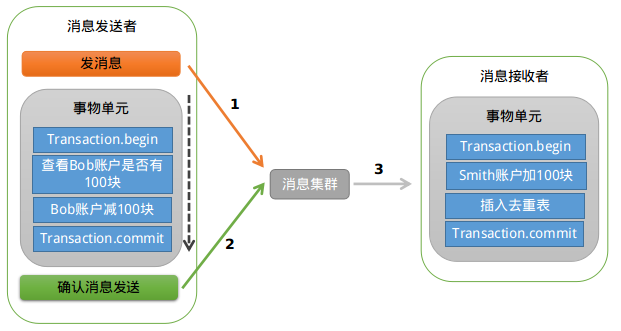

在分布式事务中一般分为两种：

+ 柔性事务满足BASE理论（基本可用，最终一致）
+ 刚性事务满足ACID理论（强一致性）

TCC模式有两种，一种类似于2PC，另一种为补偿操作。


## 本地消息表

这种实现方式的思路，其实是源于ebay，后来通过支付宝等公司的布道，在业内广泛使用。其基本的设计思想是将远程分布式事务拆分成一系列的本地事务。如果不考虑性能及设计优雅，借助关系型数据库中的表即可实现。

举个经典的跨行转账的例子来描述。

第一步伪代码如下，扣款1W，通过本地事务保证了凭证消息插入到消息表中。

````
begin transaction
    update A set amount = amount -10000 where user_id =
    insert into message (user_id,amount,status)
end transaction
commit;    
````

第二步，通知对方银行账户上加1W了。那问题来了，如何通知到对方呢？

通常采用两种方式：

+ 采用时效性高的MQ，由对方订阅消息并监听，有消息时自动触发事件
+ 采用定时轮询扫描的方式，去检查消息表的数据。

两种方式其实各有利弊，仅仅依靠MQ，可能会出现通知失败的问题。而过于频繁的定时轮询，效率也不是最佳的（90%是无用功）。所以，我们一般会把两种方式结合起来使用。

解决了通知的问题，又有新的问题了。万一这消息有重复被消费，往用户帐号上多加了钱，那岂不是后果很严重？

仔细思考，其实我们可以消息消费方，也通过一个“消费状态表”来记录消费状态。在执行“加款”操作之前，检测下该消息（提供标识）是否已经消费过，消费完成后，通过本地事务控制来更新这个“消费状态表”。这样子就避免重复消费的问题。

总结：上诉的方式是一种非常经典的实现，基本避免了分布式事务，实现了“最终一致性”。但是，关系型数据库的吞吐量和性能方面存在瓶颈，频繁的读写消息会给数据库造成压力。所以，在真正的高并发场景下，该方案也会有瓶颈和限制的。

## MQ（事务消息）

举个例子，Bob向Smith转账，那我们到底是先发送消息，还是先执行扣款操作？

好像都可能会出问题。如果先发消息，扣款操作失败，那么Smith的账户里面会多出一笔钱。反过来，如果先执行扣款操作，后发送消息，那有可能扣款成功了但是消息没发出去，Smith收不到钱。除了上面介绍的通过异常捕获和回滚的方式外，还有没有其他的思路呢？

下面以阿里巴巴的RocketMQ中间件为例，分析下其设计和实现思路。

RocketMQ第一阶段发送Prepared消息时，会拿到消息的地址，第二阶段执行本地事物，第三阶段通过第一阶段拿到的地址去访问消息，并修改状态。细心的读者可能又发现问题了，如果确认消息发送失败了怎么办？RocketMQ会定期扫描消息集群中的事物消息，这时候发现了Prepared消息，它会向消息发送者确认，Bob的钱到底是减了还是没减呢？如果减了是回滚还是继续发送确认消息呢？RocketMQ会根据发送端设置的策略来决定是回滚还是继续发送确认消息。这样就保证了消息发送与本地事务同时成功或同时失败。如下图：



总结：据笔者的了解，各大知名的电商平台和互联网公司，几乎都是采用类似的设计思路来实现“最终一致性”的。这种方式适合的业务场景广泛，而且比较可靠。不过这种方式技术实现的难度比较大。目前主流的开源MQ（ActiveMQ、RabbitMQ、Kafka）均未实现对事务消息的支持，所以需二次开发或者新造轮子。比较遗憾的是，RocketMQ事务消息部分的代码也并未开源，需要自己去实现。


http://www.infoq.com/cn/articles/solution-of-distributed-system-transaction-consistency
